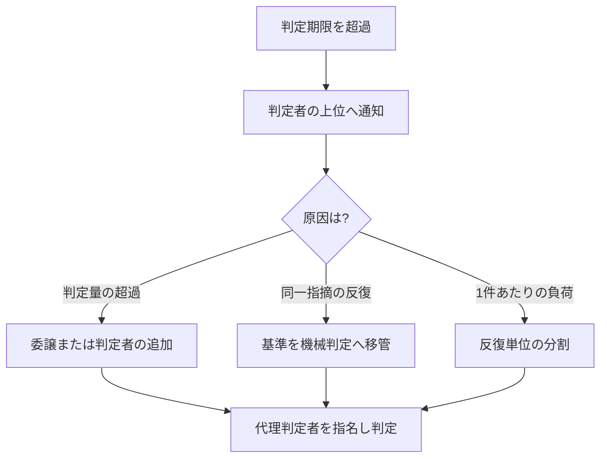

本章は、本標準の要求事項を満たせない事態が生じた場合の手続を規定します。例外を認めない標準は運用されずに迂回されます。したがって例外を禁止せず、統制の対象として扱います。

## 7.1 本章が達成すべき成果

本章の要求事項を満たしたとき、次の成果が得られます。

- 基準を満たせない状態が、隠されずに記録として表面化している
- 例外を認める権限者と、その代償として負う義務が明確である
- 判定の滞留および予算・期日の超過が、上位の判断者へ定められた基準で到達している

## 7.2 例外の前提

本標準は、次の現実を前提として例外手続を設けます。

- 期日は四半期決算・顧客契約・展示会・納品期限などの外部要因によって定まり、開発側の都合では変更できない場合がある
- 期日を守るために基準を暗黙に下げる運用が生じると、品質の劣化が記録されないまま蓄積する
- したがって基準の逸脱を禁止せず、承認・記録・回収を伴う手続として扱う

## 7.3 例外承認の要求事項

ゲートの判定基準を満たさないまま次工程へ進める場合は、次のすべてを満たさなければなりません。

| # | 要求事項 |
| --- | --- |
| 1 | 例外承認の権限を持つ者が、記名により承認する |
| 2 | 満たさない基準の項目番号と、その理由を記録する |
| 3 | 想定される影響と、影響が顕在化した場合の対処を記録する |
| 4 | 回収の期限と回収責任者を定め、技術負債台帳へ登録する |
| 5 | 回収が完了するまで、当該項目を継続的な報告対象とする |

上記のうち1項目でも満たせない場合、例外を認めてはなりません。

**本節が、条件を付して先へ進める手続です**。上表の2が条件の内容、4が条件の解消期限と責任者、5が解消までの追跡にあたります。工程ゲートの判定へ「条件付き通過」という値を設けていないのは、これらの要求を伴わない通過の経路を作らないためです([第4章 工程ゲートの判定の語彙](/process-compass/phase4-process-design/gate-criteria/) / [ADR-0036](/process-compass/adr/0036-gate-closure-by-record/))。

<!-- impl IMPL-0011 target=gate-record-template state=delivered note="条件を付して先へ進める場合は例外承認の5要求事項を満たす" -->

判定基準を満たしている成果物について、次工程の材料が未完成であることを理由に本節を用いてはなりません。それは例外ではなく、判定の範囲の誤りです([第4章 判定の範囲](/process-compass/phase4-process-design/gate-criteria/))。

レビューの形骸化を検知した場合の承認権限の一時制限と、その解除条件は 7.9 に規定します。

### 7.3.1 経路の使い分け

**判定基準を満たさないまま進める場面には、3つの経路があります**。どれを用いるかを案件の裁量に委ねません。**案件は、どの事象をどの経路へ送るかの判断基準を、企画承認(G-1)の時点で記録します**。

| 事象 | 経路 |
| --- | --- |
| 当該ゲートの判定基準を満たさないまま進める | **7.3 例外承認** |
| 前提が劣化し、判断の土台が変わった | **7.10 前提の受容** |
| 判定基準には含まれないが、放置できない事項が残った | **7.3.2 未解決事項** |

**7.3 と 7.10 は、事後と事前で分かれます**。7.3 は成果物が存在する時点で基準の不充足を認める手続であり、7.10 は判断の土台にした前提が崩れたことを認める手続です。

判断基準を事前に記録させるのは、**経路の選択を事後の裁量にすると、最も軽い経路が選ばれるため**です。

### 7.3.2 未解決事項

**判定基準に含まれないが放置できない事項**は、例外承認でも前提の受容でもありません。**判定の外に置き、追跡します**。

| 要求事項 |
| --- |
| 事項の内容と、判定の外にある理由を記録する |
| 対処の期限と担当を定める |
| 期限までに解消しない場合、7.3 または 7.10 のいずれへ送るかを判定する |

**この経路には判定値を持たせません**。工程ゲートの判定は「通過」「差し戻し」の2値のままです([ADR-0036](/process-compass/adr/0036-gate-closure-by-record/)決定2)。**未解決事項が残っていることは、通過を妨げません**。

置き場は**技術負債台帳**とし、区分欄で 7.3 由来のものと区別します。**新しい台帳を作りません**。

**この経路が無い場合、判定基準に含まれない事項は判定へ持ち込まれます**。判定の範囲の規定([第4章](/process-compass/phase4-process-design/gate-criteria/))は「持ち込むな」と定めるにとどまり、**持ち込まなかった事項の行き先を定めていませんでした**。

<!-- impl IMPL-0018 target=debt-ledger-template state=delivered note="未解決事項を技術負債台帳の区分欄で 7.3 由来と区別する" -->

:::caution[暫定 EV-0030 / 見直し 2027-02]
**対象**: 7.3.2(判定の外に置き場を設ければ、判定へ持ち込まれなくなるという判断)。

**根拠の水準**: E1(間接)。

**根拠とした事例**: JAXA JMR-004D / 英国 Gateway レビュー / NASA の RID/RFA。

JAXA は指摘をアクションアイテムとして独立組織が追跡し、英国 Gateway は期限付き勧告を3区分で返します。**いずれも独立した追跡組織を持つ体制であり、少人数の案件で同じ効果が得られるという測定を持ちません**。

**差し替え条件**: 未解決事項として記録された件数と、そのうち期限までに解消した件数。**解消率の低いまま件数が積み上がる状態は、置き場を「判定を避ける先」として使っていることを示します**。
:::

## 7.4 ファストトラック(期日制約下の例外)

ファストトラックは、7.3 の例外承認の特殊形です。動かせない期日に対処するため、一部のゲートを後追いに回す手続を規定します。7.3 の5要求事項に、本節の制約が加わります。

### 適用できる期日

適用条件は「急いでいること」ではありません。**遅延した場合に組織の外部で不可逆な損失が生じる期日**に限ります。

| 適用できる期日 | 適用できない期日 |
| --- | --- |
| 顧客との納品契約 | 社内の目標日 |
| 展示会・発表会などの公開日 | 期初に置いた見込み |
| 規制対応の法定期限 | 上位者の期待 |
| サービス終了に伴う移行期限 | チームの意欲的な目標 |

この区別を設けない場合、すべての期日が「動かせない期日」として申告されます。

### 後回しにできる対象

短縮できる対象は次の限定列挙です。ここにないものを短縮してはなりません。

| ゲート | 後回しの可否 |
| --- | --- |
| G-6 独立レビュー | 可(実施期限を定めた後追い) |
| G-3 の判断記録(ADR) | 可(記録のみ後追い。判断そのものは実施する) |
| G-7 出荷判定の一部項目 | 可(項目を特定した限定的な短縮) |
| G-4 機能仕様承認 | 不可 |
| G-5 自動検証(CI) | 不可 |
| 認証・認可・データ保全に関する検証 | 不可 |

G-4 と G-5 を短縮できない理由は、この2つを外すと「何を作ったか」と「動作するか」の双方が不明なまま出荷することになるためです。これはリスクの引き受けではなく、リスクの把握の放棄です。

### 申請書の必須項目

申請書には次を記載しなければなりません。AI エージェントが草案を生成できます。

- 短縮するゲートと、検証されないまま残る範囲(ファイル・機能・受入基準の単位で特定する)
- 未解決欠陥の一覧と重大度
- 影響を受ける利用者の範囲
- 回収に要する見積工数

確率的な予測は求めません。**事実として何が検証されていないか**を特定することを求めます。

### 乱用を防ぐ制約

| # | 制約 |
| --- | --- |
| 1 | 未回収のファストトラック項目が残っている間、同一案件で新たなファストトラックを申請できない |
| 2 | 事業ステージあたりの適用回数の上限を、企画承認(G-1)の時点で合意し記録する |
| 3 | 適用後、定めた期限内に事後レビューを実施する。未実施の場合、当該案件のファストトラック権限を停止する |
| 4 | 承認者は記名し、承認理由を記録する。理由の記載がない承認は無効とする |
| 5 | 発生率・回収完了率・適用後の欠陥発生率を継続して測定し、会議体へ報告する |

制約1が最も強い抑止です。回収を伴わない限り次を使えないため、常態的な適用が成立しません。

制約3と制約4は、承認の形式化を防ぎます。緊急手続を持つ組織では、承認側が責任回避のための署名機関と化し、事後レビューを省略する事態が繰り返し報告されています。

## 7.5 判定の滞留に対する措置

ゲートの判定期限を超過した場合、自動承認としてはなりません。次の手順を適用します。

滞留への対処は、委譲・機械化・分割のいずれかによって判定の帯域を確保する方法を優先します。判定基準の緩和による対処は、7.3 の例外承認手続を経た場合に限り認めます。

## 7.6 エスカレーションの基準

### 発火条件

次の条件に該当した時点で、報告が発生します。判断を待ってから報告するのではありません。

閾値は初期値です。企画承認(G-1)の時点で組織が確定し、記録しなければなりません。

| 区分 | 段階1 | 段階2 | 段階3 |
| --- | --- | --- | --- |
| 予算 | 10% 超過 | 20% 超過 | 30% 超 |
| スコープ | 確約範囲(SC-M)の 5% 変動 | 同 15% 変動 | 同 25% 超 |
| 日程 | 1週間の遅延 | 2週間の遅延 | 主要工程への影響 |
| 報告先 | プロジェクト責任者 | 部門責任者・PMO | ステアリングコミッティ(B-2) |

**スコープの発火条件は、確約範囲(SC-M)の変動のみを対象とします**。計画範囲(SC-P)と調整枠(SC-B)の増減では発火しません([第2章 2.10.5](/process-compass/phase4-process-design/lifecycle/))。層を区別せずに変動率を測ると、通常の調整で発火が続き、報告が読まれなくなります。

品質側にも発火条件を設けます。AI 協調開発では、予算・日程の逸脱より先に品質側の劣化が現れるためです。

| 事象 | 報告先 |
| --- | --- |
| ゲート判定の期限超過率が基準を超えた状態 | 判定者の上位者 |
| 独立レビューの差し戻し率が基準を逸脱した状態 | 技術判断者および品質保証部門 |
| 同一箇所の修正が収束しない状態 | 技術判断者 |
| 事業ステージの基準を満たさない未解決欠陥 | 品質保証部門および事業決裁者 |
| 事業性の前提が崩れた状態 | ステアリングコミッティ(B-2) |

差し戻し率の警戒方向は両側です。高すぎる場合は手前の工程の品質問題を示し、ゼロが続く場合はレビューの形骸化を示します。

エージェントが関与する案件では、発火した段階に対応するラベルを付与します。段階とラベルの対応は[第5章 4.5.2](/process-compass/phase5-implementation/label-mailbox/)によります。**ラベルの付与だけで報告を済ませてはなりません**。報告の様式は次項によります。

### エスカレーションレポートの様式

報告は次の5項目で構成しなければなりません。経緯の記述を最小化し、選択肢と事業影響への換算を必須とします。現場は経緯を語り、決裁者は選択肢を求めるためです。

| 項目 | 内容 | 分量の上限 |
| --- | --- | --- |
| 1. 状態 | 何が基準を逸脱したか。数値で示す | 3行 |
| 2. 原因 | 直接原因と、判明していれば背景要因 | 5行 |
| 3. 事業影響 | 期日・費用・利用者・契約への換算 | 表 |
| 4. リカバリ選択肢 | 3案。各案の到達点・費用・期日・残るリスク | 表 |
| 5. 推奨と決裁事項 | 起案者の推奨案と、決裁者に求める判断 | 3行 |

**選択肢は3案を必須とします**。1案は決裁ではなく承認の要求になり、2案は二者択一の圧力になります。3案あると、期日を守る案・品質を守る案・範囲を削る案という異なる価値の比較が成立します。

AI エージェントは項目1〜4の草案を生成できます。項目5は人間が記入しなければなりません。推奨の提示は結果責任(A)を負う者の行為であり、AI へ委譲できません。

### 決裁後のポートフォリオ調整

エスカレーションの決裁が要員または予算の移動を伴う場合、次を満たさなければなりません。

- 決裁結果に、影響を受ける他の案件の一覧を含める
- 移動元の案件の責任者へ通知する
- 移動により実施できなくなる事項を記録する

伝達の手段(様式・ツール)は、組織の既存の PMO 運用に合わせて[第8章](/process-compass/phase4-process-design/tailoring-guide/)で定めます。本標準が規定するのは伝達すべき内容です。

会議体の構成と決裁権限は[第3章 3.7](/process-compass/phase4-process-design/roles-responsibilities/)に規定します。

## 7.7 予算統制と中止の判断

本節は、案件に配賦する予算の構成と、案件を中止(Kill)する判断の基準を規定します。開始の手続だけを整備し、終了の手続を持たない組織では、成果の出ない案件が資源を消費し続けます。

### 7.7.1 予算の構成

予算は4区分で構成し、区分ごとに配賦の単位を変えます。

| 区分 | 内容 | 配賦の単位 |
| --- | --- | --- |
| 期間予算 | 要員の稼働期間 | 事業ステージ |
| 要員予算 | 人数と役割の構成 | 事業ステージ |
| AI実行予算 | 推論およびエージェント実行に伴う従量費用 | 月次 |
| 基盤予算 | コンテキスト基盤・CI・可観測性の維持費用 | 年次 |

AI実行予算を独立した区分として扱う理由は、費用が固定費ではなく消費量に比例するためです。席数を単位とする年次予算の枠組みでは、実際の消費との差を検知できません。

予算は事業ステージ単位で配賦し、ステージ移行ゲート(SG)の判定と同時に次ステージ分を確定させます。案件の全期間分を一括で配賦してはなりません。

**事業仮説および価値仮説の検証に要する費用は、期間予算の内訳として明示します**。顧客ヒアリング、市場調査、代替品の実地評価、外部への調査委託などが該当します。内訳に現れない検証活動は、実行されません。この内訳は、7.7.3 の必達基準1 が求める観測データを得るための費用の出どころにあたります。金額の水準は本標準では定めず、組織の既存の決裁権限規程によります。

### 7.7.2 測定する指標

次の指標を継続して測定し、判定と上程の入力とします。

| 指標 | 定義 |
| --- | --- |
| 予算消化率 | 消化した予算 ÷ 配賦した予算 |
| 進捗率 | 完了した受入基準の数 ÷ 計画した受入基準の数 |
| 消化進捗比 | 予算消化率 ÷ 進捗率。1を超えるほど計画より費用が先行している |
| AI実行費用の単位あたり値 | 期間内のAI実行費用 ÷ 期間内に統合した変更の件数 |
| AI実行予算の消化率 | 月次の実消費 ÷ 月次の配賦額 |

単位あたり値の分母は、受入基準を満たして統合された変更に限ります。取り消した変更や統合されなかった試行を分母に含めると、生成量の多さが効率の良さとして表れます。

指標の閾値は、企画承認(G-1)の時点で組織が確定し記録しなければなりません。

### 7.7.3 中止の判断基準

中止の判断は、必達基準と評点基準の2層で行います。

**必達基準**は、1項目でも不合格であれば中止または保留の対象とします。判定は観測可能な事実に基づきます。

| # | 必達基準 | 不合格とする状態 |
| --- | --- | --- |
| 1 | 事業仮説を支持する観測データが存在する | 反証するデータのみが得られている、または測定が行われていない |
| 2 | 残る予算と期間でステージのゴールに到達できる | 到達に要する見積が、残る予算または期間を上回る |
| 3 | 単位あたりコストが合意した上限以内である | 上限の超過が3期連続している |
| 4 | 法規制・セキュリティ上の阻害要因が存在しない | 解消計画を持たない阻害要因が残っている |
| 5 | 結果責任者(A)が指名されている | 空席が合意した期間を超えて継続している |

**評点基準**は、複数案件の優先順位付けに用います。1項目の低評価では中止としません。

| 観点 | 評価する内容 |
| --- | --- |
| 戦略整合 | 組織の戦略目標との対応の強さ |
| 価値の実証度 | 実利用者における効果の観測水準 |
| 再現性 | 他の領域・製品へ展開できる度合い |
| 負債の見込み | 受容した負債の返却可能性 |
| 波及 | 中止した場合に他の案件が受ける影響 |

判定は[第3章 3.7.3](/process-compass/phase4-process-design/roles-responsibilities/)の4値で行います。中止と継続の二者択一にしてはなりません。範囲を縮小して継続する選択肢と、条件付きで保留する選択肢を常に併置します。

**必達基準は、企画承認(G-1)の時点で当該の案件の言葉へ具体化し、企画書へ記載します**([第6章 テンプレ6](/process-compass/phase4-process-design/deliverable-templates/)の中止条件欄)。始めた後に止める条件を定めると、判断の時点で条件そのものが交渉の対象になります。

### 7.7.4 自動的な上程

中止の判断を人の申告に委ねてはなりません。閾値の超過を検知した時点で、機械的に上程が発生する構成とします。

| 検知する状態 | 初期値 | 上程先 |
| --- | --- | --- |
| 消化進捗比の超過 | 1.3 超が2期連続 | B-2 |
| 期間予算の残存 | 残20%未満、かつ必達基準に不合格がある | B-2 |
| AI実行予算の消化率 | 月次配賦額の150%超 | B-2 |
| 単位あたりコスト | 合意した上限の2倍超が3期連続 | B-2 |
| 上記のうち2つ以上が同時に成立 | — | B-1 |

上程は報告ではなく判定の要求です。上程を受けた会議体は、[第3章 3.7.4](/process-compass/phase4-process-design/roles-responsibilities/)が定める判定期限内に4値のいずれかを出さなければなりません。

AI実行予算の超過時の扱い(実行の停止・通知のみ・上限の自動引き上げのいずれか)は、企画承認(G-1)の時点で合意し記録します。

### 7.7.5 継続と判定する場合の要求事項

必達基準に不合格がある状態で継続と判定する場合、次を満たさなければなりません。

| # | 要求事項 |
| --- | --- |
| 1 | 決定者が記名し、継続の理由を記録する |
| 2 | 不合格の項目ごとに、解消の期限と責任者を定める |
| 3 | 必達基準を再判定する期限を定める。期限は最長で1つの事業ステージとする |
| 4 | 同一の必達基準の不合格に対して、3回を超えて継続と判定してはならない |

要求事項4が最も強い歯止めです。継続の判断そのものを禁じるのではなく、同じ理由での継続に上限を設けます。投じた資源が大きいほど中止の判断は下されにくくなります。この傾向は意思決定の研究で繰り返し確認されています。

### 7.7.6 第三者による棚卸し

案件の当事者は、自らが進める案件の中止を提起しにくい立場にあります。したがって、当事者以外による点検を制度として組み込みます。

- S1 以降の案件は、年1回以上、当該案件に関与していない者による点検を受けなければならない
- 点検の実施者は、内部監査部門・PMO・他案件の技術判断者のいずれかとする
- 点検の結果は、必達基準の項目ごとの合否として記録し、B-2 へ提出する

停滞した案件の方向転換は、当事者ではなく上位の管理者・内部監査・外部の評価者を起点として生じたことが、情報システム案件の実証研究で報告されています(Keil & Robey、1999年)。

### 7.7.7 中止と判定した場合の要求事項

| # | 要求事項 |
| --- | --- |
| 1 | 生成物・データ・外部契約の扱いを決定と同時に確定する |
| 2 | 要員の再配置先を決定と同時に確定する |
| 3 | 得られた知見を恒久層コンテキストへ登録する |
| 4 | 記録を、監査の求めに応じて提示できる期間にわたり保管する |

要求事項2を後日の検討に委ねてはなりません。再配置先が未定のまま中止を宣言すると、要員が案件に留まり続け、体制上は終了していない状態が残ります。

中止は失敗の記録ではなく、資源を回収する判断です。中止の実績が長期にわたって0件である会議体は、[第3章 3.9.4](/process-compass/phase4-process-design/roles-responsibilities/)の警戒サインに該当します。

## 7.8 記録の要求事項

例外承認およびエスカレーションの記録は、次の要件を満たさなければなりません。

- 出荷判定において、全件の状態を突合できる形式で保持する
- 回収済みの項目と未回収の項目を区別できる
- 案件の完了後も、監査の求めに応じて提示できる期間にわたり保管する

## 7.9 承認権限の一時制限

[第5章 5.6.2](/process-compass/phase4-process-design/human-ai-boundary/)の測定によって検出能力の低下が確認された場合の措置を規定します。

### 7.9.1 発動の条件

| # | 発動する状態 |
| --- | --- |
| 1 | 注入した欠陥を、連続2回、または直近3回のうち2回見逃した |
| 2 | [第5章 5.6.3](/process-compass/phase4-process-design/human-ai-boundary/)の区分が「意図的な逸脱」に該当した(この場合は1回で発動する) |

**単発の見逃しでは発動しません**。見逃しには偶然の変動が含まれるためです。単発で発動する運用は測定を懲罰と同一視させ、注入の事前察知と申し送りを招きます。その結果、測定そのものが無効化されます。

反復を条件とする構成は、外部から送付された既知の検体で検査の実施権限を制御する医療分野の制度(連続2回または3回中2回の不合格で当該項目の実施を停止する)と同型です。

### 7.9.2 制限の内容

| 対象 | 内容 |
| --- | --- |
| 単独での承認権限 | 該当する範囲について、独立レビュアを2名必須とする |
| 適用の範囲 | 見逃した欠陥の類型に対応する範囲に限定する |
| 期間 | 定めない。7.9.3 の条件を満たすまで継続する |

**制限するのは人ではなく権限の範囲です**。承認権限の全部を停止する措置を採りません。全権の停止は当人の業務を止めるだけで、検出能力を回復させないためです。

### 7.9.3 回復の条件

- 注入した欠陥を連続2回検出したとき、制限を解除する
- **期間の経過によって自動的に解除してはならない**
- 解除の判定と根拠を記録する

期間で戻す設計は「待てば戻る」という運用を生み、是正の動機を失わせます。実績で戻す設計にします。

### 7.9.4 制限された状態での例外決裁

制限された状態でも、期日の制約により2名の独立レビューを確保できない場合があります。この場合、7.4 のファストトラックと同一の手続を適用します。**別の手続を新設しません**。

7.4 の要求事項に加えて、次を満たさなければなりません。

| # | 追加の要求事項 |
| --- | --- |
| 1 | 7.4 の「適用できる期日」の要件を満たす |
| 2 | 例外の承認は、ステアリングコミッティ(B-2)の決定者が記名で行う |
| 3 | 検証されないまま残る範囲を特定して記録する |
| 4 | 回収の期限と回収責任者を定め、技術負債台帳へ登録する |
| 5 | 7.9.5 の枠から1件を消費する |

### 7.9.5 例外の枠

例外の乱用を防ぐ手段として、**比率の上限を規程に書く方式を採りません**。比率は事後にしか判明せず、超過が確認された時点で行使は既に済んでいるためです。代わりに、補充されない有限の枠を用います。

| # | 要求事項 |
| --- | --- |
| 1 | 事業ステージあたりの例外の枠を、企画承認(G-1)の時点で件数として定める |
| 2 | 枠を期の途中で補充しない |
| 3 | 枠を使い切った場合、それ以上の例外を認めない。基準を満たすか、範囲を削るか、期日を動かすかのいずれかを選ぶ |
| 4 | 行使のたびに事後レビューを実施する。未実施の場合、以降の行使を認めない |
| 5 | 行使した件数と残りの件数を、B-2 の定例で報告する |

**要求事項2が要です**。補充される枠は上限として機能しません。

同種の仕組みを運用する事例では、「これ以外の例外を作ることを推奨しない。信頼性を維持できない状態が受容される文化を生み、上位への相談によって結果を回避できるため、改善の動機が失われる」という警告が併記されています。例外を用意すること自体が統制を緩める方向に働くため、枠は最小限に保ちます。

### 7.9.6 記録と可視化

次を記録し、四半期ごとに確認します。

| 記録の対象 | 内容 |
| --- | --- |
| 発動と解除 | 日時、対象とした範囲、根拠となった測定結果 |
| 例外の行使 | 消費した枠、事後レビューの結果、回収の状況 |
| 推移 | 行使件数の推移を、検出率の推移とあわせて確認する |

行使件数が増加している一方で検出率が改善していない場合、制限の設計そのものが機能していません。この場合、制限を強めるのではなく、レビューの単位・観点・自動検査の側を見直します。

## 7.10 前提の劣化と受容

本節は、本標準が成立するために置いている前提が崩れた場合の手続を規定します。前提の一覧は[理想モデルの前提条件一覧](/process-compass/phase2-aidlc/assumptions/)(A-T1〜A-K3)によります。

### 7.10.1 なぜ止めないか

**前提が崩れていることを理由に、判定を機械的に停止してはなりません**。可視化し、受容の決裁を求めます。7.3 の例外承認の特殊形として扱います。

理由は4点です。

- 安全に最も厳格な分野でも、要求を満たさないまま進むことを**承認つきで許す**制度が置かれている。禁止されているのは、承認なしに進むことである
- **崩れの申告が判定の停止に直結すると、申告そのものが止まる**。測れなくなることは、崩れたまま進むことより悪い
- A-O3(検証キャパシティ)・A-T3(AIの自己検証)・A-P3(検証能力)は、多くの組織において**既定で崩れている**。停止する設計は、運用の開始と同時に全件が例外になる
- 事業投資の実務では、前提の検証状況に応じて**資源の解放量を変える**方式が採られている。可否の二者択一ではない

:::danger
**例外**: 安全リスク区分 SR3 以上に該当する工程では、前提の劣化を受容できません。これは本標準の判断で止めるのではなく、**適用規格の要求により受容の範囲を超える**ためです([附属書F](/process-compass/phase4-process-design/safety-verification/))。
:::

### 7.10.2 充足状態の3区分

**二値で表してはなりません**。前提の崩れは段階的に進みます。

| 記号 | 状態 |
| --- | --- |
| AC-0 | 充足。観測した事象が劣化の定義に該当しない |
| AC-1 | 劣化。劣化の定義に該当するが、前提が成立する範囲に留まる |
| AC-2 | 不成立。前提が成立していない |

AC-1 以上の前提については、受容の決裁を要します。

### 7.10.3 劣化の定義

劣化は**観測された事象で定義します**。判断や自己申告で定義してはなりません([第4章の重大度](/process-compass/phase4-process-design/gate-criteria/)と同じ作法です)。

機械的に観測できる前提について、劣化とみなす事象の初期値を示します。**数値は各組織が定めます**。

| 前提 | 観測の対象 | 劣化とみなす事象の例 |
| --- | --- | --- |
| A-T3 AIの自己検証 | CI の履歴、変更の差分 | AI が関与した変更で、テストの削除・カバレッジ閾値の引き下げ・検査条件の改変が検出された |
| A-T4 自動テストとCI基盤 | CI の設定と実行結果 | 対象に CI の定義が存在しない。既定のブランチのビルドが赤のまま継続している |
| A-O1 決定権限の所在 | D-0 体制図 | 決裁権限マトリクスに割当のない決裁事項が存在する。同一の決裁事項に複数名が割り当てられている |
| A-O2 説明責任の一意性 | D-0 体制図 | 結果責任者が1名に定まっていない工程が存在する |
| A-O3 検証キャパシティ | レビューの実績 | 応答または判定の期限の逸脱率が閾値を超えた。1人あたりの日次の割当が上限を超えた。**変更行数が上限を超える PR の比率が閾値を超えた** |
| A-K3 ガードレールの符号化 | 指示資産、コンテキスト基盤 | 強制層の規則が CI から参照されていない。陳腐化の検知が一定期間作動していない |

**上記以外の前提(A-P1・A-P2・A-P4・A-K1・A-K2)は、劣化の判定条件を定めません**。測る尺度が確立していないためです。**尺度がないまま判定条件を作ると、測れないものを測ったことにする運用が生まれます**。測定の手段が確立した時点で追加します。

:::note
A-O3 の「変更行数の上限」は、本標準が外部の実証から直接導けた数少ない値です。1回のレビューで扱う量には上限があり、それを超えると欠陥の検出率が下がるという研究があります。ただし当該の研究は2000年代の実務を対象としており、**現在の開発様式への外挿は検証されていません**。自組織の実測へ置き換えてください。
:::

### 7.10.4 受容の要求事項

AC-1 または AC-2 の前提を抱えたまま進む場合、7.3 の5項目に加えて次を満たします。

| # | 要求事項 |
| --- | --- |
| 1 | 受容の決裁者は、**当該の前提に責任を負う者**とする。職位の上下で決めない |
| 2 | 受容に**有効期限と再評価の契機**を付す |
| 3 | 受容の記録を台帳に残す。**記録の残らない受容は、承認なく進んだことと同じ**とする |

### 7.10.5 ゲートとの接続

**新しいゲートを設けません**。既存のゲート(G-1〜G-8)の通過条件に次の1項を加えます。

> 当該工程に関係する前提の充足状態が台帳に記録されており、AC-1 以上のものについて受容の決裁が取られていること

ゲートを増やすと、その運用自体が A-O3(検証キャパシティ)を圧迫します。前提を監視する仕組みが、監視すべき前提を崩す構成にしてはなりません。

台帳の様式は[第6章 テンプレ10](/process-compass/phase4-process-design/deliverable-templates/)によります。

## 7.11 関連する章

- ゲートの判定基準および期限は[第4章](/process-compass/phase4-process-design/gate-criteria/)に規定する
- 技術負債台帳の様式は[第6章](/process-compass/phase4-process-design/deliverable-templates/)に規定する
- 負債の回収サイクルは[フェーズ6(プロセス運用)](/process-compass/phase6-operation/debt-payback/)に規定する
