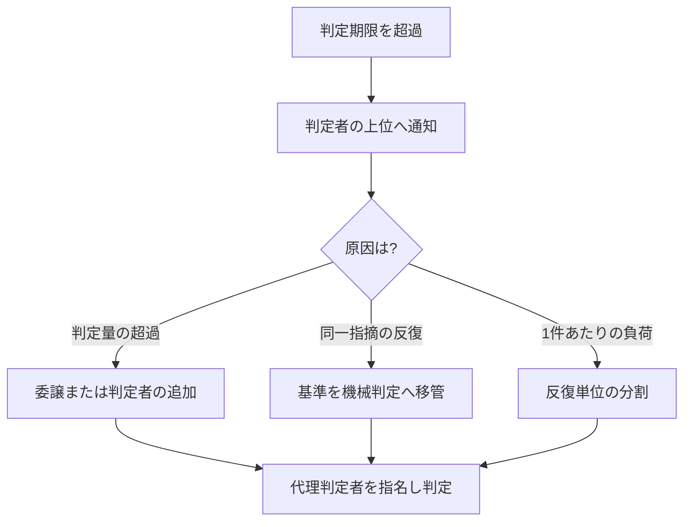

本章は、本標準の要求事項を満たせない事態が生じた場合の手続を規定します。例外を認めない標準は運用されずに迂回されます。したがって例外を禁止せず、統制の対象として扱います。

## 7.1 本章が達成すべき成果

本章の要求事項を満たしたとき、次の成果が得られます。

- 基準を満たせない状態が、隠されずに記録として表面化している
- 例外を認める権限者と、その代償として負う義務が明確である
- 判定の滞留および予算・期日の超過が、上位の判断者へ定められた基準で到達している

## 7.2 例外の前提

本標準は、次の現実を前提として例外手続を設けます。

- 期日は四半期決算・顧客契約・展示会・納品期限などの外部要因によって定まり、開発側の都合では変更できない場合がある
- 期日を守るために基準を暗黙に下げる運用が生じると、品質の劣化が記録されないまま蓄積する
- したがって基準の逸脱を禁止せず、承認・記録・回収を伴う手続として扱う

## 7.3 例外承認の要求事項

ゲートの判定基準を満たさないまま次工程へ進める場合は、次のすべてを満たさなければなりません。

| # | 要求事項 |
| --- | --- |
| 1 | 例外承認の権限を持つ者が、記名により承認する |
| 2 | 満たさない基準の項目番号と、その理由を記録する |
| 3 | 想定される影響と、影響が顕在化した場合の対処を記録する |
| 4 | 回収の期限と回収責任者を定め、技術負債台帳へ登録する |
| 5 | 回収が完了するまで、当該項目を継続的な報告対象とする |

上記のうち1項目でも満たせない場合、例外を認めてはなりません。

:::note
レビューの形骸化を検知した場合の承認権限の一時制限と、その解除条件は、本章の改訂で追加します。
:::

## 7.4 ファストトラック(期日制約下の例外)

ファストトラックは、7.3 の例外承認の特殊形です。動かせない期日に対処するため、一部のゲートを後追いに回す手続を規定します。7.3 の5要求事項に、本節の制約が加わります。

### 適用できる期日

適用条件は「急いでいること」ではありません。**遅延した場合に組織の外部で不可逆な損失が生じる期日**に限ります。

| 適用できる期日 | 適用できない期日 |
| --- | --- |
| 顧客との納品契約 | 社内の目標日 |
| 展示会・発表会などの公開日 | 期初に置いた見込み |
| 規制対応の法定期限 | 上位者の期待 |
| サービス終了に伴う移行期限 | チームの意欲的な目標 |

この区別を設けない場合、すべての期日が「動かせない期日」として申告されます。

### 後回しにできる対象

短縮できる対象は次の限定列挙です。ここにないものを短縮してはなりません。

| ゲート | 後回しの可否 |
| --- | --- |
| G-6 独立レビュー | 可(実施期限を定めた後追い) |
| G-3 の判断記録(ADR) | 可(記録のみ後追い。判断そのものは実施する) |
| G-7 出荷判定の一部項目 | 可(項目を特定した限定的な短縮) |
| G-4 機能仕様承認 | 不可 |
| G-5 自動検証(CI) | 不可 |
| 認証・認可・データ保全に関する検証 | 不可 |

G-4 と G-5 を短縮できない理由は、この2つを外すと「何を作ったか」と「動作するか」の双方が不明なまま出荷することになるためです。これはリスクの引き受けではなく、リスクの把握の放棄です。

### 申請書の必須項目

申請書には次を記載しなければなりません。AI エージェントが草案を生成できます。

- 短縮するゲートと、検証されないまま残る範囲(ファイル・機能・受入基準の単位で特定する)
- 未解決欠陥の一覧と重大度
- 影響を受ける利用者の範囲
- 回収に要する見積工数

確率的な予測は求めません。**事実として何が検証されていないか**を特定することを求めます。

### 乱用を防ぐ制約

| # | 制約 |
| --- | --- |
| 1 | 未回収のファストトラック項目が残っている間、同一案件で新たなファストトラックを申請できない |
| 2 | 事業ステージあたりの適用回数の上限を、企画承認(G-1)の時点で合意し記録する |
| 3 | 適用後、定めた期限内に事後レビューを実施する。未実施の場合、当該案件のファストトラック権限を停止する |
| 4 | 承認者は記名し、承認理由を記録する。理由の記載がない承認は無効とする |
| 5 | 発生率・回収完了率・適用後の欠陥発生率を継続して測定し、会議体へ報告する |

制約1が最も強い抑止です。回収を伴わない限り次を使えないため、常態的な適用が成立しません。

制約3と制約4は、承認の形式化を防ぎます。緊急手続を持つ組織では、承認側が責任回避のための署名機関と化し、事後レビューを省略する事態が繰り返し報告されています。

## 7.5 判定の滞留に対する措置

ゲートの判定期限を超過した場合、自動承認としてはなりません。次の手順を適用します。

滞留への対処は、委譲・機械化・分割のいずれかによって判定の帯域を確保する方法を優先します。判定基準の緩和による対処は、7.3 の例外承認手続を経た場合に限り認めます。

## 7.6 エスカレーションの基準

### 発火条件

次の条件に該当した時点で、報告が発生します。判断を待ってから報告するのではありません。

閾値は初期値です。企画承認(G-1)の時点で組織が確定し、記録しなければなりません。

| 区分 | 段階1 | 段階2 | 段階3 |
| --- | --- | --- | --- |
| 予算 | 10% 超過 | 20% 超過 | 30% 超 |
| スコープ | 5% 変動 | 15% 変動 | 25% 超 |
| 日程 | 1週間の遅延 | 2週間の遅延 | 主要工程への影響 |
| 報告先 | プロジェクト責任者 | 部門責任者・PMO | 投資判断を行う会議体 |

品質側にも発火条件を設けます。AI 協調開発では、予算・日程の逸脱より先に品質側の劣化が現れるためです。

| 事象 | 報告先 |
| --- | --- |
| ゲート判定の期限超過率が基準を超えた状態 | 判定者の上位者 |
| 独立レビューの差し戻し率が基準を逸脱した状態 | 技術判断者および品質保証部門 |
| 同一箇所の修正が収束しない状態 | 技術判断者 |
| 事業ステージの基準を満たさない未解決欠陥 | 品質保証部門および事業決裁者 |
| 事業性の前提が崩れた状態 | 投資判断を行う会議体 |

差し戻し率の警戒方向は両側です。高すぎる場合は手前の工程の品質問題を示し、ゼロが続く場合はレビューの形骸化を示します。

### エスカレーションレポートの様式

報告は次の5項目で構成しなければなりません。経緯の記述を最小化し、選択肢と事業影響への換算を必須とします。現場は経緯を語り、決裁者は選択肢を求めるためです。

| 項目 | 内容 | 分量の上限 |
| --- | --- | --- |
| 1. 状態 | 何が基準を逸脱したか。数値で示す | 3行 |
| 2. 原因 | 直接原因と、判明していれば背景要因 | 5行 |
| 3. 事業影響 | 期日・費用・利用者・契約への換算 | 表 |
| 4. リカバリ選択肢 | 3案。各案の到達点・費用・期日・残るリスク | 表 |
| 5. 推奨と決裁事項 | 起案者の推奨案と、決裁者に求める判断 | 3行 |

**選択肢は3案を必須とします**。1案は決裁ではなく承認の要求になり、2案は二者択一の圧力になります。3案あると、期日を守る案・品質を守る案・範囲を削る案という異なる価値の比較が成立します。

AI エージェントは項目1〜4の草案を生成できます。項目5は人間が記入しなければなりません。推奨の提示は結果責任(A)を負う者の行為であり、AI へ委譲できません。

### 決裁後のポートフォリオ調整

エスカレーションの決裁が要員または予算の移動を伴う場合、次を満たさなければなりません。

- 決裁結果に、影響を受ける他の案件の一覧を含める
- 移動元の案件の責任者へ通知する
- 移動により実施できなくなる事項を記録する

伝達の手段(様式・ツール)は、組織の既存の PMO 運用に合わせて[第8章](/process-compass/phase4-process-design/tailoring-guide/)で定めます。本標準が規定するのは伝達すべき内容です。

:::note
予算・要員の再配賦および中止(Kill)判断の基準は、本章の改訂で追加します。会議体の構成と決裁権限は[第3章](/process-compass/phase4-process-design/roles-responsibilities/)の改訂で規定します。
:::

## 7.7 記録の要求事項

例外承認およびエスカレーションの記録は、次の要件を満たさなければなりません。

- 出荷判定において、全件の状態を突合できる形式で保持する
- 回収済みの項目と未回収の項目を区別できる
- 案件の完了後も、監査の求めに応じて提示できる期間にわたり保管する

## 7.8 関連する章

- ゲートの判定基準および期限は[第4章](/process-compass/phase4-process-design/gate-criteria/)に規定する
- 技術負債台帳の様式は[第6章](/process-compass/phase4-process-design/deliverable-templates/)に規定する
- 負債の回収サイクルは[フェーズ6(プロセス運用)](/process-compass/phase6-operation/debt-payback/)に規定する
