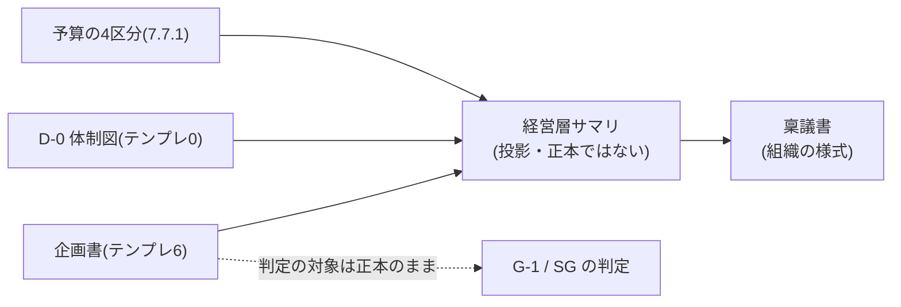

本附属書は、[ADR-0032](/process-compass/adr/0032-executive-summary-as-projection/)の決定に基づき、既存の決裁制度へ本標準の成果物を提示する作法を示します。**要求事項ではなく手引きです**。提示の形式は組織の決裁制度に依存するため、本標準が遵守を求められる範囲を超えます。

## G.1 なぜ投影なのか

本標準は経営層の手続を変更しません。既存の稟議・決裁権限規程・出荷判定をそのまま用います。したがって**稟議書そのものは組織の様式であり、本標準は関与しません**。

一方で、事業決裁者を読者に挙げている成果物は[テンプレ6 企画書](/process-compass/phase4-process-design/deliverable-templates/)の1件のみです。その様式は9つの節と5つの表からなり、1枚に収まりません。

そこで、既存成果物から必要な項目を取り出して1枚に並べます。**新しい様式を作りません**。

投影が満たすべき条件は3点です。

| # | 条件 | 欠いた場合に起きること |
| --- | --- | --- |
| 1 | すべての項目に、既存成果物の出所が対応している | 投影が第2の正本になり、更新の追随が切れる |
| 2 | 新しい記述を書かせない | 投影のためだけの作文が生まれる |
| 3 | 判定の対象にしない | 判定の記録と提示の資料が混ざり、監査で追えなくなる |

## G.2 投影の構成

次の8項目で構成します。**出所を持たない項目を加えてはなりません**。

| 提示する欄 | 出所 |
| --- | --- |
| 誰の何が変わるか | 企画書 観点3 受益者と価値 |
| 今は何で代替しているか | 企画書 観点2 の「現在の代替手段」 |
| なぜ自社か | 企画書 観点2 自社が勝てる理由 |
| いくらかかるか | [7.7.1](/process-compass/phase4-process-design/exception-escalation/) 予算の4区分(期間・要員・AI実行・基盤) |
| いつ何が確かめられるか | 企画書 観点4 の「期待効果(短期)」 |
| 効果の幅 | 企画書 観点4 の「期待効果(長期)」 |
| 止める条件 | 企画書 観点6 中止条件 |
| 誰が決めるか | [D-0](/process-compass/phase4-process-design/deliverable-templates/) 表1 決定の権限 |

投影に含めない項目は次のとおりです。理由は[ADR-0031](/process-compass/adr/0031-market-hypothesis-by-structure-not-fields/)決定6 および ADR-0032 によります。

- 市場規模、市場成長率
- 到達の経路(チャネル)
- 課金モデル、収益の構成
- 投資回収期間、損益分岐点

## G.3 提示の順序

企画書の6観点は**書く順**です。財務を最初に置かないのは、初期の選別に財務基準を用いる構成が成果を下げるという調査結果によります。

一方、決裁の場で読まれる順序はこれと異なります。**書く順序を変えずに、提示の順序だけを変えます**。

| 提示の順 | 欄 | 対応する観点 |
| --- | --- | --- |
| 1 | 誰の何が変わるか | 観点3 |
| 2 | 今は何で代替しているか | 観点2 |
| 3 | いくらかかるか | 7.7.1 |
| 4 | いつ何が確かめられるか | 観点4 |
| 5 | 効果の幅 | 観点4 |
| 6 | なぜ自社か | 観点2 |
| 7 | 止める条件 | 観点6 |
| 8 | 誰が決めるか | D-0 表1 |

**止める条件を最後から2番目に置きます**。冒頭に置くと案件の否定として読まれ、末尾に置くと読まれません。

## G.4 稟議へ出す数値

決裁制度が単一の金額または回収期間の提示を要求する場合の作法です。

:::danger
**企画書の期待効果欄を書き換えてはなりません**。稟議のための数値を正本へ書き戻すと、[第6章](/process-compass/phase4-process-design/deliverable-templates/)が禁じた単一の年額が正本に入ります。
:::

| # | 作法 |
| --- | --- |
| 1 | 稟議書へ記載する数値は、期待効果の幅の**下限値**を用いる |
| 2 | **上限値を提示に用いてはならない** |
| 3 | 数値には、算定根拠と効果が出ない条件を併記する。数値のみの提示を禁じる |
| 4 | 幅の出所(企画書の版)を明記する |

### なぜ下限値なのか

需要予測の検証では、過大な見積りが系統的に生じています。上限値の提示は、その偏りを制度として追認します。

**下限値で決裁が通らない案件は、下限値で通らないという事実そのものが判断の材料です**。数値を上げて通すのではなく、通らない理由を記録します。

### なぜ数値の提示を禁じないのか

数値の提示そのものを禁じると、決裁制度が数値を要求する組織では、**標準の外で数字が作られます**。統制の外に資料が生まれる状態は、規定された形式で数値を出す状態より悪くなります。

## G.5 やってはならないこと

| # | 禁止 | 理由 |
| --- | --- | --- |
| 1 | 投影を正本として保管する | 正本が2つになり、更新の追随が切れる |
| 2 | 投影だけを見てゲートを判定する | 判定の入力は正本である。投影は判定の材料を欠く |
| 3 | 投影に、出所を持たない項目を加える | 投影のためだけの作文が生まれる |
| 4 | 投影を根拠に企画書の記述を削る | 読みやすさのために判定の材料を削る取り引きになる |
| 5 | 上限値を稟議へ提示する | G.4 のとおり |

:::caution[暫定 EV-0019 / 見直し 2027-08]
**対象**: 投影の8項目の構成と、G.3 の提示の順序。
**根拠の水準**: E0(なし)。
**差し替え条件**: 投影を用いた決裁3件分の記録と、決裁者が不足を指摘した項目の一覧。
:::
