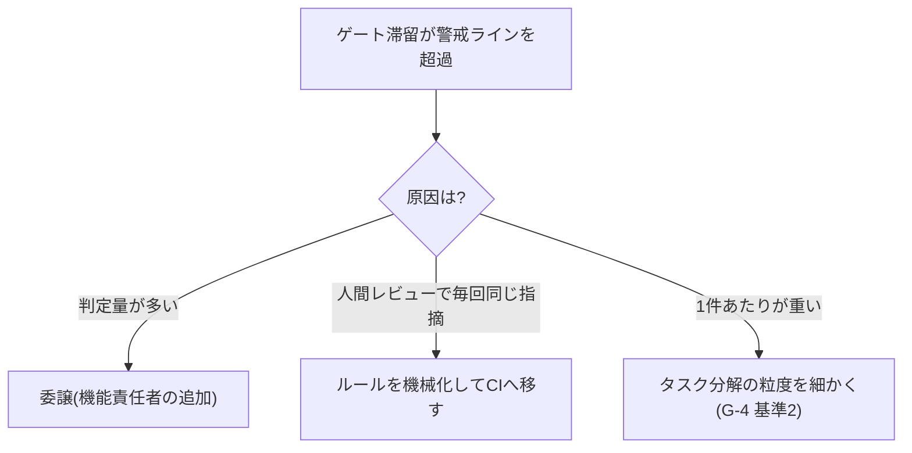

[統合プロセス参照モデル](/process-compass/processes/integrated/)の8ゲートを、運用に載せられる粒度まで詳細化します。各ゲートの判定は、このページのチェックリストとの突合で行います。

## ゲート運用の共通ルール

すべてのゲートに共通する運用原則です(設計原則の実装)。

1. **単独判定**: 判定者は1人。関係者の意見は判定前の**非同期コメント期間**(公開された期限まで)に集め、判定会議は開かない
2. **期限付き**: 各ゲートに判定期限を設ける。期限超過は「自動承認」にはせず、**エスカレーション**(判定者の上位への通知と代理判定者の指名)とする
3. **差し戻しは理由付き**: 差し戻す場合、どの基準を満たさないかをチェックリストの項目番号で示す。「なんとなく不安」での差し戻しを認めない
4. **記録が残る**: 判定結果・判定者・日時・差し戻し理由を記録する(記録様式は[成果物テンプレート](/process-compass/phase4-process-design/overview/)で定義)

## 各ゲートの判定チェックリスト

### G-1 企画承認(事業決裁者・既存規程どおり)

| # | 判定基準 | 確認方法 |
| --- | --- | --- |
| 1 | 投資対効果が事業基準を満たす | 企画書の効果試算と社内基準の突合 |
| 2 | リスクと受容方針が明示されている | 企画書のリスク欄 |
| 3 | コンテキスト基盤の初期整備コストが予算に含まれる | 予算内訳(明文化コストの予算化) |

期限: 既存の稟議運用どおり(このゲートは低頻度のため既存の速度を許容する)。

### G-2 要件合意(価値責任者・48時間)

| # | 判定基準 | 確認方法 |
| --- | --- | --- |
| 1 | 受入基準が検証可能な形式で書かれている | 「条件+期待動作」形式(EARS 等)への準拠 |
| 2 | 曖昧語が残っていない | 禁止語リストとの突合(下記) |
| 3 | 暗黙の前提が案件層コンテキストに登録済み | コンテキスト基盤の案件層の差分確認 |
| 4 | スコープ外事項が明記されている | 仕様書の「やらないこと」欄 |

**曖昧語の禁止リスト(初期値)**: 「適切に」「柔軟に」「可能な限り」「〜など」「必要に応じて」「基本的に」。これらは受入基準に使用不可とし、AI によるチェックを CI に組み込みます(フェーズ5)。

### G-3 技術設計判断(技術判断者・48時間)

| # | 判定基準 | 確認方法 |
| --- | --- | --- |
| 1 | 非機能要件の充足見込みが示されている | 設計案の非機能欄(性能・可用性・セキュリティ) |
| 2 | 既存資産・コンテキスト基盤と整合している | 恒久層(設計標準)との突合 |
| 3 | 選択の可逆性が評価されている | ADR の「戻せない選択」欄の記載 |
| 4 | 代替案が最低1つ比較されている | ADR の比較表 |

### G-4 機能仕様承認(価値責任者または委譲先・24時間)

| # | 判定基準 | 確認方法 |
| --- | --- | --- |
| 1 | 機能仕様に検証可能な受入基準が含まれる | G-2 と同じ形式チェック |
| 2 | タスク分解の粒度が1タスク=1レビュー単位 | 実装計画のタスク一覧(1タスクのPRが独立レビュー可能なサイズ) |
| 3 | 対象機能のコア/非コア指定が明示されている | 機能一覧のコア指定欄 |

### G-5 自動検証 CI(機械判定・即時)

| # | 判定基準 | 初期値 |
| --- | --- | --- |
| 1 | 全テストが GREEN | 例外なし |
| 2 | 静的解析・脆弱性スキャンの重大指摘 | Critical / High = 0 件(Medium 以下は台帳記録で通過可) |
| 3 | テストカバレッジ | 企画時に設定した基準値以上(目安: 新規コード 80%。数値は組織で調整) |
| 4 | 曖昧語チェック(仕様変更を含むPRの場合) | 禁止語 0 件 |

このゲートの原則は「**合意済みルールはすべて機械化して載せる**」です。人間のレビューで毎回指摘していることがあれば、それはこのゲートへ移す候補です。

### G-6 独立レビュー(独立レビュア・2営業日)

| # | 判定基準 | 確認方法 |
| --- | --- | --- |
| 1 | 仕様(受入基準)と実装が一致している | 受入基準の項目ごとに挙動を確認 |
| 2 | レビュアが挙動を自分の言葉で説明できる | 承認コメントに1〜2文の挙動要約を必須記載 |
| 3 | (コア機能のみ)設計意図の記録が完備 | ADR・判断記録の添付確認 |
| 4 | レビュアが作成の指示者本人でない | ブランチ保護で機械強制 |

基準2の「挙動要約の必須記載」は、rubber stamp(見ずに承認)の抑止装置です。要約が書けない承認は差し戻し扱いにします。

### G-7 出荷判定(QA・3営業日)

| # | 判定基準 | 初期値 |
| --- | --- | --- |
| 1 | 計画したテストの消化率 | 100%(未消化は理由と代替の記録が必要) |
| 2 | 未解決の重大欠陥 | 0 件(重大=データ破損・セキュリティ・業務停止) |
| 3 | 受容した負債の台帳記録 | 記録漏れ 0 件 |
| 4 | 運用引き継ぎ文書 | 完備(監視項目・障害時連絡先・復旧手順) |
| 5 | 全ゲートの通過記録 | 欠落 0 件 |

**このゲートで再テスト・再レビューを始めないこと**。判定は記録と基準の突合に限定します(滞留防止)。突合で疑義が出た場合のみ、対象を絞って確認します。

### G-8 リリース決裁(事業決裁者・48時間)

| # | 判定基準 | 確認方法 |
| --- | --- | --- |
| 1 | 出荷判定(G-7)を通過している | 判定記録 |
| 2 | 事業リスクの受容判断 | リリースタイミング・市場影響の観点のみ |

**技術品質を蒸し返さない**ことを運用規程に明記します。G-8 の差し戻し理由に技術品質を挙げることは、G-7 との役割分担違反です。

## ゲートの健全性を計測する

ゲートが機能しているか・形骸化していないかを、次の指標で継続計測します(フェーズ6の運用テーマ)。

| 指標 | 何が分かるか | 警戒サイン |
| --- | --- | --- |
| ゲート滞留時間(提出→判定) | 承認がボトルネックになっていないか(G5) | 期限超過率が10%を超える |
| 差し戻し率 | ゲートが機能しているか | 0%が続く(=素通しの疑い)または50%超(=手前の品質問題) |
| レビュー所要時間 | rubber stamp の検知 | 変更規模に対して極端に短い承認が続く |
| エスカレーション発生数 | 判定者の帯域不足 | 特定判定者に集中(委譲・増員の判断材料) |

差し戻し率の「0%が続くのは良い状態ではない」という点が重要です。すべて素通しになっているゲートは、存在しないのと同じです。

## 判定者の帯域が超過したら

人間の検証帯域が律速になったときの対処を、あらかじめ決めておきます。

「速くするために基準を緩める」は選択肢に含めません。緩和ではなく、委譲・機械化・分割で帯域を確保します。
