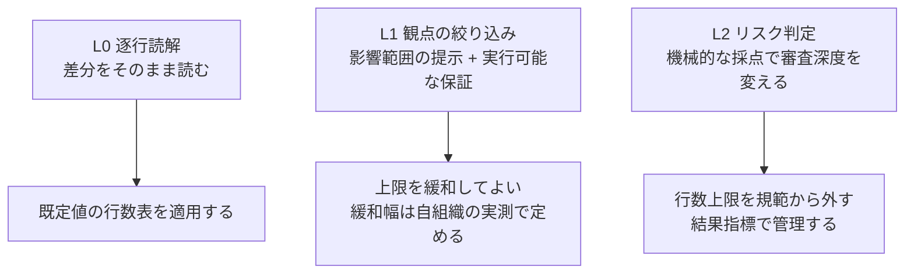

本章は、本標準が置く8つの工程ゲートについて、運用に載せられる粒度まで判定基準を規定します。各ゲートの判定は、このページのチェックリストとの突合で行います。

ゲートの識別子・順序・成果物との関係は、[統合プロセス参照モデル](/process-compass/phase4-process-design/process-model/)(本標準の構造の機械可読表現)が保持します。本章はその判定基準の正本です([ADR-0010](/process-compass/adr/0010-data-doc-interface/))。

## ゲートの2系統

本標準のゲートは2系統に分かれます。本章が規定するのは工程ゲート(G-1〜G-8)です。

| 系統 | 記号 | 判断の対象 | 規定する章 |
| --- | --- | --- | --- |
| ステージ移行ゲート | SG-0〜SG-2 | 投資を継続するか、次ステージへ進むか | [第2章](/process-compass/phase4-process-design/lifecycle/) |
| 工程ゲート | G-1〜G-8 | この成果物を次工程へ進めてよいか | 本章 |

各事業ステージで有効化する工程ゲートの組は、[第2章 2.5](/process-compass/phase4-process-design/lifecycle/)に規定します。

## 前提条件と判定基準の区別

ゲートは2種類の条件を持ちます。両者を混同してはなりません。

| 区分 | 定義 | 満たさない場合 |
| --- | --- | --- |
| 前提条件 | 判定を開始するために整っていなければならない状態 | 判定を開始せず、提出者へ差し戻す |
| 判定基準 | 判定において合否を評価する基準 | 判定の結果として差し戻す |

前提条件を判定基準に含めると、他の基準の評価と相殺されて通過します。前提条件は機械的に検査し、人の判断を介在させません。

## 全ゲートに共通する通過条件

各ゲートの判定基準に加えて、次を全ゲートの通過条件とします。**新しいゲートは設けません**。

> 当該の工程に関係する前提の充足状態が台帳に記録されており、AC-1 以上のものについて受容の決裁が取られていること

前提の一覧は[理想モデルの前提条件一覧](/process-compass/phase2-aidlc/assumptions/)、手続は[第7章 7.10](/process-compass/phase4-process-design/exception-escalation/)、様式は[第6章 テンプレ10](/process-compass/phase4-process-design/deliverable-templates/)によります。

**前提が崩れていることを理由に判定を停止しません**。可視化し、受容の決裁を求めます。停止する設計は申告そのものを止め、測定を無効にします。

## ゲート運用の共通ルール

すべてのゲートに共通する運用原則です(設計原則の実装)。

1. **単独判定**: 判定者は1人。関係者の意見は判定前の**非同期コメント期間**(公開された期限まで)に集め、判定会議は開かない
2. **期限付き**: 各ゲートに判定期限を設ける。期限超過は「自動承認」にはせず、**エスカレーション**(判定者の上位への通知と代理判定者の指名)とする
3. **差し戻しは理由付き**: 差し戻す場合、どの基準を満たさないかをチェックリストの項目番号で示す。「なんとなく不安」での差し戻しを認めない
4. **記録が残る**: 判定結果・判定者・日時・差し戻し理由を記録する(記録様式は[成果物テンプレート](/process-compass/phase4-process-design/deliverable-templates/)で定義)

## 各ゲートの判定チェックリスト

### G-1 企画承認(事業決裁者・既存規程どおり)

**前提条件**(満たさない場合、審議を開始しない):

| # | 前提条件 | 確認方法 |
| --- | --- | --- |
| 1 | 意思決定・エスカレーション体制図(D-0)が承認済みである | 承認者と承認日時の記録([第2章 2.8](/process-compass/phase4-process-design/lifecycle/)) |

判定基準:

| # | 判定基準 | 確認方法 |
| --- | --- | --- |
| 1 | 投資対効果が事業基準を満たす | 企画書の効果試算と社内基準の突合。算定根拠・参照した過去案件・効果が出ない条件の3欄が埋まっていること |
| 2 | リスクと受容方針が明示されている | 企画書のリスク欄。区分・顕在化しうる時期・方針・判断者が埋まっていること。AI 利用に伴うリスクを1行以上含むこと |
| 3 | コンテキスト基盤の初期整備コストが予算に含まれる | 予算内訳(明文化コストの予算化) |
| 4 | 指標の閾値と予算区分が合意され記録されている | 安定性指標、エスカレーション閾値([第7章 7.6](/process-compass/phase4-process-design/exception-escalation/))、予算の4区分([第7章 7.7](/process-compass/phase4-process-design/exception-escalation/)) |

**戦略整合と自社が勝てる理由の欄が空である企画書は、基準1の判定へ進みません**。案件を始める理由を書かないまま、費用と効果の数字だけで判定する経路を作らないためです。欄の空白は機械的に検査します(記述の内容は機械が判定しません。[第5章 5.7.4](/process-compass/phase4-process-design/human-ai-boundary/))。

企画で評価する6観点と様式は[第6章 テンプレ6](/process-compass/phase4-process-design/deliverable-templates/)に規定します。

期限: 既存の稟議運用どおり(このゲートは低頻度のため既存の速度を許容する)。

### G-2 要件合意(価値責任者・48時間)

| # | 判定基準 | 確認方法 |
| --- | --- | --- |
| 1 | 受入基準が検証可能な形式で書かれている | 「条件+期待動作」形式([EARS 記法ガイド](/process-compass/phase4-process-design/ears-guide/))への準拠 |
| 2 | 曖昧語が残っていない | 禁止語リストとの突合(下記) |
| 3 | 暗黙の前提が案件層コンテキストに登録済み | コンテキスト基盤の案件層の差分確認 |
| 4 | スコープ外事項が明記されている | 仕様書の「やらないこと」欄 |
| 5 | 合意した範囲がスコープ3層へ割り当てられている | SC-M・SC-P・SC-B の別が記入されていること([第2章 2.10.1](/process-compass/phase4-process-design/lifecycle/)) |

基準5で合意した範囲が、G-4 における範囲内外の判定の基準になります。**G-2 で層を割り当てていない案件では、G-4 の判定が成立しません**。

**曖昧語の禁止リスト(初期値)**: 「適切に」「柔軟に」「可能な限り」「〜など」「必要に応じて」「基本的に」。これらは受入基準に使用不可とし、AI によるチェックを CI に組み込みます(フェーズ5)。

### G-3 技術設計判断(技術判断者・48時間)

| # | 判定基準 | 確認方法 |
| --- | --- | --- |
| 1 | 非機能要件の充足見込みが示されている | 設計案の非機能欄(性能・可用性・セキュリティ) |
| 2 | 既存資産・コンテキスト基盤と整合している | 恒久層(設計標準)との突合 |
| 3 | 選択の可逆性が評価されている | ADR の「戻せない選択」欄の記載 |
| 4 | 代替案が最低1つ比較されている | ADR の比較表 |
| 5 | 事業影響が観測可能な事象で記述されている | ADR の事業影響欄5項目([第6章 テンプレ2](/process-compass/phase4-process-design/deliverable-templates/))に空欄がないこと |

#### 事業影響を金額で定量化しない

**事業影響の記載に、金額での定量化を義務づけません**。復旧の費用や賠償の見積りは、置いた前提によって桁が変わります。義務づければ、**精度を装った数字が決裁を通ります**。金額を書くことは禁じませんが、書く場合は算定根拠・参照した過去案件・その額にならない条件の3点を併記します([第6章 テンプレ6](/process-compass/phase4-process-design/deliverable-templates/)と同じ作法)。

**発生確率と影響度の格付けを掛け合わせた順位づけを、判定の根拠にしてはなりません**。リスクマトリクスの数学的性質を分析した研究(2008年)は、**量的に小さいリスクへ高い定性評価を与えうること**、発生頻度と深刻度が負に相関する場合には無作為な判断より悪くなりうること、無作為に選んだ危険源の対のうち正しく明確に比較できるのは1割に満たないことを報告しています。

:::note
リスク区分 R1〜R3([第3章 3.8.1](/process-compass/phase4-process-design/roles-responsibilities/))は、格付けの掛け合わせではなく**該当条件による判定**であるため、上記の批判の対象になりません。事業影響の記述でも、取り消しの可否は R の軸を流用します。
:::

記述は[第4章の重大度](#欠陥トリアージ基準)と同じ作法をとります。**観測可能な事象で書き、主観的な深刻さの表現を用いません**。

#### 記載の検査

記述の質を機械判定して承認可否を決めてはなりません([第5章 5.7.4](/process-compass/phase4-process-design/human-ai-boundary/))。機械が検査してよいのは形式的な欠落です。

| 検査の対象 | 機械 | 人間 |
| --- | --- | --- |
| 欄が空である | 検査する | — |
| 「回復に要する時間」が幅ではなく単一の値である | 検査する | — |
| 「顕在化が分かる兆候」が「なし」と記載されている | 検査する | — |
| 前の判断記録と記述が一致している | 検査する | — |
| 記述の内容が妥当である | しない | 判定する |

「顕在化が分かる兆候」に「なし」を認めない作法は、決断の記録における「確認していない事項」と同じものです。

#### 事業決裁者が受容を拒否した場合

差し戻し先を3つに分けます。**新しい経路を設けません**。

| 拒否の理由 | 差し戻し先 |
| --- | --- |
| 別の技術的選択で回避しうる | **G-3 へ差し戻す**(代替案の再検討。基準4) |
| どの技術的選択でも受容できない | **G-2 へ差し戻す**。要件そのものが実現不能である |
| 案件の前提が崩れている | **中止の判断へ上程する**([第7章 7.7.3](/process-compass/phase4-process-design/exception-escalation/)) |

**「受容できないが進める」を通常の経路として認めません**。認める場合は[第7章 7.3](/process-compass/phase4-process-design/exception-escalation/)の例外承認によります。

### G-4 機能仕様承認(価値責任者または委譲先・24時間)

| # | 判定基準 | 確認方法 |
| --- | --- | --- |
| 1 | 機能仕様に検証可能な受入基準が含まれる | G-2 と同じ形式チェック |
| 2 | タスク分解の粒度が1タスク=1レビュー単位 | 実装計画のタスク一覧(1タスクのPRが独立レビュー可能なサイズ) |
| 3 | 対象機能のコア/非コア指定が明示されている | 機能一覧のコア指定欄 |
| 4 | 各タスクの規模が分割基準の範囲内である | 下記「タスクの分割基準」との突合 |
| 5 | 合意した範囲の内か外かの判定が記入されている | 判定欄に SC-M / SC-P / SC-B / 範囲外 のいずれかが記入されていること。**空欄の場合、判定を開始しない** |

#### 範囲内外の判定を機械が行わない理由

基準5について、**機械が判定してよいのは記入の有無だけです**。範囲の内か外かの判断そのものを機械に委ねてはなりません。

自動生成した要求トレーサビリティ行列を人手で検証させた実験(2010年)では、初期の精度が低い候補を与えられた分析者は品質を大きく改善した一方、**初期の精度が高い候補を与えられた分析者は品質を下げました**。分析者の最終結果は、初期状態によらず一点へ収束する傾向を示しています。機械の出力を人が追認する構成は、人の判断を機械の出力へ引き寄せます。

この結論は、記述の質を機械判定して承認可否を自動決定しないという[第5章 5.7.4](/process-compass/phase4-process-design/human-ai-boundary/)の原則と同じものです。AI エージェントは判定の**草案**を作成できます。確定は判定者が行います。

#### 範囲外と判定した場合

内側のループを止めません。影響の範囲に応じて経路を分けます。手続は[第2章 2.10.8](/process-compass/phase4-process-design/lifecycle/)に規定します。

判定の総数は増えません。基準5は G-4 の記載事項であり、独立した判定を追加するものではありません。あわせて[第7章 7.6](/process-compass/phase4-process-design/exception-escalation/)のスコープに関する発火条件を確約範囲(SC-M)の変動へ限定したため、**通常運転で発生する報告の件数は減ります**。

### G-5 自動検証 CI(機械判定・即時)

| # | 判定基準 | 初期値 |
| --- | --- | --- |
| 1 | 全テストが GREEN | 例外なし |
| 2 | 静的解析・脆弱性スキャンの重大指摘 | Critical / High = 0 件(Medium 以下は台帳記録で通過可) |
| 3 | テストカバレッジ | 企画時に設定した基準値以上(目安: 新規コード 80%。数値は組織で調整) |
| 4 | 曖昧語チェック(仕様変更を含むPRの場合) | 禁止語 0 件 |
| 5 | 依存関係のライセンス検査 | 禁止ライセンスの検出 0 件。ライセンスを判定できない依存 0 件(台帳へ記録すれば通過可) |
| 6 | 文脈ファイルの形式検査 | リポジトリ内の参照切れ 0 件。1ファイルの分量の上限超過 0 件([第3章 3.11.4](/process-compass/phase4-process-design/roles-responsibilities/)) |

**基準6にコードと文脈の乖離を含めません**。乖離の判定は対応関係の推定を含み、実効的な偽陽性が生じます。**落とすと、内容のない形式的な更新が入ります**。乖離は記録し、四半期の棚卸しで扱います(手続は[コンテキスト基盤](/process-compass/phase5-implementation/context-base/))。

このゲートの原則は「**合意済みルールはすべて機械化して載せる**」です。人間のレビューで毎回指摘していることがあれば、それはこのゲートへ移す候補です。

#### 知財潔白性の検査

**成果物へ他者の著作物が混入していないことの検査を、AI の利用の有無で変えてはなりません**。人が書いた場合にも混入は起こります。要求は全件へ一律に適用します。

検査の対象は2つに分かれます。**同じ「知財チェック」として扱ってはなりません**。

| 対象 | 調べること | 本標準における扱い |
| --- | --- | --- |
| 依存関係のライセンス | 取り込んだ部品のライセンスと、その条件(表示義務、派生物の開示義務など) | **合否条件**(基準5) |
| 生成物と既存の著作物の類似 | 出力が既存の表現と一致または高度に類似するか | **合否条件にしない**。実施と結果を記録し、出荷判定(G-7)のエビデンスとする |

類似の検知を合否条件にしてはならない理由は3つあります。

- 検知は完全でない。検出されなかったことは、混入がないことの証明にならない
- 合否条件にすると、**検出されなかったという結果が「潔白である」という記録として残る**。後述の推認に対して、この記録は防御にならない
- 検知の機能は事業者が提供するものであり、位置づけが変わる。2026-04-03 に、ある事業者の知財補償において複製検知機能の利用が要件から外れた実例がある

:::danger
**「AI が生成したので既存の著作物を知らなかった」は抗弁になりません**。日本の著作権法における侵害の要件は**類似性と依拠性**であり、生成 AI の学習段階に当該の著作物が含まれていた場合、利用者が認識していなくても**通常は依拠性が推認される**とされています(文化審議会 著作権分科会の法制度に関する小委員会「AIと著作権に関する考え方について」、令和6年)。

したがって、**利用者の側で制御できるのは類似性の側と、講じた措置の記録だけです**。
:::

:::caution
上記の「考え方」は**法的な拘束力を持ちません**。同資料自身が、公表時点における小委員会としての一定の考え方であり、確定的な法的評価をするものではないと明記しています。**本標準は「著作権法に準拠する」とは書きません**。規定するのは、侵害が主張された場合に提示できる記録を残す手続です。
:::

検査の実装は[フェーズ5(CI/CD ゲート)](/process-compass/phase5-implementation/ci-gates/)に規定します。**判定の場は増えません**。基準5は機械判定であり、判定者の帯域を消費しません。

### G-6 独立レビュー(独立レビュア・応答1営業日 / 判定2営業日)

| # | 判定基準 | 確認方法 |
| --- | --- | --- |
| 1 | 仕様(受入基準)と実装が一致している | 受入基準の項目ごとに挙動を確認 |
| 2 | レビュアが挙動を自分の言葉で説明できる | 承認コメントに1〜2文の挙動要約を必須記載 |
| 3 | (コア機能のみ)設計意図の記録が完備 | ADR・判断記録の添付確認 |
| 4 | レビュアが作成の指示者本人でない | ブランチ保護で機械強制 |

基準2の「挙動要約の必須記載」は、見ずに承認する状態の抑止装置です。要約が書けない承認は差し戻し扱いにします。

このゲートの検出能力は、意図的に混入させた欠陥の検出率によって継続的に測定します。手続は[第5章 5.6.2](/process-compass/phase4-process-design/human-ai-boundary/)に規定します。測定の対象は工程であり、個人ではありません。

期限の運用は下記「レビュー SLA と滞留の措置」に規定します。

安全関連ソフトウェアを含む変更では、このゲートに加えて**独立した安全性の評価を重ねます**。既存のゲートへ吸収してはなりません。評価者は実装の責任者から組織的に独立している必要があり、独立レビュアとは要件が異なるためです。手順は[附属書F](/process-compass/phase4-process-design/safety-verification/)によります。

### G-7 出荷判定(QA・3営業日)

| # | 判定基準 | 初期値 |
| --- | --- | --- |
| 1 | 計画したテストの消化率 | 100%(未消化は理由と代替の記録が必要) |
| 2 | 未解決の欠陥 | 事業ステージ別の欠陥トリアージ基準(下記)を満たす |
| 3 | 受容した負債の台帳記録 | 記録漏れ 0 件 |
| 4 | 運用引き継ぎ文書 | 完備(監視項目・障害時連絡先・復旧手順) |
| 5 | 全ゲートの通過記録 | 欠落 0 件 |
| 6 | AI 品質指標の確認 | 下記「AI 品質指標の扱い」に従う |
| 7 | (安全関連ソフトウェアのみ)安全適合性の検証記録 | [附属書F](/process-compass/phase4-process-design/safety-verification/) F.7 の項目に欠落がない |
| 8 | 知財潔白性の検査記録 | 依存関係のライセンス検査の結果、類似の検知の実施記録と結果、判定できなかった項目の台帳記録。**欠落 0 件** |

基準8を G-5 と別に置く理由は、**生成の時点で適法であることと、出荷する成果物として適法であることが別の場面だから**です。前掲の「考え方」も、生成が適法に行える場合でも生成物の利用まで直ちに適法となるものではなく、場面ごとの判断が必要であるとしています。

**基準8で判定するのは「検出されなかったこと」ではなく「定めた検査を実施し記録したこと」です**。検知に完全さを期待できない以上、検出されなかったことを潔白の根拠にできません。集約の実装は[フェーズ5](/process-compass/phase5-implementation/ci-gates/)によります。

**このゲートで再テスト・再レビューを始めないこと**。判定は記録と基準の突合に限定します(滞留防止)。突合で疑義が出た場合のみ、対象を絞って確認します。

### G-8 リリース決裁(事業決裁者・48時間)

| # | 判定基準 | 確認方法 |
| --- | --- | --- |
| 1 | 出荷判定(G-7)を通過している | 判定記録 |
| 2 | 事業リスクの受容判断 | リリースタイミング・市場影響の観点のみ |

**技術品質を蒸し返さない**ことを運用規程に明記します。G-8 の差し戻し理由に技術品質を挙げることは、G-7 との役割分担違反です。

## タスクの分割基準

AIエージェントは人間のレビュー帯域を超える量の変更を生成します。分割の基準は、生成側の都合ではなく**レビューする側の帯域**で決めます。

ただし「レビューする側の帯域」は行数では決まりません。行数が帯域の代理として機能するのは、**レビュアーが差分をテキストのまま逐行読解する場合だけ**です。影響範囲を機械的に提示する、正しさを実行可能な保証で担保する、リスクに応じて審査深度を変える。こうした手段を備えるほど、同じ帯域で扱える変更は大きくなります。

したがって本節は、**規範をレビュー可能性に置き、行数はその代理指標として扱います**。

### 規範

分割について本標準が要求するのは、次の1点です。

> **レビュアーが、変更の意図・影響範囲・正しさの根拠を、判定に耐える負荷で確認できること**

以降に示す行数・ファイル数・層数は、この規範を満たすための**代理指標**であり、規範そのものではありません。代理指標を満たしても規範を満たさない場合、判定は差し戻しです。逆に、代理指標を超えていても規範を満たすことを示せる場合、後述の手続によって上限を動かせます。

### 行数を代理指標として扱う根拠と、その限界

- 変更規模は測りやすく、レビュー依頼の時点で自動的に判定できる。運用コストが最も低い代理指標である
- 一方、レビュー指標が事後欠陥をどれだけ説明するかを Qt と Chrome で追試した研究(2020年)は、**レビュー指標を含まないモデルのほうが同等以上の適合度を示した**と報告している。事後欠陥をより強く説明するのは、先行する欠陥・モジュールサイズ・著者の属性である
- したがって行数は独立した原因ではなく、**モジュールサイズ・欠陥履歴・著者属性の代理**である可能性が高い
- 行数と並んで実証的な支持を持つのは**変更の分散度**である。変更が多数のファイルへ散らばるほど欠陥傾向が高まることを、変更エントロピーの研究群が示している

この追試を過剰に一般化しないための線引きも置きます。「レビュー指標が事後欠陥を予測しない」ことと「分割基準として行数が無意味である」ことは、別の主張です。対象は2プロジェクトであり、無作為化実験ではなく相関の推定です。**行数を捨てる根拠にはならず、行数を単独の根拠にできないことの根拠にとどまります**。

**この節の数値を「守れば品質が上がる基準」として提示しません**。逐行読解しか手段がないときに、レビュアーの負荷を予測可能な範囲へ収めるための既定値として提示します。

:::caution
この分野では、原典に存在しない数値が二次資料を通じて広まっています。上限400行の出典についても、「200行未満なら欠陥検出率87%、1000行超で28%へ低下」という数値が広く引用されていますが、**原典を精読した結果、この記述は存在しないことを確認しました**。数値を引用する際は、二次資料ではなく原典で確認してください。
:::

:::note
認知負荷理論(Sweller)をこの基準の理論的根拠として引用しません。コードレビューへの直接適用を実証した査読研究を、2026-08-07 時点で確認できていないためです。コード理解を対象とした生理指標の研究は存在しますが、レビューという判断行為を対象としたものではありません。
:::

### レビュー可能性の担保水準(L0〜L2)

何によってレビュー可能性を担保しているかで、変更規模の扱いが変わります。

```mermaid
graph TD
  L0["L0 逐行読解<br>差分をそのまま読む"] --> D0["既定値の行数表を適用する"]
  L1["L1 観点の絞り込み<br>影響範囲の提示 + 実行可能な保証"] --> D1["上限を緩和してよい<br>緩和幅は自組織の実測で定める"]
  L2["L2 リスク判定<br>機械的な採点で審査深度を変える"] --> D2["行数上限を規範から外す<br>結果指標で管理する"]
```

| 水準 | この水準を名乗るための条件 | 変更規模の扱い |
| --- | --- | --- |
| L0 | 下記のいずれも備えない | 既定値の表(後述)を適用する |
| L1 | 変更の影響範囲を機械的に提示できる。かつ、確認すべき範囲を実行可能な保証で限定できる | 上限を緩和してよい。緩和幅は自組織の実測で定める |
| L2 | 変更のリスクを機械的に採点し、閾値で審査深度を変える運用が稼働している。かつ、取り消し可能性が担保されている | 行数上限を規範から外す。リスクスコアと結果指標で管理する |

**水準は自己申告ではなく、条件の充足を記録で示します**。示せない場合の既定は L0 です。

L2 が机上の設計ではないことは、公開された一次事例で確認できます。ある大規模事業者は、変更のリスクスコアに基づいて低リスク変更のレビューを自動化する仕組みを本番運用し、53.5万件超の変更を評価して33.1万件超を自動的に着地させたと報告しています(2026年)。同社は導入の動機として、コード増加の大半をAIエージェントが担うようになり、供給とレビュー能力の差が開いたことを挙げています。

この事例で重要なのは、**人間のレビューを省いたのではなく、別の保証へ置き換えた**という点です。原文は、対象となった変更について人間のレビューを一切要さない(延期でもない)と明示しています。ただし対象は、リスクの最も低い上位5%かつ確信度が一定以上のものに限られます。代替する保証として自動テスト・段階的ロールアウト・本番監視を置いています。**置き換える先を持たずにレビューを省く運用は、L2 ではありません**。

:::caution
L2 の一次事例は、モノレポ・大規模な自動テスト基盤・高い自動化網羅率を前提とする特定企業のものです。論文自身も、これを一般化可能性の限界として挙げています。さらに、対象変更を無作為に割り付けていないことを内的妥当性の限界として認めています。**リバート率やインシデント率の差には、低リスクな変更を選んだ効果が含まれます**。この前提を持たない組織で水準だけを模倣すると、リスク採点の外れ値がそのまま本番へ出ます。L2 を名乗る条件に「取り消し可能性の担保」を含めているのはこのためです。
:::

### 行数上限が成立しない類型

リスク採点とは別に、**変更の生成過程が決定論的であることを根拠に、規模と無関係な承認を認める類型**があります。ある大規模事業者は、機械的な一括変換について、リポジトリ全体を承認できる担当者がパターン単位で承認し、文脈の理解を要する箇所だけを個別の所有者へ回す制度を運用しています。1日700件超の変更・15,000ファイル超に及んだ事例が公開されています。

この類型で品質を担保しているのは、行数ではなく次の3点です。

- 変換が機械的であり、同じ入力から同じ出力が決定論的に得られる
- 変換の正しさをテストが検出でき、そのテストが信頼できる
- 独立してコミットできる単位へ分割でき、問題があれば部分的に取り消せる

**この3点を満たす変更に行数上限を適用しません**。一括整形・リネーム・機械的な移行がこれに該当します。逆に、3点のいずれかを満たさない変更をこの類型として扱ってはなりません。人手による判断が混じった時点で、通常の水準判定へ戻します。

リスク採点による深度可変(前項)と本項は、行数から自由になる根拠が異なります。前者は**統計的な予測**、後者は**変換過程の決定論性**です。混同すると、予測の外れ値を決定論と誤認します。

### L0 の既定値

逐行読解しか手段がない場合の既定値です。

| 項目 | 目安 | 上限 |
| --- | --- | --- |
| 変更行数 | 100行程度 | 400行 |
| 変更ファイル数 | 10ファイル未満 | 15ファイル |
| 1つの変更が扱う関心事 | 1つ | 1つ |
| スタックの層数 | 3層まで | — |

各数値が何に依拠するかを明示します。**依拠する前提が崩れた時点で、その数値は見直しの対象になります**。

| 数値 | 根拠 | 成立の前提 |
| --- | --- | --- |
| 目安 100行 | 広く参照される実務ガイドラインの「100行は妥当、1000行は大きすぎる。ただし判断はレビュアーに委ねられる」という記述 | レビュアーが差分をテキストで読む。但し書きを含めて採用する |
| 上限 400行 | 2,500件のレビュー・320万行を対象とした調査(2006年)の「200行未満が望ましく、400行を超えない」。原典の記述を確認済み。併記される時間の上限(60分・90分)は、単一研究ではなく1991年・2000年・2006年の3件の異なる調査の収束として原典が提示している | 2006年当時のC系プロダクトコードとツール支援レビュー。**2010年代以降に独立して再検証した研究を確認できていない** |
| ファイル数 10/15 | 数値自体の実証はない。変更の分散度を見るという設計思想が変更エントロピー研究群で支持される | 分散度が負荷と相関する。**具体的な区切り位置は自組織で較正する対象である** |
| 層数 3層 | 実証的根拠はない。スタック管理と文脈の分断のコストに対する実務上の判断 | 積み直しの操作コストが現在の水準にとどまる |

- 自動生成ファイル・ロックファイル・一括整形は行数の算定から除外する
- 一括整形やリネームは、実質的な変更と別の変更単位に分ける
- 上限を超える場合、実装計画へ差し戻す。レビューを分割して対処しない

### 上限を緩和できる手段と、できない手段

L1・L2 を名乗る条件に数えられるのは、**レビュー負荷の削減効果が公開された一次事例または実証研究で確認できる手段に限ります**。効果が実務上そう信じられているだけの手段は、推奨には値しますが上限の緩和根拠にはなりません。

| 手段 | 何を代替するか | 上限の緩和根拠 |
| --- | --- | --- |
| リスクスコアによる審査深度の可変化 | 逐行読解そのもの | **認める**(L2)。本番規模の一次事例がある |
| 変異テスト・プロパティテスト・契約による保証 | 正しさの根拠の確認 | **認める**(L1)。担保範囲を機械的に画定できる |
| 構造差分・影響範囲解析による提示 | 影響範囲の把握 | **認める**(L1)。提示範囲が機械的に定まる場合に限る |
| アーキテクチャ図・UML等による可視化 | 構造の理解 | **認めない**。推奨手段として扱う |
| 仕様レベルレビューへの前倒し(ADR・形式化された要求記述) | 設計妥当性の判断 | **認めない**。推奨手段として扱う |
| AIによる差分要約・自動レビューコメント | 読解の一次スクリーニング | **認めない**。下記の理由による |

可視化と仕様レベルレビューを緩和根拠から外すのは、有効でないからではありません。**レビュー負荷の削減量を測った一次資料を 2026-08-07 時点で確認できていない**ためです。効果が測定できれば、後述の手続で緩和根拠へ移せます。

AIによる差分要約を緩和根拠から外す理由は別にあります。承認シグナルを出す仕組みを加えると人間の吟味が減る傾向(自動化バイアス)は、訓練や指示では抑えにくいと報告されています。**負荷が下がったように見えて、確認そのものが減ります**。要約は推奨しますが、上限を動かす根拠にはしません。

### 上限を自組織の実測で較正する

上の数値は外部の調査に由来する初期値です。**運用開始後は自組織の実測へ置き換えます**。

1. レビュー1件あたりの所要時間と、変更規模・分散度・レビュアーの当該コードへの馴染みを併せて記録する
2. 四半期ごとに、判定完了時間が SLA を満たした変更の分布を出す
3. その分布の上側パーセンタイル(初期は第85を推奨)を新しい上限とする
4. 差し戻し率・リバート率・本番インシデント率が悪化していないことを併せて確認する。悪化している場合、上限を戻す

この手続は、外部の固定値を規格限界として使うのではなく、自工程の実測から管理限界を導く考え方によります。組織が自らの実績値を基準の基礎に置く設計は、成熟度モデルにおけるプロセス性能ベースラインとしても標準化されています。

参考値の扱いにも注意が必要です。開発生産性のフレームワークは、示す指標を「例示であり規範的な標準ではない」と自ら位置づけています。広く引用されるベンチマークが上位・下位のティア区分を取りやめ、分布としての提示へ改めたという報告もあります(第三者による記述であり、発行元の一次資料では未確認)。いずれにせよ、**外部ベンチマークを目標値として本標準へ取り込みません**。

### 分割しすぎない

小さくすることと、意味を成さないほど切り刻むことは別です。次を満たさない分割を認めません。

- 各変更が単独で意味を持ち、それだけでビルドと自動検証(G-5)が通る
- 新しいインタフェースを追加する変更は、その利用箇所を同じ変更に含める

細かく分けるほど良いわけではありません。異なる問題領域をまたぐ切り替えは復帰に時間を要するという実務上の指摘があります。ただし**分割による総待ち時間の増加を直接測定した研究は確認できていません**。この項は定量基準ではなく、定性的な歯止めとして置きます。

分割の実際の手順は[フェーズ5(スタック型 PR の運用)](/process-compass/phase5-implementation/stacked-pr/)に規定します。

### この基準の見直し

本節は、レビュー負荷を削減する手段の普及度に依存します。手段が普及するほど L0 の既定値は現場から外れます。

| 見直しの契機 | 見直す対象 |
| --- | --- |
| 上表の「認めない」手段について、負荷削減量を測った一次資料が確認できたとき | 緩和根拠の区分 |
| L2 の一次事例が、モノレポ・大規模テスト基盤を前提としない組織から報告されたとき | L2 を名乗る条件 |
| 自組織の実測が4四半期分そろったとき | L0 の既定値すべて |
| 400行の根拠(2006年の調査)を再検証した研究が現れたとき | 上限 400行 |

**目安として 2027-08 に本節全体を棚卸しします**。基準そのものを変更する場合は、本文を直接書き換えずに ADR を起票し、決定後に本文と ADR 番号の参照を更新します。

:::caution
2026-08-05 時点で、大きな変更をAIエージェントが依存関係付きの複数の変更単位へ自動分割する実装は確認できていません。分割は実装計画(G-4)の段階で人が設計します。変更を意図ごとに自動分解する研究は活発ですが、実運用製品への組み込みは確認できていません。
:::

## レビュー SLA と滞留の措置

AIによる生成の速度が上がるほど、待ち行列はレビュー側へ移ります。**変更を小さくするだけで総待ち時間を改善できません**。割り当てと滞留時の措置を併せて設計します。

### 2つの時刻を分ける

| 指標 | 定義 | 初期値 |
| --- | --- | --- |
| 応答時間 | レビュー依頼から、最初の応答(承認・差し戻し・着手の表明)まで | 1営業日以内 |
| 判定完了時間 | レビュー依頼から、判定の確定まで | 2営業日以内 |

「1営業日以内に応答する」は、広く参照される実務ガイドが明示する基準です。参考として、約900万件の変更を対象とした実測ではレビュー全体の所要時間の中央値は4時間未満であり、2026年の業界ベンチマークでは着手までが1時間未満を最上位帯、1〜4時間を良好帯としています。**4時間は規範ではなく上位帯の参考値**として扱います。

集中作業の中断は求めません。作業の切れ目で対応します。全体の速さよりも、**個々の応答が速いこと**を優先します。

### 割り当て

- レビュー依頼は**個人へ指名する**。チーム宛てのままにしない
- 指名は所有者定義から導出してよい。ただし所有者定義は静的な対応であり、負荷・不在・専門性の変化を反映しない

チーム宛ての依頼は着手が遅れます。個人への明示的な割り当てが遅延を有意に減らしたという比較実験の報告があります(2023年)。一方、チーム宛てのほうが品質と作業の分配に優れるという逆向きの報告もあります(2026年)。**速度と分配はトレードオフの関係にあります**。本標準は速度を優先し、分配は下記の偏りの監視で担保します。

### 滞留したときの措置

| 経過 | 措置 |
| --- | --- |
| 応答時間の超過 | 指名したレビュアへ自動で催促する |
| 応答時間の2倍を超過 | 判定者の上位へ通知する |
| 判定完了時間の超過 | [第7章 7.5](/process-compass/phase4-process-design/exception-escalation/)の措置(代理判定者の指名)を適用する |

自動催促の効果は実証されています。停滞した変更へ自動で通知する仕組みを大規模に導入した比較試験では、解決までの時間が約60%短縮されたと報告されています。

**自動的な再割り当てを第一の手段にしてはなりません**。理由は2つです。

- 標準機能の自動割り当ては、対象者が多忙の状態を設定していると選ばれない。全員が多忙の場合、依頼はチームへ割り当てられたまま残る。滞留を検知して人へ落とす役割が別途必要になる
- 期限の超過を契機に別のレビュアーへ機械的に再割り当てする運用の実例は、2026-08-05 時点で確認できていない

したがって措置の順序は「**催促 → 上位への通知 → 人による代理の指名**」とします。

### 偏りの監視

| 指標 | 警戒サイン |
| --- | --- |
| レビュアあたりの依頼件数の分布 | 特定の担当者への集中 |
| レビュアごとの応答時間の分布 | 特定の担当者だけが長い |
| 差し戻し率のレビュア間の差 | 極端な差 |

推薦を自動化する場合、専門性・作業負荷・離職リスクを同時に扱うと負荷の集中を減らせたという報告(2023年)がある一方で、推薦回数に属性による偏りが生じたという報告もあります(2022年・2023年)。**自動化を導入する場合、偏りの計測を同時に開始します**。

## 欠陥トリアージ基準

「未解決の重大欠陥をゼロにする」を全ステージへ一律に適用すると、探索段階の速度が失われます。本標準は、露出する利用者の性質に応じて許容水準を変えます。

### 重大度と優先度の分離

重大度と優先度は別の概念であり、決める主体が異なります。

| 概念 | 性質 | 決める主体 |
| --- | --- | --- |
| 重大度(Severity) | 技術的な影響の大きさ | 技術側。観測可能な事実で判定する |
| 優先度(Priority) | いつ直すかの順序 | 事業側。市場・契約・利用者影響で判定する |

重大度の判定には AI エージェントが参加できます。判定材料を観測可能な事象に限定しているためです。優先度は事業判断であり、人間が決めます。

### 重大度の定義

重大度は次の3段階とします。定義には主観的表現を用いません。

| 重大度 | 定義(観測可能な事象) |
| --- | --- |
| Sev1 | システムまたは主要機能が停止する。データが破損または消失する。認証・認可が破られる。いずれかに該当し、かつ回避策が存在しない |
| Sev2 | 主要機能に障害があるが、記述可能な回避策が存在する。または副次機能が停止する |
| Sev3 | 機能は動作するが、表示・操作性・性能が仕様を満たさない。業務は継続できる |

Sev1 と Sev2 を分ける唯一の境界は「回避策が存在するか」です。**回避策は文書化されていなければ存在しないものとして扱います**。

### 事業ステージ別のトリアージマトリクス

判断の基準はステージ名ではなく、**露出する利用者の性質**です。

| 事業ステージ | 露出する利用者 | Sev1 | Sev2 | Sev3 |
| --- | --- | --- | --- | --- |
| S0 探索 | 社内・実験参加者 | 回避策を文書化すれば継続可 | 記録のみ | 記録のみ |
| S1 価値確立 | 限定した実利用者 | コア機能は出荷不可。非コアは既知の不具合として公開すれば可 | 記録し次サイクルで返却 | 記録のみ |
| S2 スケール | 一般利用者 | 出荷不可(例外なし) | 出荷不可。例外承認の対象 | 記録し計画返却 |

S0 で Sev1 を許容できるのは、影響が実験参加者に限定され、かつ回避策を直接伝達できるためです。露出が広がると、同じ欠陥でも許容できなくなります。

### 既知の不具合の要求事項

Sev1 または Sev2 を残したまま次段階へ進む場合、既知の不具合の一覧を成果物として作成しなければなりません。

- 現象・影響範囲・回避策・解消予定を1件ずつ記載する
- 回避策が書けない項目は、既知の不具合として公開してはならない
- ステージ移行ゲート(SG)において、未解消の既知の不具合を一覧として提出する

台帳への記録だけでは利用者へ伝わりません。公開する一覧と、内部の技術負債台帳は別の成果物として扱います。

### 定量指標の設定義務

本標準は、安定性の閾値そのものを規定しません。業種・製品形態によって妥当な水準が異なるためです。規定するのは次の3点です。

1. 企画承認(G-1)の時点で、ステージごとの安定性指標と閾値を合意し記録する
2. 閾値を下回った場合、出荷判定(G-7)を不合格とする
3. 閾値の変更は、[第7章](/process-compass/phase4-process-design/exception-escalation/)の例外承認手続を経る

参考値として、2026年時点で観測されているクラッシュフリーセッション率の水準を示します。自組織の値を決める際の出発点として用います。

| 区分 | 参考値 |
| --- | --- |
| 全体の中央値 | 99.95% |
| 上位25% | 99.99% |
| 一般消費者向けの目安 | 99.5% 以上 |
| 金融・医療の目安 | 99.9% 以上 |

## AI 品質指標の扱い

出荷判定(G-7)および委託契約において、AI が関与した成果物の品質を定量的に扱う際の要求事項を規定します。

### 指標の定義

本標準は、次の2指標を**本標準の定義として**用います。外部の確立した標準指標ではないため、名称と定義を必ず併記して用いなければなりません。

| 指標 | 本標準における定義 |
| --- | --- |
| AI起因の手戻り率 | 作成から14日以内に取り消された、または書き換えられた行数 ÷ 期間内に AI が生成した行数 |
| 一発承認率 | 差し戻しを受けずに承認された変更の件数 ÷ 期間内に承認された変更の件数 |

AI起因の手戻り率は、大規模な変更履歴の分析で用いられる「短期間で書き換えられた行の比率」を、AI が生成した範囲に限定したものです。**独自の指標名を、業界の標準指標であるかのように用いてはなりません**。根拠のない権威を与えることになります。

### 閾値の設定と較正

| # | 要求事項 |
| --- | --- |
| 1 | 閾値は企画承認(G-1)の時点で組織が定め、記録する |
| 2 | 初期値は暫定とし、2四半期の実測分布へ基づいて自組織の値へ置き換える |
| 3 | 母数の下限を定める。下限を満たさない期間の値を判定に用いてはならない |

要求事項3が実務上の要です。比率は母数が小さいほど不安定になります。例えば期間内の変更が10件しかない場合、1件の増減で比率は10ポイント動き、閾値との比較は統計的な意味を持ちません。**母数の下限(初期値: 30件)または観測窓(初期値: 四半期)のいずれかを必ず定めます**。

### 合否条件にしてよい指標、してはならない指標

| 指標 | 扱い |
| --- | --- |
| 新規に変更した範囲に限定した機械判定(G-5 の基準) | **合否条件**とする |
| AI起因の手戻り率 | 閾値を G-1 で確定した場合に限り合否条件とする。未確定なら傾向の確認に留める |
| 一発承認率 | **合否条件にしてはならない**。傾向の確認に留める |

**一発承認率を合否条件にしてはならない理由**は次のとおりです。

- 承認は「対象が改善されたか」の判定であり、「指摘がなかったか」の判定ではない。広く参照される実務標準も、完璧でなくとも全体の健全性を改善するなら承認を優先すべきとしている
- したがって、この指標を上げる最短の経路は**指摘を控えること**になる
- さらに、変更の大きさとレビュー時間で機械的に操作できる。1回のレビューで欠陥検出率が高く保たれるのは200〜400行を60〜90分で読む場合とされており、**大きな変更を短時間で通せば一発承認率は容易に上がります**

一発承認率は、差し戻し率および欠陥の検出工程と対で確認します。単独では判断材料になりません。

### 新規に変更した範囲へ限定する

定量条件の対象を、既存のコード全体ではなく**新規に追加・変更した範囲**へ限定します。全体の絶対値を条件にすると、既存の負債によって恒常的に不合格となり、閾値の意味が失われます。

## ゲートの健全性を計測する

ゲートが機能しているか・形骸化していないかを、次の指標で継続計測します(フェーズ6の運用テーマ)。

| 指標 | 何が分かるか | 警戒サイン |
| --- | --- | --- |
| ゲート滞留時間(提出→判定) | 承認がボトルネックになっていないか(G5) | 期限超過率が10%を超える |
| 差し戻し率 | ゲートが機能しているか | 0%が続く(=素通しの疑い)または50%超(=手前の品質問題) |
| レビュー所要時間 | rubber stamp の検知 | 変更規模に対して極端に短い承認が続く |
| エスカレーション発生数 | 判定者の帯域不足 | 特定判定者に集中(委譲・増員の判断材料) |

差し戻し率の「0%が続くのは良い状態ではない」という点が重要です。すべて素通しになっているゲートは、存在しないのと同じです。

## 判定の滞留および基準の逸脱

判定が滞留した場合の措置、判定基準を満たさないまま次工程へ進める場合の例外承認手続、および上位への報告基準は、[第7章(例外・エスカレーション)](/process-compass/phase4-process-design/exception-escalation/)に規定します。

判定の帯域が不足した場合、委譲・機械化・分割のいずれかによる帯域の確保を優先します。判定基準の緩和による対処は、第7章の例外承認手続を経た場合に限り認めます。
