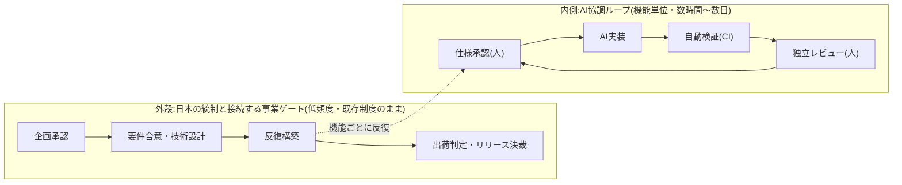

フェーズ4の中核成果として、**統合プロセス参照モデル(AI協調型)**を設計しました。プロセス本体は[スキーマ駆動のデータ](/process-compass/processes/integrated/)として公開しており(全体マップからフェーズ・個別作業へ掘り下げられます)、このページはその**設計解説**です。なぜこの形なのかを説明します。

## 全体像: 二層構造

- **外殻** — 日本の決裁文化(稟議・決裁権限規程・出荷判定)と整合する低頻度のゲート。**既存制度を変えない**
- **内側** — SDD式の人間承認ゲートを持つAI協調ループ。機能単位・数時間〜数日の反復

これは構造としては Water-Scrum-Fall と同型です。ただしフェーズ1で確認したとおり、ハイブリッドは「境界を意図的に設計すれば有効な形」になります。本モデルは、その境界(どこまでが事業ゲートで、どこからがAIループか)を明示的に設計した**意図的ハイブリッド**です。

## 4つの設計原則と5つのギャップへの対応

| 設計原則 | 内容 | 対応するギャップ |
| --- | --- | --- |
| 1. 判定者は1人 | 各ゲートは単独の判定者が期限内に判定する。意見は判定前の非同期コメントで集める | G2 責任主体の欠落 |
| 2. 技術と事業の分離 | 技術設計判断(技術判断者)と事業決裁(決裁者)を別ゲートにする | G3 職位ゲートと専門性の乖離、G5 承認滞留 |
| 3. 作成者は承認しない | AI成果物は、作成を指示した本人ではない人間がレビューする | G2、事業継続性(理解の分散) |
| 4. 文脈は基盤に一度書く | 恒久層・案件層のコンテキスト基盤に一度書き、AIが補完する | G1 明文化の壁、G4 兼務(文脈が人でなく基盤に宿る) |

## 各要素の由来(何をどこから借りたか)

このモデルは新発明ではなく、フェーズ1〜2で体系化した各プロセスの**実証済みの部品を意図的に組み合わせた**ものです。

| 要素 | 由来 | 参照 |
| --- | --- | --- |
| 節目の決裁ゲート・出荷判定 | ウォーターフォール(日本のSIer標準形)・JUSE型品質ゲート | [ウォーターフォール](/process-compass/processes/waterfall/) |
| 機能単位の反復・検査と適応 | スクラム / アジャイル | [スクラム](/process-compass/processes/scrum/) |
| 仕様承認→AI実装の流れ | SDD(Spec-Driven Development) | [仕様駆動開発](/process-compass/processes/sdd/) |
| AI協調・人間チェックポイント | AIDLC | [AIDLC](/process-compass/processes/aidlc/) |
| 「作成者は承認不可」の独立レビュー | GitHub Copilot coding agent の統制設計 | [エージェント型開発](/process-compass/phase2-aidlc/agentic-development/) |
| 自動検証ゲート(機械判定) | TDD / CI文化 | [TDD](/process-compass/processes/tdd/) |
| コンテキスト基盤 | コンテキストエンジニアリング | [コンテキスト補完基盤](/process-compass/phase3-gap-analysis/context-infrastructure/) |

## 人間の検証帯域を守る設計

フェーズ2で確認したとおり、AI協調の最大の律速は**人間の検証帯域**です。このモデルは帯域を3つの方法で守ります。

1. **機械化できる検査はすべて CI へ**(g-ci)。合意済みルールは自動検証に載せ、人の目を通さない
2. **人の判断を種類で分ける**。価値判断(価値責任者)・技術判断(技術判断者)・理解の確認(独立レビュア)・記録の確認(出荷判定)に分業し、1人に集中させない
3. **判定に期限を付ける**。要件合意・技術設計・リリース決裁は目安48時間以内。出荷判定は「記録の確認」に限定し再テストを始めない

## 変えるもの・変えないもの

導入の交渉コストを最小にするため、既存制度への変更を2点に絞っています。

- **変えない**: 稟議・決裁権限規程(企画承認・リリース決裁)、QA部門の出荷判定と署名、第三者レビューの文化
- **変える(2点のみ)**: (1)技術判断を決裁階層から分離し単独判定者へ、(2)ゲート判定を合議から「単独判定+事前の非同期コメント」へ

この2点が、品質管理部門・プロセス部門への提案時の最大の論点になります。逆に言えば、この2点さえ合意できれば、残りは既存制度の上にそのまま載ります。

## このモデルの前提と限界

参照モデルには[前提条件](/process-compass/processes/integrated/)があります(決定権の実質委譲、CI基盤、3者分離できる体制規模、明文化コストの予算化)。前提を満たさない組織への調整方法は、[テーラリングガイド](/process-compass/phase4-process-design/overview/)(フェーズ4の後続)で扱います。

:::note
このモデルは v0(参照モデル)です。実際の組織へ適用するにはチーム体制・事業フェーズによる調整が必要で、その調整ロジック自体が最終ゴールのプロセス提案ツールの中身になります。フィードバックは [GitHub Issues](https://github.com/Takenori-Kusaka/process-compass/issues) へお願いします。
:::
