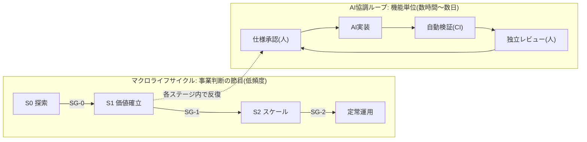
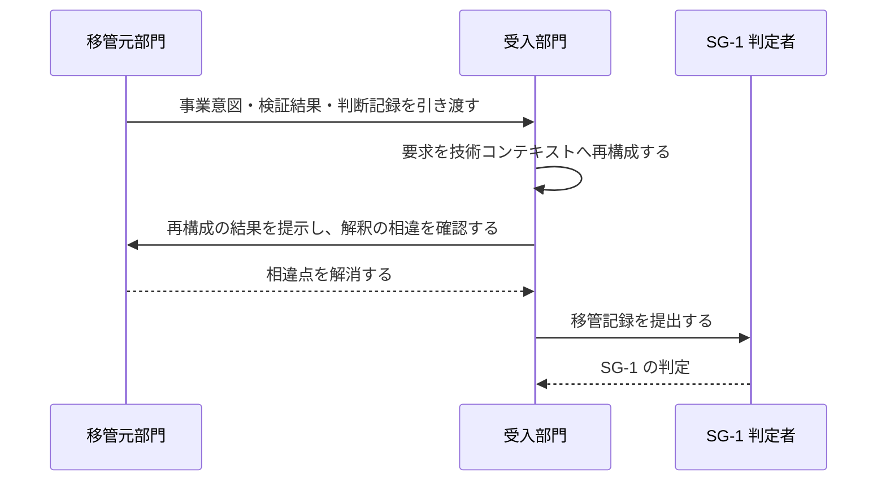

本章は、本標準が対象とする開発ライフサイクルの階層構造と、その節目に置くマイルストーンを規定します。

## 2.1 本章が達成すべき成果

本章の要求事項を満たしたとき、次の成果が得られます。

- 事業判断の節目と、日々の開発反復とが、それぞれ別の頻度で運用されている
- 各節目において、次段階へ移行してよいかを判定する制御点が定義されている
- 事業ステージに応じて、開発反復の厳格さが段階的に変化している
- 部門をまたぐ移管が、受入側の理解の成立をもって完了している

## 2.2 二層構造

本標準のライフサイクルは、頻度の異なる2階層で構成します。

| 階層 | 頻度 | 判定の性質 | 既存制度との関係 |
| --- | --- | --- | --- |
| マクロライフサイクル | 案件あたり数回 | 投資継続・移管・出荷可否の判断 | 既存の稟議・決裁権限規程・出荷判定をそのまま用いる |
| AI協調ループ | 機能あたり数時間〜数日 | 仕様適合・実装品質の判断 | 新たに規定する |

二層に分ける理由は次のとおりです。

- 事業判断の頻度を上げると決裁が滞留し、開発反復の頻度を下げると AI の生成速度を活かせない
- 判断の性質が異なるため、判定者・判定基準・期限を分離しなければ責任の所在が曖昧になる

## 2.3 事業ステージ

事業ステージは、不確実性を段階的に低減する区分です。3ステージを定義します。

| 記号 | 名称 | 別称 | ゴール | 出口ゲート |
| --- | --- | --- | --- | --- |
| S0 | 探索 | DR0 | 事業仮説と技術的実現性を検証し、投資継続の可否を判断できる状態にする | SG-0 |
| S1 | 価値確立 | DR1 | 実利用者に価値が届くことを実証し、継続提供できる技術基盤を確立する | SG-1 |
| S2 | スケール | DR2 | 利用者層の拡大に耐える品質・運用体制・再現性を確立する | SG-2 |

:::caution
本標準の S0・S1・S2 は**事業ステージ**であり、製造業で一般に用いられる設計審査の DR1〜DR4 とは対象が異なります。両者を同一の記号で扱うと現場で誤解が生じるため、本標準では S 記号を用います。DR0・DR1・DR2 は別称として併記します。
:::

### 既存の設計審査体系との対応

製造業の設計審査体系を運用している組織では、次の対応で読み替えます。対応は目安であり、実際の割り当てはテーラリング([第8章](/process-compass/phase4-process-design/tailoring-guide/))で確定します。

| 本標準 | 製造業の設計審査(一般形) | 対象 |
| --- | --- | --- |
| S0 探索 / SG-0 | DR1 開発企画フェーズ | 開発の妥当性・事業性の評価 |
| S1 価値確立 / SG-1 | DR2 構想設計フェーズ | 実現手段・技術構成の評価 |
| S2 スケール / SG-2 | DR3 詳細設計、DR4 量産移行 | 量産・本番展開への移行判断 |

## 2.4 ステージ移行ゲート

ステージの境界には移行ゲートを置きます。判定は3択とし、判断を保留したまま継続する状態を作りません。

| ゲート | 名称 | 判定 | 主な判定基準 |
| --- | --- | --- | --- |
| SG-0 | 探索完了 | S1へ移行 / 継続検証 / 中止 | 事業仮説が実証データで支持されている。技術的実現性が確認されている。次ステージの投資規模と体制が示されている |
| SG-1 | 価値確立完了 | S2へ移行 / 継続 / 中止 | 実利用者における価値が実証されている。拡大に耐えるアーキテクチャが確定している。受入部門が要求を自らの言葉で再構成できている |
| SG-2 | スケール完了 | 定常運用へ移行 / 改善継続 | 対象利用者層の品質基準を満たしている。運用体制が定常運用として成立している。受容した負債の返却計画が承認されている |

SG-2 を設けない場合、プロジェクト体制のまま運用が継続し、技術負債の返却主体が消えます。定常運用への移行は明示的に判定しなければなりません。

ステージ移行ゲートの判定は、ステアリングコミッティ(B-2)が行います。会議体の構成・判定の語彙・判定期限は[第3章 3.7](/process-compass/phase4-process-design/roles-responsibilities/)に規定します。

:::note
予算配賦および中止判断の基準は、[第7章](/process-compass/phase4-process-design/exception-escalation/)の改訂で規定します。
:::

## 2.5 工程ゲートとの関係

ステージ移行ゲート(SG)と工程ゲート(G-1〜G-8)は、別の軸です。混同してはなりません。

| 観点 | ステージ移行ゲート(SG) | 工程ゲート(G) |
| --- | --- | --- |
| 判断の対象 | 投資を継続するか、次ステージへ進むか | この成果物を次工程へ進めてよいか |
| 頻度 | 案件あたり3回 | 開発サイクルごと |
| 判定者 | 会議体(投資判断・事業決裁) | 単独の判定者 |
| 期限 | 会議体の開催周期 | 24〜72時間 |

各ステージで有効化する工程ゲートは次のとおりです。ステージが上がるほど有効化される数が増えます。

| 工程ゲート | S0 探索 | S1 価値確立 | S2 スケール |
| --- | --- | --- | --- |
| G-1 企画承認 | 簡略 | 適用 | 適用 |
| G-2 要件合意 | G-4 に統合 | 適用 | 適用 |
| G-3 技術設計判断 | 主要な選択のみ | 適用 | 適用 |
| G-4 機能仕様承認 | 適用 | 適用 | 適用 |
| G-5 自動検証(CI) | 適用 | 適用 | 適用 |
| G-6 独立レビュー | 任意 | コア機能に適用 | 全件に適用 |
| G-7 出荷判定 | 省略可 | 簡略 | 適用 |
| G-8 リリース決裁 | 省略可 | 適用 | 適用 |

G-4 と G-5 はどのステージでも省略できません。この2つを外すと、仕様の承認を経ない実装と、機械検証を経ない統合が発生します。

## 2.6 AI協調ループの構成

AI協調ループは、機能単位で次の4工程を反復します。

| 工程 | 主体 | 完了条件 | 配置するゲート |
| --- | --- | --- | --- |
| 仕様承認 | 人間 | 受入基準が検証可能な形式で確定している | G-4 |
| AI実装 | AIエージェント | 実装計画の全タスクが完了している | — |
| 自動検証 | CI | 定めた機械判定基準をすべて満たす | G-5 |
| 独立レビュー | 人間(作成を指示した者以外) | 仕様と実装の一致を確認し、挙動を記録した | G-6 |

ループの反復単位は、次の制約を満たさなければなりません。

- 1周期の実装量は、独立レビューが単独で完結できる大きさに収める
- 受入基準を満たさない実装は、次工程へ進めずループ内で差し戻す
- 反復のたびに、判断の記録をコンテキスト基盤へ書き戻す

### ステージによるループの回し方の変化

ステージが上がるほど、反復の速度より記録の厳格さを優先します。

| 観点 | S0 探索 | S1 価値確立 | S2 スケール |
| --- | --- | --- | --- |
| ループの主目的 | 学習 | 適合 | 品質と再現性 |
| 独立レビュー | 任意 | コア機能に必須 | 全件必須 |
| 判断記録(ADR) | 主要な選択のみ | コア機能は必須 | 全件必須 |
| コンテキスト基盤 | 案件層のみ | 恒久層の整備を開始 | 恒久層の維持が必須 |
| 想定する反復周期 | 数時間〜1日 | 1〜3日 | 2〜5日 |

## 2.7 部門間移管

事業ステージの移行に伴って担当部門が変わる場合、移管を SG-1 の判定要件として扱います。

移管の完了条件は次のとおりです。文書の引き渡しをもって完了とはしません。

| # | 完了条件 |
| --- | --- |
| 1 | 受入部門が、事業意図と価値仮説を自らの言葉で再構成した文書を作成している |
| 2 | 再構成の結果を移管元が確認し、解釈の相違が解消されている |
| 3 | 未確定事項が一覧化され、それぞれに解消の期限と責任者が割り当てられている |
| 4 | 恒久層コンテキストに、移管対象の用語・制約・判断基準が登録されている |
| 5 | 移管後の結果責任者(A)が指名され、担当表に記録されている |

条件1を文書の受領で代替してはなりません。受入側が再構成できない状態は、移管が完了していない状態です。

:::note
移管に伴う人員の交代、および定期異動によるロールの継続性の断絶については、コンテキスト移管の手続として本標準の改訂で規定します。
:::

## 2.8 関連する章

- 各工程ゲートの判定基準は[第4章](/process-compass/phase4-process-design/gate-criteria/)に規定する
- ステージごとの欠陥の扱いは[第4章](/process-compass/phase4-process-design/gate-criteria/)に規定する
- 判定者および会議体は[第3章](/process-compass/phase4-process-design/roles-responsibilities/)に規定する
- ステージの省略・統合はテーラリング([第8章](/process-compass/phase4-process-design/tailoring-guide/))の対象とする
