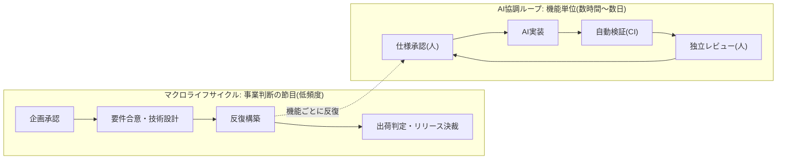

本章は、本標準が対象とする開発ライフサイクルの階層構造と、その節目に置くマイルストーンを規定します。

## 2.1 本章が達成すべき成果

本章の要求事項を満たしたとき、次の成果が得られます。

- 事業判断の節目と、日々の開発反復とが、それぞれ別の頻度で運用されている
- 各節目において、次工程へ移行してよいかを判定する制御点が定義されている
- 開発反復の1周期が、人間による検証が可能な大きさに保たれている

## 2.2 二層構造

本標準のライフサイクルは、頻度の異なる2階層で構成します。

| 階層 | 頻度 | 判定の性質 | 既存制度との関係 |
| --- | --- | --- | --- |
| マクロライフサイクル | 案件あたり数回 | 事業価値・投資・出荷可否の判断 | 既存の稟議・決裁権限規程・出荷判定をそのまま用いる |
| AI協調ループ | 機能あたり数時間〜数日 | 仕様適合・実装品質の判断 | 新たに規定する |

二層に分ける理由は次のとおりです。

- 事業判断の頻度を上げると決裁が滞留し、開発反復の頻度を下げると AI の生成速度を活かせない
- 判断の性質が異なるため、判定者・判定基準・期限を分離しなければ責任の所在が曖昧になる

## 2.3 マクロライフサイクルの構成

マクロライフサイクルは、事業フェーズの進行に応じた節目で区切ります。各節目には、第4章に定めるゲートを配置します。

| 節目 | 判定の対象 | 配置するゲート |
| --- | --- | --- |
| 企画承認 | 投資対効果、リスク受容方針、体制の妥当性 | G-1 |
| 要件合意 | 受入基準の検証可能性、スコープの明確さ | G-2 |
| 技術設計判断 | 非機能要件の充足見込み、選択の可逆性 | G-3 |
| 出荷判定 | 品質記録の完備、未解決欠陥の状態 | G-7 |
| リリース決裁 | 事業リスクの受容可否 | G-8 |

:::note
製造業のデザインレビュー(DR)体系やテクニカルレビュー(TR)体系との対応づけ、および事業ステージ(企画・MVP・グロース・量産)ごとのマイルストーン設計は、本章の改訂で追加します。現時点では上表の5節目を最小構成として規定します。
:::

## 2.4 AI協調ループの構成

AI協調ループは、機能単位で次の4工程を反復します。

| 工程 | 主体 | 完了条件 | 配置するゲート |
| --- | --- | --- | --- |
| 仕様承認 | 人間 | 受入基準が検証可能な形式で確定している | G-4 |
| AI実装 | AIエージェント | 実装計画の全タスクが完了している | — |
| 自動検証 | CI | 定めた機械判定基準をすべて満たす | G-5 |
| 独立レビュー | 人間(作成を指示した者以外) | 仕様と実装の一致を確認し、挙動を記録した | G-6 |

ループの反復単位は、次の制約を満たさなければなりません。

- 1周期の実装量は、独立レビューが単独で完結できる大きさに収める
- 受入基準を満たさない実装は、次工程へ進めずループ内で差し戻す
- 反復のたびに、判断の記録をコンテキスト基盤へ書き戻す

## 2.5 二層の接続点

マクロライフサイクルと AI協調ループは、次の2点で接続します。

1. **反復構築フェーズの開始時**: 承認済みの要件と技術設計を、機能単位に分解して AI協調ループへ引き渡す
2. **反復構築フェーズの終了時**: AI協調ループが生成した記録一式を、出荷判定の突合材料として引き渡す

接続点における引き渡し物は、第6章に定める様式で記録します。

## 2.6 関連する章

- 各ゲートの判定基準は[第4章](/process-compass/phase4-process-design/gate-criteria/)に規定する
- 判定者および会議体は[第3章](/process-compass/phase4-process-design/roles-responsibilities/)に規定する
- 節目の省略・追加はテーラリング([第8章](/process-compass/phase4-process-design/tailoring-guide/))の対象とする
