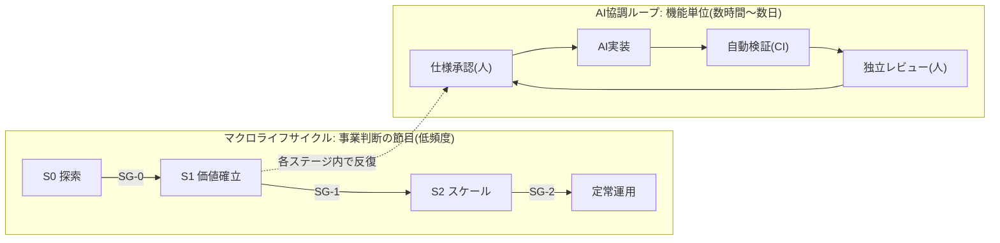
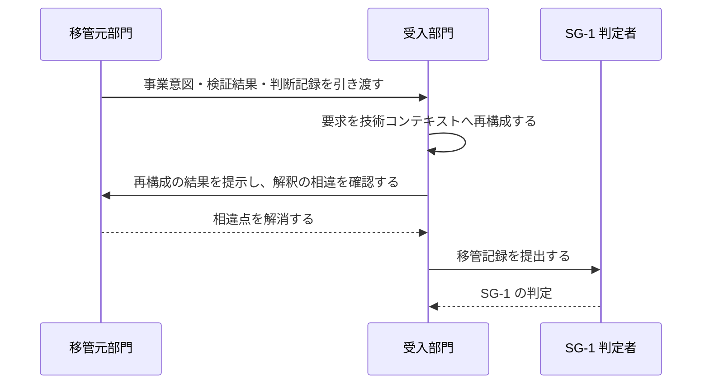
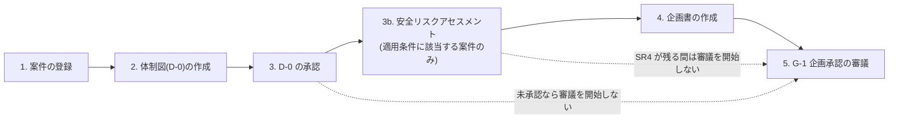
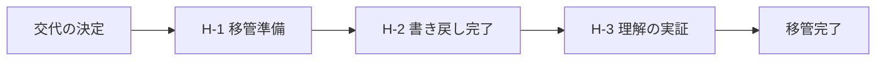
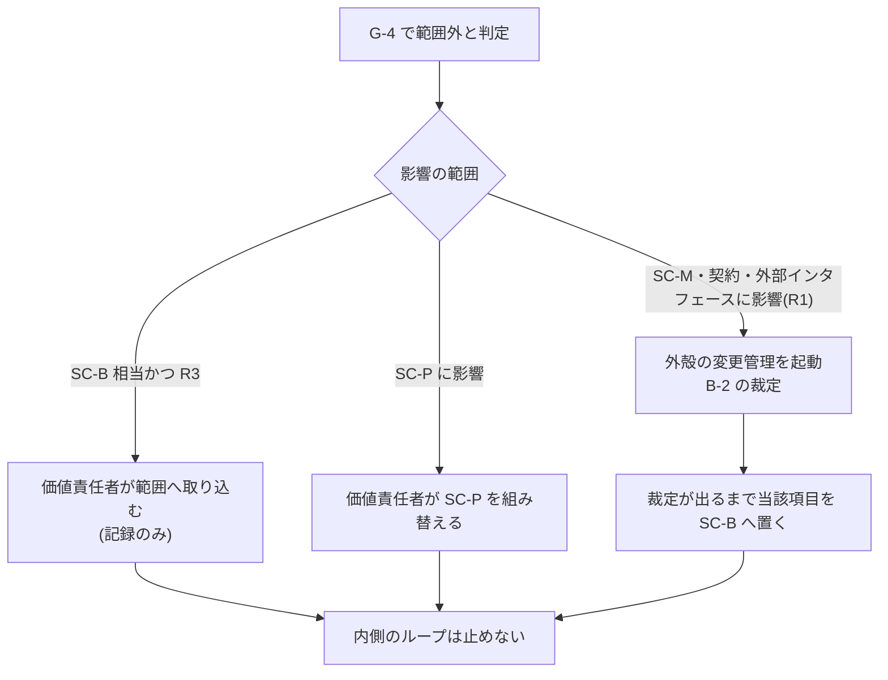

本章は、本標準が対象とする開発ライフサイクルの階層構造と、その節目に置くマイルストーンを規定します。

## 2.1 本章が達成すべき成果

本章の要求事項を満たしたとき、次の成果が得られます。

- 事業判断の節目と、日々の開発反復とが、それぞれ別の頻度で運用されている
- 各節目において、次段階へ移行してよいかを判定する制御点が定義されている
- 事業ステージに応じて、開発反復の厳格さが段階的に変化している
- 部門をまたぐ移管が、受入側の理解の成立をもって完了している

## 2.2 二層構造

本標準のライフサイクルは、頻度の異なる2階層で構成します。

| 階層 | 頻度 | 判定の性質 | 既存制度との関係 |
| --- | --- | --- | --- |
| マクロライフサイクル | 案件あたり数回 | 投資継続・移管・出荷可否の判断 | 既存の稟議・決裁権限規程・出荷判定をそのまま用いる |
| AI協調ループ | 機能あたり数時間〜数日 | 仕様適合・実装品質の判断 | 新たに規定する |

二層に分ける理由は次のとおりです。

- 事業判断の頻度を上げると決裁が滞留し、開発反復の頻度を下げると AI の生成速度を活かせない
- 判断の性質が異なるため、判定者・判定基準・期限を分離しなければ責任の所在が曖昧になる

## 2.3 事業ステージ

事業ステージは、不確実性を段階的に低減する区分です。3ステージを定義します。

| 記号 | 名称 | 別称 | ゴール | 出口ゲート |
| --- | --- | --- | --- | --- |
| S0 | 探索 | DR0 | 事業仮説と技術的実現性を検証し、投資継続の可否を判断できる状態にする | SG-0 |
| S1 | 価値確立 | DR1 | 実利用者に価値が届くことを実証し、継続提供できる技術基盤を確立する | SG-1 |
| S2 | スケール | DR2 | 利用者層の拡大に耐える品質・運用体制・再現性を確立する | SG-2 |

:::caution
本標準の S0・S1・S2 は**事業ステージ**であり、製造業で一般に用いられる設計審査の DR1〜DR4 とは対象が異なります。両者を同一の記号で扱うと現場で誤解が生じるため、本標準では S 記号を用います。DR0・DR1・DR2 は別称として併記します。
:::

### 既存の設計審査体系との対応

製造業の設計審査体系を運用している組織では、次の対応で読み替えます。対応は目安であり、実際の割り当てはテーラリング([第8章](/process-compass/phase4-process-design/tailoring-guide/))で確定します。

| 本標準 | 製造業の設計審査(一般形) | 対象 |
| --- | --- | --- |
| S0 探索 / SG-0 | DR1 開発企画フェーズ | 開発の妥当性・事業性の評価 |
| S1 価値確立 / SG-1 | DR2 構想設計フェーズ | 実現手段・技術構成の評価 |
| S2 スケール / SG-2 | DR3 詳細設計、DR4 量産移行 | 量産・本番展開への移行判断 |

## 2.4 ステージ移行ゲート

ステージの境界には移行ゲートを置きます。判定は3択とし、判断を保留したまま継続する状態を作りません。

| ゲート | 名称 | 判定 | 主な判定基準 |
| --- | --- | --- | --- |
| SG-0 | 探索完了 | S1へ移行 / 継続検証 / 中止 | 事業仮説が実証データで支持されている。技術的実現性が確認されている。次ステージの投資規模と体制が示されている |
| SG-1 | 価値確立完了 | S2へ移行 / 継続 / 中止 | 実利用者における価値が実証されている。拡大に耐えるアーキテクチャが確定している。受入部門が要求を自らの言葉で再構成できている |
| SG-2 | スケール完了 | 定常運用へ移行 / 改善継続 | 対象利用者層の品質基準を満たしている。運用体制が定常運用として成立している。受容した負債の返却計画が承認されている |

SG-2 を設けない場合、プロジェクト体制のまま運用が継続し、技術負債の返却主体が消えます。定常運用への移行は明示的に判定しなければなりません。

ステージ移行ゲートの判定は、ステアリングコミッティ(B-2)が行います。会議体の構成・判定の語彙・判定期限は[第3章 3.7](/process-compass/phase4-process-design/roles-responsibilities/)に規定します。

次ステージの予算は、ステージ移行ゲートの判定と同時に確定させます。予算の構成と中止(Kill)の判断基準は[第7章 7.7](/process-compass/phase4-process-design/exception-escalation/)に規定します。

## 2.5 工程ゲートとの関係

ステージ移行ゲート(SG)と工程ゲート(G-1〜G-8)は、別の軸です。混同してはなりません。

| 観点 | ステージ移行ゲート(SG) | 工程ゲート(G) |
| --- | --- | --- |
| 判断の対象 | 投資を継続するか、次ステージへ進むか | この成果物を次工程へ進めてよいか |
| 頻度 | 案件あたり3回 | 開発サイクルごと |
| 判定者 | 会議体(投資判断・事業決裁) | 単独の判定者 |
| 期限 | 会議体の開催周期 | 24〜72時間 |

各ステージで有効化する工程ゲートは次のとおりです。ステージが上がるほど有効化される数が増えます。

| 工程ゲート | S0 探索 | S1 価値確立 | S2 スケール |
| --- | --- | --- | --- |
| G-1 企画承認 | 簡略 | 適用 | 適用 |
| G-2 要件合意 | G-4 に統合 | 適用 | 適用 |
| G-3 技術設計判断 | 主要な選択のみ | 適用 | 適用 |
| G-4 機能仕様承認 | 適用 | 適用 | 適用 |
| G-5 自動検証(CI) | 適用 | 適用 | 適用 |
| G-6 独立レビュー | 任意 | コア機能に適用 | 全件に適用 |
| G-7 出荷判定 | 省略可 | 簡略 | 適用 |
| G-8 リリース決裁 | 省略可 | 適用 | 適用 |

G-4 と G-5 はどのステージでも省略できません。この2つを外すと、仕様の承認を経ない実装と、機械検証を経ない統合が発生します。

## 2.6 AI協調ループの構成

AI協調ループは、機能単位で次の4工程を反復します。

| 工程 | 主体 | 完了条件 | 配置するゲート |
| --- | --- | --- | --- |
| 仕様承認 | 人間 | 受入基準が検証可能な形式で確定している | G-4 |
| AI実装 | AIエージェント | 実装計画の全タスクが完了している | — |
| 自動検証 | CI | 定めた機械判定基準をすべて満たす | G-5 |
| 独立レビュー | 人間(作成を指示した者以外) | 仕様と実装の一致を確認し、挙動を記録した | G-6 |

ループの反復単位は、次の制約を満たさなければなりません。

- 1周期の実装量は、独立レビューが単独で完結できる大きさに収める
- 受入基準を満たさない実装は、次工程へ進めずループ内で差し戻す
- 反復のたびに、判断の記録をコンテキスト基盤へ書き戻す

### ステージによるループの回し方の変化

ステージが上がるほど、反復の速度より記録の厳格さを優先します。

| 観点 | S0 探索 | S1 価値確立 | S2 スケール |
| --- | --- | --- | --- |
| ループの主目的 | 学習 | 適合 | 品質と再現性 |
| 独立レビュー | 任意 | コア機能に必須 | 全件必須 |
| 判断記録(ADR) | 主要な選択のみ | コア機能は必須 | 全件必須 |
| コンテキスト基盤 | 案件層のみ | 恒久層の整備を開始 | 恒久層の維持が必須 |
| 想定する反復周期 | 数時間〜1日 | 1〜3日 | 2〜5日 |

## 2.7 部門間移管

事業ステージの移行に伴って担当部門が変わる場合、移管を SG-1 の判定要件として扱います。

移管の完了条件は次のとおりです。文書の引き渡しをもって完了とはしません。

| # | 完了条件 |
| --- | --- |
| 1 | 受入部門が、事業意図と価値仮説を自らの言葉で再構成した文書を作成している |
| 2 | 再構成の結果を移管元が確認し、解釈の相違が解消されている |
| 3 | 未確定事項が一覧化され、それぞれに解消の期限と責任者が割り当てられている |
| 4 | 恒久層コンテキストに、移管対象の用語・制約・判断基準が登録されている |
| 5 | 移管後の結果責任者(A)が指名され、担当表に記録されている |

条件1を文書の受領で代替してはなりません。受入側が再構成できない状態は、移管が完了していない状態です。

人員の交代を伴う移管、および定期異動によるロールの継続性の断絶については、2.9 のコンテキスト移管ゲートを併せて適用します。

## 2.8 案件の立ち上げ手順

事業ステージ S0 の開始時に、次の順序で立ち上げを行います。順序を入れ替えてはなりません。

| # | 手順 | 成果物 | 責任者 |
| --- | --- | --- | --- |
| 1 | 案件を登録し、案件IDを付与する | 案件登録記録 | 起案者 |
| 2 | 意思決定・エスカレーション体制図(D-0)を作成する | D-0 | 起案者(AIが草案を生成) |
| 3 | D-0 を承認する | 承認記録 | D-0 表1 の投資継続を決定する者 |
| 3b | 安全リスクアセスメント表を作成し、承認を得る(適用条件に該当する案件のみ) | テンプレ9 | 技術判断者 |
| 4 | 企画書を作成する | 企画書 | 価値責任者 |
| 5 | 企画承認(G-1)を審議する | 判定記録 | 事業決裁者 |

手順3b の適用条件と様式は[第6章「AIエージェント安全リスクアセスメント」](/process-compass/phase4-process-design/deliverable-templates/)によります。該当しない案件では手順3b を省略します。

### D-0 を前提条件とする理由

D-0([第6章 テンプレ0](/process-compass/phase4-process-design/deliverable-templates/))は、企画承認の判定対象ではなく**判定を開始するための前提条件**です。両者を区別します。

| 区分 | 定義 | G-1 における対象 |
| --- | --- | --- |
| 前提条件 | 満たしていなければ判定を開始しない条件 | D-0 の承認 |
| 判定基準 | 判定において合否を評価する基準 | 投資対効果、リスク受容、基盤整備の予算化 |

D-0 を判定基準に含めると、体制の不備が投資対効果と相殺されて通過します。前提条件に置くことで、体制が定まらないまま審議へ進む経路をなくします。

**誰が決めるかが決まっていない状態で、何を作るかを決裁してはなりません**。決裁の後に体制を決めると、決裁内容に合わせて責任者が選ばれ、責任の所在が事後的に構成されます。

### 前提条件の統制

- D-0 が承認されていない案件は、G-1 の審議を開始してはならない
- 安全リスクアセスメントの適用条件に該当し、かつ SR4 の危険源が残っている案件は、G-1 の審議を開始してはならない
- D-0 の次回レビュー期日を超過している案件は、ステージ移行ゲート(SG)の判定を開始してはならない
- 前提条件の充足は、人の確認ではなく機械的な検査によって判定する([フェーズ5](/process-compass/phase5-implementation/ci-gates/))

期日を超過した D-0 を放置したまま判定を続ける運用を認めると、体制図は初回の作成時にのみ存在する文書になります。

## 2.9 コンテキスト移管ゲート

定期的な人事異動が制度として存在する組織では、対象システムを理解している人が数年で入れ替わります。本節は、要員の交代に際して理解の断絶を防ぐ手続を規定します。

### 2.9.1 適用対象

次のいずれかに該当する交代に適用します。

- 成果物の結果責任者(A)の交代
- 文脈オーナーの交代
- コア機能の理解保持者が交代し、残る保持者が1名以下になる場合

### 2.9.2 移管の成立条件

移管は、口頭説明の完了によって成立しません。**後任者が前任者へ問い合わせずに判断できる状態**をもって成立とします。

この定義は 2.7 の部門間移管と同型です。文書の引き渡しは移管の手段であり、完了条件ではありません。

### 2.9.3 3つのゲート

| ゲート | 判定時期 | 判定者 | 判定の対象 |
| --- | --- | --- | --- |
| H-1 移管準備 | 交代の決定から5営業日以内 | 価値責任者 | 対象範囲、理解保持者数、コンテキスト基盤の欠落 |
| H-2 書き戻し完了 | 交代日の10営業日前まで | 文脈オーナー | H-1 で特定した欠落の解消 |
| H-3 理解の実証 | 交代日以降、合意した期限内 | 前任者でも後任者でもない第三者 | 後任者が独立して判断できること |

### 2.9.4 H-1 移管準備: 欠落の棚卸し

コンテキスト基盤へ記録されていない知識を、次の4類型で洗い出します。文書化されずに個人へ留まりやすい知識の類型です。

| 類型 | 内容 | 書き戻し先 |
| --- | --- | --- |
| 設計の背景と制約 | 判断した時点の人員・期限・既存資産の制約 | 判断記録(ADR) |
| 却下した選択肢 | 検討したが採らなかった案と、採らなかった理由 | 判断記録(ADR)の代替案欄 |
| 運用上の勘所 | 壊れやすい箇所、監視値の読み方、負荷の周期性 | 運用引き継ぎ文書 |
| 組織的文脈 | 承認権限の所在、利用者との約束、過去の経緯 | D-0 および恒久層コンテキスト |

あわせて、コア機能ごとの**理解保持者数**(その機能について独立して判断できる人数)を数えます。理解保持者が1名の機能は、交代の前に2名以上へ増やさなければなりません。

:::caution
理解保持者数を、変更履歴の作成者数から機械的に算出してはなりません。AIエージェントが生成した変更の比率が高い環境では、作成者の記録は理解の所在を表しません。
:::

### 2.9.5 H-2 書き戻し完了

- 書き戻しは**前任者が書き、後任者がレビューする**。順序を逆にしない。後任者が読んで理解できることが検証の条件であるため
- AIエージェントが草案を生成してよい。ただし却下した選択肢と当時の制約は前任者しか保持していない情報であり、人が記入する
- 完了の判定は、追記した分量ではなく **H-1 で特定した欠落項目の消化**で行う

### 2.9.6 H-3 理解の実証

移管が完了したかを、後任者の自己申告で判定してはなりません。熟練した開発者を対象とした対照実験では、作業時間が実測で19%長くなった条件について、本人は20%短くなったと申告しています(2025年7月公表)。理解の自覚は理解の証拠になりません。

判定は次の4課題の組み合わせで行います。

| # | 課題 | 合格の条件 |
| --- | --- | --- |
| 1 | 設計の説明 | 対象のコア機能について、記録を参照せずに設計判断とその理由を自分の言葉で説明できる |
| 2 | 却下案の再構成 | 採らなかった選択肢を1つ以上挙げ、採らなかった理由を説明できる |
| 3 | 障害時の初動 | 過去の障害事例を提示され、一次切り分けの手順と確認箇所を挙げられる |
| 4 | 変更の実作業 | 小規模な変更を、独立レビューを通過するまで単独で完遂する |

- 課題1〜3 は、AI へ問い合わせない状態で実施する
- 課題4 では AI の利用を制限しない。実務の作業条件と一致させるため
- 評価者・評価方法・課題・結果を記録する。評価者には前任者と後任者のいずれも充ててはならない

課題2を含める理由は、却下した選択肢を再構成できることが、結論の暗記と理解の区別になるためです。

### 2.9.7 準備段階における AI の利用

後任者が準備段階でAIエージェントを用いることを禁止しません。ただし利用の仕方に要求を課します。

- 生成された説明をそのまま受け取る使い方(受動的な委譲)を認めない
- 疑問点を問いとして立て、回答の根拠を記録と突き合わせる使い方を求める

未知のライブラリを用いる課題の対照実験では、AI 支援を受けた群の事後理解度が支援なしの群より17ポイント低く、群内では能動的に質問を重ねた者ほど高い成績を示しました(2026年1月公表)。**AI の利用そのものではなく、受動的な委譲が理解の形成を妨げます**。

### 2.9.8 期限内に完了しない場合

- 交代日までに H-3 が合格しない場合、前任者の関与を延長するか、対象を他の理解保持者へ一時的に移す
- 結果責任者(A)を空席にしたまま交代日を過ぎてはならない
- **H-3 の不合格を後任者の人事評価に用いてはならない**。判定の対象は個人の能力ではなく、コンテキスト基盤の十分性と移管手続の設計である

最後の項目は運用上の要です。不合格が個人の評価に跳ね返る運用では、合格が目的化し、判定が形式化します。

## 2.10 スコープの確約と進捗の統制

本節は、事業ステージの期間内にどこまでを行うかを合意し、その進み具合を観測し、必要に応じて範囲を調整する手続を規定します。**新しい会議体・ゲート・様式を設けません**。既存の判定の記載事項を増やし、既存の報告の対象を狭める構成にします。

### 2.10.1 スコープの3層

スコープを単一の一覧として扱ってはなりません。すべてが必須である計画は、期日と衝突した時点で削る対象を持たず、削減の判断がそのまま基準の引き下げへ向かいます。

| 記号 | 層 | 定義 | 動かすときの手続 |
| --- | --- | --- | --- |
| SC-M | 確約範囲 | これを欠くと当該ステージのゴールに到達しない範囲 | ステージ移行ゲート(SG)の判定、または[第7章 7.6](/process-compass/phase4-process-design/exception-escalation/)のエスカレーション |
| SC-P | 計画範囲 | 計画に含むが、期日と競合した場合に次ステージへ送れる範囲 | 価値責任者の単独判定 |
| SC-B | 調整枠 | 着手順を最後に置き、余力が生じた場合にのみ実施する範囲 | 価値責任者の単独判定 |

確約範囲(SC-M)は、当該ステージの計画容量の 60% を超えてはなりません。調整枠(SC-B)には 20% 程度を残します。

:::note
60% と 20% は、DSDM の MoSCoW 優先順位付けが推奨する配分をそのまま初期値として採ったものです。**実証研究に基づく値ではありません**。原典は「Must Have の工数が 60% を超える水準は、見積りの正確さ・進め方の理解・チームの成熟・低リスクな環境の4条件をすべて満たす場合を除き、失敗のリスクを持ち込む」としています。自組織の実測へ置き換えてください。
:::

配分は要求の**件数ではなく容量**で算出します。件数で配分すると、大きな項目を確約範囲へ入れても割合が動きません。

### 2.10.2 規模の合意

規模の合意に、精度を装った見積り手法を用いてはなりません。

| # | 要求事項 |
| --- | --- |
| 1 | 規模は工数の絶対値ではなく、直近の実測スループット(単位期間あたりに完了した作業単位の個数)に対する件数で合意する |
| 2 | 実測が存在しない段階(S0 の初回)では、確約範囲を置かない。全体を計画範囲として扱う |
| 3 | 見積りの精度を根拠として、確約範囲の上限を引き上げてはならない |
| 4 | 合意した規模と、その根拠とした実測値を記録する |

要求事項3を置く理由は、工程の進行によって見積りの不確実性が収束するとは限らないという報告があるためです(2006年、実案件のデータに基づく)。**確約の量を支えるのは見積りの巧拙ではなく、実測された完了の速さです**。

### 2.10.3 スコープを確定する時期

ステージ移行ゲート(SG)の「継続」の判定と同時に、次ステージの SC-M・SC-P・SC-B を確定させます。[第3章 3.7.3](/process-compass/phase4-process-design/roles-responsibilities/)が「継続」の判定に求める確定事項へ、スコープを加える形をとります。**スコープを定めるための場を別に設けません**。

S0 の初回については、企画承認(G-1)の時点で確定させます。様式は[第6章 テンプレ6](/process-compass/phase4-process-design/deliverable-templates/)によります。

### 2.10.4 進捗の観測

**進捗を担当者の完了率の申告で測ってはなりません**。申告による完了率が長期にわたり高い水準を示し続ける現象は、1988年に NASA の案件を対象とした分析で報告されており、原因は規模の過小な見積りと、進捗の可視性の低さの相互作用にあるとされています。

観測は、到達を測る指標と停滞を測る指標の対で行います。

| 観点 | 指標 | 定義 | 性質 |
| --- | --- | --- | --- |
| 到達 | 進捗率 | 完了した受入基準の数 ÷ 計画した受入基準の数([第7章 7.7.2](/process-compass/phase4-process-design/exception-escalation/)) | 遅行 |
| 停滞 | 作業単位の滞留期間 | 着手した時点から現在までの経過時間 | 先行 |

滞留期間の運用は次のとおりです。

- 未完了の作業単位について継続的に観測する。完了した作業単位には適用しない
- 実測サイクルタイムの85パーセンタイル、または企画承認(G-1)で合意した値を超えた項目を**滞留**として扱う
- 滞留した項目は、担当者と価値責任者へ**非同期で**通知する。通知のための定例を設けない

:::caution
作業単位の滞留期間は、[第4章](/process-compass/phase4-process-design/gate-criteria/)の**ゲート滞留時間**とは対象が異なります。ゲート滞留時間は提出から判定までを測り、判定者の帯域を表します。滞留期間は作業単位そのものの停滞を表します。両者を同じ指標として集計してはなりません。
:::

測定の実装は[フェーズ6(メトリクス)](/process-compass/phase6-operation/metrics/)に規定します。

### 2.10.5 棚卸しとスコープの調整

棚卸しのための会議体を設けません。滞留した項目の一覧と、スコープ3層の現状を非同期に確認し、[第3章 3.10](/process-compass/phase4-process-design/roles-responsibilities/)の事前レビュー期間の仕組みへ載せます。

調整の権限は次のとおりです。

| 調整 | 判定者 | 記録 |
| --- | --- | --- |
| SC-P を SC-B へ降格する | 価値責任者(単独) | 調整の記録のみ |
| SC-B を削除する、または SC-B へ項目を追加する | 価値責任者(単独) | 調整の記録のみ |
| SC-P へ項目を追加する | 価値責任者(単独)。容量の上限を超える場合は不可 | 調整の記録のみ |
| SC-M を増減する | ステージ移行ゲート(SG)、または[第7章 7.6](/process-compass/phase4-process-design/exception-escalation/)のエスカレーション | 判定記録 |

**計画範囲と調整枠の増減を、逸脱として扱ってはなりません**。利用者の要望の変化や学習を反映できる柔軟なスコープを持たない案件は、顧客便益の実現において平均を下回ったという調査があります(2016年、実務者への調査)。スコープの削減は逸脱ではなく、便益を実現するための通常の操作です。

### 2.10.6 期日に間に合わない見込みが立った場合

見込みは、2.10.4 の2指標によって評価します。**見込みが立った時点で手続を開始します**。期日の到来を待ってはなりません。

選択の順序を次のとおり定めます。順序を入れ替えてはなりません。

- 手順1では、調整枠(SC-B)から先に削る。確約範囲(SC-M)へは手を付けない
- 手順1で不足する場合、[第7章 7.6](/process-compass/phase4-process-design/exception-escalation/)のエスカレーションレポートを起票する。選択肢は3案を必須とする
- 手順3(判定基準の引き下げ)は、[第7章 7.3](/process-compass/phase4-process-design/exception-escalation/)の例外承認を経た場合に限る。動かせない期日に該当する場合は 7.4 のファストトラックによる

### 2.10.7 通常運転と例外の境界

境界を次のとおり定めます。この境界を曖昧にすると、通常の調整までが例外の手続を通り、例外の件数が意味を失います。

| 事象 | 扱い |
| --- | --- |
| SC-P・SC-B の増減 | 通常運転。価値責任者の単独判定 |
| 滞留の発生と解消 | 通常運転。非同期の通知 |
| SC-M の増減 | **例外**。SG またはエスカレーション |
| 判定基準を満たさないまま進める | **例外**。[第7章 7.3](/process-compass/phase4-process-design/exception-escalation/) |
| 動かせない期日に対する短縮 | **例外**。[第7章 7.4](/process-compass/phase4-process-design/exception-escalation/) |

### 2.10.8 合意した範囲から外れた変更の扱い

内側の AI協調ループは数時間から数日で回り、外殻の合意(G-2 要件合意および契約)は更新されません。この速度差を放置すると、実装と合意の乖離が蓄積し、出荷判定(G-7)で全面的な差し戻しが生じます。

**乖離は G-4(機能仕様承認)で捕捉します**。判定基準は[第4章](/process-compass/phase4-process-design/gate-criteria/)に規定します。範囲外と判定された変更の経路は次のとおりです。

- **外殻の起動によって、内側のループ全体を停止してはならない**。停止する設計は、判定を避ける動機を生む
- 裁定を待つ項目は調整枠(SC-B)へ移し、着手しない。着手したまま裁定を待つ状態を作らない
- 受託開発では、確約範囲(SC-M)の変更が契約の変更に直結する。対応づけは[第8章 軸D](/process-compass/phase4-process-design/tailoring-guide/)による

生成の量が増えても統制の側が追随しなければ不安定さが増すことは、2025年の大規模調査で報告されています。**外殻の合意を更新しないまま内側の生成量だけが増える構成は、この所見の一例にあたります**。

## 2.11 関連する章

- 各工程ゲートの判定基準は[第4章](/process-compass/phase4-process-design/gate-criteria/)に規定する
- ステージごとの欠陥の扱いは[第4章](/process-compass/phase4-process-design/gate-criteria/)に規定する
- 判定者および会議体は[第3章](/process-compass/phase4-process-design/roles-responsibilities/)に規定する
- ステージの省略・統合はテーラリング([第8章](/process-compass/phase4-process-design/tailoring-guide/))の対象とする
