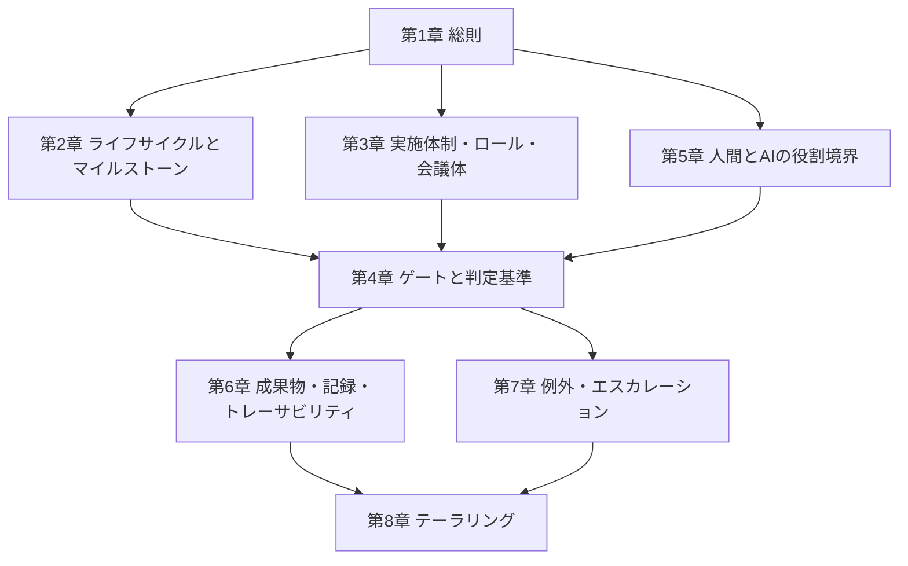

本ページは「AI協調型ソフトウェア開発プロセス標準」(以下、本標準)の総則です。本標準は、生成AIを開発の主たる実装主体として組み込みながら、日本の大企業が備える投資決裁・品質保証・監査の統制と接続できる開発プロセスを規定します。

## 1.1 目的

本標準の目的は次のとおりです。

- 生成AIを実装主体とする開発において、成果の品質・責任の所在・意思決定の記録を担保する要求事項を定めること
- 既存の品質マネジメントシステム(QMS)および決裁権限規程を置き換えることなく、その上に AI 協調の運用を接続すること
- 組織・事業フェーズ・規模の違いをテーラリング(第8章)で吸収し、同一の成果定義のもとで運用できる状態を維持すること

## 1.2 適用範囲

| 区分 | 内容 |
| --- | --- |
| 適用対象 | 生成AIエージェントを実装・設計・検証のいずれかに用いるソフトウェア開発およびその保守 |
| 適用組織 | 社内の品質マネジメントシステムまたは決裁権限規程を有する組織 |
| 適用フェーズ | 企画・要件・設計・実装・検証・出荷判定・運用の全ライフサイクル |
| 適用外 | AI を一切用いない開発、および本標準の要求事項を既存規程が上位で禁止する領域 |

適用外の領域が存在する場合は、テーラリング(第8章)の記録として除外理由を残します。

## 1.3 引用規格および参照文書

本標準は、次の規格・ガイドラインを前提として構成しています。

| 区分 | 文書 | 本標準での用途 |
| --- | --- | --- |
| ライフサイクル | ISO/IEC/IEEE 12207:2017 | プロセスを「成果(Outcomes)」で定義する構成の根拠 |
| 品質マネジメント | ISO 9001 / JIS Q 9001 | 総則の構成、記録の管理、不適合出力の管理 |
| ソフトウェア適用手引 | ISO/IEC 90003 | QMS のソフトウェア開発への適用解釈 |
| AIマネジメント | ISO/IEC 42001:2023 / JIS Q 42001:2025 | AI の統制・責任・トレーサビリティ要求 |
| 国内ガイドライン | AI事業者ガイドライン(第1.2版、2026年3月公表) | 国内における AI 利活用の実務指針 |
| 機械安全 | ISO 12100 / JIS B 9700 | リスクアセスメントの手順(第6章・第7章で参照) |
| AI と機能安全 | ISO/IEC TR 5469:2024 | 安全関連機能の設計・開発に AI を用いる局面の整理(第6章で参照) |

:::note
引用規格の適用度合いは業種によって異なります。規制業(医療・金融・産業機械等)では、上表に加えて各業種固有の規格(IEC 62304、IEC 61508 等)を第8章のテーラリングで追加します。
:::

:::caution
本標準は上表の規格への**適合性を主張するものではありません**。とりわけ ISO 12100 は機械類の設計を対象とする規格であり、保護対象は人体の傷害と健康障害に限られます。第6章の安全リスクアセスメントは、その手順の構造を参照した本標準の規定です。IEC 62304 は医療機器ソフトウェアを対象とする規格であり、汎用の開発標準として引用しません。
:::

## 1.4 用語の定義

本標準で用いる主要な用語を次のとおり定義します。用語は後続の章の改訂に伴って追加します。

| 用語 | 定義 |
| --- | --- |
| AI協調ループ | 仕様承認・AI実装・自動検証・独立レビューを機能単位で反復する開発サイクル |
| マクロライフサイクル | 事業ステージの移行によって区切られる低頻度のプロセス階層 |
| 事業ステージ | 不確実性の低減段階を表す区分。S0 探索・S1 価値確立・S2 スケールの3段階(別称: DR0・DR1・DR2) |
| ステージ移行ゲート | 事業ステージの境界に置く制御点。SG-0・SG-1・SG-2。投資継続と移管の可否を判定する |
| 工程ゲート | 1つの開発サイクル内に置く制御点。G-1〜G-8。成果物を次工程へ進めてよいかを判定する |
| ゲート | 定められた判定者が、定められた基準との突合により次段階への移行可否を判定する制御点の総称 |
| 結果責任(A) | 成果の正しさに対する最終責任。成果物ごとに1名のみ割り当てる |
| 実行(R) | 実際の作業。AIエージェントは実行を担えるが、結果責任は担えない |
| コンテキスト基盤 | AI に与える前提情報を、恒久層と案件層に分けて保守する仕組み |
| 会議体 | 単独の判定者では決められない事項を、定められた構成員により決定する場。B-1〜B-4 |
| 決裁権限マトリクス | 金額区分とリスク区分の交点によって決定者を一意に定める表 |
| リスク区分 | 決定の取り消し可能性と影響範囲による区分。R1〜R3 |
| 標準変更 | 手順とロールバック手段が確立し、事前承認済みとしてカタログに登録した反復的な変更 |
| 必達基準 | 1項目でも不合格であれば中止または保留の対象とする判定基準 |
| 評点基準 | 案件間の優先順位付けに用いる評価軸。単独の低評価では中止としない |
| コア機能 | 事業上致命的であり、人間による理解の維持を必須とする機能 |
| 理解保持者数 | 対象の機能について、他者へ問い合わせずに判断できる人数 |
| コンテキスト移管ゲート | 要員の交代に際して理解の断絶を防ぐ制御点。H-1〜H-3 |
| AI自律レベル | AIエージェントの自律の水準。監視者・フォールバックの担い手・適用範囲の3変数で定義する。L1〜L3 |
| 適用範囲 | AIエージェントが動作してよい領域。対象・環境・変更種別・リスク区分の4軸で記述する |
| 指示資産 | AIエージェントへ与える指示の集合。強制層・誘導層・再利用層の3層で構成する |
| 重大度(Severity) | 欠陥がもたらす技術的な影響の大きさ。Sev1〜Sev3 の3段階。観測可能な事象のみで判定する |
| 優先度(Priority) | 欠陥をいつ修正するかの順序。事業判断として人間が決める |
| 既知の不具合 | 未解消の欠陥のうち、回避策とともに利用者へ公開する一覧。内部の技術負債台帳とは別の成果物 |
| テーラリング | 組織・事業フェーズ・規模に応じて本標準の適用度合いを調整すること |
| 危険源 | 危害を引き起こす潜在的な根源。Hz-nnn で識別する |
| 危害のひどさ | 危険源が現実化した場合に生じる被害の大きさ。Hs1〜Hs3。重大度(Sev)が事後の観測であるのに対し、事前の見積りである |
| 安全リスク区分 | 危害のひどさ・暴露・発生確率・回避可能性から導く区分。SR1〜SR4 |
| リスク低減ステップ | 危険源への対処の段階。RRS1 実行不能化・RRS2 検知と承認・RRS3 情報提供。順序を入れ替えない |
| 安全関連ソフトウェア | 安全機能の実現・安全状態への遷移・監視と診断のいずれかを担う部分。無条件にリスク区分 R1 として扱う |
| 安全度水準 | 安全関連系に要求される安全性の水準の総称。具体的な指標は適用規格を特定してから確定する |
| 未検証の入力 | AI が生成した出力の初期状態。決定論的な検証を経て初めて成果物になる |
| 故障挿入試験 | 意図的に異常を発生させ、保護方策の動作を確かめる試験 |

## 1.5 本標準の構成

本標準は本文8章と附属書6編で構成します。本文は要求事項を規定し、附属書は背景・記法・様式・実施の手引きを提供します。

| 章 | 表題 | 規定する内容 |
| --- | --- | --- |
| [第1章](/process-compass/phase4-process-design/overview/) | 総則 | 目的・適用範囲・引用規格・用語・構成 |
| [第2章](/process-compass/phase4-process-design/lifecycle/) | ライフサイクルとマイルストーン | 事業フェーズ、マクロゲート、AI協調ループとの接続 |
| [第3章](/process-compass/phase4-process-design/roles-responsibilities/) | 実施体制・ロール・会議体 | ロール定義、RACI、任命・兼務、会議体と決裁権限 |
| [第4章](/process-compass/phase4-process-design/gate-criteria/) | ゲートと判定基準 | 各ゲートの判定基準、期限、計測指標 |
| [第5章](/process-compass/phase4-process-design/human-ai-boundary/) | 人間とAIの役割境界 | AI自律レベル、人間が担う判断、形骸化の防止 |
| [第6章](/process-compass/phase4-process-design/deliverable-templates/) | 成果物・記録・トレーサビリティ | 成果物様式、記録要件、データとの対応 |
| [第7章](/process-compass/phase4-process-design/exception-escalation/) | 例外・エスカレーション | 基準逸脱時の手続、期日リスク、上位への報告 |
| [第8章](/process-compass/phase4-process-design/tailoring-guide/) | テーラリング | 組織条件に応じた適用度合いの調整 |
| [附属書A](/process-compass/phase4-process-design/integrated-process/) | 設計の背景と由来 | 本標準の構造を採用した理由と既存プロセスとの対応 |
| [附属書B](/process-compass/phase4-process-design/ears-guide/) | EARS 記法 | 受入基準を検証可能な形式で記述する方法 |
| [附属書C](/process-compass/phase4-process-design/review-guide/) | 独立レビュー実施ガイド | 独立レビューの実施手順 |
| [附属書D](/process-compass/phase4-process-design/proposal-template/) | 導入提案書の様式 | 品質保証部門・決裁者への提案様式 |
| [附属書E](/process-compass/phase4-process-design/developer-guide/) | 開発者のAI協調作業ガイド | 仕様の記述から差分の検証までの作業手順 |
| [附属書F](/process-compass/phase4-process-design/safety-verification/) | 安全適合性の検証ガイド | 安全関連ソフトウェアの検証手順と AI 利用時の追加要求 |

## 1.6 各章の入力・処理・出力(IPO)

本標準は、章ごとに入力・処理・出力を定義し、章間のトレーサビリティを確保します。

| 章 | 入力(Input) | 処理(Process) | 出力(Output) |
| --- | --- | --- | --- |
| 第2章 | 事業計画、投資枠 | 事業フェーズの判定、マイルストーン設定 | ライフサイクル計画、ゲート配置 |
| 第3章 | ライフサイクル計画、要員情報 | ロール任命、会議体設置、決裁権限の割当 | 体制図、RACI、決裁権限マトリクス |
| 第4章 | 各工程の成果物 | 判定基準との突合 | ゲート判定記録、差し戻し理由 |
| 第5章 | AI 能力の現状評価 | 役割境界の設定、理解度の測定 | 役割境界定義、AIX メトリクス |
| 第6章 | 各工程の作業結果 | 様式への記録、識別子の付与 | 成果物、記録、トレーサビリティ表 |
| 第7章 | 基準逸脱・期日超過の検知 | 影響評価、代替案の決定 | 例外承認記録、負債台帳への登録 |
| 第8章 | 組織条件(規模・フェーズ・規制) | 適用度合いの調整 | テーラリング記録 |

## 1.7 記述の原則

本標準の記述は次の原則に従います。

- 本文は要求事項のみを記述する。設計思想・検討経緯・比較検討は附属書Aへ記載する
- 要求事項は「〜を規定する」「〜しなければならない」「〜してはならない」の形式で記述し、推奨事項と区別する
- 特定の製品名・組織内の口頭文脈に依存する表現は用いない
- AI の能力に関する記述には、その記述が妥当な時点(YYYY-MM-DD)を併記する

## 1.8 関連するフェーズ

- ゲートを Git・CI 上で機械的に強制する方法は[フェーズ5(プロセス実装)](/process-compass/phase5-implementation/overview/)に規定する
- 導入後の運用・測定・改善は[フェーズ6(プロセス運用)](/process-compass/phase6-operation/overview/)に規定する
- 組織条件を入力して調整結果を得る手段として[プロセス提案シミュレーター](/process-compass/tool/simulator/)を提供する
