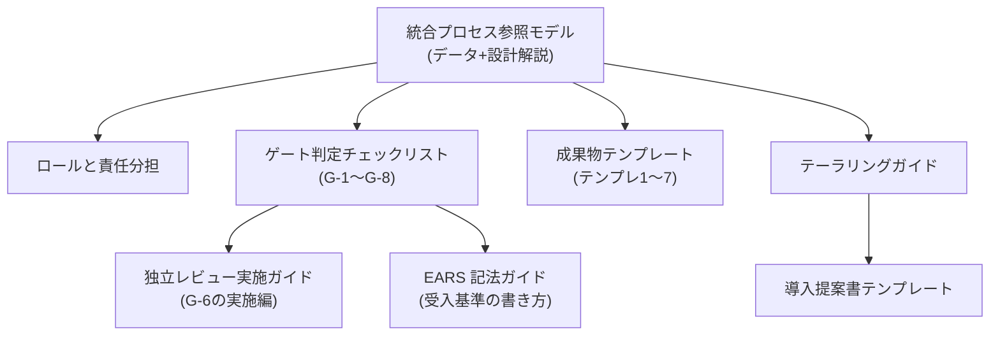

フェーズ1〜3の分析をもとに、企業の品質管理部門・プロセス部門へ提案できるレベルまで統合プロセスを定義したフェーズです。成果物は揃っており、このページはその案内図です。

## 成果物の全体像

## 読む順序

| 順 | ページ | 内容 |
| --- | --- | --- |
| 1 | [統合プロセスの設計解説](/process-compass/phase4-process-design/integrated-process/) | なぜこの構造なのか(設計原則と各要素の由来) |
| 2 | [参照モデル本体](/process-compass/processes/integrated/) | フェーズ・ロール・ゲート・タスクの定義(L1→L2→L3 で詳細化) |
| 3 | [ロールと責任分担](/process-compass/phase4-process-design/roles-responsibilities/) | RACI・任命基準・兼務可否 |
| 4 | [ゲート判定チェックリスト](/process-compass/phase4-process-design/gate-criteria/) | G-1〜G-8 の判定基準と初期値 |
| 5 | [独立レビュー実施ガイド](/process-compass/phase4-process-design/review-guide/) | 3パス方式・観点チェックリスト・挙動要約 |
| 6 | [EARS 記法ガイド](/process-compass/phase4-process-design/ears-guide/) | 受入基準を検証可能にする書き方 |
| 7 | [成果物テンプレート](/process-compass/phase4-process-design/deliverable-templates/) | 企画書〜引き継ぎ文書までの実テンプレート7点 |
| 8 | [テーラリングガイド](/process-compass/phase4-process-design/tailoring-guide/) | 体制・事業フェーズ別の調整(提案ツールの知識ベースの原型) |
| 9 | [導入提案書テンプレート](/process-compass/phase4-process-design/proposal-template/) | 品質管理部門・上長への提案様式 |

## 次のフェーズとの関係

- 定義したゲートを Git・CI 上で機械的に強制する方法は[フェーズ5(プロセス実装)](/process-compass/phase5-implementation/overview/)
- 導入後の運用・改善は[フェーズ6(プロセス運用)](/process-compass/phase6-operation/overview/)
- 条件を入力して自チーム向けの調整を得るには[プロセス提案シミュレーター](/process-compass/tool/simulator/)
