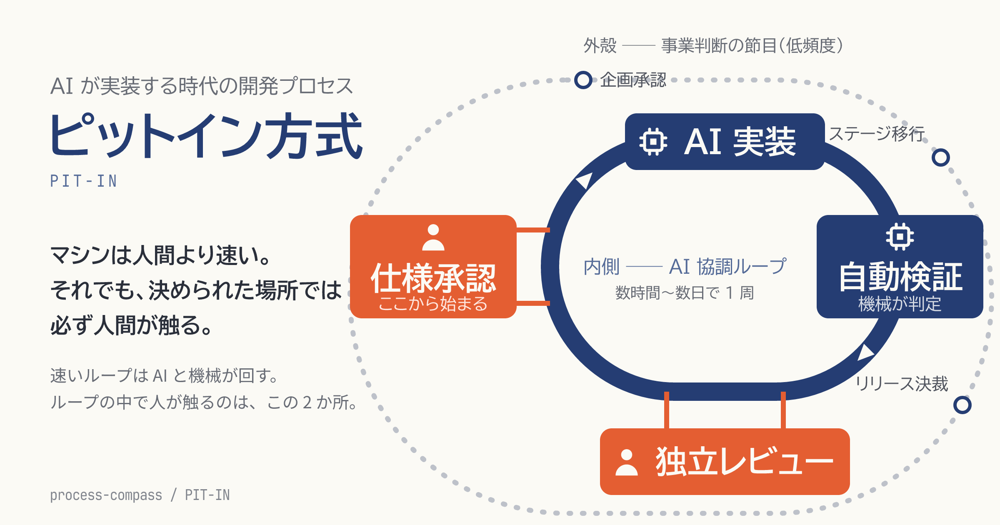
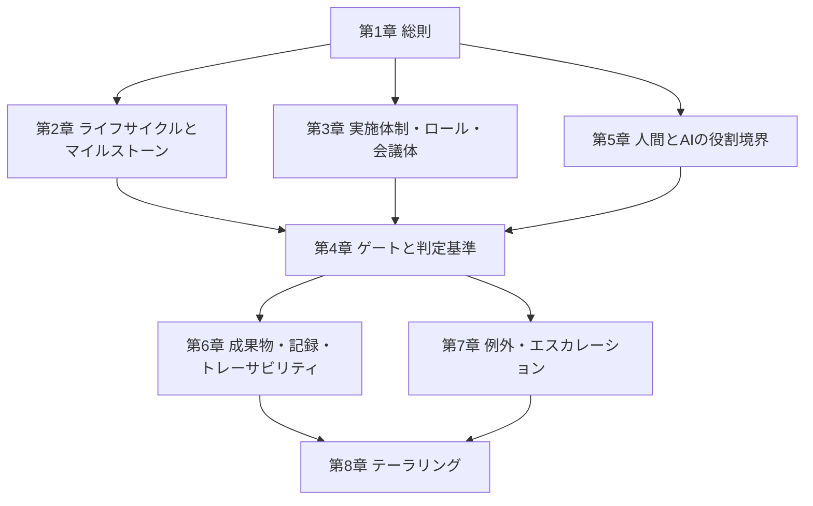
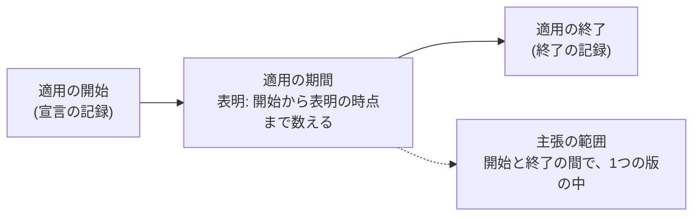

本ページは「AI協調型ソフトウェア開発プロセス標準」(以下、本標準)の総則です。本標準は、生成AIを開発の主たる実装主体として組み込みながら、日本の大企業が備える投資決裁・品質保証・監査の統制と接続できる開発プロセスを規定します。

## 1.0 名称

本標準の通称を **ピットイン方式**(PIT-IN)と定めます([ADR-0027](/process-compass/adr/0027-process-name-pit-in/))。

| 層 | 用途 | 名称 |
| --- | --- | --- |
| 通称 | 口頭・検索・リポジトリ名 | ピットイン方式(PIT-IN) |
| 正式名称 | 稟議・QMS 文書・規格の引用 | AI協調型ソフトウェア開発プロセス標準 |

F1 のピット作業は、18〜20名が2秒以下で完了します。レースは止まりません。決められた場所でだけ人の手を入れます。この構成を本標準のゲートに重ねています。

本標準を一文にまとめると、次の要約になります。

- マシンは人間より速い。それでも、決められた場所では必ず人間が触る

図は2層からなります。内側のループは時計回りに、仕様承認(人)、AI 実装、自動検証(機械)、独立レビュー(人)の4工程を回ります。人が関わる2工程をピットボックスの形で示しています。外側の環は事業判断の節目で、既存の稟議・決裁制度をそのまま使います([第2章](/process-compass/phase4-process-design/lifecycle/))。

## 1.1 目的

本標準の目的は次のとおりです。

- 生成AIを実装主体とする開発において、成果の品質・責任の所在・意思決定の記録を担保する要求事項を定めること
- 既存の品質マネジメントシステム(QMS)または決裁権限規程を有する組織では、それらを置き換えることなく、その上に AI 協調の運用を接続すること
- 組織・事業フェーズ・規模の違いをテーラリング(第8章)で吸収し、同一の成果定義のもとで運用できる状態を維持すること

ここでいう担保は、製品に欠陥が無いことの約束を意味しません。品質を保証する主体は本標準ではなく、本標準を適用した組織です。組織が主張できる範囲と主張しない範囲は 1.9 に定めます。

## 1.2 適用範囲

| 区分 | 内容 |
| --- | --- |
| 適用対象 | 生成AIエージェントを実装・設計・検証のいずれかに用いるソフトウェア開発およびその保守 |
| 適用組織 | 適用対象の開発または保守を行う組織。1名の体制を含む。品質マネジメントシステムと決裁権限規程のどちらも持たない体制を含む |
| 適用フェーズ | 企画・要件・設計・実装・検証・出荷判定・運用の全ライフサイクル |
| 適用外 | AI を一切用いない開発、および本標準の要求事項を既存規程が上位で禁止する領域 |

適用外の領域が存在する場合は、テーラリング(第8章)の記録として除外理由を残します。

適用組織を、既存の規程を持つ組織に限りません([ADR-0068](/process-compass/adr/0068-start-of-application-and-conformance-claim/) 決定6)。品質マネジメントシステムまたは決裁権限規程を有する組織は、本標準をその上に接続します。どちらも持たない体制は、決定の権限を D-0 体制図に記名で定めます([第8章](/process-compass/phase4-process-design/tailoring-guide/)「会議体と体制図の調整」)。

1名の体制を適用組織に含めることは、その体制が品質保証の主張の成立条件を満たすことを意味しません。成立条件は 1.9 と[第4章 G-7](/process-compass/phase4-process-design/gate-criteria/)によります。本標準を適用していると言える時点と、適合を主張できる範囲は、1.10 によります。

本標準は、開発の方式と開発手法の名によって、適用の対象を限定しません。反復型の手法を用いる開発も、計画駆動の開発も、上表の適用対象に当たれば適用の対象です。

本標準は、既存の開発手法との併用の可否・有効性・要素の対応・置き換えを主張しません。既存の開発手法と本標準を併用した案件の記録を、本標準の策定で確かめていないためです。本標準は、反復の周期、チームの会合の持ち方、事業ステージより短い期間の計画の方法を規定せず、採用組織に委ねます。作業の一覧については、[第2章 2.10](/process-compass/phase4-process-design/lifecycle/)が定める事項(スコープ3層、規模の合意、進捗の観測、棚卸しと調整)に限って規定します。他の手法を用いていることと、その手法の名と組み合わせて名乗ることを、本標準は適用の開始に当たる事象として扱いません。適用の表明と適合の主張の根拠としても扱いません(1.10)。対外の文書での書き方は、[附属書H](/process-compass/phase4-process-design/assurance-case/) H.8 によります。

既存の開発手法を用いる組織が、本標準の定める事項と定めない事項を読み分けるための説明は、[附属書A](/process-compass/phase4-process-design/integrated-process/) A.7 に示します。判断の根拠は [ADR-0080](/process-compass/adr/0080-method-neutrality-and-relation-to-existing-methods/)によります。

## 1.3 引用規格および参照文書

**本標準には、引用規格はありません**。次の表の文書は、本標準の構成と用語を定めるときに参照した文書(参考文献)です。表の文書の要求事項は、引用によって本標準の要求事項の一部になりません。本標準を適用するために、表の文書を入手する必要はありません。

| 区分 | 文書(版) | 本標準での用途 | 読んだ範囲 | 出典台帳 |
| --- | --- | --- | --- | --- |
| ライフサイクル | ISO/IEC/IEEE 12207:2017(第1版) | プロセスを「成果(Outcomes)」で定義する構成の根拠 | 目次とまえがき。箇条4(適合)の本文は読んでいない | SRC-0642 |
| 品質マネジメント | ISO 9001:2015 / JIS Q 9001:2015 | 総則の構成、記録の管理、不適合出力の管理 | ISO 9001:2015 は目録と要約。JIS Q 9001:2015 は原本を取得していない | SRC-0643、SRC-0648 |
| ソフトウェア適用手引 | ISO/IEC/IEEE 90003:2018 | QMS のソフトウェア開発への適用解釈 | 目録と要約 | SRC-0644 |
| AIマネジメント | ISO/IEC 42001:2023 / JIS Q 42001:2025 | AI の統制・責任・トレーサビリティ要求 | ISO/IEC 42001:2023 は公開の抜粋。JIS Q 42001:2025 は原本を取得していない | SRC-0090、SRC-0647 |
| 国内ガイドライン | AI事業者ガイドライン(第1.2版、2026年3月公表) | 国内における AI 利活用の実務指針 | 該当の節 | SRC-0500 |
| 機械安全 | ISO 12100:2010 / JIS B 9700:2013 | リスクアセスメントの手順(第6章・第7章で参照) | JIS B 9700:2013 の公開の抜粋。ISO 12100:2010 と一致(IDT) | SRC-0645 |
| AI と機能安全 | ISO/IEC TR 5469:2024 | 安全関連機能の設計・開発に AI を用いる局面の整理(第6章で参照) | 目録と要約 | SRC-0646 |

- 本標準が文書を引くときは、発行年(または版)を付ける。箇条・表・図を引くときは、必ず版を付ける。版の無い引用をしない
- 表の各行に、出典台帳の識別子(SRC-NNNN)を書く。引用した版に台帳のカードがあることは、`npm run check` が確かめる
- 本標準の版を発行するたびに、表の文書の改訂の有無を棚卸しし、日付を付けて記録する。新しい版へ追従するかは、文書ごとに決める。手続は[本標準の版の発行](/process-compass/community/standard-editions/)による

表の ISO/IEC/IEEE 12207:2017 は、2026-04 に第2版(ISO/IEC/IEEE 12207:2026。SRC-0491)で置き換えられています。本標準は第2版への追従を決めていません。追従の要否は、別の Issue で扱います。

表の ISO 9001:2015 は、2026-09-16 に改訂版(ISO 9001:2026)が発行されたと、二次資料が伝えています(SRC-0542)。本標準は改訂版の本文を読んでおらず、追従を決めていません。追従の要否は、版の発行の前の引用規格の棚卸しで扱います。

:::note
引用規格の適用度合いは業種によって異なります。規制業(医療・金融・産業機械等)では、上表に加えて各業種固有の規格(例: IEC 62304:2006/AMD1:2015、IEC 61508:2010)を第8章のテーラリングで追加します。追加する規格も、版を付けて宣言に書きます([第8章](/process-compass/phase4-process-design/tailoring-guide/)「調整は宣言を伴う」)。
:::

:::caution
本標準は上表の規格への**適合性を主張するものではありません**。とりわけ ISO 12100:2010 は機械類の設計を対象とする規格であり、保護対象は人体の傷害と健康障害に限られます。第6章の安全リスクアセスメントは、その手順の構造を参照した本標準の規定です。IEC 62304:2006/AMD1:2015 は医療機器ソフトウェアを対象とする規格であり、汎用の開発標準として引用しません。
:::

## 1.4 用語の定義

本標準で用いる主要な用語を次のとおり定義します。用語は後続の章の改訂に伴って追加します。

| 用語 | 定義 |
| --- | --- |
| AI協調ループ | 仕様承認・AI実装・自動検証・独立レビューを機能単位で反復する開発サイクル |
| マクロライフサイクル | 事業ステージの移行によって区切られる低頻度のプロセス階層 |
| 事業ステージ | 不確実性の低減段階を表す区分。S0 探索・S1 価値確立・S2 スケールの3段階(別称: DR0・DR1・DR2) |
| ステージ移行ゲート | 事業ステージの境界に置く制御点。SG-0・SG-1・SG-2。投資継続と移管の可否を判定する |
| 工程ゲート | 1つの開発サイクル内に置く制御点。G-1〜G-8。判定の対象(本表「判定の対象」)を次工程へ進めてよいかを判定する |
| ゲート | 定められた判定者が、定められた基準との突合により次段階への移行可否を判定する制御点の総称 |
| 判定の対象 | 工程ゲートが、次工程へ進めてよいかを判定するもの。技術設計判断(G-3)では技術上の選択であり、判断記録ではない。ほかの工程ゲートの対象は第6章「成果物と様式の対応」による |
| 判定の材料 | 判定者が、判定基準の確認方法として読む記録。判定の対象と同じものとは限らない。G-3 の判断記録(第6章 テンプレ2)と、G-7 の運用引き継ぎ文書(テンプレ5)は判定の材料である |
| 判定の証跡 | 判定が成立したことを示す記録。工程ゲートでは判定記録(第6章 テンプレ4)に限る。判定の材料を、判定の証跡に数えない(第4章「判定の成立」) |
| 結果責任(A) | 成果の正しさに対する最終責任。成果物ごとに1名のみ割り当てる |
| 実行(R) | 実際の作業。AIエージェントは実行を担えるが、結果責任は担えない |
| 席 | ロールの別称。責務と、判定者となるゲートの組。体制が変わっても変わらない。責任者・担い手と対で述べるときに用いる(第5章 5.5) |
| 責任者 | 席の結果責任(A)を負う記名の自然人。席ごとに1名。体制の変化点でのみ変わる |
| 担い手 | 席の作業を実際に行う実行主体。人、または AI の実行主体の文脈。AI の担い手は、モデルの版・指示資産の版・権限の組で識別する |
| 運用形態 | 担い手が席の判断をどこまで進めるかの区分。人確定・協働・委任の3つ。上限は変更ごとのリスク区分で決まる(第5章 5.5) |
| 独立 | 確認する側が、作成を指示した側と別の自然人であること。人の単位でのみ用いる。構成の条件と、変更ごとの条件の2層で定める。構成の条件は、確認する席の責任者が、確認される側の席の責任者と別の自然人であること。変更ごとの条件は、変更を確認した人が、その変更の作成を指示した者と別の自然人であること。安全関連は組織上の独立を重ねる(第3章 3.5.4) |
| 開発ライン | 同一の案件の、開発者の席と独立レビュアの席。作成を指示する側と、それを独立レビュー(G-6)で確認する側を合わせて指す。出荷判定者の席と事業決裁者の席を含まない。この語を、ほかの意味に用いない。複数の案件にまたがる開発の単位は「開発組織」、案件に関わる人の全体は「案件に関与する者」と書く(第3章 3.5) |
| 第三者レビュー | 本標準を適用する組織と別の組織にあり、案件に利害を持たない者による検証。本標準のゲートには無い。独立レビュー(G-6)、同じ組織の別部門による検証、プロセス内部監査を、第三者レビューと呼ばない。同じ組織の別部門による検証は「組織上独立した検証」と呼ぶ |
| 契約上の確認行為 | 委託の契約が定める、発注側が納入物または実施された業務を確認する行為。検収、業務終了の確認、実施業務の確認が例に当たる。何が当たり、どの効果を持つかは、契約による。本標準のゲートの判定は、契約上の確認行為ではない(第8章 軸D) |
| 分離 | 文脈の分離(作業領域・セッション・認証情報が別)と、入力の分離(作成側の説明文・主張・推論の過程を確認側へ渡さない)の総称。分離だけでは独立は成立しない |
| 体制の変化点 | D-0 体制図、テーラリングの入力、担い手の適合性確認の前提のいずれかを変える変化。5種(第3章 3.13) |
| 設計の有効性 | 統制の設定(閾値・除外設定・必須の検査・ルールセット・フック・権限と、それらを動かす検査装置)の値が、規定どおりであること。設定が在ることの確認で示せる |
| 運用の有効性 | 統制の設定で、止まるべきものが実際に止まること。設定が在ることの確認では示せない。統制の設定を変える変更では、陰性の確認(止まるべき違反を通し、止まった結果)で確かめる(第4章 G-5「統制の設定の陰性の確認」) |
| 検査装置 | 強制層の検査(CI の必須の検査、実行前フックと権限設定による遮断)と、それを動かす構成とスクリプト(検査のスクリプト、スタック別の検査の定義、ワークフロー、検査が読む規則データ)の総称。第3章 3.11.3 の強制層の手段と、その実装を合わせて指す。足す・直す・外すの対象であり、強制層への組み込み(追加・削除・統合)は AI維持管理者が承認し、追加の要否は技術判断者が決める(第3章 3.11.2・3.11.4)。[ADR-0073](/process-compass/adr/0073-corrective-action-by-impact-and-control-effectiveness/) の「検査の装置」と同じもの |
| 保証の開示 | 出荷ごとに、独立性の成立状況・外した項目・未実施の検証・検出能力の測定値を1枚で示す記録。既存の記録からの投影。項目の正本は第4章 G-7「保証の開示」、読み方と定型の文は附属書H H.6 |
| 品質保証 | 顧客・社会のニーズを満たすことを確実にし、確認し、実証するために、組織が行う体系的活動(JSQC-Std 00-001:2023 の 1.3)。本標準が定めるのは、範囲・根拠・証拠を伴う品質保証の主張(assurance)であり、契約上の担保(warranty)と結果の約束(guarantee)を含まない(附属書H H.1) |
| 品質保証の主張 | 本標準を適用した組織が、宣言した保証範囲について、品質の要求事項が満たされるという確信の根拠を、証拠・論証・開示とともに示し、その責任を引き受けること。成立条件は第4章 G-7 による |
| トップマネジメント | 組織を最高位で指揮し管理する人または人々。品質保証の方針と受容の基準に記名し、組織の保証の主張の最終責任を負う |
| 品質保証の方針と受容の基準 | トップマネジメントが記名する、組織に1つの1ページの文書(層1)。保証の相手と範囲の方針、受容しない条件、外枠、受容の権限の段階、上申先の5項目。様式は第6章 テンプレ11 |
| 保証範囲 | 組織が品質を保証する対象(製品・リリース・利用条件・期間)。案件の開始時に G-1 で宣言する(層2)。範囲外の成果物について、組織は品質を保証すると主張しない |
| 外枠 | 受容の基準の前提となる、適用される法令・契約の要求事項・整合規格・技術水準・社会の許容。組織の受容の対象ではない |
| 検出の層 | 欠陥や逸脱を見つけるために置く確認のうち、ゲートの判定に数えないもの。AI の推定による確認が当たる。通過しても判定は成立せず、人の確認を減らす理由にもならない。検出率または「未測定」を開示する(附属書H H.4) |
| コンテキスト基盤 | AI に与える文脈の情報を、恒久層と案件層に分けて保守する仕組み |
| 前提 | 確かめないまま成り立つとみなして置き、崩れると成果物に影響する言明。本標準が置いた前提は、成り立っているかを前提の台帳(第6章 テンプレ10)で観測する。案件の前提は、成り立っているかを判定しない。案件層への登録の有無を G-2 基準3 で確かめ、崩れたときの影響を書く。機能仕様の前提の欄に書かれたものは、すべて確かめていないものとして読む(第4章 G-2「前提の欄(基準3)」)。ゲートの「前提条件」(判定を開始するために整っていなければならない状態。第4章「前提条件と判定基準の区別」)とは別の語である |
| 会議体 | 単独の判定者では決められない事項を、定められた構成員により決定する場。本標準が定める B-1〜B-4(第3章 3.7)と、第8章「会議体と体制図の調整」で B-1〜B-4 を既存の場へ対応づけたもの、または設置したものを指す。既存の会合へ対応づけた場合、会議体の規定(第3章 3.7.3・3.7.5 ほか)は、対応づけた議題に限って掛かる。チームが自ら開く会合(定例・計画・振り返りなど)は、対応づけた議題を除き会議体に当たらない。工程ゲートの判定の場でもない(第4章「ゲート運用の共通ルール」) |
| 決裁権限マトリクス | 金額区分とリスク区分の交点によって決定者を一意に定める表 |
| リスク区分 | 決定の取り消し可能性と影響範囲による区分。R1〜R3 |
| 標準変更 | 手順とロールバック手段が確立し、事前承認済みとしてカタログに登録した反復的な変更。委任の範囲として登録した変更種別と同じものを指す(第3章 3.7.4、第5章 5.5.4) |
| 必達基準 | 1項目でも不合格であれば中止または保留の対象とする判定基準 |
| 評点基準 | 案件間の優先順位付けに用いる評価軸。単独の低評価では中止としない |
| コア機能 | 事業上致命的であり、人間による理解の維持を必須とする機能 |
| 理解保持者数 | 対象の機能について、他者へ問い合わせずに判断できる人数 |
| コンテキスト移管ゲート | 要員の交代に際して理解の断絶を防ぐ制御点。H-1〜H-3 |
| AI自律レベル | AIエージェントの自律の水準。監視者・フォールバックの担い手・適用範囲の3変数で定義する。L1〜L3 |
| 適用範囲 | AIエージェントが動作してよい領域。対象・環境・変更種別・リスク区分の4軸で記述する |
| 指示資産 | AIエージェントへ与える指示の集合。強制層・誘導層・再利用層の3層で構成する |
| 重大度(Severity) | 欠陥がもたらす技術的な影響の大きさ。Sev1〜Sev3 の3段階。観測可能な事象のみで判定する |
| 優先度(Priority) | 欠陥をいつ修正するかの順序。事業判断として人間が決める |
| 既知の不具合 | 未解消の欠陥のうち、回避策とともに利用者へ公開する一覧。内部の技術負債台帳とは別の成果物 |
| テーラリング | 組織・事業フェーズ・規模に応じて本標準の適用度合いを調整すること |
| 適用の開始 | 案件に本標準の要求事項が掛かり始める時点。テーラリングの宣言を案件の記録に残した時点。準拠テンプレートでは、構成が設定済み(`configured: true`)になった最初のコミット(1.10.1) |
| 適用の終了 | 案件への本標準の適用を終えた時点。終了の記録を残した時点。理由の区分は、案件の完了・中止、運用の終了、採用の取り下げの3つ(1.10.4) |
| 本標準の版 | 本標準の保守者が発行した本標準の識別。「第N版」と発行日で示す。要求事項を変えない改訂は「第N版 修正M」と示す(1.10.3) |
| 作業中の版 | 版として発行していない本標準の状態。公開のサイトと配布物の、発行の時点のコミットの後に変わった内容を含む。適用の表明には、コミットの識別とともに名指せる。適合の主張と逸脱を伴う適合の主張には名指せない(1.10.3) |
| 適用の表明 | 案件に本標準を適用していると、組織が述べること。従う版、未達のゲートの件数、記録の欠落の件数、逸脱と列挙に無い離脱を併記する(1.10.2) |
| 逸脱 | 本標準の要求事項を満たさない状態のうち、本標準が条項で条件と代償措置を定めて認めたもの。閉じた列挙であり、一覧は 1.10.2 による。条項の無い離脱を逸脱と呼ばない |
| 列挙に無い離脱 | 本標準の要求事項を満たさない構成の状態のうち、ゲートの未達でも記録の欠落でもなく、本標準が条件と代償措置を定めていないもの。未達(ゲートの状態)・記録の欠落と並ぶ第3の表示の区分である。記録はあり、ゲートは判定されうる。条項が定める記録と表示を行う。適合の主張と逸脱を伴う適合の主張を妨げる(1.10.2) |
| 適合の主張 | 案件が本標準の要求事項を満たしていると、組織が述べること。発行した版を名指し、未達のゲート・記録の欠落・逸脱・列挙に無い離脱が無い範囲に限る(1.10.2)。品質保証の主張とは別の主張である |
| 逸脱を伴う適合の主張 | 案件が、逸脱を除いて本標準の要求事項を満たしていると、組織が述べること。範囲にある離脱が逸脱だけである場合に限り、各逸脱を列挙する。省略して「適合」と書かない(1.10.2) |
| 危険源 | 危害を引き起こす潜在的な根源。Hz-nnn で識別する |
| 危害のひどさ | 危険源が現実化した場合に生じる被害の大きさ。Hs1〜Hs3。重大度(Sev)が事後の観測であるのに対し、事前の見積りである |
| 安全リスク区分 | 危害のひどさ・暴露・発生確率・回避可能性から導く区分。SR1〜SR4 |
| リスク低減ステップ | 危険源への対処の段階。RRS1 実行不能化・RRS2 検知と承認・RRS3 情報提供。順序を入れ替えない |
| 安全関連ソフトウェア | 安全機能の実現・安全状態への遷移・監視と診断のいずれかを担う部分。無条件にリスク区分 R1 として扱う |
| 安全度水準 | 安全関連系に要求される安全性の水準の総称。具体的な指標は適用規格を特定してから確定する |
| 未検証の入力 | AI が生成した出力の初期状態。決定論的な検証を経て初めて成果物になる |
| 故障挿入試験 | 意図的に異常を発生させ、保護方策の動作を確かめる試験 |

:::note
「逸脱」の語は、本文の一部で事象を指して用いています(委任の範囲の逸脱、意図的な逸脱、基準の逸脱、運用の逸脱など)。これらは上表の「逸脱」の定義の外にあり、適合の主張の名に関わりません。事象を指す用例の改名は、別に扱います(Issue #316)。
:::

## 1.5 本標準の構成

本標準は本文8章と附属書9編で構成します。本文と規定の附属書は、要求事項を規定します。参考の附属書は、背景・実施の手引き・問いへの回答を提供します。参考の附属書の記述は、適合の条件に数えません。

附属書の種別は、附属書の単位で宣言します。次の表の「種別」の列と、各附属書の表題に示します。本文は、規定の附属書を「〜によります」の形で引き、参考の附属書を「〜参照」の形で引きます。参考の附属書に、要求事項と禁止を置きません。判断の根拠は [ADR-0063](/process-compass/adr/0063-normative-informative-and-verbal-forms/)によります。

```mermaid
graph TD
  C1["第1章 総則"] --> C2["第2章 ライフサイクルと<br>マイルストーン"]
  C1 --> C3["第3章 実施体制・ロール・会議体"]
  C2 --> C4["第4章 ゲートと判定基準"]
  C3 --> C4
  C1 --> C5["第5章 人間とAIの役割境界"]
  C5 --> C4
  C4 --> C6["第6章 成果物・記録・<br>トレーサビリティ"]
  C4 --> C7["第7章 例外・エスカレーション"]
  C6 --> C8["第8章 テーラリング"]
  C7 --> C8
```

| 章 | 種別 | 表題 | 内容 |
| --- | --- | --- | --- |
| [第1章](/process-compass/phase4-process-design/overview/) | 規定(本文) | 総則 | 目的・適用範囲・引用規格・用語・構成・主張の範囲・適用の開始と適合の主張 |
| [第2章](/process-compass/phase4-process-design/lifecycle/) | 規定(本文) | ライフサイクルとマイルストーン | 事業フェーズ、マクロゲート、AI協調ループとの接続 |
| [第3章](/process-compass/phase4-process-design/roles-responsibilities/) | 規定(本文) | 実施体制・ロール・会議体 | ロール定義、RACI、任命・兼務、会議体と決裁権限、体制の変化点 |
| [第4章](/process-compass/phase4-process-design/gate-criteria/) | 規定(本文) | ゲートと判定基準 | 各ゲートの判定基準、期限、計測指標 |
| [第5章](/process-compass/phase4-process-design/human-ai-boundary/) | 規定(本文) | 人間とAIの役割境界 | AI自律レベル、判断の席と確定の担い手、形骸化の防止 |
| [第6章](/process-compass/phase4-process-design/deliverable-templates/) | 規定(本文) | 成果物・記録・トレーサビリティ | 成果物様式、記録要件、データとの対応 |
| [第7章](/process-compass/phase4-process-design/exception-escalation/) | 規定(本文) | 例外・エスカレーション | 基準逸脱時の手続、期日リスク、上位への報告 |
| [第8章](/process-compass/phase4-process-design/tailoring-guide/) | 規定(本文) | テーラリング | 組織条件に応じた適用度合いの調整、再テーラリングの契機 |
| [附属書A](/process-compass/phase4-process-design/integrated-process/) | 参考 | 設計の背景と由来 | 本標準の構造を採用した理由、既存プロセスからの由来と既存の開発手法との関係 |
| [附属書B](/process-compass/phase4-process-design/ears-guide/) | 規定 | EARS 記法 | 受入基準を検証可能な形式で記述する方法 |
| [附属書C](/process-compass/phase4-process-design/review-guide/) | 参考 | 独立レビュー実施ガイド | 独立レビューの実施手順 |
| [附属書D](/process-compass/phase4-process-design/proposal-template/) | 規定 | 導入提案書の様式 | 品質保証部門・決裁者への提案様式 |
| [附属書E](/process-compass/phase4-process-design/developer-guide/) | 参考 | 開発者のAI協調作業ガイド | 仕様の記述から差分の検証までの作業手順 |
| [附属書F](/process-compass/phase4-process-design/safety-verification/) | 規定 | 安全適合性の検証ガイド | 安全関連ソフトウェアの検証手順と AI 利用時の追加要求 |
| [附属書G](/process-compass/phase4-process-design/executive-projection/) | 参考 | 決裁制度への提示 | 経営層へ提示する1枚を、既存成果物からの投影として構成する作法 |
| [附属書H](/process-compass/phase4-process-design/assurance-case/) | 規定 | 品質保証の論証 | 組織の保証の主張と3層の構造、主張しないこと、主張・条項・証跡・主張の崩れを示す観測の対応、保証の開示の読み方(項目の正本は第4章 G-7) |
| [附属書I](/process-compass/phase4-process-design/adoption-guide/) | 参考 | 採用判断の手引き | 採用を判断する者の18の問い(品質保証と組織継続)への本標準の回答 |

種別を附属書より小さい単位(節・段落)では宣言しません。規定の附属書の中の注記・例・理由の文は、本文と同じく説明として読みます(1.7.2)。

## 1.6 各章の入力・処理・出力(IPO)

本標準は、章ごとに入力・処理・出力を定義し、章間のトレーサビリティを確保します。

| 章 | 入力(Input) | 処理(Process) | 出力(Output) |
| --- | --- | --- | --- |
| 第2章 | 事業計画、投資枠 | 事業フェーズの判定、マイルストーン設定 | ライフサイクル計画、ゲート配置 |
| 第3章 | ライフサイクル計画、要員情報 | ロール任命、会議体設置、決裁権限の割当 | 体制図、RACI、決裁権限マトリクス |
| 第4章 | 各工程の成果物 | 判定基準との突合 | ゲート判定記録、差し戻し理由 |
| 第5章 | AI 能力の現状評価 | 役割境界の設定、理解度の測定 | 役割境界定義、AIX メトリクス |
| 第6章 | 各工程の作業結果 | 様式への記録、識別子の付与 | 成果物、記録、トレーサビリティ表 |
| 第7章 | 基準逸脱・期日超過の検知 | 影響評価、代替案の決定 | 例外承認記録、負債台帳への登録 |
| 第8章 | 組織条件(規模・フェーズ・規制)、体制の変化点 | 適用度合いの調整、変化点での再実行 | テーラリング記録 |

## 1.7 記述の原則

本標準の記述は次の原則に従います。

- 本文と規定の附属書は、要求事項・推奨事項・許容事項を記述する。設計思想・検討経緯・比較検討は附属書A へ記載する
- 規定の強さは、文末の形で示す。対応は 1.7.1 による
- 説明は、理由の文と注記に書く。規定と説明の読み分けは 1.7.2 による
- 表の升に入れる語は、1.7.3 の語彙に限る
- 同じ事項の規定は1か所に書く。ほかの箇所は、その所在を引く
- 特定の製品名・組織内の口頭文脈に依存する表現は用いない
- AI の能力に関する記述には、その記述が妥当な時点(YYYY-MM-DD)を併記する

### 1.7.1 規定の表現形式

本標準を適用する者が、適合を主張するために満たす要求事項を、文面から識別できるようにします。要求事項と、推奨事項・許容事項・可能性の記述は、文末の形で区別します。本文と規定の附属書に、次の表の形を使います。

| 種類 | 本文(ですます調) | 箇条書き・表(である調) | 意味 |
| --- | --- | --- | --- |
| 要求 | 〜します/〜とします/〜によります/〜しなければなりません | 〜する/〜とする/〜による/〜しなければならない | 適合の主張には、これを満たす。満たさない要求事項が、本標準が条項で条件と代償措置を定めた逸脱(1.10.2)に限られる範囲は、逸脱を伴う適合の主張になる |
| 禁止 | 〜しません/〜してはなりません | 〜しない/〜してはならない | 要求の否定の形。強さは要求と同じ |
| 推奨 | 〜することを推奨します/〜することが望ましいです | 〜することが望ましい/〜を推奨する | 特に適していると本標準が判断した選択。ほかの選択を排除しない。従わなくても適合する |
| 推奨しない | 〜しないことを推奨します | 〜しないことが望ましい/非推奨 | 適していないと本標準が判断した選択。禁止ではない |
| 許容 | 〜してよいものとします/〜して差し支えありません | 〜してよい/〜してもよい | 本標準がこれを認めている |
| 可能性・能力 | 〜できます/〜場合があります/〜ことがあります | 〜できる/〜場合がある/〜ことがある | 起こりうること、または行う力があること。本標準の許可ではない |
| 外部の制約 | 〜とされています/〜と定められています | 〜とされている/〜と定められている | 法令など、本標準の外が定めること。本標準の要求事項ではない |

- 本文と規定の附属書の地の文で、平叙の動詞文(「〜します」「〜しません」)は、要求事項として読む。「〜しなければなりません」と「〜します」の強さに差は無い
- 文末の「〜できます」を、許容の意味で使わない。許容には、表の許容の形を使う。「〜できます」は、可能性と能力の記述に限る
- 依頼の形(「〜してください」)と「〜すべきです」を、規定の文末に使わない。強さが決まらないためである
- 箇条書きと表の中の体言止めは、見出しの文または列の見出しが示す種類として読む

:::caution[暫定 EV-0096 / 見直し 2027-04]
**対象**: 規定の表現形式の表(1.7.1)の日本語の文末と、JIS Z 8301 の表現形式との対応。および、文末の書き分けが適合の判定のばらつきを減らすという前提。
**根拠の水準**: E1(間接)。
**差し替え条件**: JIS Z 8301 の原本で確かめた表現形式の表との照合の結果。書き直しを終えた章について、別の読み手2名が要求の文を数えて食い違った件数。

種類の立て方(要求・推奨・許容・可能性と能力・外部の制約)と、表に無い形を規定に使わないという決まりは、ISO/IEC 専門業務用指針 第2部(第9版、2021)の箇条7 によります。原典で確かめました。日本語の文末は、本標準が定めた対応です。JIS Z 8301 は第三者の転載でしか読めていないため、同規格の文を引いていません。本標準の文末が同規格の表現形式と一致するとは主張しません。文末の書き分けの効果を測った結果も、見つかっていません。
:::

### 1.7.2 規定と説明の読み分け

次のものは説明です。要求事項として読みません。

- 理由の文。文末が「〜ためです」「〜からです」の文
- 注記(`:::note`)、根拠水準のマーク(`:::caution[暫定 …]`)、図、例
- 定義と事実の記述。名詞または形容詞で結ぶ文(「〜です」)
- 主語が「本標準」である文。「本標準は〜を課しません」「本標準は〜を定めません」は、課さないと決めたことの表明であり、本標準を適用する者への禁止ではない
- 参考の附属書の記述(1.5)

要求事項を、名詞で結ぶ文と注記に書きません。規定として効かせる事項は、1.7.1 の要求または禁止の形で書きます。

平叙の動詞文が説明か要求かを、機械は判定しません。迷う文は要求として読みます。要求の取りこぼしより、説明が要求として読まれるほうが安全なためです。

### 1.7.3 表の升に入れる語

| 升が示すもの | 使う語 | 意味 |
| --- | --- | --- |
| 工程ゲートの状態 | 適用、簡略、統合、省略、未達 | テーラリングの規則が定める結果([ADR-0028](/process-compass/adr/0028-unmet-gate-distinct-from-omitted/))。組織が選ぶ余地を示す語ではない |
| 規定の強さ | 必須、禁止、推奨、非推奨、許容、不要 | 必須と禁止は要求。不要は、本標準がこれを求めないこと |

- 限定は、語の後ろの括弧に書く(例: 「適用(コア機能)」「統合(G-4 へ)」)
- 「省略可」「任意」「どちらでもよい」を使わない。許容(組織が選べる)とも規定(標準が決めている)とも読めるためである <!-- provision-ok: 廃した語を示す -->
- 記号の「○」「△」と、1字の「可」「不可」を、規定の強さの升に使わない。上の表のどの語に当たるかの判断(例: △ は非推奨と限定つきの許容のどちらを指すのか)を、読み手に委ねるためである。規定の強さは上の語と括弧の限定で書く([ADR-0082](/process-compass/adr/0082-seat-combination-boundaries-and-lane-mapping/) 決定6) <!-- provision-ok: 廃した記号と語を示す -->

### 1.7.4 検査と、その限界

`npm run check` は、本文と規定の附属書について、依頼の形と「〜すべき」の文末、廃した升の語を検出します。参考の附属書については、要求と禁止の文末、実装マークを検出します。廃した言い回しの登録簿に載せた句は、公開ドキュメントと準拠テンプレートの全体から検出します。書式は[規定の表現形式の検査](/process-compass/community/provision-forms/)によります。

「〜できます」が許容か能力かを、機械は判定しません。平叙の動詞文が要求か説明かも、判定しません。この2つは、人が読んで確かめます。

### 1.7.5 組織が書く基準の読み替え

本標準は、組織が書く基準(受入基準、品質保証の方針と受容の基準、テーラリングの宣言)に、その基準が緩める理由へ読み替えられる場合の列挙を求めません。列挙が十分かを記録で判定できず、書かれた禁止は守られにくいためです。読み替えへの歯止めは、本標準の各条項の中に禁止として書きます(例: [第8章](/process-compass/phase4-process-design/tailoring-guide/) 軸B「本軸は、未達の表示を動かしません」、[附属書H](/process-compass/phase4-process-design/assurance-case/) H.11)。条項を起草するときの手順は[規定の表現形式の検査](/process-compass/community/provision-forms/)「起草の規則」によります。

規定の目的に反する結果を文言の充足で得てはならない、という一般的な規定も置きません。判定者に目的への照合を求めると、当該ゲートの判定基準だけで判定する決まり([ADR-0036](/process-compass/adr/0036-gate-closure-by-record/) 決定4)と当たり、判定を記録で再現できなくなるためです。

:::caution[暫定 EV-0128 / 見直し 2027-10]
**対象**: 組織が書く基準に、緩める理由への読み替えの列挙を求めないこと。
**根拠の水準**: E1(間接)。
**差し替え条件**: 附属書H H.11 の表に載らない読み替えが、案件の流出の原因として観測された件数。

基準の書き手に読み替えの列挙を課した規格は、調べた範囲で見つかっていません。書かれた禁止が AI の実行主体に守られにくいことは、独立した複数の測定が示しています。列挙を求めないことの効果は、測られていません。
:::

### 1.7.6 根拠水準のマークの範囲

本標準は、根拠水準のマーク(E0〜E3。[ADR-0026](/process-compass/adr/0026-evidence-level-marking/))を、本標準の記述に付けます。**本標準は、根拠水準のマークを、本標準を適用する者の文書に課しません**。組織が置く値の多くは E0 で、すべてにマークが付くと区別の意味を失います。付け忘れを、記録で検出できません。1.7.5 と同じく、本標準が自らに課す作業を採用者へ広げない、という判断です。

[附属書I](/process-compass/phase4-process-design/adoption-guide/)の導入前の検証の要件⑥(結果の根拠の水準を開示する)は、この範囲の外にあり、残ります。能力依存として登録した値の見直しは、[能力依存の定数の登録簿](/process-compass/phase6-operation/metrics/)の再評価によります。判断の根拠は[ADR-0075](/process-compass/adr/0075-acceptance-criteria-coverage-premises-and-ai-findings/)の決定6 によります。

## 1.8 関連するフェーズ

フェーズ5(プロセス実装)とフェーズ6(プロセス運用)の文書は、本標準の構成(本文8章と附属書9編)の外にあり、本文に従属します。本文の要求事項を実装し、運用する手段を示します。フェーズ5 とフェーズ6 の記述は、本文の要求事項を狭めません。食い違う場合は、本文によります。

- ゲートを Git・CI 上で機械的に強制する方法は[フェーズ5(プロセス実装)](/process-compass/phase5-implementation/overview/)に示す
- 導入後の運用・測定・改善は[フェーズ6(プロセス運用)](/process-compass/phase6-operation/overview/)に示す
- 組織条件を入力して調整結果を得る手段として[プロセス提案シミュレーター](/process-compass/tool/simulator/)を提供する

:::note
フェーズ5 とフェーズ6 のページごとの種別(規定・参考)は、定めていません。各ページの規範と本文の対応を突合していないためです。
:::

## 1.9 本標準を適用する組織が主張できること、主張しないこと

**本標準そのものは、品質を保証する主体になりません**。品質を保証すると主張し、その責任を負うのは、本標準を適用した組織です。最終責任はトップマネジメントにあります。本標準は、組織が保証を主張するための要求事項であり、その主張の拠り所です([ADR-0057](/process-compass/adr/0057-organizational-quality-assurance/))。

組織が主張できるのは、次のことです。

> 本標準を適用した組織は、トップマネジメントが記名した品質保証の方針と受容の基準のもとで、宣言した保証範囲について、顧客と社会に対し、品質を保証する。約束する品質を生成より前に人が定め、AI と独立な検証で確かめる仕組みを確立し(確実にする)、出荷ごとに開発ラインの外の記名の自然人が基準の充足と記録の完備を突合し(確認する)、確かめていない範囲と、受容の基準に照らして記名で受け入れた残存リスクを、保証の開示で示す(実証する)。

主張は3つの層で支えます。

| 層 | 内容 | 正本 |
| --- | --- | --- |
| 層1 | トップマネジメントが記名する品質保証の方針と受容の基準。導入時と変化点だけで改める | 第6章 テンプレ11 |
| 層2 | 案件の開始時に、事業決裁者が G-1 で承認する品質の約束と保証範囲 | 第4章 G-1、第6章 テンプレ6 |
| 層3 | 出荷ごとの出荷判定(G-7)と、層1 に照らした残存リスクの受容(G-8) | 第4章 G-7・G-8 |

法令・契約・整合規格・技術水準・社会の許容は、層の外の前提条件(外枠)です。受容の対象ではありません。

主張は、出荷ごとに、保証範囲に入る変更が6つの成立条件を満たす場合に限ります。成立条件と判定は[第4章 G-7](/process-compass/phase4-process-design/gate-criteria/)によります。満たさない範囲は、「品質保証の対象外として出荷した」と顧客へ伝えます。1名体制は、外部の確認者を置かない限り、組織として品質を保証するとは主張できません。

**この保証は、製品に欠陥が無いことの約束ではありません**。組織の保証の主張は、次の事項を含みません。

- 欠陥が無いこと(結果の約束)
- 契約上の担保(仕様への適合や無償の修補の約束)
- 社内の受容が、製造物責任・契約責任・規制上の責任を限定すること
- 機械学習の振る舞いを持つ製品について、その振る舞いの保証(本標準の範囲外)
- 受入基準と試験計画が十分であること
- AI による確認が、独立した人の確認と同等であること
- 人のレビューが全行を読んだこと
- 抜き取られなかった範囲に逸脱が無いこと
- 既存規格への適合(1.3)
- 契約上の責任の帰結

主張の構造、成立条件の読み方、主張を支える条項と証跡の対応、AI による確認の数え方、署名の意味、出荷ごとの保証の開示、対外的に使う表現は、[附属書H](/process-compass/phase4-process-design/assurance-case/)に示します。附属書H は既存の条項からの投影であり、要求事項の正本は各章です。本標準の運用が欠陥の流出を減らしたという測定はありません。主張の成立条件が対外の根拠として足りるかも実証しておらず、根拠の水準は ADR-0057 に開示しています。採用を判断する者の問いへの回答は、[附属書I](/process-compass/phase4-process-design/adoption-guide/)にあります。

## 1.10 適用の開始と適合の主張

本標準を**適用している**ことと、本標準に**適合している**と主張できることを区別します。品質保証の主張(1.9)は、このどちらとも別の主張です。判断の根拠は [ADR-0068](/process-compass/adr/0068-start-of-application-and-conformance-claim/)、[ADR-0083](/process-compass/adr/0083-standard-edition-end-of-application-and-deviation/)、[ADR-0085](/process-compass/adr/0085-adoption-into-existing-repositories/)によります。

適用の単位は案件とします。適用の期間は、適用の開始(1.10.1)から適用の終了(1.10.4)までです。表明と主張は、従う本標準の版(1.10.3)を名指して述べます。

```mermaid
flowchart LR
  B["適用の開始<br/>(宣言の記録)"] --> P["適用の期間<br/>表明: 開始から表明の時点まで数える"]
  P --> E["適用の終了<br/>(終了の記録)"]
  P -.-> C["主張の範囲<br/>開始と終了の間で、1つの版の中"]
```

### 1.10.1 適用の開始

適用の開始は、当該案件のテーラリングの宣言([第8章](/process-compass/phase4-process-design/tailoring-guide/)「調整は宣言を伴う」)を、案件の記録に残した時点とします。準拠テンプレートでは、構成(`process.config.json`)が設定済み(`configured: true`)になった最初のコミットがこれに当たります([準拠テンプレートリポジトリ](/process-compass/phase5-implementation/template-repository/))。

- 適用の開始より前の変更は、本標準の要求事項の対象としない
- 適用の開始の後は、テーラリングで導いた要求事項のすべてを、同時に適用する。満たしていない要求事項は、未達・記録の欠落・逸脱・列挙に無い離脱のいずれかとして表示する(1.10.2)
- 適用の開始の後に、ゲートを順に有効にしていく経過措置を設けない
- 強制の前に、違反に当たる操作を観測するだけの期間を置く場合は、適用の開始より前に置く。適用の開始の後に、強制層を観測だけの設定にしない
- 適用の開始より前の案件について、本標準を適用していると表明しない
- 宣言の記載が欠けていても、適用の開始は動かない。欠けた記載は、記録の欠落として表示する
- 準拠テンプレートでは、適用の開始のコミットに、構成の変更の記録の初期化の記録(`changeLog` の `init`)を同じコミットで書く。無ければ記録の欠落として表示し、適用の開始は動かさない。適用の開始のコミットが検査の範囲(初期化の PR など)にある間は、契約の検査を失敗にする。この記録の欠落は、適用の表明の件数(開始から表明の時点まで)に常に1件として数える
- 再テーラリング(構成の変更)、版の切り替え(1.10.3)、構成の再初期化は、適用の開始を動かさない
- 適用の開始の境は、既定ブランチの主系列(既定ブランチへ順に積まれた変更の列。併合で取り込んだ側の履歴を含まない)の上に置く
- 適用の開始より前の履歴には、履歴の出所(採用者の過去の変更、併合した他のリポジトリの履歴、準拠テンプレートの開発履歴)を問わず、適合を主張しない。出所を識別して、一部の履歴を要求事項の対象に含めたり、対象から除いたりしない。適用の開始の後に併合した履歴も、出所を問わず要求事項の対象とする

<!-- impl IMPL-0119 target=evidence-aggregation state=delivered check=machine test=template/scripts/gate/test-edition-end.mjs note="適用の開始(構成の初期化の記録)より前の変更を変更の件数に数えず欠落にもせず、後の変更は導いた要求事項のすべての対象にする。途中の段階を表す値を持たない。初期化の直後の出荷で、記録の無い変更が欠落として出ることを実行して確かめた(#306)(#314 の突合 X-6 で違反と適合の対の試験を足し、machine へ戻した)" -->

<!-- impl IMPL-0304 target=evidence-aggregation state=delivered check=machine test=template/scripts/gate/test-edition-end.mjs note="適用の開始の境を、構成が configured: true になった最初のコミットとする(findInitCommit)。そのコミットに changeLog の init の記録が無い場合、集約の範囲にそのコミットがあれば記録の欠落として出し、境は動かさない。契約の検査(verify-gate-contract)は、そのコミットが検査の範囲(PR の基底の祖先でない、または手元の HEAD)にあれば失敗にし、範囲の外であれば注記として出す。test-edition-end.mjs が、init の記録を欠いた履歴で欠落が出ること、境が動かないこと、HEAD が初期化のコミットのとき契約の検査が失敗することを実行して確かめる(#313)" -->

<!-- impl IMPL-0313 target=evidence-aggregation state=delivered check=machine test=template/scripts/gate/test-adoption.mjs note="適用の開始の境を、既定ブランチの第1親の連鎖の上で configured: true になった最初のコミットとする(findInitCommit が git log --first-parent で探す)。併合した別の履歴の中の configured: true のコミットを境にしない。旧い探し方(全履歴を歩く)が、開始の後に併合した別の履歴の古いコミットを境にすることを、先に test-adoption.mjs で再現した(品質保証 V-4)。境がマージのときは、第2親の側を含む境の全祖先を開始より前とする(#315)" -->

<!-- impl IMPL-0318 target=evidence-aggregation state=delivered check=machine test=template/scripts/gate/test-adoption.mjs note="適用の開始より前の履歴を、出所を問わず要求事項の対象外とし、件数だけを開示する(テンプレート由来の初期コミットの識別と、製品のコードを変えたコミットの一覧をやめた)。開始の後に併合した共通の祖先の無い履歴のコミットは、開始の祖先でないため対象として数え、記録が無ければ欠落にする。test-adoption.mjs が、開始の後に併合した別の履歴の製品の変更が欠落として出ることと、開始より前の開示が件数だけであることを実行して確かめる(#315)" -->

#### 既存のリポジトリで適用を始める場合(適用: 既存のコードと履歴を持つリポジトリで適用を始める案件)

既存のリポジトリには、本標準より前からの統制(エージェントへの指示、CI、ブランチ保護、コードオーナーの定め)があります。これらとテンプレートの統制の関係を決めずに始めると、どちらかが**失敗を出さずに外れる**ことがあります(矛盾する指示ファイルの片方が任意に選ばれる。コードオーナーの定めは最初の1か所だけが効き、不正な行は飛ばされる)。次の要求事項は、適用の開始の記録の内容として掛かります。開始より前の準備の活動には掛かりません。

- 適用の開始の記録に、既存の統制の資産の一覧と、資産ごとの扱いを含める。資産は、エージェントの指示ファイル(入れ子のものを含む)、CI のワークフローと必須チェック、ブランチ保護とルールセット、コードオーナーの定め、カバレッジの測定、使う言語と道具の対応(アダプタ)とする。扱いは「取り込む」「置き換える」「残して並存する」「対象外とする」のいずれかとする
- 扱いは、技術判断の席の責任者(人)が記名で確定する。AI の担い手は一覧を起案してよいが、扱いを確定しない
- 機械が検出した資産(準拠テンプレートでは初期化の事前点検の出力)は、一覧に載せる。一覧の網羅を、人の申告だけで示さない
- 統制に効くファイル(エージェントの指示ファイル、コードオーナーの定め、強制層のワークフロー、フックの登録)が、準拠テンプレートの規則を欠いたまま、適用を始めない

判定の対象は、一覧の記録の有無と記名、機械が検出した資産との照合、統制に効くファイルの規則の有無です。一覧が既存の資産を網羅したことそのものは、判定の対象にしません。機械が検出しない資産(リポジトリの外の設定など)の漏れは、実環境の統制の確認([附属書I I.11](/process-compass/phase4-process-design/adoption-guide/) 要件⑦)で補います。

持ち込みの手順は、準拠テンプレートの手引きに置きます([準拠テンプレートリポジトリ](/process-compass/phase5-implementation/template-repository/)「既存のリポジトリへ持ち込む」)。本標準は、次の3つを**採らないと決めました**。

| 採らないこと | 理由 |
| --- | --- |
| 持ち込みの手順の全体を、本標準に置く | 実際の GitHub 上での通しの検証と、python・go の既存のリポジトリでの試行が無い。確かめていない手順に従ったことを、適合の根拠にさせない |
| 資産ごとに順に適用する段階の展開 | 上の「導いた要求事項のすべてを、同時に適用する」と矛盾する。部分的な適用を適合と読ませる |
| 既存の違反を基準線として記録し、新しい違反だけを止める仕組み | 閾値の緩和と機械で区別できない。基準を満たさないまま進める4つ目の経路になる。既存の違反は、例外承認・前提の受容・未解決事項の3つの経路で技術負債台帳へ載せる(第4章) |

<!-- impl IMPL-0319 target=adoption-preflight state=delivered check=machine test=template/scripts/gate/test-adoption.mjs note="既存のリポジトリで適用を始める要求事項のうち、機械が確かめる部分。初期化の事前点検(preflight.mjs)が、既存の統制の資産(独自の AGENTS.md・入れ子の指示ファイル・既存のワークフロー・テンプレートの配置の外の製品のコードと履歴・言語の目印・カバレッジの測定の穴・.gitignore の行)を検出し、資産があれば一覧(docs/adoption-inventory.md)を求める。一覧に検出した資産がすべて載り、扱いが4つの値のいずれかで、確定した者が記入済みかつ AI の名義でなく、確定日が日付であることを確かめ、欠ければ止める(初期化は構成を書かない)。確定した者が技術判断の席の責任者その人であることは確かめない(初期化の前は席が無い)。確かめる者: 初期化の PR を確かめる人(一覧の記名と D-0 の技術判断者を突き合わせる)。test-adoption.mjs と test-init-g5.mjs が、一覧の欠け・未載の資産・AI の名義・値の外の扱いで止まり、記名した一覧で通ることを実行して確かめる(#315)" -->

<!-- impl IMPL-0320 target=gate-contract state=delivered check=machine test=template/scripts/gate/test-adoption.mjs note="統制に効くファイルがテンプレートの規則を欠いたまま始めないこと。事前点検が、CLAUDE.md の区間の目印と常駐の規則の欠け、CODEOWNERS の置き場の重なり、雛形の所有者 @OWNER の残り、.claude/settings.json のフックの登録(guard-write)の欠けで止める。契約検査(verify-gate-contract)は、設定済みの構成でも、フックの登録の欠けと @OWNER の残りを失敗にする(開始の後に戻した場合も止める)。初期化と generate-profile.mjs --merge-hooks は、既存の settings.json へテンプレートのフックの登録を併合する(既存の登録は残す)。test-adoption.mjs が、欠けで止まり・落ち、併合の後に通ることを実行して確かめる(#315)" -->

:::caution[暫定 EV-0166 / 見直し 2027-04]
**対象**: 既存のリポジトリで適用を始める場合の4つの要求事項と、開始の境を既定ブランチの主系列の上に置き、開始より前の履歴に出所を問わず主張しない定め(1.10.1)。
**根拠の水準**: E1(間接)。
**差し替え条件**: 観測の源は、採用者の資産の一覧(`docs/adoption-inventory.md`)と、適用の開始の後に見つかった統制の外れの報告です。開始の後に、一覧に載らなかった資産が原因で統制が外れた件数を数えます。1件でもあれば、その資産を事前点検の検出の対象へ加える向きで見直します。一覧の作成が適用の開始を妨げた件数と、その理由も数えます。資産の種類のうち、どの採用者も「対象外とする」とした種類が続けば、一覧の資産から外す向きで見直します。

既存の環境を現状の写しから始める型は、CMMI の導入の手引き(SRC-0669)にあります。開始のリビジョンより前に主張しない型は、SLSA の Source の要求(SRC-0416)にあります。どちらも、本標準の文脈で測ったものではありません。要求事項の根拠にしたのは、手元の git と node での1回の試行(EV-0107)と、会議体の推論です。併合した別の履歴が開始の境を動かすことは、準拠テンプレートの試験で再現して確かめました。実際の GitHub 上では確かめていません(`research/315-deliberation/`)。
:::

**導入の途中を表す状態を、本標準は設けません**。「導入中」「準備中」「一部適用」に当たる状態と、その呼び名を定めません。意図的な決定です。途中であることは、未達のゲートと記録の欠落の件数で表示します。段階の呼び名は、満たしたという主張として読まれるためです。

適用の開始の後に満たす順序と、順序によらず動かせない要求事項の一覧を、本標準は定めません。導いた要求事項のすべてが、同時に掛かるためです。各要求事項の所在は、それぞれの章によります。

適用の開始の時点で満たしていない要求事項があることは、適用の開始を妨げません。準備を済ませてから開始するか、未達と記録の欠落の表示を受け入れて開始するかは、組織が決めます。

適用の開始の境を、構成の変更の記録の1件目(`changeLog` の `init`)に置く案は採りませんでした。構成の変更の記録は、後から切り詰めや書き換えができます。手で `configured: true` を先に入れた履歴では、境が遅れ、その間の変更が数えられなくなるためです。

### 1.10.2 適用の表明と適合の主張

| 述べること | 述べる条件 | 併記する事項 | 件数を数える範囲 |
| --- | --- | --- | --- |
| 適用の表明(本標準を適用している) | 適用の開始の後で、適用の終了の記録が無い | 従う本標準の版(作業中の版のときは、配布物のコミットの識別を併記する)。未達のゲートの件数と、記録の欠落の件数(無い場合は 0 件と書く)。逸脱と列挙に無い離脱の一覧(無い場合は無しと書く) | 適用の開始から表明の時点まで |
| 適合の主張(本標準に適合している) | 主張の範囲に、未達のゲート・記録の欠落・逸脱・列挙に無い離脱が無い。発行した版を名指す | 従う本標準の版と、主張の範囲(期間またはリリース) | 主張の範囲 |
| 逸脱を伴う適合の主張(本標準に、次の逸脱を伴って適合している) | 主張の範囲に、未達のゲート・記録の欠落・列挙に無い離脱が無く、逸脱がある。発行した版を名指す | 従う本標準の版と、主張の範囲。範囲にある各逸脱の識別(下表)と、代償措置の記録の所在 | 主張の範囲 |

- 主張の名は、範囲ごとに求める。主張の範囲は、適用の開始と適用の終了の間に置き、1つの版の中に収める。版の切り替えをまたぐ範囲は、版ごとに分ける
- 適用の終了の前に終わる範囲についての主張は、終了の記録で無効にならない(1.10.4)
- 作業中の版(1.10.3)を、適合の主張と逸脱を伴う適合の主張に名指さない。発行した版が無い間は、この2つの主張をしない
- 適用の表明は、作業中の版を名指してよい。その場合は、従う配布物のコミットの識別を併記する
- 逸脱を伴う適合の主張を、省略して「適合」と書かない。名を省く短い引用(バッジ、提案書の1行など)でも同じである
- 未達のゲートの件数と記録の欠落の件数を併記しない表明を、本標準に基づく適用の表明として扱わない
- 未達のゲート・記録の欠落・列挙に無い離脱がある範囲について、適合の主張と逸脱を伴う適合の主張をしない
- 適用の表明と適合の主張は、品質保証の主張ではない。保証の主張の成立条件は 1.9 と第4章 G-7 による
- 対外の文書での文の型は、附属書H H.8 による。H.8 は文の型だけを持ち、述べる条件と併記する事項は本節による

<!-- impl IMPL-0120 target=evidence-aggregation state=undelivered check=manual plan=scheduled issue=354 review=2027-04 note="第1章 1.10.2 の適用の表明に併記する事項(従う版と、作業中の版のときの配布物のコミットの識別、未達のゲートの件数と記録の欠落の件数、逸脱と列挙に無い離脱の一覧)を、表明の様式として出力する仕組みは無い。出荷の証跡の集約は、範囲について述べられる名と版と逸脱を出す(IMPL-0308)が、未達と記録の欠落の件数を表明の文と組にして出さない。表明する者が、表明の時点で転記して確かめる(#306・#313)。確かめる者: 計画の Issue(issue= の番号)の担当者(降ろすときに確かめる。それまでは降りていない規定として台帳に出る)" -->

<!-- impl IMPL-0308 target=evidence-aggregation state=delivered check=machine test=template/scripts/gate/test-edition-end.mjs note="集約の範囲について述べられる名(適合の主張・逸脱を伴う適合の主張・適用の表明だけ・述べられない)を、範囲の終点のコミットの構成の版・未達・閉じた列挙の逸脱・列挙に無い離脱と、範囲の記録の欠落から導いて出力する(claim)。範囲の中で従う版が変われば名を出さず、範囲を分けるよう出す。終了の記録は、終了を含む範囲の名を消さず、過去の範囲として述べる旨を出す。PROCESS-PROFILE.md と CLAUDE.md の生成区間も構成について同じ名を出す。作業中の版では適用の表明までとし、列挙に無い離脱があれば適用の表明までとすることを、版をまたぐ範囲と終了を含む範囲とあわせて test-edition-end.mjs が実行して確かめる。範囲の時点の未達と兼務は範囲の終点の構成で読み、範囲の途中の構成の変化は版のほかは見ない(#313)" -->

#### 逸脱の閉じた列挙

逸脱は、次の表の離脱に限ります。表に無い離脱を、逸脱と呼びません。表への追加と削除は、本標準の改訂(版の番号 N を上げる改訂。1.10.3)に限ります。

| 識別 | 逸脱 | 条件と代償措置を定める条項 |
| --- | --- | --- |
| D-1 | 開発ライン × 出荷判定者の兼務(3名未満の体制) | [第3章 3.5.2](/process-compass/phase4-process-design/roles-responsibilities/)([ADR-0029](/process-compass/adr/0029-shipping-approver-merge-exception/)) |

#### 列挙に無い離脱

次の離脱は、本標準が記録と表示を定めていますが、条件と代償措置を定めていません。逸脱ではありません。記録と表示の規定は、各条項のとおり適用します。これらがある範囲で述べられるのは、適用の表明までです。

| 離脱 | 記録と表示を定める条項 |
| --- | --- |
| 出荷判定者 × 事業決裁者の兼務(3名未満の体制) | 第3章 3.5、第4章 G-8 |
| AI維持管理者 × AI運用担当者の兼務、欠陥注入の時期と箇所の秘匿の不成立(1〜2名の体制) | 第3章 3.5、第5章 5.6.2 |
| 実行主体の文脈の認証情報を、席ごとに分けられない構成 | 第3章 3.5.3 |
| コア機能の理解の保持者が1名以下の状態 | 第3章 3.4.3 要求事項6 |
| 品質保証の方針と受容の基準の記名者が、事業決裁者を兼ねる体制(1名、または3名未満) | 第6章 テンプレ11 要求事項5 |

:::note
上の表の帰結として、次の構成は、適合の主張と逸脱を伴う適合の主張のどちらもできません。述べられるのは、適用の表明までです。

- 1名の体制。外部の確認者を置いて G-6 を満たしても、次の4つの規定が常に当たる。第3章 3.4.3 要求事項6(コア機能の理解の保持者が常に1名以下)、第3章 3.5 の出荷判定者 × 事業決裁者、第3章 3.5 と第5章 5.6.2 の AI維持管理者 × AI運用担当者と欠陥注入の時期と箇所の秘匿、第6章 テンプレ11 要求事項5(層1 の記名者が事業決裁者を兼ねる)
- 出荷判定者と事業決裁者を同じ人が兼ねる2名の体制。AI維持管理者と AI運用担当者を同じ人が兼ねる2名の体制
- コア機能の理解の保持者が1名以下の機能を持つ案件。席ごとに認証情報を分けていない構成(規模を問わない)
- 本標準の第1版を発行するまでの、すべての構成(1.10.3)

2名の体制が2つの主張に至るのは、次のすべてがそろう場合に限ります。

- G-6 の確認者を確かめられる
- 出荷判定者と事業決裁者が別の人
- AI維持管理者と AI運用担当者が別の人
- 2名ともコア機能の理解の保持者
- 席ごとに認証情報を分けている
- 層1 の記名者が事業決裁者でない

このとき残る離脱が D-1 だけであれば、逸脱を伴う適合の主張になります。

コア機能の理解の保持者(第3章 3.4.3 要求事項6・7)と認証情報の分離(第3章 3.5.3、[ADR-0035](/process-compass/adr/0035-separation-by-execution-context/))が、条件と代償措置を定めた許可(逸脱)に当たるかは、別の Issue で審議します。それまでは列挙に無い離脱として扱います。1名・2名の体制のための代償措置を閉じた列挙に加えるかも、同じ Issue で扱います。この一覧の根拠となる棚卸しは、`research/313-deliberation/implementation.md` にあります。
:::

1〜2名の体制は、D-0 体制図の表5(人の名簿と席)から独立レビュー(G-6)の確認者を確かめられるまで、G-6 が未達です([第8章 軸A](/process-compass/phase4-process-design/tailoring-guide/))。準拠テンプレートでは、構成の初期化の直後がこれに当たります。この間に述べられるのは、適用の表明までです。未達が解けても、保証の主張の成立条件を満たすとは限りません(1.9)。

本標準は、適用の表明と適合の主張を誰が確かめるかを定めません。本標準に、認証の制度はありません。

逸脱を、要求事項を満たさない状態の全体(本標準の条項に条件の無いものを含む)を指す語とし、3.5.2 の兼務を「許可」と呼ぶ案は採りませんでした。[ADR-0029](/process-compass/adr/0029-shipping-approver-merge-exception/)と準拠テンプレートの構成(`deviations[]`)が、すでに条項で認めた離脱の意味でこの語を使っており、置き換えると記録の語と本文の語が逆になるためです。主張の名を分けず、逸脱の開示だけで足りるとする案も採りませんでした。開示は、短い引用で落ちるためです。

:::caution[暫定 EV-0106 / 見直し 2027-04]
**対象**: 適用の開始をテーラリングの宣言の記録の時点とし、導入の途中を表す状態を設けず、適用の表明に未達と記録の欠落の件数を併記させる定め(1.10)。
**根拠の水準**: E1(間接)。
**差し替え条件**: 適用の表明のうち件数を併記したものと併記しなかったものの件数。適用の開始から未達と記録の欠落が 0 件になるまでの期間の実測。導入の途中を表す状態を設けた場合との比較。

適用している事実と適合の主張を分ける型は、読めた範囲のプロセスの規格と、段階の尺度を持つ枠組みの調査によります。導入の途中を適合の型として名指しする規格は、読めた範囲にありませんでした。ISO/IEC/IEEE 12207:2017 の適合の箇条の本文は読めていません。途中の状態を設けないことが、導入の定着を早めるか遅らせるかを測った資料は、見つかっていません。準拠テンプレートが構成の初期化を境に履歴を扱うことは、手元の git で実行して確かめました。実際の GitHub 上では確かめていません。
:::

:::caution[暫定 EV-0160 / 見直し 2027-10]
**対象**: 主張の名を「適合の主張」と「逸脱を伴う適合の主張」の2つに分け、逸脱を閉じた列挙に限り、列挙に無い離脱が主張を妨げるとする定め(1.10.2)。
**根拠の水準**: E0(なし)。
**差し替え条件**: 観測の源は、採用者の対外の文書(提案書・バッジ・公開の表示)のうち、本標準への適合を述べたものと、それを受け取った側の照会の記録です。受け手が、2つの主張を区別して読んだ件数と、区別せずに読んだ件数を比べます。区別せずに読んだ件数が区別した件数を上回れば、名による区別をやめ、逸脱の一覧を主張の必須の併記へ移す向きで見直します。下回れば、名の区別を保ちます。あわせて、列挙に無い離脱のために主張をできなかった採用者の件数と、その離脱の内訳を数えます。同じ離脱が繰り返し主張を妨げていれば、その離脱に条件と代償措置を定めて閉じた列挙へ加えるかを、本標準の改訂で検討します。

案件の主張と指針ごとの開示を分ける型は、MISRA Compliance にあります。本標準には、指針ごとの要約の様式がありません。名に開示を運ばせる型が、受け手の読み違いを減らすかを測った資料は、見つかっていません(2026-10-24 時点。`research/313-deliberation/`)。
:::

:::caution[暫定 EV-0162 / 見直し 2027-10]
**対象**: 件数を数える範囲を表明の種類ごとに分け(適用の表明は開始から表明の時点まで、2つの主張は主張の範囲)、主張の範囲を開始と終了の間の1つの版の中に置く定め。および、適用の開始の境を構成が設定済みになった最初のコミットに置き、初期化の記録の欠けを記録の欠落として示す定め(1.10.1・1.10.2)。
**根拠の水準**: E0(なし)。
**差し替え条件**: 観測の源は、採用者の適用の表明と主張の記録と、出荷の証跡の集約の出力です。主張の範囲が版の切り替えをまたいで述べられた件数と、適用の開始のコミットで初期化の記録が欠けていた件数を数えます。版をまたぐ範囲の主張を求められ、版ごとに分けると主張の意味を失う事例が観測されれば、範囲の定めを緩める向きで見直します。初期化の記録の欠けが、手で構成を書いた履歴ではなく道具の不具合で生じていれば、検出を契約の検査の失敗へ広げる向き(範囲の外の過去の欠けも失敗にする)で見直します。どちらも観測されなければ、範囲の定めと開始の境の定めを保ちます。

範囲の定めは、本標準の内部の整合(版ごとの要求、適用の期間)から導きました。外部の規格が範囲の数え方を定めた例は、読めた範囲にありませんでした(2026-10-24 時点)。
:::

### 1.10.3 本標準の版

本標準の版は、本標準の保守者が発行したものに限ります。版は「第N版」と発行日で示します。要求事項を変えない改訂は「第N版 修正M」と示します。版の発行・付番・引用の棚卸しの手続は、[本標準の版の発行](/process-compass/community/standard-editions/)によります。

- 適用の表明と2つの主張には、従う本標準の版を書く。発行日を併記する
- 発行していない状態(作業中の版)を、適合の主張と逸脱を伴う適合の主張に名指さない。公開のサイトと配布物の内容が、発行した版と一致するとは限らない
- 適用の表明は、作業中の版を、配布物のコミットの識別とともに名指してよい。適用の表明は件数を併記する事実の記述であり、版の意味の改訂に左右されないためである
- 版の名は、発行の時点のコミットの配布物に限って付く。発行の後に変わった配布物は、作業中の版(第N版の後)として示す
- 従う版は、テーラリングの宣言([第8章](/process-compass/phase4-process-design/tailoring-guide/))と構成に記録する
- 新しい版は、旧い版を置き換える。旧い版に従う案件は、旧い版への主張を期限なく続けてよい
- 追従していない版への適合を主張しない。新しい版への主張は、その版でテーラリングの宣言をやり直した後の範囲に限る
- 版の切り替えに、移行の期間と旧い版の失効を設けない
- 第8章「調整は宣言を伴う」の要求事項4(従う版の宣言)を足す前に書いた宣言と D-0 体制図には、版の記載が無い。版の記載を足すまでは、宣言の記載の欠けとして記録の欠落に数える。準拠テンプレートでは、`/pit` がこの欠けを注記する。版の記載の無い宣言と D-0 を、遡って書き換えない。次に改めるときに版を書く
- 配布物のコミット(機械の識別)は、版と併記する。コミットを版の代わりにしない
- 準拠テンプレートは、自身の検査が実装する本標準の版を宣言する。要求事項の検査を変える準拠テンプレートの更新は、従う版の切り替えと同時に取り込む。従う版を切り替えずに、新しい版の検査だけを取り込まない
- 準拠テンプレートの構成の形式を改めた場合も、移行の期間を設けない。準拠テンプレートの検査は、知らない形式の版の構成を受け付けない。旧い形式の構成の移行は、構成の値(ゲートの状態・席・閾値)を変えない。値を変える必要があれば、記名を伴う構成の変更で行う

<!-- impl IMPL-0321 target=gate-contract state=delivered check=machine test=template/scripts/gate/test-adoption.mjs note="構成の形式の版(formatVersion)を持ち、契約検査(verify-gate-contract)は、知らない版(準拠テンプレートが知るより大きい formatVersion・schemaVersion)の構成を失敗にする。欄の無い構成は版 0 として読み、結果が同じ補いだけを行い、移行を注記する(失敗にしない)。契約検査は、構成が従う版と、準拠テンプレートが実装する版(知識ベースの source.edition)が違えば注記する(合否には使わない)。test-adoption.mjs が、知らない版で落ち、現行の版で落ちないことを実行して確かめる(#315)" -->

<!-- impl IMPL-0322 target=process-change-skill state=delivered check=machine test=template/scripts/gate/test-adoption.mjs note="構成の形式の移行を /process-change の種別 migrate で行う。版ごとに現行の版への直接の変換を当て、ゲートの状態・席・閾値・名簿の値を変えない(変わる欄があれば拒否する)。体制や個別の値を入力に書くと拒否する。changeLog に migrate の記録(from・to)を残し、変化点に数えず、D-0 の改訂履歴に行を足さない。移行は取り込んだテンプレートの記録(強制層の要約値)を書き換えず、templateCommit の入力を拒否する(記録し直しは種別 intake の記名。#315 突合 X-6)。test-adoption.mjs が、値を変える入力と templateCommit の拒否、移行の前後で値と記録が同じことを実行して確かめる(#315)" -->

<!-- impl IMPL-0325 target=gate-contract state=delivered check=manual note="要求事項の検査を変える準拠テンプレートの更新を、従う版の切り替えと同時に取り込むこと。契約検査は、構成が従う版と、準拠テンプレートが実装する版(知識ベースの source.edition)の違いを注記に出す。取り込んだ更新が要求事項の検査を変えたかは機械で判定しない(保守者が版の発行の告知に書く。community/standard-editions.md)。第1版の発行の前は、どの構成も作業中の版に従う。取り込み(/process-change の種別 intake)は、知識ベースの生成元のコミットの前後を changeLog に書き、従う作業中の版の切り替えを記録に残す(#315 突合 X-18)。確かめる者: 取り込みの PR を受ける AI維持管理者(state:needs-platform。告知と契約検査の注記を突き合わせる)" -->

<!-- impl IMPL-0311 target=next-role state=delivered check=machine test=template/scripts/gate/test-edition-end.mjs note="D-0 体制図の冒頭に「従う本標準の版」の欄が無い、または空欄のとき、/pit(next.mjs)が、宣言の要求事項4 の欠けとして注記する。段階は止めない。D-0 の欄と構成の standard.edition の一致は検査しない。test-edition-end.mjs が、欄の無い D-0 で注記が出ることを実行して確かめる(#313)(#314 の突合 X-6 で違反と適合の対の試験を足し、machine へ戻した)" -->

<!-- impl IMPL-0305 target=config-standard state=delivered check=machine test=template/scripts/gate/test-edition-end.mjs note="構成の standard.edition に従う版を持つ。null は作業中の版を表し、述べられる名を適用の表明までとする。作業中の版の表示には、複製した知識ベースの生成元のコミットと、最後に発行した版(basedOn)を添える。欄の無い旧い構成は、作業中の版として読み、再生成でも欄を足さない(構成の要約値を変えない)。契約の検査が版の書式を確かめ、test-edition-end.mjs が実行して確かめる(#313)" -->

<!-- impl IMPL-0306 target=process-change-skill state=delivered check=machine test=template/scripts/gate/test-edition-end.mjs note="版の切り替えを /process-change の edition の種別で行う。切り替え先は知識ベースの source.edition と一致する発行した版に限り、作業中の版を拒み、決定した者と理由を要する。changeLog に edition の記録(from・to)を残す。test-edition-end.mjs が拒否と記録を実行して確かめる(#313)" -->

版の番号 N を上げる改訂は、要求事項・禁止・適用範囲・判定基準・テーラリングの規則データ・テンプレートの必須欄のいずれかを変える改訂です。どちらに当たるか迷う改訂は、N を上げます。

:::caution[暫定 EV-0158 / 見直し 2027-10]
**対象**: 版の番号 N を上げる改訂と、修正 M に留める改訂の境(要求事項・禁止・適用範囲・判定基準・テーラリングの規則データ・テンプレートの必須欄の変更は N、迷うものは N)。
**根拠の水準**: E0(なし)。
**差し替え条件**: 観測の源は、版の発行の記録(`src/data/edition.yaml` の履歴)と、各版の発行の後に採用者から寄せられた照会です。修正 M として発行した改訂のうち、採用者が要求の変更として読み、宣言のやり直しを求めた件数を数えます。1件でもあれば、その改訂の種類を N の側へ移す向きで見直します。N として発行した改訂のうち、採用者のテーラリングの結果と構成が1つも変わらなかったものが半数を超えれば、N の範囲を狭める向きで見直します。

どの改訂で版の番号を上げるかの境を定めた一次資料は、読めた範囲で見つかっていません。境は、本標準の要求事項の種類から導きました。区分の境が採用者の読み違いを減らすかを測った資料も、見つかっていません(2026-10-24 時点。`research/313-deliberation/`)。
:::

:::caution[暫定 EV-0159 / 見直し 2027-10]
**対象**: 版の切り替えに移行の期間と旧い版の失効を設けず、旧い版への主張を期限なく有効とする定め(1.10.3)。
**根拠の水準**: E0(なし)。
**差し替え条件**: 観測の源は、採用者の構成の版の欄(`standard.edition`)と、版ごとの重大な欠陥の報告です。旧い版に留まる案件の件数と、その版で後から見つかった、安全または品質保証の主張を損なう欠陥の件数を数えます。旧い版の欠陥が判明した後も旧い版に留まり主張を続ける案件が観測されれば、欠陥のある版に限って失効を設ける向きで見直します。観測されなければ、期限を置かない定めを保ちます。

認証の制度(ISO 9001:2015 と ISO/IEC 27001:2022 の移行)は、移行の期間の終わりに旧い版の認証を失効させます。期日で切らず、旧い版のまま続けることを認め、新しい版への適合の宣言だけを禁じる型が、FAA AC 20-115C にあります。本標準には、適合を強制する認証の機関がありません。失効を定めても、確かめる者がいないため、後者の型を採りました。期限を置かないことが、新しい版への追従を遅らせるかを測った資料は、見つかっていません(2026-10-24 時点。`research/313-deliberation/`)。
:::

### 1.10.4 適用の終了

適用の終了は、案件への本標準の適用を終えた記録を残した時点とします。

- 終了の記録には、理由の区分(案件の完了・中止、運用の終了、採用の取り下げのいずれか1つ)、決定した者の記名、終了の日付を書く。準拠テンプレートでは、`/process-change` の終了の種別がこれに当たる
- 終了の記録が無い案件は、適用が続いているものとして扱う
- 適用の終了の後は、現在形の適用の表明をしない。公開の表示(バッジなど)は、期間を示す形へ改めるか外す
- 適用の終了の前の範囲についての主張は、その範囲の記録を保管している間に限り有効とする
- 同じ案件で適用を再開した場合、件数は最初の適用の開始から数える。終了から再開までの空白の期間は、記録の欠落として表示する

<!-- impl IMPL-0307 target=config-change-log state=delivered check=machine test=template/scripts/gate/test-edition-end.mjs note="適用の終了を changeLog の end の種別で記録する(理由の区分 closed・operation-ended・withdrawn、決定した者、理由)。終了の後の構成の変更は notice だけを受け付ける。終了の後は述べられる名を出さず、現在形の表明をしない旨を PROCESS-PROFILE.md に出す。契約の検査が理由の区分と記名を確かめ、test-edition-end.mjs が実行して確かめる(#313)" -->

<!-- impl IMPL-0309 target=config-change-log state=undelivered check=manual plan=scheduled issue=354 review=2027-04 note="同じ案件で適用を再開する経路は無い。準拠テンプレートは終了の後の構成の変更を notice のほかは拒む。再開する場合は、終了と再開の間を記録の欠落として表示し、件数を最初の適用の開始から数えることを、表明する者が手で確かめる(#313)。確かめる者: 計画の Issue(issue= の番号)の担当者(降ろすときに確かめる。それまでは降りていない規定として台帳に出る)" -->

**本標準は、適用の一時停止、期日による適用の失効、適用の範囲の縮小を設けません**。意図的な決定です。いずれも、適用の途中を表す状態(1.10.1)と同じく、未達を隠す経路になるためです。適用をやめるときは終了を記録し、再び適用するときは再開として扱います。

:::caution[暫定 EV-0161 / 見直し 2027-10]
**対象**: 適用の終了を1つの事象(終了の記録)で定め、一時停止・期日の失効・範囲の縮小を設けず、同じ案件の再開では件数を最初の開始から数えて空白を記録の欠落とする定め(1.10.4)。
**根拠の水準**: E0(なし)。
**差し替え条件**: 観測の源は、採用者の構成の変更の記録(`changeLog` の end)と、終了の後の公開の表示です。終了の記録の件数と理由の区分の内訳、再開した案件の件数、終了の後に現在形の表明が残った件数を数えます。一時停止に当たる運用(終了と再開を短い間隔で繰り返す)が観測され、空白の記録の欠落が理由で再開をあきらめた案件が出れば、一時停止の状態を設ける向きで見直します。観測されなければ、1つの事象の定めを保ちます。

外部の制度は、認証の終了・縮小・一時停止・取消しを、別々の事象として定めています(ISO/IEC 17065:2012 の箇条7.11 の見出しと、認証機関の運用規程による。本文は二次の資料でしか読めていません)。案件の終結を終了の事由とした一次資料は、見つかっていません。本標準は認証の制度を持たないため、事象を1つに絞りました(2026-10-24 時点。`research/313-deliberation/`)。
:::
