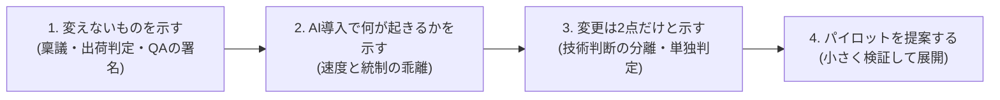

本プロジェクトの成果は、最終的に**各企業の品質管理部門・プロセス部門に提案し、承認を得て運用してもらう**ことを想定しています。このページは、そのための提案書テンプレートと進め方です。

## 提案の戦略: 「変えない」から入る

品質管理部門への提案で最も効くのは、**何を変えないかを最初に示す**ことです。統合プロセスは既存制度(稟議・決裁権限規程・出荷判定・第三者レビュー)を壊さない設計なので、提案書もその順で構成します。



## 提案書テンプレート

```markdown
# 開発プロセス改定の提案: AI協調型統合プロセスの導入

- 提案者: <氏名・部署> / 提案日: YYYY-MM-DD
- 承認をお願いする事項: 本提案書 §7

## 1. 要旨(1ページ)
- 生成AIの開発利用が進む中、現行プロセスのままでは「無統制な野良利用」か
  「統制優先でAIの価値を殺す」かの二択になりつつある
- 本提案は、既存の品質統制(出荷判定・第三者レビュー・決裁制度)を維持したまま、
  AI利用を統制下に置く開発プロセスの導入を提案する
- 既存制度への変更点は2点のみ(§4)

## 2. 現状の課題
- <自社の実態を記載: AI利用の現状(野良利用の有無)、承認リードタイム、
  レビュー負荷、技術負債の状況など。定量データがあれば添付>

## 3. 提案するプロセスの概要
- 外殻: 現行の決裁・出荷判定制度をそのまま使用(変更なし)
- 内側: AIが生成し人間が承認する協調ループ(仕様承認→AI実装→自動検証→独立レビュー)
- 全成果物に単一の人間の責任者(A)を割り当てる。AIは実行(R)のみで
  結果責任(A)を負わない
- 参照: <統合プロセス参照モデルの資料を添付>

## 4. 既存制度への変更点(2点のみ)
| # | 変更 | 理由 | 影響範囲 |
| --- | --- | --- | --- |
| 1 | 技術設計の判断を決裁階層から分離し、技術判断者(単独)へ委譲 | 決裁者の専門性と判断対象の乖離解消、滞留防止 | 対象案件の技術判断のみ。予算決裁は従来どおり |
| 2 | ゲート判定を合議から「単独判定+事前の非同期コメント」へ | 責任の一意化、判定の迅速化 | 対象案件のゲート運用のみ |

## 5. 品質統制の観点(品質管理部門への回答)
- 出荷判定: 現行どおり品質保証部門が第三者として署名する。判定材料は
  ゲート判定記録・品質レポート・負債台帳として様式化され、突合可能
- AI生成物の統制: 「作成指示者は承認不可」の独立レビューをシステムで強制。
  合意済みルールは自動検証(CI)で機械的に検査
- 監査対応: 全ゲートの判定記録が残り、AI生成箇所のトレーサビリティを維持
- 懸念と対策: <想定Q&Aを記載。例: レビュー形骸化→挙動要約の必須記載>

## 6. パイロット計画
- 対象: <1プロジェクト・3〜9名規模を推奨>
- 期間: <2〜3か月>
- 成功基準(事前に合意):
  - ゲート滞留時間: 現行の承認リードタイム比で悪化しない
  - 品質: 重大欠陥の流出 0 件
  - 記録: 全成果物に責任者が紐づき、判定記録の欠落 0 件
- 中止基準: <重大欠陥の流出、滞留の大幅悪化など>
- 計測: ゲート滞留時間・差し戻し率・レビュー所要時間を自動集計

## 7. 承認をお願いする事項
1. §4 の2点の変更を、パイロット対象案件に限り適用すること
2. パイロット結果の評価会(終了時)の設置
3. <必要な予算・体制があれば記載>
```

## 想定問答(提案時に必ず出る質問)

| 質問 | 回答の骨子 |
| --- | --- |
| AIが作ったコードの品質は誰が保証するのか | 承認した人間(独立レビュア・出荷判定者)。AIは結果責任を負わない設計で、責任の所在は現行より明確になる |
| レビューが形骸化しないか | 挙動要約の必須記載と、差し戻し率・レビュー所要時間の計測で検知する。差し戻し率0%を「良い状態」と見なさない |
| 単独判定は独断にならないか | 判定前の非同期コメント期間で関係者の意見を集める(根回しの構造化)。判定記録が残るため事後検証も可能 |
| 既存の出荷判定はどうなるか | 変わらない。むしろ判定材料が様式化され、突合しやすくなる |
| 失敗したらどうするか | パイロット限定・中止基準つき。従来プロセスへの切り戻しはいつでも可能 |

## 提案の進め方

1. **事前の非同期共有**: 提案書を関係者へ事前配布し、コメントを集めて反映する(このプロセス自体が「単独判定+非同期コメント」の実演になる)
2. **パイロットで実証**: 小さく始めて計測データで語る。成功基準は事前合意しておく
3. **展開時にテーラリング**: パイロット後の展開では[テーラリングガイド](/process-compass/phase4-process-design/tailoring-guide/)で部署ごとの条件に調整する

:::note
このテンプレートは汎用の雛形です。実際の提案では §2(現状の課題)に自社の定量データを入れることが説得力を左右します。承認リードタイム・レビュー負荷・AI利用実態の3つは、提案前に必ず測っておくことを推奨します。
:::
