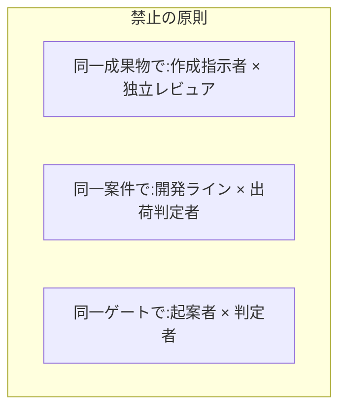

[統合プロセス参照モデル](/process-compass/processes/integrated/)の8ロールを、導入時にそのまま使える粒度まで詳細化します。要員計画・任命・兼務の判断はこのページを基準にします。

## 責任の種類: A と R を分ける

責任分担は RACI で表します。生成AI時代に重要なのは **A(結果責任)と R(実行)の分離**です。

- **A(Accountable)= 結果責任**: 成果の正しさに最終責任を負う。**各成果物に必ず1人だけ**(ギャップG2対応)
- **R(Responsible)= 実行**: 実際に作業する。**AIエージェントはRになれるが、Aには絶対になれない**
- **C(Consulted)= 事前相談**: 判定前の非同期コメントで意見を出す
- **I(Informed)= 事後共有**: 結果の共有を受ける

## RACI マトリクス(フェーズ × ロール)

| 作業 | 価値責任者 | 技術判断者 | 開発者(検証) | AI | 独立レビュア | QA | 事業決裁者 | 文脈オーナー |
| --- | --- | --- | --- | --- | --- | --- | --- | --- |
| 事業意図の言語化 | **A**/R | C | I | R | — | — | C | — |
| コンテキスト基盤整備 | C | C | R | R | — | — | — | **A**/R |
| 協働仕様化・受入基準 | **A** | C | R | R | — | C | — | C |
| 技術設計(ADR) | C | **A**/R | C | R | — | — | — | I |
| 機能仕様サイクル | **A** | C | C | R | — | — | — | — |
| 実装・テスト生成 | I | C | R | R | — | — | — | — |
| 挙動検証・理解記録 | I | C | **A**/R | — | — | — | — | — |
| 独立レビュー | I | I | — | — | **A**/R | I | — | — |
| 出荷判定 | I | I | I | R | — | **A**/R | I | — |
| リリース決裁 | C | I | — | — | — | C | **A**/R | — |
| 負債返却の計画 | **A** | C | R | R | — | I | I | — |
| 文脈への書き戻し | I | C | R | R | — | — | — | **A** |

読み方の要点は次のとおりです。

- どの行にも **A は1人だけ**。A が2人いる行を作ってはならない(責任分散の再発)
- **AI の列に A が存在しない**——これこそこの表の本質。AIはどれだけ実行(R)しても、結果責任は必ず人間に紐づく

## 任命基準

| ロール | 任命基準(何ができる人か) | 職位要件 |
| --- | --- | --- |
| 価値責任者 | 対象プロダクトの価値を語れ、優先順位を単独で決められる。決定権の委譲を組織から受けている | 不問(職位でなく権限委譲で決める) |
| 技術判断者 | 対象技術領域のトレードオフを評価でき、ADR を書ける | 不問(技術力量で決める) |
| 開発者(検証者) | AI生成コードを読み解き、挙動を自分の言葉で説明できる | 不問 |
| 独立レビュア | 開発者と同等の読解力。対象成果物の作成指示に関与していないこと | 不問 |
| QA(出荷判定者) | 品質記録と基準の突合ができる。開発ラインから独立していること | 既存のQA部門の任命規程どおり |
| 事業決裁者 | 既存の決裁権限規程どおり | 規程どおり(変更しない) |
| 文脈オーナー | 対象領域の規約・用語に責任を持てる。継続的に保守できる | 不問 |

## 兼務ルール(許可 / 禁止)

メンバーシップ型雇用の現実(兼務・異動が常態)を前提に、**禁止する組み合わせを最小限に絞って**明示します。それ以外の兼務は許可です。

| 組み合わせ | 可否 | 理由 |
| --- | --- | --- |
| 価値責任者 × 文脈オーナー | ○ | 小規模では自然な兼務 |
| 技術判断者 × 開発者 | ○ | 小規模では自然な兼務 |
| 価値責任者 × 技術判断者 | △(避けたい) | 価値と技術の相互チェックが消える。5名未満の体制のみ許容 |
| 作成指示者 × 独立レビュア(同一成果物) | **禁止** | 独立レビューの意味が消える(ブランチ保護で機械的に強制) |
| 開発ライン × 出荷判定者(同一案件) | **禁止** | 第三者判定の independence が崩れる |
| 事業決裁者 × 価値責任者 | △(避けたい) | 事業と価値の分離が消える。小規模のみ許容 |

**最小体制は3名**です(作成指示者・独立レビュア・出荷判定者の分離が下限)。3名未満の場合は独立レビューを外部(他チーム・他部門)へ依頼する運用にします。

## 委譲ルール

- 価値責任者は、機能単位の仕様承認(g-spec-cycle)を**機能責任者へ明示的に委譲できる**。委譲は文書(担当表)で行い、口頭では行わない
- **委譲しても結果責任(A)は価値責任者に残る**(スクラムガイドのPO原則と同型)
- 技術判断者は、定型的な技術選定(ライブラリ更新等)の判定を開発者へ委譲できる。アーキテクチャに影響する判断は委譲不可

## 異動・引き継ぎへの備え(日本文脈)

定期異動でロールの継続性が切れるのは前提として設計します。

- 引き継ぎの実体は**人ではなくコンテキスト基盤と判断記録(ADR)**に置く。後任は基盤を読めば判断の経緯を追える状態を保つ
- ロールの担当表(誰がどの成果物のAか)を常に最新に保ち、空席を作らない。担当表の保守は文脈オーナーの責務
- 兼務が変わったら禁止組み合わせに抵触しないかを担当表更新時に機械チェックする(フェーズ5で自動化)
