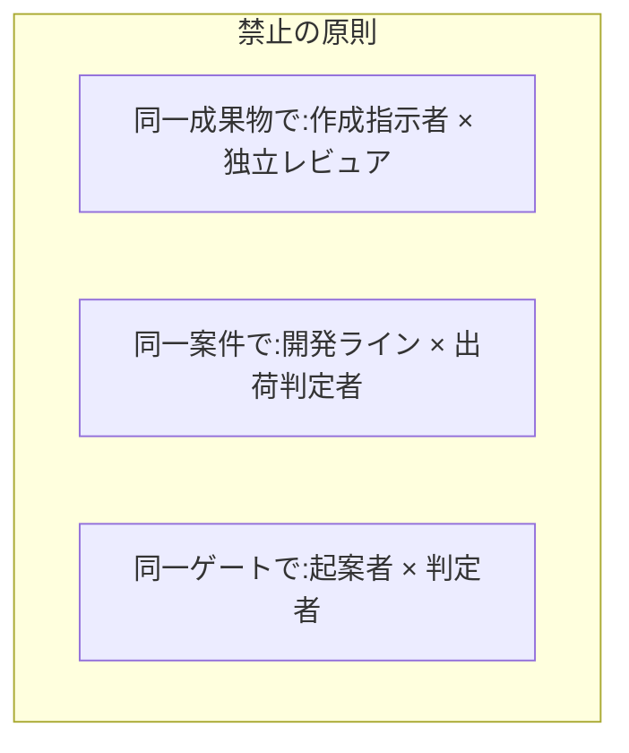
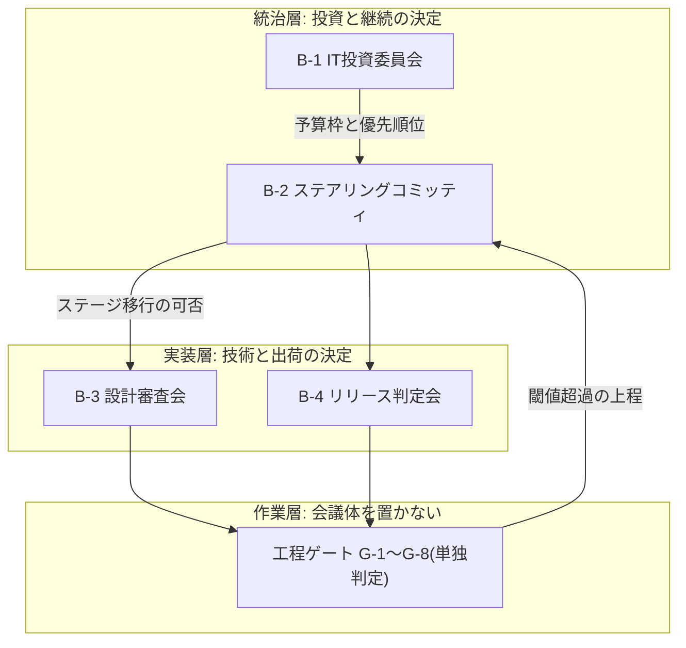
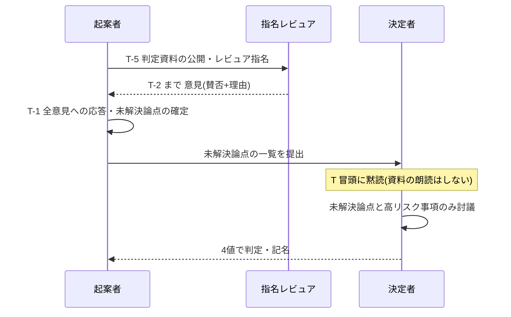

本章は、本標準を実施する体制を規定します。ロールの定義と責任の割当、ならびに決定を下す会議体とその決裁権限を対象とします。

## 3.1 本章が達成すべき成果

本章の要求事項を満たしたとき、次の成果が得られます。

- 各成果物に対する結果責任者が1名に特定されている
- 決定を下す場と、そこで扱う事項の範囲が明示されている
- 決定の重さに応じた決裁者が、金額とリスクの2軸で一意に定まる
- 決定の待ち時間が計測され、滞留が検知される

## 3.2 責任の種類: A と R を分ける

責任分担は RACI で表します。生成AI時代に重要なのは **A(結果責任)と R(実行)の分離**です。

- **A(Accountable)= 結果責任**: 成果の正しさに最終責任を負う。**各成果物に必ず1人だけ**
- **R(Responsible)= 実行**: 実際に作業する。**AIエージェントはRになれるが、Aには絶対になれない**
- **C(Consulted)= 事前相談**: 判定前の非同期コメントで意見を出す
- **I(Informed)= 事後共有**: 結果の共有を受ける

## 3.3 RACI マトリクス(作業 × ロール)

| 作業 | 価値責任者 | 技術判断者 | 開発者(検証) | AI | 独立レビュア | QA | 事業決裁者 | 文脈オーナー |
| --- | --- | --- | --- | --- | --- | --- | --- | --- |
| 事業意図の言語化 | **A**/R | C | I | R | — | — | C | — |
| コンテキスト基盤整備 | C | C | R | R | — | — | — | **A**/R |
| 協働仕様化・受入基準 | **A** | C | R | R | — | C | — | C |
| 技術設計(ADR) | C | **A**/R | C | R | — | — | — | I |
| 機能仕様サイクル | **A** | C | C | R | — | — | — | — |
| 実装・テスト生成 | I | C | R | R | — | — | — | — |
| 挙動検証・理解記録 | I | C | **A**/R | — | — | — | — | — |
| 独立レビュー | I | I | — | — | **A**/R | I | — | — |
| 出荷判定 | I | I | I | R | — | **A**/R | I | — |
| リリース決裁 | C | I | — | — | — | C | **A**/R | — |
| 負債返却の計画 | **A** | C | R | R | — | I | I | — |
| 文脈への書き戻し | I | C | R | R | — | — | — | **A** |

読み方の要点は次のとおりです。

- どの行にも **A は1人だけ**。A が2人いる行を作ってはならない
- **AI の列に A が存在しない**。AIはどれだけ実行(R)しても、結果責任は必ず人間に紐づく

## 3.4 任命基準

| ロール | 任命基準(何ができる人か) | 職位要件 |
| --- | --- | --- |
| 価値責任者 | 対象プロダクトの価値を語れ、優先順位を単独で決められる。決定権の委譲を組織から受けている | 不問(職位でなく権限委譲で決める) |
| 技術判断者 | 対象技術領域のトレードオフを評価でき、ADR を書ける | 不問(技術力量で決める) |
| 開発者(検証者) | AI生成コードを読み解き、挙動を自分の言葉で説明できる | 不問 |
| 独立レビュア | 開発者と同等の読解力。対象成果物の作成指示に関与していないこと | 不問 |
| QA(出荷判定者) | 品質記録と基準の突合ができる。開発ラインから独立していること | 既存のQA部門の任命規程どおり |
| 事業決裁者 | 既存の決裁権限規程どおり | 規程どおり(変更しない) |
| 文脈オーナー | 対象領域の規約・用語に責任を持てる。継続的に保守できる | 不問 |

## 3.5 兼務ルール(許可 / 禁止)

兼務と異動が常態である組織を前提に、**禁止する組み合わせを最小限に絞って**明示します。それ以外の兼務は許可です。

```mermaid
graph TD
  subgraph 禁止の原則
    X1["同一成果物で:作成指示者 × 独立レビュア"]
    X2["同一案件で:開発ライン × 出荷判定者"]
    X3["同一ゲートで:起案者 × 判定者"]
  end
```

| 組み合わせ | 可否 | 理由 |
| --- | --- | --- |
| 価値責任者 × 文脈オーナー | ○ | 小規模では自然な兼務 |
| 技術判断者 × 開発者 | ○ | 小規模では自然な兼務 |
| 価値責任者 × 技術判断者 | △(避けたい) | 価値と技術の相互チェックが消える。5名未満の体制のみ許容 |
| 作成指示者 × 独立レビュア(同一成果物) | **禁止** | 独立レビューの意味が消える(ブランチ保護で機械的に強制) |
| 開発ライン × 出荷判定者(同一案件) | **禁止** | 第三者判定の独立性が崩れる |
| 事業決裁者 × 価値責任者 | △(避けたい) | 事業と価値の分離が消える。小規模のみ許容 |

**最小体制は3名**です(作成指示者・独立レビュア・出荷判定者の分離が下限)。3名未満の場合は独立レビューを外部(他チーム・他部門)へ依頼する運用にします。

## 3.6 委譲ルール

- 価値責任者は、機能単位の仕様承認(G-4)を**機能責任者へ明示的に委譲できる**。委譲は文書(担当表)で行い、口頭では行わない
- **委譲しても結果責任(A)は価値責任者に残る**
- 技術判断者は、定型的な技術選定(ライブラリ更新等)の判定を開発者へ委譲できる。アーキテクチャに影響する判断は委譲不可

## 3.7 会議体

### 3.7.1 会議体を置く階層

決定の場は3階層に分かれます。上位ほど扱う決定の不可逆性が高く、開催頻度は低くなります。

```mermaid
graph TD
  subgraph 統治層["統治層: 投資と継続の決定"]
    B1["B-1 IT投資委員会"]
    B2["B-2 ステアリングコミッティ"]
  end
  subgraph 実装層["実装層: 技術と出荷の決定"]
    B3["B-3 設計審査会"]
    B4["B-4 リリース判定会"]
  end
  subgraph 作業層["作業層: 会議体を置かない"]
    W["工程ゲート G-1〜G-8(単独判定)"]
  end
  B1 -->|予算枠と優先順位| B2
  B2 -->|ステージ移行の可否| B3
  B2 --> B4
  B3 --> W
  B4 --> W
  W -->|閾値超過の上程| B2
```

作業層に会議体を置かないことが本標準の基本方針です。工程ゲート(G-1〜G-8)は単独判定であり、判定会議を開きません([第4章](/process-compass/phase4-process-design/gate-criteria/))。承認のために独立した委員会を通す運用は、変更失敗率を下げない一方で、変更のリードタイムと復旧時間を悪化させることが大規模調査で報告されています(DORA、2019年)。

### 3.7.2 4つの会議体

| 記号 | 会議体 | 階層 | 扱う決定 | 接続するゲート |
| --- | --- | --- | --- | --- |
| B-1 | IT投資委員会 | 統治層 | 案件の採否、予算枠の配賦、案件間の優先順位、中止 | G-1 |
| B-2 | ステアリングコミッティ | 統治層 | 事業ステージの移行可否、閾値を超えた逸脱の裁定 | SG-0 / SG-1 / SG-2 |
| B-3 | 設計審査会 | 実装層 | 部門をまたぐ設計の要求適合性 | G-3(補完) |
| B-4 | リリース判定会 | 実装層 | 変更のリスク区分の規則、標準変更カタログの維持 | G-8(補完) |

B-3 と B-4 は工程ゲートを**置き換えません**。工程ゲートの単独判定はそのまま維持し、単独判定者の権限を超える事項のみを会議体が扱います。

### 3.7.3 判定の語彙

すべての会議体は、次の4値のいずれかで判定しなければなりません。判定を保留したまま次回へ持ち越す運用を認めません。

| 判定 | 意味 | 判定と同時に確定させる事項 |
| --- | --- | --- |
| 継続 | 次段階へ進める | 次段階の予算・要員・期間、次回の判定日 |
| 中止 | 案件を終了する | 資産の扱い、要員の再配置先、記録の保管 |
| 保留 | 進めないが終了もしない | 保留を解く条件、再判定の期限 |
| 差し戻し | 条件を付して前段階へ戻す | 満たすべき条件、再提出の期限 |

「継続」の判定に次段階の資源配分と次回判定日を含めることを要求します。この2点を欠いた継続は、判定ではなく先送りです。

「保留」には必ず解除条件と再判定期限を付けます。期限のない保留は、記録上は生存しているが誰も進めない案件を生みます。

:::note
[第2章 2.4](/process-compass/phase4-process-design/lifecycle/)のステージ移行ゲートに示した「移行 / 継続検証 / 中止」は、本節の語彙では「継続 / 保留 / 中止」に対応します。ステージ移行ゲートでは差し戻しを用いません。前段階が存在しないためです。
:::

### 3.7.4 各会議体の規定

#### B-1 IT投資委員会

| 項目 | 内容 |
| --- | --- |
| 目的 | 案件を横断して投資枠を配分し、実施しない案件を決める |
| 決定する事項 | 案件の採否、年度および四半期の予算枠、案件間の優先順位、中止 |
| 決定しない事項 | 個別案件の技術選択、仕様の内容、要員の日々の割当 |
| 決定者(A) | 既存の決裁権限規程に定める投資決裁者。1名 |
| 意見(C) | 価値責任者、技術判断者、品質保証部門、財務部門 |
| 開催 | 四半期ごとの定例、および上程による臨時 |
| 判定期限 | 上程から10営業日以内 |
| 記録 | 判定記録、配分した予算枠、次回判定日 |

#### B-2 ステアリングコミッティ

| 項目 | 内容 |
| --- | --- |
| 目的 | 個別案件の進行を監視し、ステージ移行と逸脱への対処を決める |
| 決定する事項 | SG-0〜SG-2 の判定、[第7章 7.6](/process-compass/phase4-process-design/exception-escalation/)の段階3に達した逸脱の裁定、案件内の予算・要員の再配分 |
| 決定しない事項 | 工程ゲート(G-1〜G-8)の判定、技術設計の良否 |
| 決定者(A) | 事業決裁者。1名 |
| 意見(C) | 価値責任者、技術判断者、QA、AI維持管理の担当部門 |
| 開催 | 月次の定例、および上程による臨時 |
| 判定期限 | 上程から5営業日以内 |
| 記録 | 判定記録、変更した計画、次回判定日 |

#### B-3 設計審査会

| 項目 | 内容 |
| --- | --- |
| 目的 | 単独の技術判断者では判定できない、部門をまたぐ設計の適合性を審査する |
| 決定する事項 | 複数部門の要求に影響する設計の採否、外部インタフェースの確定、安全・法規制に関わる設計の適合性 |
| 決定しない事項 | 実装の良否(G-6 の対象)、テスト結果の合否(G-7 の対象) |
| 決定者(A) | 技術判断者。1名 |
| 意見(C) | 関係部門の技術担当、品質保証部門、運用部門 |
| 開催 | 対象設計が確定した時点。定例を待たない |
| 判定期限 | 提出から5営業日以内 |
| 適用条件 | S2 スケール、または安全・法規制の対象となる機能。それ以外は G-3 の単独判定で足りる |

設計審査会に検証結果の読み合わせをさせてはなりません。検証(テストによる要求充足の確認)は工程ゲートの対象であり、本会議体が扱うのは審査(設計が要求を満たすかの評価)です。この区別を失うと、会議体は資料の朗読の場になります。

#### B-4 リリース判定会

| 項目 | 内容 |
| --- | --- |
| 目的 | 変更の区分規則を定め、会議体を通さずに出せる変更の範囲を維持する |
| 決定する事項 | 変更のリスク区分の判定規則、標準変更カタログへの登録と削除、重大変更の実施可否、Sev1 事象後の是正確認 |
| 決定しない事項 | 標準変更および通常変更の個別の可否 |
| 決定者(A) | QA(出荷判定者)。1名 |
| 意見(C) | 運用部門、セキュリティ部門、価値責任者 |
| 開催 | 月次の定例 |
| 判定期限 | 重大変更は上程から3営業日以内 |

変更は3区分で扱います。すべての変更を同一の経路に通すと、リスクの差に応じた速度差が失われます。

| 区分 | 定義 | 承認の経路 |
| --- | --- | --- |
| 標準変更 | カタログに登録済みで、手順とロールバック手段が確立した反復的な変更 | 事前承認済み。G-5 の通過をもって実施可 |
| 通常変更 | 標準にも重大にも該当しない変更 | G-7 および G-8 の単独判定 |
| 重大変更 | リスク区分 R1(3.8.1)に該当する変更 | B-4 の判定 |

**標準変更カタログを育てることが B-4 の主たる仕事**です。会議体の価値は、通す変更の数ではなく、通さずに済ませられる変更の範囲で測ります。

### 3.7.5 会議体に持ち込んではならない事項

- 会議体は、3.7.4 の「決定する事項」に列挙した事項のみを扱う。列挙外の事項を議題としてはならない
- 判定を要しない報告のみの議題を、定例の議題としてはならない。報告は非同期の記録で行う
- 工程ゲートの判定を会議体へ持ち込んではならない。判定者の帯域が不足する場合は、[第7章 7.5](/process-compass/phase4-process-design/exception-escalation/)の措置(委譲・機械化・分割)による

## 3.8 決裁権限マトリクス

### 3.8.1 リスク区分

金額のみで決裁者を決めてはなりません。少額でも取り消せない決定が存在するためです。リスクは次の3区分とし、観測可能な条件で判定します。

| 区分 | 該当条件(いずれかに該当すれば当該区分) |
| --- | --- |
| R1 | 外部との契約・公開インタフェース・データ形式を変更し、取り消しに相手方の同意を要する。認証・認可・個人データの取扱いに影響する。事業継続に影響する |
| R2 | 取り消しに人手の作業を要するが、自組織の判断のみで戻せる。限定した実利用者に影響する |
| R3 | 取り消しが自動化された手段で完結する。影響が組織内に留まる |

区分の判定材料は観測可能な事実に限るため、AIエージェントが草案を作成できます。確定は人間が行います。

### 3.8.2 決裁者の割当

決裁者は、金額区分とリスク区分の交点で一意に定まります。表の値は初期値です。

| リスク \ 金額 | 区分I(小) | 区分II(中) | 区分III(大) |
| --- | --- | --- | --- |
| R3 | 技術判断者 | 価値責任者 | B-2 |
| R2 | 価値責任者 | B-2 | B-2 |
| R1 | B-2 | B-1 | B-1 |

金額区分I・II・IIIの境界額は、本標準では定めません。既存の決裁権限規程に定める境界額をそのまま用い、企画承認(G-1)の時点で案件ごとに記録しなければなりません。既存規程と別の金額体系を新設することを禁止します。二重の権限体系は、どちらに従うかの解釈を現場に委ねる結果を生みます。

### 3.8.3 起案・意見・決定の分離

各決定について、次の3つの役割を分けて記録します。

| 役割 | 内容 | 人数 |
| --- | --- | --- |
| 起案 | 提案文書を作成し、上程する | 1名 |
| 意見 | 期限までに賛否と理由を述べる | 複数 |
| 決定 | 判定を下し、記名する | **1名** |

意見を述べた者は決定者ではありません。意見の数によって決定を導く運用(実質的な多数決)を認めません。決定者が1名であることは、[第7章](/process-compass/phase4-process-design/exception-escalation/)の例外承認における記名要件と同じ原則です。

## 3.9 会議体の運用規律

### 3.9.1 判定期限の起算

判定期限は**定例の開催日ではなく、上程の受理日から起算**します。定例を起算点にすると、開催直後に上程された案件の待ち時間が1周期分伸び、期限が形骸化します。

### 3.9.2 定例を待てない場合の措置

判定期限内に定例が開催されない場合は、持ち回り決議を用います。

- 持ち回り決議は、決定者の記名による非同期の承認とし、意見期間を明示する
- **リスク区分 R1 の決定に持ち回り決議を用いてはならない**。取り消せない決定は、意見の相互参照が成立する場で判定する
- 持ち回り決議の結果は、次回の定例で報告する

### 3.9.3 期限を超過した場合

判定期限の超過を自動承認としてはなりません。[第7章 7.5](/process-compass/phase4-process-design/exception-escalation/)の措置を適用し、決定者の上位へ通知したうえで代理の決定者を指名します。

### 3.9.4 会議体の健全性指標

会議体が機能しているかを、次の指標で継続計測します。計測と改善の運用は[フェーズ6](/process-compass/phase6-operation/overview/)に規定します。

| 指標 | 何が分かるか | 警戒サイン |
| --- | --- | --- |
| 上程から判定までの日数 | 会議体が滞留点になっていないか | 期限超過率が10%を超える |
| 判定に占める中止・差し戻しの比率 | 判定が実質を伴っているか | 0%が続く(=素通しの疑い) |
| 議題に占める報告のみの比率 | 会議体が報告の場に転じていないか | 増加が続く |
| 持ち回り決議の比率 | 定例の頻度が実態に合っているか | 半数を超える(=開催周期の見直し) |
| 標準変更カタログの登録件数(B-4) | 会議体を通さない経路が育っているか | 増加が止まる |

中止・差し戻しが一度も出ない会議体は、判定の場ではなく通過点です。この状態が続く場合、会議体の廃止または判定基準の見直しを検討します。

## 3.10 事前レビュー期間

会議体の判定は、当日に議論を始めるのではなく、**公開された期限までに非同期で意見を集め終えた状態**から始めます。日本の組織では、会議の前に関係者へ個別に説明し合意を作る調整が実務として広く行われています。この調整は記録に残らず、参加できなかった者には見えません。本節は、この事前調整を期限と記録を伴う正規の手続として規定します。

### 3.10.1 適用範囲

- B-1〜B-4 の全ての上程に適用する
- 工程ゲート(G-1〜G-8)にも同じ様式を適用する。工程ゲートでは判定会議を開かないため、非同期コメント期間のみを設ける
- 標準変更(3.7.4)には適用しない。事前承認済みの経路であるため

### 3.10.2 期間の構成

判定日を T とし、次の時点を定めます。

| 時点 | 行為 | 責任者 |
| --- | --- | --- |
| T−5営業日 | 判定資料を公開し、意見を求めるレビュアを記名で指名する | 起案者 |
| T−2営業日 | 意見の受付を締め切る | 指名レビュア |
| T−1営業日 | 全ての意見に応答を記載し、未解決論点の一覧を確定する | 起案者 |
| T | 黙読、未解決論点の討議、判定 | 決定者 |

リスク区分 R1(3.8.1)の案件は、T−10営業日の公開・T−5営業日の締切とします。取り消せない決定には、意見を出す側の検討時間を確保する必要があるためです。

期間を短縮できるのは、[第7章 7.4](/process-compass/phase4-process-design/exception-escalation/)のファストトラックを適用した場合に限ります。

### 3.10.3 判定資料の要求事項

判定資料は次を含まなければなりません。AIエージェントが草案を生成し、起案者が確定します。

| # | 記載事項 |
| --- | --- |
| 1 | 判定基準の項目ごとの充足状況(充足・未充足・該当なし) |
| 2 | 未解決の論点と、それぞれの現時点の扱い |
| 3 | 自動検査が検出した高リスク事項(認証・認可・個人データ・不可逆な変更・基準の逸脱) |
| 4 | リスク区分(R1〜R3)の判定と、その根拠となる事実 |
| 5 | 決定者に求める判断の明示 |

**経緯の記述を評価対象としません**。判定に必要なのは現在の状態と選択肢です。

### 3.10.4 意見の様式

- 意見は賛否と理由をあわせて記載する。**理由のない反対は意見として扱わない**
- 反対には、代替案または充足すべき条件のいずれかを添える
- 1つの論点につき1つのスレッドを立てる。複数論点を1つのスレッドに混ぜない
- 起案者は全ての意見へ応答を記載する。意見を採用しない場合も、採用しない理由を残す

論点を小さく分割することを要求するのは、判断の対象が大きいほどレビューの質が下がるという実証結果があるためです。承認者の人数を増やしても、この劣化は補えません。

### 3.10.5 期限までに意見がない場合の扱い

意見がないことをどう扱うかは、決定の取り消し可能性によって変えます。

| リスク区分 | 期限までに意見がない場合 |
| --- | --- |
| R3 | 異議なしとみなして判定へ進む |
| R2 | 異議なしとみなして判定へ進む。指名レビュアの不応答を記録する |
| R1 | 判定へ進めない。指名レビュア全員の記名による応答(賛否いずれか)を必須とする |

R1 で応答が揃わない場合は、3.9.3 の措置(決定者の上位への通知と代理の指名)を適用します。取り消せない決定について、沈黙を同意と読み替えてはなりません。

### 3.10.6 意見を出さなかった者の責任

- 期限までに意見を出さなかった者は、判定の後にその論点を理由として差し戻しを要求できない
- ただし、判定の後に新たに判明した事実に基づく場合は、この制限を適用しない
- 指名レビュアの応答率を記録し、継続して応答がない場合は指名を見直す。応答しない者を指名し続ける運用は、レビューを経た外形だけを作る

この規定を置かない場合、期間中は沈黙し、判定の後に異議を述べる行動が有利になります。その結果、事前レビュー期間そのものが使われなくなります。

### 3.10.7 判定当日の進め方

```mermaid
sequenceDiagram
  participant P as 起案者
  participant R as 指名レビュア
  participant D as 決定者
  P->>R: T-5 判定資料の公開・レビュア指名
  R-->>P: T-2 まで 意見(賛否+理由)
  P->>P: T-1 全意見への応答・未解決論点の確定
  P->>D: 未解決論点の一覧を提出
  Note over D: T 冒頭に黙読(資料の朗読はしない)
  D->>D: 未解決論点と高リスク事項のみ討議
  D-->>P: 4値で判定・記名
```

- 冒頭に資料の黙読時間を置く。**資料の読み上げを議事に含めてはならない**
- 議題は未解決論点と高リスク事項に限る。事前レビュー期間で解決した事項を再度扱わない
- 期限までに解消しなかった対立は、決定者が判定によって決める。合意の成立を待たない
- 判定に異議を述べた者も、判定の後はその決定に従って実行する

意見が一致するまで議論を続ける運用は、最も長く主張を続けた者の案が通る結果を招きます。決定者を1名に定める(3.8.3)のは、この帰結を避けるためです。

### 3.10.8 形骸化の検知

事前レビュー期間が機能しているかを、次の指標で計測します。

| 指標 | 何が分かるか | 警戒サイン |
| --- | --- | --- |
| 事前意見が0件の上程の比率 | レビューが行われているか | 増加が続く |
| 判定当日に初めて出た論点の比率 | 事前レビュー期間が使われているか | 高い(=事前に読まれていない) |
| 指名レビュアの応答率 | 指名が実態に合っているか | 低下が続く |
| 資料公開から判定までの日数 | 期間の短縮が常態化していないか | 規定日数を下回る事例が続く |
| 起案者の応答が付いていない意見の比率 | 意見が処理されているか | 0%より大きい状態が続く |

## 3.11 異動・引き継ぎへの備え

定期異動でロールの継続性が切れるのは前提として設計します。

- 引き継ぎの実体は**人ではなくコンテキスト基盤と判断記録(ADR)**に置く。後任は基盤を読めば判断の経緯を追える状態を保つ
- ロールの担当表(誰がどの成果物のAか)を常に最新に保ち、空席を作らない。担当表の保守は文脈オーナーの責務
- 兼務が変わったら禁止組み合わせに抵触しないかを担当表更新時に機械チェックする(フェーズ5で自動化)

## 3.12 関連する章

- 工程ゲートの判定基準および期限は[第4章](/process-compass/phase4-process-design/gate-criteria/)に規定する
- ステージ移行ゲートの判定基準は[第2章](/process-compass/phase4-process-design/lifecycle/)に規定する
- 逸脱の上程基準および例外承認の手続は[第7章](/process-compass/phase4-process-design/exception-escalation/)に規定する
- 会議体の削減・統合はテーラリング([第8章](/process-compass/phase4-process-design/tailoring-guide/))の対象とする
- 事前レビュー期間を Git・チケット上で強制する方法は[フェーズ5(事前レビュー期間の自動化)](/process-compass/phase5-implementation/pre-review-automation/)に規定する
