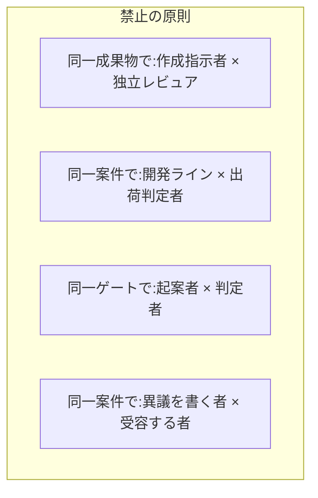
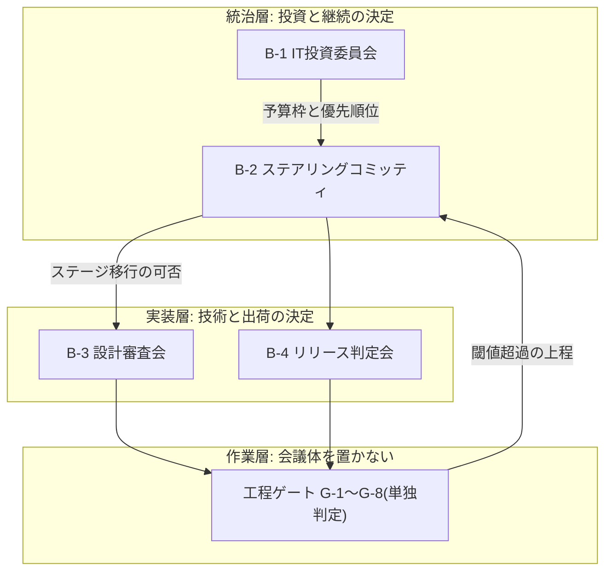
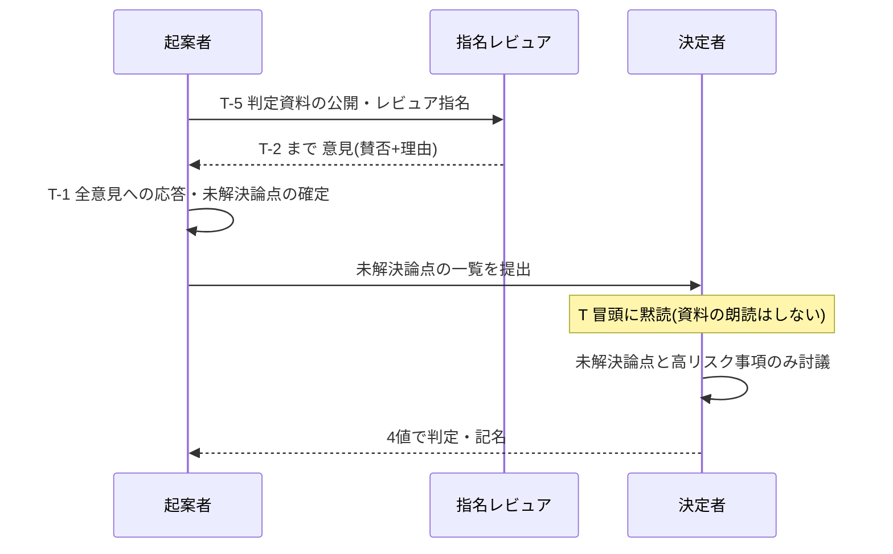
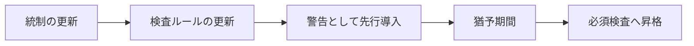

本章は、本標準を実施する体制を規定します。ロールの定義と責任の割当、ならびに決定を下す会議体とその決裁権限を対象とします。

## 3.1 本章が達成すべき成果

本章の要求事項を満たしたとき、次の成果が得られます。

- 各成果物に対する結果責任者が1名に特定されている
- 決定を下す場と、そこで扱う事項の範囲が明示されている
- 決定の重さに応じた決裁者が、金額とリスクの2軸で一意に定まる
- 決定の待ち時間が計測され、滞留が検知される

## 3.2 責任の種類: A と R を分ける

責任分担は RACI で表します。生成AI時代に重要なのは **A(結果責任)と R(実行)の分離**です。

- **A(Accountable)= 結果責任**: 成果の正しさに最終責任を負う。**各成果物に必ず1人だけ**。A は責任者を指す
- **R(Responsible)= 実行**: 実際に作業する。**AIエージェントは担い手として R になれるが、A には絶対になれない**
- **C(Consulted)= 事前相談**: 判定前の非同期コメントで意見を出す
- **I(Informed)= 事後共有**: 結果の共有を受ける

A と R の分離は、ロール(席)に置く人と実行主体の区別に対応します。

- **責任者**: 席の結果責任(A)を負う記名の自然人。席ごとに1名
- **担い手**: 席の作業を実際に行う実行主体。人、または AI の実行主体の文脈

本章は「ロール」を主に用い、責任者・担い手と対で述べるときに「席」を用います。AI を担い手に置いても、責任者は変わりません。**AI を責任者にしてはなりません**。

席の作業を複数の人で担う場合(開発者5名、独立レビュア2名など)も、席の責任者は席ごとに1名です。成果物ごとの結果責任者は、担当表(D-0 体制図)で1名に定めます。責任者でない担い手(人)の増減・交代を体制の変化点に数える条件は、3.13.1 によります。

担い手の運用形態(人確定・協働・委任)と、判断を確定する担い手の上限は、[第5章 5.5](/process-compass/phase4-process-design/human-ai-boundary/)によります。判断の根拠は[ADR-0054](/process-compass/adr/0054-seat-accountable-performer/)によります。

## 3.3 RACI マトリクス(作業 × ロール)

| 作業 | 価値責任者 | 技術判断者 | 開発者(検証) | AI | 独立レビュア | QA | 事業決裁者 | 文脈オーナー |
| --- | --- | --- | --- | --- | --- | --- | --- | --- |
| 事業意図の言語化 | **A**/R | C | I | R | — | — | C | — |
| コンテキスト基盤整備 | C | C | R | R | — | — | — | **A**/R |
| 協働仕様化・受入基準 | **A** | C | R | R | — | C | — | C |
| 技術設計(ADR) | C | **A**/R | C | R | — | — | — | I |
| 機能仕様サイクル | **A** | C | C | R | — | — | — | — |
| 実装・テスト生成 | I | C | **A**/R | R | — | — | — | — |
| 挙動検証・理解記録 | I | C | **A**/R | — | — | — | — | — |
| 独立レビュー | I | I | — | — | **A**/R | I | — | — |
| 出荷判定 | I | I | I | R | — | **A**/R | I | — |
| リリース決裁 | C | I | — | — | — | C | **A**/R | — |
| 負債返却の計画 | **A** | C | R | R | — | I | I | — |
| 文脈への書き戻し | I | C | R | R | — | — | — | **A** |

読み方の要点は次のとおりです。

- どの行にも **A は1人だけ**。A が2人いる行を作ってはならない。A を欠く行も作ってはならない
- **AI の列に A が存在しない**。AI の列が示すのは、担い手としての R である。AI がどれだけ実行(R)しても、結果責任は必ず責任者(人間)に紐づく

## 3.4 任命基準

| ロール | 任命基準(何ができる人か) | 職位要件 |
| --- | --- | --- |
| 価値責任者 | 対象プロダクトの価値を語れ、優先順位を単独で決められる。決定権の委譲を組織から受けている。顧客接点を持つ、または価値仮説の検証を設計し発注できる | 不問(職位でなく権限委譲で決める) |
| 技術判断者 | 対象技術領域のトレードオフを評価でき、ADR を書ける | 不問(技術力量で決める) |
| 開発者(検証者) | AI生成コードを読み解き、挙動を自分の言葉で説明できる | 不問 |
| 独立レビュア | 開発者と同等の読解力。対象成果物の作成指示に関与していないこと | 不問 |
| QA(出荷判定者) | 品質記録と基準の突合ができる。開発ラインから独立していること | 既存のQA部門の任命規程どおり |
| 事業決裁者 | 既存の決裁権限規程どおり | 規程どおり(変更しない) |
| 文脈オーナー | 対象領域の規約・用語に責任を持てる。継続的に保守できる | 不問 |
| AI維持管理者 | 対象リポジトリの規約と設計標準を理解し、指示資産の記述と実際の挙動の一致を検証できる | 不問 |
| AI運用担当者 | AI 実行基盤の構成・費用・統制要件を理解し、全社の規程と開発ラインを接続できる | 全社の統制部門の任命規程どおり |

価値責任者に顧客接点または検証の設計・発注の能力を求めるのは、[ADR-0031](/process-compass/adr/0031-market-hypothesis-by-structure-not-fields/)の決定2 によります。価値責任者は 3.3 の RACI で「事業意図の言語化」の A/R を持ちます。しかし従来の任命基準は価値を語る能力と決定権のみを問い、**その価値の前提を確かめる手段の保有を問うていませんでした**。検証の設計と発注のいずれもできない者を任命すると、企画書の記述は確かめられないまま残ります。

### 3.4.1 任命基準の充足をどう確認するか

上表の基準は「何ができる人か」で書かれています。**できることの確認手続を持たない任命基準は、実質的に無条件の任命です**。本節は確認の手続を規定します。

| # | 要求事項 |
| --- | --- |
| 1 | ロールへの任命に先立ち、任命基準の充足を確認し記録する |
| 2 | 確認は、**実務の成果物または実務に相当する演習の記録**によって行う |
| 3 | 確認の記録には、判定者・判定日・用いた成果物・判定結果を含める |
| 4 | 確認を経ない任命は、期限付きの暫定任命に限る(下記) |
| 5 | 確認の有効期間を定める。無期限としない |

#### 確認に用いるもの

**筆記試験を確認の主たる手段としません**。本標準がロールへ求めるのは知識ではなく判断であり、判断は成果物にしか表れないためです。

| ロール | 確認に用いる成果物 |
| --- | --- |
| 開発者(検証者) | AI生成コードに対する挙動要約([附属書E](/process-compass/phase4-process-design/developer-guide/)の書式)。第三者が読んで、実装と一致することを検証できる水準にあるか |
| 独立レビュア | 実際の差し戻し記録。指摘が基準の項目番号で示されているか、指摘の妥当性が第三者に追えるか |
| 技術判断者 | 執筆した ADR。選択肢の比較と却下理由が書かれているか |
| 価値責任者 | 判定の記録。4値のいずれで判定し、理由をどう書いたか。あわせて、過去に実施した顧客ヒアリングまたは調査の記録。誰に何を確かめ、結果を価値の記述へどう反映したか |
| QA(出荷判定者) | 判定記録と基準の突合の記録。突合の網羅と、疑義の扱い |
| 文脈オーナー | 保守した恒久層コンテキストの差分。記述と実際の挙動の一致 |
| AI維持管理者 | 指示資産の検証記録。記述と実際の挙動の不一致を検出できているか |

#### 暫定任命

確認の手続は、任命を止める仕組みではありません。**確認が済むまで任命できない運用は、現場を停止させます**。

- 確認を経ない任命を、**期間を定めた暫定任命として認める**
- 暫定任命の期間は組織が定める。定めない暫定任命を認めない
- 暫定任命の期間中、当該ロールの判定は単独で確定させない。確認済みの者による併記を求める
- 確認済みの者による併記を置けない場合は、その判定を未達として表示する。併記のない判定を、成立した判定として表示しない
- 期間内に確認へ至らない場合、任命を解くか、期間の延長を記録して決裁する

#### 有効期間を置く理由

AI生成コードの読解に必要な能力は、モデルの世代交代によって変わります。**2年前の確認記録は、現在の能力を保証しません**。

有効期間は組織が定めます。本標準は値を規定しません。期間の設定にあたっては、確認の手続そのものの改訂(用いる成果物・判定の観点)を同時に行います。期間だけを更新し、確認の中身を据え置く運用は形骸化します。

#### 教育の対象範囲

**本標準はロールに任命される者への教育を要求します。組織の全構成員への一律の教育を要求しません**。

| 対象 | 求める水準 |
| --- | --- |
| ロールに任命される者 | 上表の確認を通過する水準 |
| 業務でAIを利用する者(ロール任命の有無を問わない) | 統制の遵守([第5章](/process-compass/phase4-process-design/human-ai-boundary/)の役割境界、機密の取り扱い、知財の取り扱い) |
| 上記のいずれにも該当しない者 | 本標準は教育を要求しない |

第2区分の内容を、第1区分の内容と混ぜてはなりません。混ぜると、AIを利用しない者にも実装の読解を教えることになり、費用が水準に見合わなくなります。段階別の内容は[フェーズ5の社会実装計画](/process-compass/phase5-implementation/enablement/)に規定します。

### 3.4.2 AI を担い手に置くときの適合性確認

3.4.1 は、人をロールへ任命するときの確認です。AI を担い手に置くときは、その対応物として担い手の**適合性確認**を求めます。AI に「任命」の語を用いません。任命は結果責任(A)を含意し、3.2 と衝突するためです。担い手が AI であっても、責任者は記名の自然人のままです。

3.12.3 のモデルの適合性評価は、全社のモデル単位の評価です。当該の席の判断を担えるかは確かめていません。本節は席の単位で確かめます。3.12.3 を通過していないモデルは、本節の確認の対象にできません。

| # | 要求事項 |
| --- | --- |
| 1 | 確認の単位は**担い手の識別**とする。担い手の識別は、モデルの版・指示資産の版・権限の組である |
| 2 | 確認には、当該の席で人が確定した過去の判定の再現と、欠陥注入による検出の記録([第5章 5.6.2](/process-compass/phase4-process-design/human-ai-boundary/))を用いる |
| 3 | ペルソナや席名の付与を、確認に数えない |
| 4 | 実施は AI維持管理者が行い、承認は席の責任者が行う。承認は人が確定する |
| 5 | 確認の記録には、実施者・承認者・実施日・担い手の識別・用いた事例・結果を含める |
| 6 | 確認を経ない担い手は、運用形態の上限を協働とする。単独で確定させない |
| 7 | 確認は、担い手の識別が変わった時点で失効する(3.13.1 の変化点4)。失効した担い手は、再確認まで要求事項6 による |
| 8 | 確認の日付・確認した担い手の識別・失効後の再確認の期日を、D-0 体制図へ記載する |
| 9 | 承認は、承認した席の責任者が交代した時点で失効する。離脱を含む。**承認を、新しい責任者へ引き継がない**。新しい責任者が承認し直すまで、要求事項6 による |

失効の契機は、期間ではなく担い手の識別の変化とします。これは、確認の記録(事例と結果)の失効についての定めです。承認の失効は、別の契機です(要求事項9)。

| 失効するもの | 契機 | 戻すために要ること |
| --- | --- | --- |
| 確認の記録 | 担い手の識別の変化 | 新しい識別について、確認を実施し直す。承認も要る |
| 承認 | 承認した席の責任者の交代(離脱を含む) | 新しい責任者が、既存の確認の記録を読んで承認し直す。担い手の識別が変わっていなければ、確認の再実施は要しない |

承認を引き継がない理由は、結果責任を負う者が受け入れていない担い手を、委任で動かさないためです。どちらの失効も厳しくする向きであり、即時に適用します。責任者の交代と離脱の変化点を、承認者であることを理由に止めません(3.13.3)。

担い手の識別を変える前に、新しい識別について確認を済ませておく運用を妨げません。次の4つをすべて満たす場合は、協働へ下げずに切り替えられます。1つでも欠ければ、協働へ下げます。

| # | 協働へ下げずに切り替える条件 |
| --- | --- |
| 1 | 確認の記録の担い手の識別が、新しい識別と一致する |
| 2 | 確認の記録が、旧い記録の使い回しでない。確認日が、旧い識別についての記録の確認日より後である |
| 3 | 実施者が AI維持管理者の席の責任者であり、承認者が当該の席の責任者である(要求事項4) |
| 4 | 当該の席の責任者が、新しい識別で委任を続ける決定として記名し、理由を書く |

条件4 を求めるのは、委任を続けることが緩める向きの決定に当たるためです([第5章 5.5.7](/process-compass/phase4-process-design/human-ai-boundary/))。確認の記録を識別の変更と同時に出すだけでは、記名を省けません。条件4 の記名は、当該の席の責任者に限ります。D-0 体制図の決定の権限を持つ者の記名で代えません。担い手を受け入れるのは、その席の結果責任を負う者であるためです。

**条件2 のうち機械で確かめられるのは、確認日の前後までです**。事例と結果が旧い記録と同一で、日付だけを新しくした記録は、機械で判別しません。使い回しでないことは、承認する席の責任者が、確認の記録を読んで確かめます。

引き継ぎでは、次のとおり扱います。

| 変化 | 確認の記録 | 承認 |
| --- | --- | --- |
| 承認した席の責任者が交代した(離脱を含む) | 有効なまま残る | 失効する。新しい責任者が承認し直す(要求事項9) |
| 確認の実施者(AI維持管理者の席の責任者)が交代した、または体制から外れた | 有効なまま残る。記録は、実施した時点の実施者の記名で有効である | 失効しない |
| 担い手の識別が変わった | 失効する(要求事項7) | 新しい識別の確認について、承認が要る |

- 承認し直しのときに、記録の実施者を現在の体制と照合しない。実施者の離脱を理由に、確認の再実施を求めない
- 新しい責任者が承認し直して委任へ戻すのは、緩める向きである。承認し直しと、委任を続ける決定の記名を、1つの変化点で同時に行ってよい(第5章 5.5.7)
- AI維持管理者の席の責任者が交代したときの、委任の規則の承認の扱いは、第5章 5.5.7 による

確認に用いる事例の件数と合格の基準は、組織が定めて記録します。**本標準は件数を定めません**。下限も置きません。書き漏らしではなく、課さないと決めたものです。値を支える測定が無いためです。少ない件数で確認した事実は、要求事項5 の記録に件数として残ります。

**適合性確認は、AI の判断が正しいことの保証ではありません**。確かめるのは、当該の席で人が下した判定と同じ結論に至るかと、仕込んだ欠陥を検出できるかの2点です。確認を通過した担い手の運用形態も、[第5章 5.5](/process-compass/phase4-process-design/human-ai-boundary/)の上限を超えません。

この確認の方法には先例が見つかっておらず、実証を欠きます。根拠の水準と差し替え条件は、[ADR-0054](/process-compass/adr/0054-seat-accountable-performer/)の暫定マーク EV-0042 によります。

<!-- impl IMPL-0020 target=config-seats state=delivered note="AI を担い手に置くときの適合性確認(確認を経ない担い手は協働を上限とする)" -->

## 3.5 兼務ルール(許可 / 禁止)

兼務と異動が常態である組織を前提に、**禁止する組み合わせを最小限に絞って**明示します。それ以外の兼務は許可です。


```mermaid
graph TD
  subgraph 禁止の原則
    X1["同一成果物で:作成指示者 × 独立レビュア"]
    X2["同一案件で:開発ライン × 出荷判定者"]
    X3["同一ゲートで:起案者 × 判定者"]
    X4["同一案件で:異議を書く者 × 受容する者"]
  end
```

| 組み合わせ | 可否 | 理由 |
| --- | --- | --- |
| 価値責任者 × 文脈オーナー | ○ | 小規模では自然な兼務 |
| 技術判断者 × 開発者 | ○ | 小規模では自然な兼務 |
| 価値責任者 × 技術判断者 | △(避けたい) | 価値と技術の相互チェックが消える。5名未満の体制のみ許容 |
| 作成指示者 × 独立レビュア(同一成果物) | **禁止** | 独立レビューの意味が消える。ブランチ保護と、出荷の証跡の集約で強制する(下記) |
| 開発ライン × 出荷判定者(同一案件) | **禁止**(3名未満は例外あり。3.5.2) | 開発ラインから独立した判定が成立しない |
| 出荷判定者 × 事業決裁者(同一案件) | **禁止**(3名未満は逸脱として記録する。下記) | 異議を書く者と、残存リスクを受容する者が同一になり、受容が自己完結する([第4章 G-8](/process-compass/phase4-process-design/gate-criteria/)) |
| 事業決裁者 × 価値責任者 | △(避けたい) | 事業と価値の相互チェックが消える。小規模のみ許容 |
| 技術判断者 × AI維持管理者 | ○ | 小規模では自然な兼務 |
| AI維持管理者 × AI運用担当者 | **禁止** | 案件の都合で全社の統制を緩める経路ができる |
| 移行支援担当 × 出荷判定者(同一案件) | **禁止** | 自らの支援の成果を自ら評価する構造になる |
| 標準所管 × 適合性監査の判定者 | **禁止** | 標準の欠陥が、判定の甘さとして現れる |

**最小体制は3名**です(作成指示者・独立レビュア・出荷判定者の兼務禁止を満たす下限)。3名未満で出荷判定者の兼務を避けられない場合の扱いは 3.5.2 によります。

3名以上の体制では、独立レビュアの席の責任者と、開発者の席の責任者を、同一人物にする構成を認めません。判定を記名する席の責任者が、判定される側の席の責任者と同一になるためです。開発ラインの席と出荷判定者の席も同じです。席の作業を複数の人が担うことは妨げません。認めないのは、責任者が同一である構成です。

出荷判定者の席と事業決裁者の席も、3名以上の体制では、責任者を同一人物にする構成を認めません。出荷判定者は、開示された未達・未測定への異議の有無を書きます。事業決裁者は、それを読んで残存リスクの受容を記名します([第4章 G-8](/process-compass/phase4-process-design/gate-criteria/))。この仕組みは、書く者と受容する者が別の自然人であることを前提にしています。

| 体制 | 出荷判定者 × 事業決裁者の兼務の扱い |
| --- | --- |
| 3名以上 | 認めない。責任者を同一人物にする構成を拒否する |
| 3名未満 | 逸脱として D-0 体制図へ記録する。保証の開示の項目1 へ「異議を書く者と、残存リスクを受容する者が同一である」と表示する。異議の欄の記載と受容の記名は省かない |

3名未満の体制でも禁止する案は、採りませんでした。1名体制を宣言できなくなり、未達と逸脱を隠さずに表示するという[ADR-0028](/process-compass/adr/0028-unmet-gate-distinct-from-omitted/)の方針に合わないためです。判断の根拠は[ADR-0056](/process-compass/adr/0056-assurance-argument/)の決定5 によります。

「作成指示者 × 独立レビュア」の禁止は、2つの層で強制します。**ブランチ保護だけでは止まらない経路があります**。

| 層 | 止めるもの | 止めないもの |
| --- | --- | --- |
| ブランチ保護 | 変更の作成者本人による承認 | 作成者が AI または bot である変更への、作成を指示した者の承認。リポジトリの上では、指示した者は作成者でない |
| 出荷の証跡の集約 | 独立した人の確認の条件([第4章 G-6](/process-compass/phase4-process-design/gate-criteria/))を満たさない承認。数えず、G-6 を適用する体制では記録の欠落として差し戻す(第4章 G-7) | D-0 体制図の記載の誤り。内部監査で確かめる |

AI に作成させた変更を、指示した本人が承認する形は、ブランチ保護を通ります。この形を止めるのは、マージの時点ではなく、出荷判定の時点です。

3名未満の体制でも、独立レビュー(G-6)は、作成を指示した者以外の人が確認するという型を変えません。独立は人の単位で定義します(3.5.4)。確認者は、体制と変更によって次のとおりです。

| 体制と変更(適用: 3名未満の体制) | 独立レビュー(G-6)の確認者 |
| --- | --- |
| 2名体制で、相手が作成の指示に関与していない変更 | 相手。**作成を指示していない側の人が確認すれば、G-6 は成立する** |
| 2名体制で、相手も作成の指示に関与した変更 | 外部の確認者(他チーム・他部門)。置けなければ[未達](/process-compass/adr/0028-unmet-gate-distinct-from-omitted/) |
| 1名体制 | 外部の確認者(他チーム・他部門)。置けなければ未達 |

外部の確認者を要する変更では、確認者の配分を変えてよいものとします。変更のリスク区分ごとに、次のとおり扱います。

| 変更のリスク区分 | 外部の確認者を要する変更の独立レビュー(G-6)(適用: 3名未満の体制) |
| --- | --- |
| R1 | 外部の確認者へ依頼する。外部の確認者は R1 の変更へ集中させてよい。G-6 未達のまま出荷する場合は、[第7章 7.3](/process-compass/phase4-process-design/exception-escalation/)の例外承認を要する |
| R2 | 外部に置けなければ未達とし、**リリースごとの件数**で表示する |
| R3 | R2 と同じ。委任の条件を満たし、独立レビュアの席が委任を宣言している変更は、判定の時点が事後へ移る([第5章 5.5](/process-compass/phase4-process-design/human-ai-boundary/))。時点が移っても、責任者が同一人物であれば独立は成立しない(3.5.4)。作成を指示した者と別の人が抜き取れない場合は、責任者本人が抜き取った旨を保証の開示へ表示する |

R1 は、事後の取り消しを前提にできません(3.8.1)。未達のままの出荷に例外承認を求めるのは、このためです。**AI の確認を置いても、未達は解けません**(3.5.4)。出荷判定(G-7)の兼務は、2名体制でも逸脱のままです(3.5.2)。判断の根拠は[ADR-0054](/process-compass/adr/0054-seat-accountable-performer/)の決定8 によります。

AI維持管理者 × AI運用担当者の兼務禁止と、欠陥注入における時期と箇所の秘匿([第5章 5.6.2](/process-compass/phase4-process-design/human-ai-boundary/))は、1〜2名体制では成立しない場合があります。成立しない場合は、逸脱として D-0 体制図へ記録し、表示し続けます。3.5.2 の例外をこれらへ広げません。

この表が定めるのは**禁止する組み合わせ**です。**それを判定する単位は人だけではありません**。生成AIのセッションが作業を担う場合の判定は 3.5.3 によります。

<!-- impl IMPL-0001 target=config-roles state=delivered note="兼務を禁止する組み合わせ" -->

### 3.5.2 出荷判定者の兼務に限った例外(代償措置つき)

3名未満の体制では、**開発ライン × 出荷判定者**の兼務禁止が成立しません。この1組に限り、次の4つをすべて満たす場合に兼務を認めます。

| # | 条件 |
| --- | --- |
| 1 | 体制が3名未満であること(3名以上になった時点で例外は失効する) |
| 2 | G-7 の判定記録を必須とし、基準の各項目との突合を記録に残すこと |
| 3 | リリース後の抜き取り確認を[運用作業カタログ](/process-compass/phase6-operation/operations-catalog/)へ定常作業として置くこと |
| 4 | 兼務の事実と代償措置を **D-0 体制図へ明記する**こと。空欄・未定にしないこと |

この例外は**他の禁止の組み合わせへ広げません**。とくに「作成指示者 × 独立レビュア」へは適用しません。3名未満の体制での「出荷判定者 × 事業決裁者」の兼務は、この例外ではなく、3.5 の定めによる逸脱として記録します。両者の違いは次のとおりです。

| | 作成指示者 × 独立レビュア(G-6) | 開発ライン × 出荷判定者(G-7) |
| --- | --- | --- |
| ゲートの目的 | 作成時の思い込みを、抱えていない人が見る | 品質の記録と基準を突き合わせ、出荷の可否を判定する |
| 1人での達成 | **不可能**(見る人が同一である以上、目的が成立しない) | 可能(突合と判定は単独で実行できる) |
| 欠けるもの | 目的そのもの | 判定者の独立性 |
| 扱い | [未達](/process-compass/adr/0028-unmet-gate-distinct-from-omitted/)として表示し続ける | 代償措置つきの逸脱として記録し、表示し続ける |

**代償措置は独立性の回復ではありません**。判定が甘くなる可能性は残ります。記録と抜き取りが行うのは、甘さが後から検出できる状態にすることだけです。判断の根拠は[ADR-0029](/process-compass/adr/0029-shipping-approver-merge-exception/)によります。

<!-- impl IMPL-0002 target=config-deviations state=delivered note="出荷判定者の兼務に限った例外と代償措置" -->

移行支援担当と標準所管の職掌、および分離が成立するための報告線と予算の要件は、[フェーズ5(イネーブルメント計画)](/process-compass/phase5-implementation/enablement/)に規定します。**役割の名称を分けただけでは分離になりません**。適合性監査の実施者の要件は[フェーズ6(プロセス内部監査)](/process-compass/phase6-operation/process-audit/)によります。

### 3.5.1 物理隔離（ロール別 clone / worktree）による兼務禁止の強制

本標準が規定する「作成指示者（Dev） × 独立レビュア（QM）」などの兼務禁止ルールを、生成AI（AIエージェント）環境で実効的に順守させることは困難です。これらを機械的に強制するためには、コンポーネント別（フロント、バック等）の分割ではなく、**役割（ロール）別の物理的な作業ディレクトリ（git clone または git worktree）の分離が不可欠**となります。

```
【不適切: コンポーネント分割】
<作業ルート>/<リポジトリ名> (単一リポジトリ、あるいはコンポーネント別)
 └── AIエージェントが同一ディレクトリ内で「実装(R)」と「自己レビュー(A/R)」を連続実行
     ⚠️ 作成者と承認者の分離（ADR-0035）が機械的に崩壊する

【適切: ロール別物理分割（ピットイン推奨構成）】
<作業ルート>/
 ├── <リポジトリ名>-po       (価値責任者: 受入基準・PO判断)
 ├── <リポジトリ名>-dev      (開発者: 実装・単体テスト)
 ├── <リポジトリ名>-qm       (出荷判定者: 独立レビュー・マージゲート)
 ├── <リポジトリ名>-audit    (監査担当: 適合性監査)
 └── <リポジトリ名>-platform (AI維持管理: 検査・CI/CD基盤)
```

物理的にディレクトリ（クローン）をロール別に分離することには、以下の決定的な統制上の理由があります。

1. **「作成者 ≠ 承認者」ルールの機械的強制（認証情報を分離した場合に限る）**:
   単一の作業領域でAIエージェントを自走させた場合、AIが同一コンテキスト内でコードを書き（R）、そのまま自分のPRを自分で承認（A）してマージする「セルフ・アプルーブ」を防ぐことは極めて困難である。ディレクトリの分離に加えて**ロールごとに認証情報（GitHubトークン等）を分ける**ことで、Dev用セッションのAIはマージ権限へ物理的にアクセスできなくなる。**全ロールが同一の認証情報を共有する構成では、この強制は成立しない**（[ADR-0035](/process-compass/adr/0035-separation-by-execution-context/)）。分離できない場合は、権限の分離を代償措置つきの逸脱として記録する。
2. **AIコンテキストの汚染とインデックス破壊の防止**:
   単一の作業コピーをPO・Dev・QM等の複数エージェントが同時に変更すると、gitのインデックスファイル（`.git/index`）のロック競合や破損が即座に発生する。また、前段の未確定な途中状態が他のロールのコンテキストに混ざり込み、AIの判断が歪む（自動化バイアスや追従バイアス）ことを物理的に遮断できる。
3. **非同期協調への強制**:
   各ディレクトリが物理的に分かれているため、ロール間のやり取りは必ず「文書・コミット・PR・GitHubラベル」などの検証可能な証跡（エビデンス）を経由せざるを得なくなる。これは口頭やチャットによる非公式な合意を排除し、QMSが要求するトレーサビリティを自然に強制する。

#### ロールとレーンの写像

**レーンの数と、ロールの数は一致しません**。上の推奨構成は5レーンですが、3.2 が定めるロールはこれより多く、1つのレーンが複数のロールを担います。

写像を案件が独自に決めると、割り当て先のないロールが生じます。標準は既定の写像を次のとおり定めます。

| ロール | 既定のレーン | 受信箱のラベル |
| --- | --- | --- |
| 価値責任者 | PO | `state:needs-po` |
| 技術判断者 | Dev(セッションを分ける)または独立 | `state:needs-tech` |
| 開発者(検証者) | Dev | `state:needs-dev` / `state:qm-blocked` |
| 独立レビュア | QM | `state:dev-done` |
| QA(出荷判定者) | QM | `state:dev-done` / `state:ready-to-merge` |
| 監査担当 | Audit | `state:needs-audit` |
| AI維持管理者 | Platform | `state:needs-platform` |
| 事業決裁者 | PO(決裁のみ) | `state:needs-owner` |

<!-- impl IMPL-0013 target=claude-md state=delivered note="ロールとレーンの写像および受信箱のラベル" -->

写像は次の2条件を満たさなければなりません。

| # | 条件 |
| --- | --- |
| 1 | 3.5 の兼務禁止表で**禁止**または**△(避けたい)**とされた組み合わせを、同一レーンへ写像しない |
| 2 | ゲートの判定者となるロールは、いずれかの受信箱のラベルで指せること |

条件1により、**技術判断者を価値責任者のレーンへ既定で置きません**。ラベルの設計が、標準の避けたい兼務を強制してはならないためです。技術判断者が開発者とレーンを共有する場合は、3.5.3 の文脈の分離が成立しないため、セッションを分けます。

案件は写像を D-0 体制図へ記載し、構成(`process.config.json` の `roles[]`)へ出力します。**空欄や未定にしません**。判断の根拠は[ADR-0037](/process-compass/adr/0037-label-points-to-lane-not-role/)によります。

### 3.5.3 兼務を判定する単位(人と実行主体の文脈)

3.5 の兼務禁止表は、**人と実行主体の文脈という2つの単位で判定します**。いずれか一方でも同一であれば、兼務禁止は成立していません。

| 単位 | 対象 | 判定 |
| --- | --- | --- |
| 人 | 役割を担う自然人 | 3.5 の表による |
| 実行主体の文脈 | 作業を担うセッション・作業領域・認証情報の組 | 同一の文脈が、禁止された2つの役割の作業を担ってはならない |

人の単位で独立していても、文脈の単位で分離していなければ、兼務禁止は成立していません。**役割の割り当てを人へ書いただけでは、実行主体には届きません**。判断の根拠は[ADR-0035](/process-compass/adr/0035-separation-by-execution-context/)によります。

#### 文脈の分離が成立する条件

次の3つがすべて分かれている場合に限り、文脈は分離しています。

| # | 分離する対象 | 満たせない場合 |
| --- | --- | --- |
| 1 | 作業領域(clone または worktree) | 3.5.1 の分離が成立しない |
| 2 | セッション(会話文脈。1セッションが複数の役割を担わない) | 役割の越境が検出できない |
| 3 | 認証情報(トークン) | 権限の分離が成立しない。代償措置つきの逸脱として記録する |

1 だけを満たした構成は、よくある誤りです。**ディレクトリを分けても、1つのセッションが複数のレーンの受信箱を見に行けば、文脈は合流します**。[Label Mailbox](/process-compass/phase5-implementation/label-mailbox/)のポーリングは、自分のロールの受信箱に限って実行します。

#### 入力の分離(適用: 確認側の担い手に AI を置く場合)

文脈を分けても、作成側の説明が確認側へ渡れば、確認は作成側の主張に引き寄せられます。確認側の担い手に AI を置く場合は、文脈の分離に加えて**入力の分離**を求めます。

| # | 要求事項 |
| --- | --- |
| 1 | 確認側の担い手へ、作成側の説明文・主張・推論の過程を、判断の前に渡さない |
| 2 | 確認側の担い手へ渡すのは、仕様・受入基準・差分とする |

入力の分離は、兼務を判定する単位ではありません。人と実行主体の文脈が分かれていることを前提に、確認側へ何を渡すかを定める条件です。AI の確認を検出の層として数える条件は、[ADR-0056](/process-compass/adr/0056-assurance-argument/)の決定4 によります。入力の分離はその条件の1つです。人の確認者への提示は、[ADR-0023](/process-compass/adr/0023-review-package-cues-not-conclusions/)と[附属書C](/process-compass/phase4-process-design/review-guide/)によります。

生成側の文脈や実装を切り離すと検出が上がるという向きは、複数の測定で一致しています(2026-09 時点)。ただし、作成側の説明文を除いた効果そのものを測った資料は1件です。出典は `research/282-survey-2026-09/` にあります。根拠の水準と差し替え条件は、[ADR-0054](/process-compass/adr/0054-seat-accountable-performer/)の暫定マーク EV-0041 によります。

#### 実行主体が参照するもの

各実行主体は、次の3つを起動時に参照できなければなりません。参照先は D-0 体制図から導出し、実行主体が手で書き足す運用にしません。

| # | 参照する内容 |
| --- | --- |
| 1 | 自らのロールと、判定者となるゲート |
| 2 | 担ってはならない工程(兼務禁止表と未達の記録から導出する) |
| 3 | 引き渡し先のロールと、使用するラベル |

参照先が D-0 の改訂に追随しているかは、機械的に検査できなければなりません。**形式と配置は準拠テンプレートが定めます**。本標準は宣言の内容と検査可能性のみを規定します。

<!-- impl IMPL-0003 target=claude-md state=delivered note="実行主体が起動時に参照する内容(判定するゲート・担ってはならない工程・引き渡し先)" -->

### 3.5.4 独立と分離の語の定義

本標準は、「独立」を人の単位でだけ使います。「分離」は、文脈と入力の単位で使います。

| 語 | 単位 | 成立の条件 |
| --- | --- | --- |
| 独立 | 責任者(人) | 確認する席の責任者が、作成を指示した者と別の自然人である。安全関連は組織上の独立を重ねる |
| 分離(文脈) | 実行主体の文脈 | 作業領域・セッション・認証情報が別である(3.5.3) |
| 分離(入力) | 確認側への入力 | 作成側の説明文・主張・推論の過程を、判断の前に渡さない。渡すのは仕様・受入基準・差分とする(3.5.3) |

この定義から次が導かれます。

| # | 帰結 |
| --- | --- |
| 1 | AI を担い手に置いて得られるのは、分離までである。**責任者が同一人物なら、AI を何体に分けても独立は成立しない** |
| 2 | 文脈だけを分けた AI の確認を「独立レビュー」と呼ばない。記録と対外の表示でも、独立した人の確認と区別する |
| 3 | 分離した AI の確認によって、G-6 の未達を解かない。AI の確認は代償措置として記録し、未達の解消に数えない |
| 4 | モデルの系統の違いを、独立と分離のどちらの条件にも数えない |

帰結4 の理由は2つです。系統を混ぜる効果は、測定によって向きが分かれています(2026-09 時点。単一事例の水準で、出典は `research/282-survey-2026-09/`)。また、提供が停止されると維持できない条件です。

[第5章 5.8.4](/process-compass/phase4-process-design/human-ai-boundary/)の段階も、この呼び分けに従います。弱・中・強は分離に、最強は独立に当たります。判断の根拠は[ADR-0054](/process-compass/adr/0054-seat-accountable-performer/)の決定7 によります。

<!-- impl IMPL-0021 target=claude-md state=delivered note="確認側への入力の分離(3.5.3)と、独立・分離の語の使い分け(3.5.4)" -->

## 3.6 委譲ルール

- 価値責任者は、機能単位の仕様承認(G-4)を**機能責任者へ明示的に委譲できる**。委譲は文書(担当表)で行い、口頭では行わない
- **委譲しても結果責任(A)は価値責任者に残る**
- 技術判断者は、定型的な技術選定(ライブラリ更新等)の判定を開発者へ委譲できる。アーキテクチャに影響する判断は委譲不可
- 本節の委譲は、人から人への委譲である。AI の担い手への委任は本節によらず、[第5章 5.5](/process-compass/phase4-process-design/human-ai-boundary/)による
- 委任で移るのは判定の時点である。判定の主体と結果責任(A)は、席の責任者に残る

## 3.7 会議体

### 3.7.1 会議体を置く階層

決定の場は3階層に分かれます。上位ほど扱う決定の不可逆性が高く、開催頻度は低くなります。


```mermaid
graph TD
  subgraph 統治層["統治層: 投資と継続の決定"]
    B1["B-1 IT投資委員会"]
    B2["B-2 ステアリングコミッティ"]
  end
  subgraph 実装層["実装層: 技術と出荷の決定"]
    B3["B-3 設計審査会"]
    B4["B-4 リリース判定会"]
  end
  subgraph 作業層["作業層: 会議体を置かない"]
    W["工程ゲート G-1〜G-8(単独判定)"]
  end
  B1 -->|予算枠と優先順位| B2
  B2 -->|ステージ移行の可否| B3
  B2 --> B4
  B3 --> W
  B4 --> W
  W -->|閾値超過の上程| B2
```

作業層に会議体を置かないことが本標準の基本方針です。工程ゲート(G-1〜G-8)は単独判定であり、判定会議を開きません([第4章](/process-compass/phase4-process-design/gate-criteria/))。承認のために独立した委員会を通す運用は、変更失敗率を下げない一方で、変更のリードタイムと復旧時間を悪化させることが大規模調査で報告されています(DORA、2019年)。

### 3.7.2 4つの会議体

| 記号 | 会議体 | 階層 | 扱う決定 | 接続するゲート |
| --- | --- | --- | --- | --- |
| B-1 | IT投資委員会 | 統治層 | 案件の採否、予算枠の配賦、案件間の優先順位、中止 | G-1 |
| B-2 | ステアリングコミッティ | 統治層 | 事業ステージの移行可否、閾値を超えた逸脱の裁定 | SG-0 / SG-1 / SG-2 |
| B-3 | 設計審査会 | 実装層 | 部門をまたぐ設計の要求適合性 | G-3(補完) |
| B-4 | リリース判定会 | 実装層 | 変更のリスク区分の規則、標準変更カタログの維持 | G-8(補完) |

B-3 と B-4 は工程ゲートを**置き換えません**。工程ゲートの単独判定はそのまま維持し、単独判定者の権限を超える事項のみを会議体が扱います。

### 3.7.3 判定の語彙

すべての会議体は、次の4値のいずれかで判定しなければなりません。判定を保留したまま次回へ持ち越す運用を認めません。

| 判定 | 意味 | 判定と同時に確定させる事項 |
| --- | --- | --- |
| 継続 | 次段階へ進める | 次段階の予算・要員・期間、**次段階のスコープ3層**、次回の判定日 |
| 中止 | 案件を終了する | 資産の扱い、要員の再配置先、記録の保管 |
| 保留 | 進めないが終了もしない | 保留を解く条件、再判定の期限 |
| 差し戻し | 条件を付して前段階へ戻す | 満たすべき条件、再提出の期限 |

「継続」の判定に次段階の資源配分・スコープ・次回判定日を含めることを要求します。これらを欠いた継続は、判定ではなく先送りです。スコープ3層(SC-M・SC-P・SC-B)の定義と確定の手続は[第2章 2.10](/process-compass/phase4-process-design/lifecycle/)によります。**スコープを定めるための会議体を別に設けません**。

「保留」には必ず解除条件と再判定期限を付けます。期限のない保留は、記録上は生存しているが誰も進めない案件を生みます。

:::note
[第2章 2.4](/process-compass/phase4-process-design/lifecycle/)のステージ移行ゲートに示した「移行 / 継続検証 / 中止」は、本節の語彙では「継続 / 保留 / 中止」に対応します。ステージ移行ゲートでは差し戻しを用いません。前段階が存在しないためです。
:::

### 3.7.4 各会議体の規定

#### B-1 IT投資委員会

| 項目 | 内容 |
| --- | --- |
| 目的 | 案件を横断して投資枠を配分し、実施しない案件を決める |
| 決定する事項 | 案件の採否、年度および四半期の予算枠、案件間の優先順位、中止 |
| 決定しない事項 | 個別案件の技術選択、仕様の内容、要員の日々の割当 |
| 決定者(A) | 既存の決裁権限規程に定める投資決裁者。1名 |
| 意見(C) | 価値責任者、技術判断者、品質保証部門、財務部門 |
| 開催 | 四半期ごとの定例、および上程による臨時 |
| 判定期限 | 上程から10営業日以内 |
| 記録 | 判定記録、配分した予算枠、次回判定日 |

#### B-2 ステアリングコミッティ

| 項目 | 内容 |
| --- | --- |
| 目的 | 個別案件の進行を監視し、ステージ移行と逸脱への対処を決める |
| 決定する事項 | SG-0〜SG-2 の判定、[第7章 7.6](/process-compass/phase4-process-design/exception-escalation/)の段階3に達した逸脱の裁定、案件内の予算・要員の再配分 |
| 決定しない事項 | 工程ゲート(G-1〜G-8)の判定、技術設計の良否 |
| 決定者(A) | 事業決裁者。1名 |
| 意見(C) | 価値責任者、技術判断者、QA、AI維持管理の担当部門 |
| 開催 | 月次の定例、および上程による臨時 |
| 判定期限 | 上程から5営業日以内 |
| 記録 | 判定記録、変更した計画、次回判定日 |

#### B-3 設計審査会(適用: S2 スケール、または安全・法規制の対象となる機能)

| 項目 | 内容 |
| --- | --- |
| 目的 | 単独の技術判断者では判定できない、部門をまたぐ設計の適合性を審査する |
| 決定する事項 | 複数部門の要求に影響する設計の採否、外部インタフェースの確定、安全・法規制に関わる設計の適合性 |
| 決定しない事項 | 実装の良否(G-6 の対象)、テスト結果の合否(G-7 の対象) |
| 決定者(A) | 技術判断者。1名 |
| 意見(C) | 関係部門の技術担当、品質保証部門、運用部門 |
| 開催 | 対象設計が確定した時点。定例を待たない |
| 判定期限 | 提出から5営業日以内 |
| 適用条件 | S2 スケール、または安全・法規制の対象となる機能。それ以外は G-3 の単独判定で足りる |

設計審査会に検証結果の読み合わせをさせてはなりません。検証(テストによる要求充足の確認)は工程ゲートの対象であり、本会議体が扱うのは審査(設計が要求を満たすかの評価)です。この区別を失うと、会議体は資料の朗読の場になります。

#### B-4 リリース判定会

| 項目 | 内容 |
| --- | --- |
| 目的 | 変更の区分規則を定め、会議体を通さずに出せる変更の範囲を維持する |
| 決定する事項 | 変更のリスク区分の判定規則、標準変更カタログへの登録と削除、重大変更の実施可否、Sev1 事象後の是正確認 |
| 決定しない事項 | 標準変更および通常変更の個別の可否 |
| 決定者(A) | QA(出荷判定者)。1名 |
| 意見(C) | 運用部門、セキュリティ部門、価値責任者 |
| 開催 | 月次の定例 |
| 判定期限 | 重大変更は上程から3営業日以内 |

変更は3区分で扱います。すべての変更を同一の経路に通すと、リスクの差に応じた速度差が失われます。

| 区分 | 定義 | 承認の経路 |
| --- | --- | --- |
| 標準変更 | カタログに登録済みで、手順とロールバック手段が確立した反復的な変更 | 事前承認済み。G-5 の通過をもって実施可 |
| 通常変更 | 標準にも重大にも該当しない変更 | G-7 および G-8 の単独判定 |
| 重大変更 | リスク区分 R1(3.8.1)に該当する変更 | B-4 の判定 |

**標準変更カタログを育てることが B-4 の主たる仕事**です。会議体の価値は、通す変更の数ではなく、通さずに済ませられる変更の範囲で測ります。

標準変更カタログは、委任の範囲([第5章 5.5.4](/process-compass/phase4-process-design/human-ai-boundary/))の登録先です。**標準変更として登録した変更種別と、委任の範囲として登録した変更種別は、同じものです**。委任のためのカタログを別に作りません。

| 項目 | 規定 |
| --- | --- |
| 登録できる変更種別 | リスク区分 R3 の変更種別に限る。属性の定め方は[第8章「対象にできる変更の境界」](/process-compass/phase4-process-design/tailoring-guide/)による |
| 登録の根拠 | 第5章 5.5.4 の条件3・4(既存のテストで検出できること、取り消しを実行した実績)に置く。連続運用の期間を根拠にしない |
| 登録する者 | B-4。B-4 を置かない体制では、D-0 体制図の決定の権限を持つ者(人)。これは D-0 表1「体制と運用形態」の決定者を指す(3.13.3)。AI の名義の登録を受け付けない。席の責任者は、登録された種別の内側で、自席の委任の範囲と条件を定める |
| 登録の判定で確かめる計測 | 当該の種別について、第5章 5.4.6 の検知条件を計測できること。計測できない種別は登録しない(第5章 5.5.4) |
| AI自律レベル | 登録した種別には L3 を適用する。登録の判定が、当該種別についての第5章 5.4.5 の引き上げの判定を兼ねる |
| 個別の変更の経路 | G-5 の通過をもって先へ進む。G-6 は、独立レビュアの席が委任を宣言している場合に限り、事後の抜き取りで判定する(第5章 5.5.4)。G-7 と G-8 は個別の変更ごとには行わず、登録時の事前承認と、期間ごとの保証の開示への計上で扱う |
| 登録した種別に当たるが、第5章 5.5.4 の7条件を満たさない変更 | 標準変更として扱わない。通常変更の経路による。安全重要度 CL1 以上の案件と規制業の案件の変更は、これに当たる |
| 登録からの削除と範囲の縮小 | 厳しくする向きの変更である。逸脱を検知した時点で適用し、B-4 の定例を待たない(第5章 5.5.7) |

期間の開示を突合して記名する出荷判定者の席と、リリース決裁の席は委任しません(第5章 5.5.5)。判断の根拠は[ADR-0054](/process-compass/adr/0054-seat-accountable-performer/)の決定4 によります。

### 3.7.5 会議体に持ち込んではならない事項

- 会議体は、3.7.4 の「決定する事項」に列挙した事項のみを扱う。列挙外の事項を議題としてはならない
- 判定を要しない報告のみの議題を、定例の議題としてはならない。報告は非同期の記録で行う
- 工程ゲートの判定を会議体へ持ち込んではならない。判定者の帯域が不足する場合は、[第7章 7.5](/process-compass/phase4-process-design/exception-escalation/)の措置(委譲・機械化・分割)による

## 3.8 決裁権限マトリクス

### 3.8.1 リスク区分

金額のみで決裁者を決めてはなりません。少額でも取り消せない決定が存在するためです。リスクは次の3区分とし、観測可能な条件で判定します。

| 区分 | 該当条件(いずれかに該当すれば当該区分) |
| --- | --- |
| R1 | 外部との契約・公開インタフェース・データ形式を変更し、取り消しに相手方の同意を要する。認証・認可・個人データの取扱いに影響する。事業継続に影響する |
| R2 | 取り消しに人手の作業を要するが、自組織の判断のみで戻せる。限定した実利用者に影響する |
| R3 | 取り消しが自動化された手段で完結する。影響が組織内に留まる |

区分の判定材料は観測可能な事実に限るため、AIエージェントが草案を作成できます。確定は人間が行います。

**区分を確定した者を、判定記録へ記名します**。誰が確定したかを、後から確かめられる状態にするためです。区分が、変更の作成を指示した者の自己記載だけに依る場合は、保証の開示の項目3 へその旨を表示します([第4章 G-7](/process-compass/phase4-process-design/gate-criteria/))。

委任の範囲([第5章 5.5.4](/process-compass/phase4-process-design/human-ai-boundary/))に当たるかどうかは、事前に定めた機械の規則で判定します。**行為する AI 自身に判定させません**。規則で分類できない変更の区分は、人間が確定します。規則に関わる者は、次のとおり分かれます。

| 行うこと | 行う者 |
| --- | --- |
| 変更種別を標準変更カタログへ登録する | B-4。B-4 を置かない体制では、D-0 表1「体制と運用形態」の決定者(3.7.4) |
| 登録された種別の内側で、自席の委任の範囲を宣言する | 席の責任者 |
| 該当を判定する機械の規則の追加と、範囲の拡大を承認する | AI維持管理者(第5章 5.5.7) |

席の責任者は、変更種別を登録しません。登録されていない種別を、席の宣言だけで委任の範囲に入れません。

### 3.8.2 決裁者の割当

決裁者は、金額区分とリスク区分の交点で一意に定まります。表の値は初期値です。

| リスク \ 金額 | 区分I(小) | 区分II(中) | 区分III(大) |
| --- | --- | --- | --- |
| R3 | 技術判断者 | 価値責任者 | B-2 |
| R2 | 価値責任者 | B-2 | B-2 |
| R1 | B-2 | B-1 | B-1 |

金額区分I・II・IIIの境界額は、本標準では定めません。既存の決裁権限規程に定める境界額をそのまま用い、企画承認(G-1)の時点で案件ごとに記録しなければなりません。既存規程と別の金額体系を新設することを禁止します。二重の権限体系は、どちらに従うかの解釈を現場に委ねる結果を生みます。

### 3.8.3 起案・意見・決定の分離

各決定について、次の3つの役割を分けて記録します。

| 役割 | 内容 | 人数 |
| --- | --- | --- |
| 起案 | 提案文書を作成し、上程する | 1名 |
| 意見 | 期限までに賛否と理由を述べる | 複数 |
| 決定 | 判定を下し、記名する | **1名** |

意見を述べた者は決定者ではありません。意見の数によって決定を導く運用(実質的な多数決)を認めません。決定者が1名であることは、[第7章](/process-compass/phase4-process-design/exception-escalation/)の例外承認における記名要件と同じ原則です。

### 3.8.4 決定は技術的正しさの承認ではない

本標準は技術設計判断(G-3)と事業決裁(G-8・SG)を分離し、上位の決裁者が技術品質を蒸し返さない構成をとっています。この構成が成立するために、**決定の意味を次のとおり定義します**。

> **事業決裁者の決定は、技術的な正しさの承認ではなく、記載された事業影響の受容である。**

この定義から次が導かれます。

| # | 帰結 |
| --- | --- |
| 1 | 決裁者が確認するのは、事業影響が観測可能な事象で記述されていることと、それを受容できるかである。**設計の良否を判定しない** |
| 2 | 決裁者が承認しても、**技術的な誤りの結果責任は技術判断者から移転しない** |
| 3 | 逆に、技術判断者へ委譲した事実は、**決裁者の受容の記録がない場合の説明にならない** |
| 4 | 受容できない場合の差し戻し先は[第4章 G-3](/process-compass/phase4-process-design/gate-criteria/)に規定する3経路による |

帰結3が要です。**分離は責任の消去ではありません**。技術判断を専門家へ委ね、その結果を検討したうえで決めたという**過程を記録すること**が、分離を成立させます。記録のない委譲は、単に判断していない状態と区別できません。

事業影響を記述する様式は[第6章 テンプレ2](/process-compass/phase4-process-design/deliverable-templates/)、記載の判定基準は[第4章 G-3](/process-compass/phase4-process-design/gate-criteria/)によります。

## 3.9 会議体の運用規律

### 3.9.1 判定期限の起算

判定期限は**定例の開催日ではなく、上程の受理日から起算**します。定例を起算点にすると、開催直後に上程された案件の待ち時間が1周期分伸び、期限が形骸化します。

### 3.9.2 定例を待てない場合の措置

判定期限内に定例が開催されない場合は、持ち回り決議を用います。

- 持ち回り決議は、決定者の記名による非同期の承認とし、意見期間を明示する
- **リスク区分 R1 の決定に持ち回り決議を用いてはならない**。取り消せない決定は、意見の相互参照が成立する場で判定する
- 持ち回り決議の結果は、次回の定例で報告する

### 3.9.3 期限を超過した場合

判定期限の超過を自動承認としてはなりません。[第7章 7.5](/process-compass/phase4-process-design/exception-escalation/)の措置を適用し、決定者の上位へ通知したうえで代理の決定者を指名します。

### 3.9.4 会議体の健全性指標

会議体が機能しているかを、次の指標で継続計測します。計測と改善の運用は[フェーズ6](/process-compass/phase6-operation/overview/)に規定します。

| 指標 | 何が分かるか | 警戒サイン |
| --- | --- | --- |
| 上程から判定までの日数 | 会議体が滞留点になっていないか | 期限超過率が10%を超える |
| 判定に占める中止・差し戻しの比率 | 判定が実質を伴っているか | 0%が続く(=素通しの疑い) |
| 議題に占める報告のみの比率 | 会議体が報告の場に転じていないか | 増加が続く |
| 持ち回り決議の比率 | 定例の頻度が実態に合っているか | 半数を超える(=開催周期の見直し) |
| 標準変更カタログの登録件数(B-4) | 会議体を通さない経路が育っているか | 増加が止まる |

中止・差し戻しが一度も出ない会議体は、判定の場ではなく通過点です。この状態が続く場合、会議体の廃止または判定基準の見直しを検討します。

## 3.10 事前レビュー期間

会議体の判定は、当日に議論を始めるのではなく、**公開された期限までに非同期で意見を集め終えた状態**から始めます。日本の組織では、会議の前に関係者へ個別に説明し合意を作る調整が実務として広く行われています。この調整は記録に残らず、参加できなかった者には見えません。本節は、この事前調整を期限と記録を伴う正規の手続として規定します。

### 3.10.1 適用範囲

- B-1〜B-4 の全ての上程に適用する
- 工程ゲート(G-1〜G-8)にも同じ様式を適用する。工程ゲートでは判定会議を開かないため、非同期コメント期間のみを設ける
- 標準変更(3.7.4)には適用しない。事前承認済みの経路であるため

### 3.10.2 期間の構成

判定日を T とし、次の時点を定めます。

| 時点 | 行為 | 責任者 |
| --- | --- | --- |
| T−5営業日 | 判定資料を公開し、意見を求めるレビュアを記名で指名する | 起案者 |
| T−2営業日 | 意見の受付を締め切る | 指名レビュア |
| T−1営業日 | 全ての意見に応答を記載し、未解決論点の一覧を確定する | 起案者 |
| T | 黙読、未解決論点の討議、判定 | 決定者 |

リスク区分 R1(3.8.1)の案件は、T−10営業日の公開・T−5営業日の締切とします。取り消せない決定には、意見を出す側の検討時間を確保する必要があるためです。

期間を短縮できるのは、[第7章 7.4](/process-compass/phase4-process-design/exception-escalation/)のファストトラックを適用した場合に限ります。

### 3.10.3 判定資料の要求事項

判定資料は次を含まなければなりません。AIエージェントが草案を生成し、起案者が確定します。

| # | 記載事項 |
| --- | --- |
| 1 | 判定基準の項目ごとの充足状況(充足・未充足・該当なし) |
| 2 | 未解決の論点と、それぞれの現時点の扱い |
| 3 | 自動検査が検出した高リスク事項(認証・認可・個人データ・不可逆な変更・基準の逸脱) |
| 4 | リスク区分(R1〜R3)の判定と、その根拠となる事実 |
| 5 | 決定者に求める判断の明示 |

**経緯の記述を評価対象としません**。判定に必要なのは現在の状態と選択肢です。

### 3.10.4 意見の様式

- 意見は賛否と理由をあわせて記載する。**理由のない反対は意見として扱わない**
- 反対には、代替案または充足すべき条件のいずれかを添える
- 1つの論点につき1つのスレッドを立てる。複数論点を1つのスレッドに混ぜない
- 起案者は全ての意見へ応答を記載する。意見を採用しない場合も、採用しない理由を残す

論点を小さく分割することを要求するのは、判断の対象が大きいほどレビューの質が下がるという実証結果があるためです。承認者の人数を増やしても、この劣化は補えません。

### 3.10.5 期限までに意見がない場合の扱い

意見がないことをどう扱うかは、決定の取り消し可能性によって変えます。

| リスク区分 | 期限までに意見がない場合 |
| --- | --- |
| R3 | 異議なしとみなして判定へ進む |
| R2 | 異議なしとみなして判定へ進む。指名レビュアの不応答を記録する |
| R1 | 判定へ進めない。指名レビュア全員の記名による応答(賛否いずれか)を必須とする |

R1 で応答が揃わない場合は、3.9.3 の措置(決定者の上位への通知と代理の指名)を適用します。取り消せない決定について、沈黙を同意と読み替えてはなりません。

### 3.10.6 意見を出さなかった者の責任

- 期限までに意見を出さなかった者は、判定の後にその論点を理由として差し戻しを要求できない
- ただし、判定の後に新たに判明した事実に基づく場合は、この制限を適用しない
- 指名レビュアの応答率を記録し、継続して応答がない場合は指名を見直す。応答しない者を指名し続ける運用は、レビューを経た外形だけを作る

この規定を置かない場合、期間中は沈黙し、判定の後に異議を述べる行動が有利になります。その結果、事前レビュー期間そのものが使われなくなります。

### 3.10.7 判定当日の進め方


```mermaid
sequenceDiagram
  participant P as 起案者
  participant R as 指名レビュア
  participant D as 決定者
  P->>R: T-5 判定資料の公開・レビュア指名
  R-->>P: T-2 まで 意見(賛否+理由)
  P->>P: T-1 全意見への応答・未解決論点の確定
  P->>D: 未解決論点の一覧を提出
  Note over D: T 冒頭に黙読(資料の朗読はしない)
  D->>D: 未解決論点と高リスク事項のみ討議
  D-->>P: 4値で判定・記名
```

- 冒頭に資料の黙読時間を置く。**資料の読み上げを議事に含めてはならない**
- 議題は未解決論点と高リスク事項に限る。事前レビュー期間で解決した事項を再度扱わない
- 期限までに解消しなかった対立は、決定者が判定によって決める。合意の成立を待たない
- 判定に異議を述べた者も、判定の後はその決定に従って実行する

意見が一致するまで議論を続ける運用は、最も長く主張を続けた者の案が通る結果を招きます。決定者を1名に定める(3.8.3)のは、この帰結を避けるためです。

### 3.10.8 形骸化の検知

事前レビュー期間が機能しているかを、次の指標で計測します。

| 指標 | 何が分かるか | 警戒サイン |
| --- | --- | --- |
| 事前意見が0件の上程の比率 | レビューが行われているか | 増加が続く |
| 判定当日に初めて出た論点の比率 | 事前レビュー期間が使われているか | 高い(=事前に読まれていない) |
| 指名レビュアの応答率 | 指名が実態に合っているか | 低下が続く |
| 資料公開から判定までの日数 | 期間の短縮が常態化していないか | 規定日数を下回る事例が続く |
| 起案者の応答が付いていない意見の比率 | 意見が処理されているか | 0%より大きい状態が続く |

### 3.10.9 必須応答ロール

3.10.5 の R1 の要求は、**指名されたレビュアの範囲でしか働きません**。起案者が指名しなかった領域では、沈黙すら記録されません。判定の後に出てくる「聞いていない」という申し立ては、多くの場合、指名の漏れから生じます。

したがって指名を起案者の裁量だけに委ねません。次の条件へ該当する案件では、対応するロールを**必ず指名レビュアに含めます**。

| 条件 | 必須応答ロール |
| --- | --- |
| 認証・認可・暗号・秘匿情報の取り扱いに変更が及ぶ | セキュリティ担当 |
| 個人データの取得・保存・第三者提供の範囲が変わる | 個人データ保護の所管 |
| 契約・ライセンス・知的財産の条件へ影響する | 法務 |
| 確約範囲(SC-M)または公開済みの外部仕様が変わる | 価値責任者、および対外説明を担う部門 |
| 安全重要度 CL2 以上の構成要素に変更が及ぶ | 安全性の評価者 |
| 運用手順・監視・障害対応の前提が変わる | 運用の担当 |

**該当するかどうかの判定を、人手の申告だけに委ねません**。機械的に判定できる条件(対象パスの一致、依存関係の変化、設定項目の種別)は自動検査の出力から判定し、判定資料へ記載します。

必須応答ロールを含む案件は、リスク区分にかかわらず 3.10.5 の R1 と同じ扱いとします。つまり**当該ロールの記名応答が揃わない状態で判定へ進めません**。

ロールの担い手が組織内にいない場合は、[第8章](/process-compass/phase4-process-design/tailoring-guide/)の軸Aに従って外部へ求めます。**担い手を置けないことを理由に、この要求を外せません**。

### 3.10.10 同期の場へのエスカレーション

3.10.7 は、期限までに解消しなかった対立を決定者の判定で決めると規定しています。ただし**非同期のまま決めてはならない対立**があります。文面での応酬は、往復が増えるほど、双方が相手の前提を取り違えたまま進む状態を生むためです。

次のいずれかへ該当した時点で、起案者は同期の場へ上げます。**判定日を待ちません**。

| 条件 | なぜ非同期で決めないか |
| --- | --- |
| 同一論点のスレッドで応酬が3往復を超えた | 論点が収束していない。文面の追加では前提の食い違いが解けない |
| リスクの受容可否について、必須応答ロールと起案者の判断が分かれた | 受容の主体を確定しないまま進むと、事後に責任の帰属が争われる |
| 対立が判定基準の解釈に及んでいる | 個別案件の判定ではなく、基準の側の問題である |
| 反対意見が代替案として設計の変更を求めている | 判定で決めても実装は変わる。設計審査の対象になる |

:::caution[暫定 EV-0002 / 見直し 2027-08]
**対象**: 同一論点の応酬3往復というエスカレーションの閾値。
**根拠の水準**: E0(なし)。
**差し替え条件**: 自組織における、往復回数と合意到達率の記録。

非同期の議論が収束しなくなる回数を測った資料を確認できていません。
:::

上げる先は対立の性質によります。

| 対立の性質 | 上げる先 |
| --- | --- |
| 設計の変更を伴う | B-3 設計審査会 |
| 投資・期日・範囲に及ぶ | B-2 ステアリングコミッティ |
| 判定基準の解釈 | 標準を所管する部門(EN-3)。個別案件の判定と分けて扱う |
| 上記以外 | 決定者が招集する臨時の場 |

エスカレーションした事案は**判定を保留にします**。同期の場を開けないことを理由に、非同期のまま判定してはなりません。

同期の場の結論は、根拠と反対意見をあわせて記録し、元の非同期スレッドへ戻します。**記録を伴わない口頭の合意を、有効な合意として扱いません**。この一点を外すと、本節は記録に残らない事前調整を復活させる経路になります。

### 3.10.11 応答を引き出す手段

必須応答ロールを定めても、応答が来なければ判定は止まります。止まること自体は正しい挙動です。ただし**止まったまま放置される状態を許しません**。

| 時点 | 行為 |
| --- | --- |
| 締切の2営業日前 | 未応答のレビュアへ自動で通知する |
| 締切の前営業日 | 未応答のレビュアと、その上位へ自動で通知する |
| 締切 | 未応答が残る場合、3.9.3 の措置(上位への通知と代理の指名)を起動する |

**督促を起案者の手作業にしません**。手作業による督促は、起案者と相手の関係の強さに依存し、実施の記録も残りません。

:::caution[暫定 EV-0003 / 見直し 2027-08]
**対象**: 締切の2営業日前・前営業日という督促の時点。
**根拠の水準**: E0(なし)。
**差し替え条件**: 自組織における、督促の時点別の応答率。

督促の時点と応答率の関係を測った資料を確認できていません。
:::

応答に対する報奨を設けません。応答の件数や速さを個人の評価指標にすると、内容を伴わない賛成が増えます。**機能する誘因は 3.10.6 の失権だけです**。すなわち、期限までに意見を出さなかった者は、後からその論点で差し戻しを要求できません。

応答率は個人ではなく**指名の妥当性**を測る指標として用います(3.10.8)。応答率の低いロールは、指名の条件が実態に合っていないか、担い手の人数が足りていないかのいずれかです。**個人の評価対象にすると、応答率は改善し、レビューの質は下がります**。

### 3.10.12 重点箇所の提示

判定者の認知帯域を守るため、確認すべき箇所を事前に提示します。提示の生成元は**自動検査の出力**とし、3.10.3 の項目3 がこれにあたります。

AI による差分の要約を、**判定資料の必須要件にしません**。また、要約だけを読んで判定してはなりません。生成物の確認を生成器へ委ねる構成は、自動化バイアスによって見落としを増やす方向に働くためです([第4章](/process-compass/phase4-process-design/gate-criteria/))。

要約を補助として添付することは認めます。添付する場合、次を守ります。

- 要約と原資料の双方へ到達できる状態にする
- 判定の記録には、要約ではなく原資料の該当箇所を根拠として記載する

## 3.11 AI基盤に関するロール

AIエージェントを実装主体とする場合、開発の成果物とは別に、**エージェントを動かすための資産**が保守の対象になります。この資産に責任者を置かないと、記述が矛盾したまま蓄積し、エージェントの挙動が予測できなくなります。

### 3.11.1 2つのロールを分ける

| ロール | 責任範囲 | 所属の性質 |
| --- | --- | --- |
| AI維持管理者 | 案件内のエージェント指示資産と、その一貫性・鮮度 | 開発ラインの内側 |
| AI運用担当者 | 全社のAI実行基盤(モデル接続・予算・統制) | 開発ラインの外側 |

分ける理由は、責任の対象が異なるためです。前者はリポジトリ内の資産に責任を持ち、後者は複数案件が共有する基盤に責任を持ちます。1名が兼ねると、案件の都合で全社の統制を緩める経路ができます。

AI運用担当者の職掌は 3.12 に規定します。

### 3.11.2 AI維持管理者の職掌

| 区分 | 内容 |
| --- | --- |
| 結果責任(A) | エージェント指示資産の一貫性と鮮度 |
| 実行(R) | 矛盾の除去、分割、削除、読み込み実績の監査 |
| 承認権限 | 指示資産の変更、エージェントが用いる外部ツールの採用可否 |
| 決定しない事項 | 機能仕様の内容、技術設計の採否 |

任命基準は「対象リポジトリの規約と設計標準を理解し、指示資産の記述が実際の挙動と一致しているかを検証できること」です。職位は問いません。

### 3.11.3 指示資産の3層

エージェントへ与える指示は、強制力の違いで3層に分けます。

| 層 | 手段 | 強制力 | 用いる対象 |
| --- | --- | --- | --- |
| 強制層 | 権限設定・実行前フック・CI の必須検査 | 機械的に強制される | 違反を許容できない規則 |
| 誘導層 | エージェント指示ファイル | 遵守は保証されない | 望ましい振る舞い、慣行の明文化 |
| 再利用層 | 手順の定義(必要時に読み込む) | 呼び出したときのみ作用する | 定型作業の手順 |

**遵守が必須の規則を誘導層に書いてはなりません**。2026-08-05 時点の主要な実装では、複数の指示ファイルは上書きではなく連結され、矛盾する記述があった場合、どちらが採用されるかは決まりません。優先順位表を整備しても、この非決定性は解消しません。

したがって AI維持管理者の職掌は、優先順位の設計ではなく**矛盾そのものの除去**に置きます。

:::caution
指示ファイルへ書いた内容が必ず守られるという前提で統制を設計してはなりません。強制が必要な規則は強制層へ降ろします。
:::

### 3.11.4 指示資産の保守要求

| # | 要求事項 | 初期値 |
| --- | --- | --- |
| 1 | 1ファイルあたりの分量に上限を設ける | 200行 |
| 2 | 追記は条件を満たした場合に限る | 同種の誤りが2回以上発生した、またはレビューで指摘された |
| 3 | 削除と統合の権限を1名へ集約する | AI維持管理者 |
| 4 | 定期的に棚卸しし、矛盾および陳腐化した記述を削除する | 四半期ごと |
| 5 | コードベースから導出できる内容を記載しない | ディレクトリ構成、依存一覧、自動生成できる概要 |
| 6 | 実際に読み込まれたファイルを記録し、監査できる状態にする | 読み込み実績のログ |
| 7 | 参照対象から外した記述を、削除せず保管領域へ移す | 外した日・理由・外した者・復帰の条件を記録する |

要求事項7の保管領域は、**エージェントが読み込むパスの指定から明示的に除外しなければなりません**。置き場を移すだけでは参照が止まりません。手続の詳細は[コンテキスト基盤](/process-compass/phase5-implementation/context-base/)によります。

**外す判断を AI に行わせてはなりません**。要求事項3 のとおり、権限は AI維持管理者1名に集約します。AI が行ってよいのは候補の提示までです。誤って外すと、必要な前提が失われます。

要求事項4の棚卸しでは、次を入力とします。**新しい判定の場を設けません**。

- 読み込み実績(要求事項6)。**一定期間 0 回の記述を、外す第一の候補とする**
- コードの変更と文脈の更新の乖離の台帳([コンテキスト基盤](/process-compass/phase5-implementation/context-base/))

**乖離の検知でビルドを落としてはなりません**。落とすと、内容のない形式的な更新が入ります。乖離は記録し、本棚卸しで扱います。

要求事項5の理由は、導出できる情報を書くと、実体との乖離が生じたときに誤った情報が優先されるためです。指示資産に残すべきは、**エージェントが自力で発見できない事項**に限ります。具体的には、既定の慣行と異なる規約、過去に問題が生じた箇所、判断の根拠です。

要求事項1には2つの根拠があります。1つは、指示の分量が増えるほど遵守率は下がるという提供者側の記載です。もう1つは、入力長の増加に伴って精度が非一様に低下するという研究報告(2025年)です。

分量は費用にも直結します。指示ファイルの付与によって成功率は改善せず、推論費用を平均2割超増やしたとする評価もあり(2026年)、無条件に増やしてよい資産ではありません。

### 3.11.5 競合の防止

複数の担当者がそれぞれ独自の規則を追加した結果、指示が矛盾する事態を防ぎます。

- 追記は誰でも起案してよい。ただし**統合と削除は AI維持管理者のみが行う**
- 指示資産の変更は、所有者定義により AI維持管理者のレビューを必須とする
- 変更時に機械検査する。検査項目は「総分量が上限内か」「既存の記述と矛盾しないか」「コードベースから導出できる内容でないか」の3点とする
- 個人の作業環境に固有の指示は、版管理の対象から除外し、共有資産へ混入させない

<!-- impl IMPL-0004 target=claude-md state=delivered note="指示資産の統合・削除の権限を AI維持管理者へ集約する" -->

追加の権限を絞るのではなく、**削除の権限を集約する**構成にしています。追加を制限すると現場が迂回し、共有されない個人設定が増えるためです。

### 3.11.6 エージェントが用いる外部ツールの統治

エージェントに追加するツール(外部連携サーバ)は、次の要求を満たさなければなりません。

| # | 要求事項 |
| --- | --- |
| 1 | 採用するツールの一覧を版管理下に置き、案件ごとに明示する |
| 2 | 提供元が自組織であるか、信頼できる提供者であることを確認する |
| 3 | 付与する権限を、必要な範囲に限定する |
| 4 | ツールの説明文を、信頼できない入力として扱う |
| 5 | 追加および変更は AI維持管理者の承認を要する |

要求事項4の理由は、ツールの実行が任意のコード実行と同等の作用を持ち、その説明文が第三者の制御下にある場合があるためです。説明文を経由して意図しない操作を誘導する攻撃が知られています。掲載先の登録簿に載っていることは、安全性の検証を意味しません。

### 3.11.7 生成物の劣化の検知

AI維持管理者は、生成された変更の性質を継続して計測します。

| 指標 | 何が分かるか |
| --- | --- |
| 重複した記述の比率 | 既存の実装を再発明していないか |
| 移動された行の比率 | 整理(リファクタリング)が行われているか |
| 短期間で書き換えられた行の比率 | 定着しない変更が増えていないか |
| 定義の相互参照の密度 | 再利用が働いているか |

2023年から2026年にかけて、重複の増加と整理の減少が大規模な変更履歴の分析で報告されています。典型的な兆候は、個人の生産性指標が改善する一方でこれらの値だけ悪化する組み合わせです。**個人の指標と保守性の指標は必ず対で確認します**。

これらの値は、AI自律レベルの引き下げ条件([第5章 5.4.6](/process-compass/phase4-process-design/human-ai-boundary/))の入力になります。

### 3.11.8 AI基盤に関する作業の RACI

| 作業 | AI維持管理者 | AI運用担当者 | 技術判断者 | 開発者 | 文脈オーナー |
| --- | --- | --- | --- | --- | --- |
| 指示資産の追記 | **A** | — | C | R | C |
| 指示資産の削除・統合 | **A**/R | — | C | I | C |
| 外部ツールの採用可否 | **A** | C | C | — | — |
| 生成物の劣化の計測 | **A**/R | C | I | I | — |
| モデルの採用・切り替え | C | **A** | C | I | — |
| 実行予算の配分 | C | **A**/R | I | I | — |
| 全社統制の反映 | R | **A** | C | — | — |

## 3.12 AI運用担当者と全社統制の接続

### 3.12.1 位置づけ

AI運用担当者は、全社のAI実行基盤に責任を持ち、複数の案件へ共通の統制を届けます。

**統制は規程としてではなく、実行環境として届けます**。文書で配布した規則は遵守を各案件の裁量に委ねますが、接続経路そのものに組み込んだ統制は迂回されません。ただし、この方式が成立する条件は次節のとおりです。

### 3.12.2 インタフェース

| 方向 | 内容 |
| --- | --- |
| AI運用担当者 → 開発ライン | 承認済みモデルの一覧、接続経路、実行予算の枠、セキュリティ統制、CI の必須検査 |
| 開発ライン → AI運用担当者 | 実行費用の消費実績、品質劣化の報告、モデル追加の要望、例外の申請 |

開発ラインが AI 実行基盤へ直接接続することを認めません。**接続はすべて AI運用担当者が用意した経路を通ります**。

この要求が実効性を持つ条件は、正規の経路が個人で契約した経路より速く、かつ扱いやすいことです。統制だけを課して利便性が劣る場合、経路は迂回され、統制の外側で AI が使われます。正規経路の整備は統制の前提条件であり、統制の結果ではありません。

### 3.12.3 モデルの適合性評価

新しいモデルを開発ラインへ導入する前に、次を満たさなければなりません。

| # | 要求事項 |
| --- | --- |
| 1 | 評価用の基準集合に対する回帰評価を実施する |
| 2 | 評価結果を、現行モデルとの差分として記録する |
| 3 | 導入の可否を AI運用担当者が記名で承認する |
| 4 | 差し替えを変更管理の対象として記録し、監査に提示できる状態で保管する |

**承認されていないモデルを開発ラインで用いてはなりません**。モデルの差し替えは、ライブラリの更新と同種の変更ではなく、成果物の品質特性そのものを変える変更です。

### 3.12.4 可用性と品質を分けて監視する

応答が正常に返っている状態でも、出力の品質だけが劣化する事象が発生します。2025年に大規模な提供者が公開した事後分析では、要求の振り分けの誤りにより、一定期間にわたって最大16%の要求が劣化した状態で処理されていました。この間、応答自体は正常に返っています。

したがって、可用性の監視だけでは品質の劣化を検知できません。2種類の監視を分けて実施します。

| 種類 | 監視の対象 | 頻度 |
| --- | --- | --- |
| 可用性 | 応答の成否、遅延、レート制限への到達 | 常時 |
| 品質 | 基準集合に対する定期的な試行と、結果の基準値との比較 | 日次以上 |

品質側の監視を持たない組織は、劣化を「エージェントの調子が悪い」という個人の感覚としてしか観測できません。

### 3.12.5 障害と切り替え

提供者の障害・レート制限・性能劣化に対して、代替の接続先へ切り替える手順を定めます。

| # | 要求事項 |
| --- | --- |
| 1 | 切り替え先は、3.12.3 の適合性評価を通過したモデルに限る |
| 2 | 切り替えの発生を記録し、開発ラインへ通知する |
| 3 | 切り替えの期間中は、AI自律レベルを1段階引き下げる |
| 4 | 切り替え後に品質監視の結果を確認し、基準を下回る場合は作業を停止する |
| 5 | 復旧後、切り替え期間中に生成された変更を特定できる状態にする |
| 6 | 切り替えの期間中は、委任([第5章 5.5.4](/process-compass/phase4-process-design/human-ai-boundary/))を協働へ下げる。担い手の識別が変わり、適合性確認(3.4.2)の前提を欠くためである |

要求事項3の理由は、切り替え先の挙動の特性が現行と異なるためです。可用性を確保するために、品質の担保を暗黙に下げてはなりません。**評価を経ていない接続先への自動的な切り替えは、可用性のために品質を犠牲にする設計**です。

基盤が利用できない期間については、次を定めます。

- 案件ごとに、基盤が使えない期間の作業手順を定める
- 人間が自ら実装する手順へ縮退する経路を確保する。この縮退は自律レベルの引き下げと別の措置である。L1 は、AI が実装を主導し、人間が全ての変更を確認する水準を指す([第5章 5.4.2](/process-compass/phase4-process-design/human-ai-boundary/))
- 期日への影響が[第7章 7.6](/process-compass/phase4-process-design/exception-escalation/)の閾値を超える場合、エスカレーションする
- 提供者の障害・利用上限で AI が使えない期間は、体制の変化点に数えない(3.13.2)。期間と、その間の扱い(人へ戻した / 止めた)を D-0 体制図の改訂履歴へ記録し、保証の開示の項目7 へ出す

### 3.12.6 モデルの廃止への追随

- 開発ラインで用いるモデルは、版を固定して指定する
- 廃止予定の一覧を四半期ごとに棚卸しし、影響する案件へ通知する
- 廃止の通知から退役までの猶予は提供者により異なり、数十日から数か月の幅がある。回帰評価・差分の修正・展開に要する期間を差し引いた**着手の期限**を定める

猶予期間の全体を移行に使えると想定してはなりません。評価と修正のリードタイムを確保できない計画は、期限直前の無評価の差し替えを招きます。

### 3.12.7 実行予算の配給

- 接続経路の上でチーム単位の上限を設定し、消費の前に強制する
- 上限に到達した場合の扱い(実行の停止・通知のみ・一時的な引き上げ)は、企画承認(G-1)の時点で合意し記録する
- 月次の消費実績を B-2 へ報告する。[第7章 7.7.4](/process-compass/phase4-process-design/exception-escalation/)の閾値を超えた場合は自動的に上程する

上限到達時に実行を停止する設定は、開発を止める代わりに費用の暴走を防ぐ選択です。どちらを選ぶかは案件ごとの判断であり、本標準は**事前に決めて記録すること**を要求します。決めていない状態で上限に到達すると、その場の判断で上限が引き上げられ、統制が事実上消えます。

本節が規定するのは消費の**総量**の統制です。実行時に暴走そのものを遮断する仕組みは 3.12.10 に規定します。両者を混同してはなりません。

### 3.12.8 セキュリティとデータ保護

| # | 要求事項 |
| --- | --- |
| 1 | 承認された経路以外からモデルへ接続してはならない |
| 2 | 機密情報の送出を検査する仕組みを、接続経路の上に置く |
| 3 | 提供者との契約において、入出力の学習利用の有無と保持期間を確認し、記録する |
| 4 | 統制の内容を、CI の必須検査として開発ラインへ反映する |
| 5 | 統制の変更は、猶予期間を置いて開発ラインへ通知する |

### 3.12.9 統制と CI 検査の同期

全社の統制が更新された場合、開発ラインへ次の順序で反映します。


```mermaid
graph LR
  A["統制の更新"] --> B["検査ルールの更新"]
  B --> C["警告として先行導入"]
  C --> D["猶予期間"]
  D --> E["必須検査へ昇格"]
```

- 猶予期間を置かずに必須検査へ昇格させてはならない。既存の案件が一斉に停止する
- 猶予期間の長さは統制の緊急度によって定める。セキュリティ上の重大な事象に対応する統制は、この限りではない
- 昇格の予定日を、先行導入の時点で通知する

### 3.12.10 実行の強制停止(サーキットブレーカー)

予算の上限は、消費の総量を統制します。**暴走を止める用途には間に合いません**。月次で配賦した枠の超過は、翌月の集計で判明します。夜間に自己修復のループへ入った実行は、その前に枠を使い切ります。

総量の統制(3.12.7)と、実行時の遮断(本節)は別の仕組みです。片方だけでは費用の暴走を防げません。

| # | 要求事項 |
| --- | --- |
| 1 | 実行の単位ごとに停止条件を定め、接続経路またはエージェント実行基盤の上で強制する |
| 2 | 停止条件は、下記の3種を最低限含む |
| 3 | 停止は失敗として記録し、人へ返す。**自動で再開してはならない** |
| 4 | 停止条件の値は案件ごとに定め、企画承認(G-1)の時点で記録する |
| 5 | 停止条件を強制できない環境で、AIエージェントの自律実行を解禁してはならない |

要求5は[第5章](/process-compass/phase4-process-design/human-ai-boundary/)の自律水準および[フェーズ5の実行環境](/process-compass/phase5-implementation/ai-environment/)の段階導入と対応します。**遮断の手段を持たないまま自律水準を上げる構成を認めません**。

#### 停止条件の3種

| 条件 | 検知するもの | 単独では不十分な理由 |
| --- | --- | --- |
| 連続失敗回数 | 同じ工程が閾値の回数だけ続けて失敗した状態 | 難しい修正は何度も失敗しながら進む。回数だけでは正当な実行を止める |
| 無進捗 | 失敗の内容が変化しない状態(同一の検査が同一の理由で落ち続ける) | 失敗の内容が毎回変わる振動を検知できない |
| 単一タスクの累積消費 | 1タスクのトークン量または金額が上限に達した状態 | 検知が最も遅い。上2つをすり抜けた場合の最後の砦である |

**回数だけの遮断を採用してはなりません**。正当な実行を頻繁に止める仕組みは、開発者の信頼を失います。信頼を失った閾値は引き上げられ続け、やがて統制として機能しなくなります。無進捗の判定を併せて持つことが、閾値を現実的な水準に保つ条件です。

#### 停止したときの扱い

- 停止を「中断」として扱わない。**中断として扱うと、再開が既定の動作になる**
- 停止の記録に、消費量・最後の失敗内容・発火した条件を残す。この記録が閾値の較正の入力になる
- 同一のタスクで停止が繰り返される場合、原因は閾値ではなくタスクの分解にある。実装計画へ差し戻す
- 停止条件の緩和を、その場の判断で行わない。[第7章 7.4](/process-compass/phase4-process-design/exception-escalation/)の例外手続による

#### 閾値の定め方

本標準は停止条件の値を規定しません。**組織が定め、記録することを要求します**。値は環境・言語・タスクの性質に依存し、外部の一般値を持ち込む根拠がないためです。

定めていない状態で運用を始めてはなりません。最初の暴走が起きた時点で値を決める運用は、その時点の損失を防げません。

初期値を持たない組織のための出発点として、連続失敗3回・無進捗2回を置きます。3か月分の停止記録がそろった時点で、正当な実行を止めた割合(誤検知率)を見て較正します。

:::caution[暫定 EV-0001 / 見直し 2027-02]
**対象**: 連続失敗3回・無進捗2回という停止条件の初期値。
**根拠の水準**: E0(なし)。
**差し替え条件**: 3か月分の停止記録と、そこから算出した誤検知率。

実証に基づく値ではなく、記録を開始するために置いた値です。
:::

## 3.13 体制の変化点

定期異動でロールの継続性が切れるのは前提として設計します。変わるのは人だけではありません。担い手の運用形態も、AI の担い手を構成するモデルと指示資産も変わります。本節は、こうした変化を受けて D-0 体制図と構成を改める手続を規定します。

個々の変化には、既に規定があります。3.5.2 の例外の失効、3.12 のモデルの差し替え、[第2章 2.9](/process-compass/phase4-process-design/lifecycle/)のコンテキスト移管ゲートなどです。本節は、それらを1つの記録へ束ねます。**変化点のための新しいゲート・会議体・台帳を置きません**。

変化点に備えて、次の状態を常に保ちます。

- 引き継ぎの実体は**人ではなくコンテキスト基盤と判断記録(ADR)**に置く。後任は基盤を読めば判断の経緯を追える状態を保つ
- ロールの担当表(誰がどの成果物のAか)を常に最新に保ち、空席を作らない。担当表の保守は文脈オーナーの責務
- 兼務が変わったら、禁止組み合わせに抵触しないかを機械で検査する(3.13.3 の再導出)

変化点の列挙と手続は、製造と労働安全の変更管理からの類推です。開発体制や AI の編成へ転用した例と、その効果の測定は見つかっていません(2026-09 時点。出典は `research/282-survey-2026-09/`)。根拠の水準と差し替え条件は、[ADR-0055](/process-compass/adr/0055-team-change-points/)の暫定マーク EV-0043 によります。

### 3.13.1 変化点に数えるもの

D-0 体制図、テーラリングの入力(軸A〜E)、担い手の適合性確認の前提、のいずれかを変える変化を、**体制の変化点**とします。

| # | 変化点 | 個別の規定 |
| --- | --- | --- |
| 1 | 責任者の増減・交代・長期の不在、兼務の変更。責任者でない担い手(人)の増減・交代は、兼務禁止と独立の再判定に影響する場合、または人数の境界を通過する場合に限り数える | 3.2、3.4.1、3.5、[第2章 2.9](/process-compass/phase4-process-design/lifecycle/) |
| 2 | 人数の境界の通過(3名未満と3名以上、10名) | 3.5.2、[第8章 軸A](/process-compass/phase4-process-design/tailoring-guide/) |
| 3 | 担い手の運用形態の変更と、委任の範囲の変更 | [第5章 5.5](/process-compass/phase4-process-design/human-ai-boundary/) |
| 4 | AI の担い手の識別の変更(モデルの版・提供者、指示資産の恒久層、ツールと権限、実行基盤) | 3.4.2、3.11.5、3.11.6、3.12.3、3.12.6 |
| 5 | 軸B〜E の入力の変化(ステージ移行、規制への該当、委託への切替、安全重要度) | [第8章](/process-compass/phase4-process-design/tailoring-guide/)、[第2章 2.4](/process-compass/phase4-process-design/lifecycle/) |

### 3.13.2 変化点に数えないもの

次は、体制の変化点に数えません。数えないと決めたものを、扱う規定とあわせて示します。

| 数えないもの | 扱う規定 |
| --- | --- |
| 目的・範囲・納期・予算の変更のうち、3.13.1 の1〜5 へ波及しないもの | [第2章 2.10](/process-compass/phase4-process-design/lifecycle/)、[第7章 7.6](/process-compass/phase4-process-design/exception-escalation/)、ステージ移行ゲート |
| 納期だけの変更 | 変化点に数えない。起票された場合は「構成の変更なし」と記録する(3.13.4) |
| 責任者でない担い手(人)の増減・交代のうち、兼務禁止と独立の再判定に影響せず、人数の境界も通過しないもの | 担当表(D-0 体制図)の更新による。変化点の手続を課さない |
| 短期の不在 | 3.9.3 の代理指名 |
| 版を固定したままのセッションの再起動と、並列数の変更 | 手続を課さない |
| 提供者の障害・利用上限で AI が使えない期間と、一時的な切り替え | 3.12.5。変化点の手続を課さない。期間と、その間の扱い(人へ戻した / 止めた)を D-0 体制図の改訂履歴へ記録し、保証の開示の項目7 へ出す。切り替えの間は、委任を協働へ下げる |
| 個々の変更のリスク区分の判定 | 3.8.1。変更ごとの判定であり、体制の変化ではない |

**納期を理由に統制を外す要求は、納期の変更として扱いません**。統制を緩める向きの変更として、3.13.3 の決定に掛けます。

**人が減っていないのに人の確認を減らす変更を、未達の発生に数えません**。独立レビューの確認者を外す変更や、承認の数を下げる変更が当たります。これらは統制を緩める向きの決定であり、記名と理由を要します(3.13.3)。未達の発生として扱うのは、体制内の人が実際に減った場合と、席の責任者が体制から外れた場合に限ります。

### 3.13.3 手続

変化点の後、**最初のゲート判定より前に**、D-0 体制図と構成を改めます。期限を日数で定めません。値の根拠が無いためです。


```mermaid
graph LR
  C["変化点"] --> S1["起票"]
  S1 -->|D-0 の改訂案| S2["決定"]
  S2 -->|新しい体制と運用形態| S3["再導出"]
  S3 -->|再生成した構成| S4["失効と、無効になった確認の特定"]
  S4 -->|やり直す確認の一覧| S5["移行"]
  S5 --> G["最初のゲート判定"]
```

| 段階 | 誰が | 何をするか |
| --- | --- | --- |
| 起票 | 気づいた者。変化点1・2・5 は文脈オーナーが責任を持つ。変化点3 は対象の席の責任者が責任を持つ。変化点4 は AI維持管理者と AI運用担当者が責任を持つ | 変化点を D-0 の改訂として起こす |
| 決定 | D-0 体制図の決定の権限を持つ者。D-0 表1「体制と運用形態」の決定者を指す([第6章 テンプレ0](/process-compass/phase4-process-design/deliverable-templates/))。緩める向きの変更は、対象の席の責任者が決定してもよい(下表)。席の責任者の任免は、この決定者の記名を要する(下記「席の責任者の任免」) | 新しい体制と運用形態を確定する |
| 再導出 | 文脈オーナー | テーラリングを再実行し、構成と、実行主体が起動時に参照する内容(3.5.3)を再生成する。兼務禁止を機械で検査する |
| 失効 | 自動 | 3名未満の例外(3名以上になった時)、適合性確認(担い手の識別が変わった時)、適合性確認の承認(承認した席の責任者が交代した時)、暫定任命(期間が満了した時)を失効させる |
| 無効になった確認の特定 | 文脈オーナー | 仕掛かり中の成果物のうち、作成を指示した者と確認する者の関係が変わったものを挙げ、確認のやり直しの要否を決める |
| 移行 | 席の責任者 | 新任の責任者は暫定任命(3.4.1)とする。確認済みの者による併記を置けない場合は、その判定を未達として表示する。新しい担い手は、適合性確認(3.4.2)まで協働を上限とする |

決定の段階では、統制を緩める向きと厳しくする向きで扱いを分けます。[第5章 5.4.5・5.4.6](/process-compass/phase4-process-design/human-ai-boundary/)と同じ非対称です。**人の離脱で成立しなくなった統制は、どちらの向きの決定でもなく、未達の発生として扱います**。

| 向き | 例 | 扱い |
| --- | --- | --- |
| 緩める | 人の確認を減らす、委任の範囲を広げる、ゲートを省略へ変える。人が減っていないのに、独立レビューの確認者を外す変更と、承認の数を下げる変更を含む | 記名と理由を要する。決定するのは、対象の席の責任者、または D-0 体制図の決定の権限を持つ者である。**AI の名義の記名を受け付けない** |
| 緩める(ステージを前へ戻す) | 軸B を PoC へ戻す | 記名と理由だけでは足りない。ステージ移行ゲート(SG)の判定を要する([第2章 2.4](/process-compass/phase4-process-design/lifecycle/)) |
| 厳しくする | 委任から協働へ引き下げる、委任の範囲を狭める、人の確認を増やす | 検知した時点で即時に適用する |
| 未達の発生 | 人の離脱で、独立レビューや兼務禁止が成立しなくなる。体制内の人が実際に減った場合、または席の責任者が体制から外れた場合に限る | 決定として扱わない。記名を待たず、即時に[未達](/process-compass/adr/0028-unmet-gate-distinct-from-omitted/)として構成へ反映し、表示する。旧い構成のまま止めない |

**席の責任者の任免**は、統制の向きにかかわらず、決定として扱います。人の離脱そのものは、決定ではなく発生です。

| 変化 | 扱い |
| --- | --- |
| 席の責任者を任命する。別の人へ交代させる。空いた席へ後任を置く | 決定である。D-0 表1「体制と運用形態」の決定者の記名と理由を要する。緩める向きでない交代にも要する |
| 人が体制から外れる。席が空く | 発生である。記名を待たず、即時に構成へ反映する(上表「未達の発生」) |
| 決定者その人を替える。決定者の席の責任者の交代と、表1 の決定者の変更が当たる | 前任の決定者の記名と理由を要する。前任者が体制から外れている場合は、組織上の任命権者の記名と理由を要する |
| 初回の記入。どの席にも責任者が記入されたことのない状態から、全席を記入する(人数に依らない) | 初期の設定として、D-0 表1「体制と運用形態」の決定者の席に記入する人の記名と理由で受け付ける。1人体制では本人が記名する。全員が離脱して全席が空いた状態は初回に当たらず、組織上の任命権者の記名による |

- 任免に決定者の記名を求めるのは、記名なしで席の責任者を替えられると、替わった者の名義で緩める向きの決定が通るためである
- 離脱と後任の任命を分けて扱う。離脱は事実であり、記名を待たない。後任を置くこと、別の人へ替えることは決定である
- 組織上の任命権者は、体制の外の人として D-0 体制図へ記載する。任命権者の記名で決定者を任命した場合は、「決定者の任命を、組織上の任命権者の記名で行った」と変化点の記録へ残し、保証の開示の項目7 へ表示する
- 新任の決定者が、自分の任命を自分の記名で確定してはならない。例外は、上表の初回の記入に限る
- いずれの記名も、AI の名義を受け付けない

<!-- impl IMPL-0036 target=config-change-log state=delivered note="席の責任者の任命と交代は D-0 表1 の決定者の記名と理由を要する。決定者の交代は前任の決定者または組織上の任命権者の記名を要する。離脱は発生として記名を待たない。テンプレート担当の実装後に主担当が改める" -->

手続には、次の規定が伴います。

- 未達のまま出荷するかどうかは、既存の規定による。R1 の変更は[第7章 7.3](/process-compass/phase4-process-design/exception-escalation/)の例外承認を要する(3.5)。安全重要度 CL1 以上と規制業では出荷できない([第8章](/process-compass/phase4-process-design/tailoring-guide/))
- 安全重要度が上がり、委任を適用できなくなったときは、抜き取り待ちの委任の変更を、協働の手続で全件確認し直す
- 適合性確認を承認した席の責任者が交代する変化点(離脱を含む)を、承認者であることを理由に止めない。承認を失効させ、新しい責任者が承認し直すまで協働を上限とする。厳しくする向きの変更であり、即時に適用する。確認の記録は有効なまま残る(3.4.2)
- 適合性確認の実施者が交代する変化点と、体制から外れる変化点でも、確認の記録は有効なまま残る(3.4.2)
- AI維持管理者の席の責任者が交代する変化点では、前任者が承認した委任の規則が承認待ちへ戻る。新しい責任者が承認し直す([第5章 5.5.7](/process-compass/phase4-process-design/human-ai-boundary/))
- 担い手の識別を変える変化点では、3.4.2 の4条件を満たす場合に限り、協働へ下げずに切り替えられる
- 成立済みの判定記録は書き換えない([ADR-0036](/process-compass/adr/0036-gate-closure-by-record/))
- 変化点をまたぐ未完了の判定は、新しい体制の判定者が引き継ぐ
- 結果責任者または文脈オーナーの交代には、[第2章 2.9](/process-compass/phase4-process-design/lifecycle/)のコンテキスト移管ゲートをあわせて適用する
- 担い手の識別が変わっても、出荷済みの成果物の再検証を求めない。成果物の正しさの根拠は検証の記録であり、生成の条件ではない。再確認するのは工程の検出能力である(3.4.2)

### 3.13.4 記録

記録は、D-0 体制図の改訂履歴と、構成の変更記録に置きます。変化点のための台帳を別に作りません。

| # | 記録する内容 |
| --- | --- |
| 1 | 変化点の種別・日付・変更前後の D-0 の版 |
| 2 | 兼務禁止と独立性の再判定の結果 |
| 3 | 無効になった確認と、やり直しの要否 |
| 4 | 失効した適合性確認と例外、再確認の期日 |
| 5 | 決定した自然人。組織上の任命権者の記名で決定者を任命した場合は、その旨(3.13.3) |
| 6 | 即時の通知を要する事象(3.13.6)では、通知先と通知日。通知する者と通知先が同一人物である場合は、その旨 |

**「構成の変更なし」という結果も記録します**。記録が無い状態は、検討して変更を不要とした状態と区別できないためです。納期だけの変更が起票された場合も、この結果を記録します。

変化点に数えない事象のうち、提供者の障害・利用上限で AI が使えなかった期間は、D-0 体制図の改訂履歴へ記録します(3.12.5)。記録するのは、期間と、その間の扱い(人へ戻した / 止めた)です。

<!-- impl IMPL-0022 target=config-change-log state=delivered note="体制の変化点の手続(最初のゲート判定より前に D-0 と構成を改める)と、D-0 の改訂履歴への記録" -->

構成と D-0 体制図の書き換えには、次を要求します。

| # | 要求事項 |
| --- | --- |
| 1 | **構成を書き換えるのは、変化点の手続(3.13.3)だけとする**。手で構成を編集する運用を置かず、案内もしない |
| 2 | 構成の変更記録は、追記だけで保つ。過去の記録の削除と差し替えを、検出できる形で持つ(3.13.5) |
| 3 | D-0 体制図のうち、構成から導ける欄は、構成から生成してよい。席・責任者・担い手・運用形態の表、委任の範囲、改訂履歴が当たる |
| 4 | 要求事項3 の生成を用いる場合は、構成を正とする。生成した欄と構成の一致を、機械で検査する。不一致のまま判定へ進まない |
| 5 | 要求事項3 の生成を用いる場合も、決定の理由と記名は人が書く |

要求事項1 の理由は、手で書き換えた構成が、記名と理由を残さないまま統制を緩められるためです。要求事項3 の理由は、同じ内容を D-0 と構成へ二重に記入させると、片方だけが改められるためです。生成した欄は構成と同じ内容を持つため、実行主体が参照する内容(3.5.3)の導出元は変わりません。

### 3.13.5 宣言と実態のずれの検出

変化点の起票を、申告だけに頼りません。申告だけの運用は、申告しないほうが楽な側へ崩れるためです。次の3組のずれを機械で検出します。

| 宣言 | 突き合わせる実態 |
| --- | --- |
| D-0 体制図に宣言した人数 | 直近の承認者の数 |
| 宣言した担い手の識別 | 実際に動いたモデル |
| 構成が参照する D-0 の版 | 判定記録が参照する D-0 の版 |

検出したずれは、3.13.3 の起票として扱います。

あわせて、**変化点の手続を経ない構成の書き換え**を機械で検出します(3.13.4 の要求事項1・2)。

| 検出する状態 | 突き合わせるもの |
| --- | --- |
| 構成が変わっているのに、変更記録の追記が無い | 現在の構成と、変更記録の最後の記録 |
| 変更記録が切り詰められた、または差し替えられた | 変更を取り込む先の版の変更記録と、変更後の変更記録 |

検出した書き換えは、取り込みません。変化点の手続を経て出し直します。

<!-- impl IMPL-0034 target=config-change-log state=delivered note="変化点の手続を経ない構成の書き換えを検出する。変更記録は要約値の連鎖を持ち、契約検査が現在の構成との一致と、取り込む先の版の変更記録が保たれていることを確かめる" -->

**起票されない変化点は、検出できない場合があります**。機械で検出できるのは、人数・担い手の識別・版の不一致と、構成の書き換えに限ります。

- 手続を飛ばした書き換えと、変更記録の切り詰め・差し替えは、機械で検出できる
- 構成を書き換えたうえで、要約値を合わせた記録を偽って追記する改ざんは、機械で検出できない。取り込む先の版との比較も通る
- 後者を止めるのは、構成の変更に AI維持管理者の承認を要することと(3.11.2)、変更を確認する人である

<!-- impl IMPL-0023 target=evidence-aggregation state=undelivered note="宣言と実態のずれの検出。D-0 の版の不一致は、証跡の集約が記録の欠落として出す。人数と担い手の識別のずれは警告に留まり、変化点の起票へつなぐ処理は降りていない" -->

### 3.13.6 品質保証部門への通知

体制の変化点は、出荷の記録の中で品質保証部門へ知らせます。通知のための帳票を別に作りません。

| 知らせる時点 | 対象 | 通知先 |
| --- | --- | --- |
| 出荷ごと | 期間中のすべての変化点と、AI が使えなかった期間。出荷ごとの保証の開示(項目7)へ集約する | 保証の開示を突合する出荷判定者 |
| 即時 | 下表の6つの事象 | 出荷判定者の席の責任者。事象によって通知先が加わる(後掲「通知先」) |

即時の通知は、次の者が行います。変化点に当たる事象では、変化点を起票する責任を持つ者(3.13.3)が通知します。

| # | 即時に知らせる事象 | 通知する者 |
| --- | --- | --- |
| 1 | 人数の境界の通過 | 文脈オーナー |
| 2 | 運用形態の変更 | 対象の席の責任者 |
| 3 | 検出の層に数えている AI の担い手の識別の変更 | AI維持管理者と AI運用担当者 |
| 4 | 権限の一時制限([第7章 7.9](/process-compass/phase4-process-design/exception-escalation/))の発動 | 発動を記録した者。品質保証の機能が当たる(第7章 7.9.6) |
| 5 | 独立レビュー(G-6)が、成立から未達へ変わる変化。責任者が同一人物になり、成立しなくなる場合を含む | 文脈オーナー |
| 6 | 出荷判定者の席の責任者の交代 | 文脈オーナー |

- 事象3 を即時に知らせるのは、検出率の測定値が失効するためである。失効した値が、保証の開示へ載り続けないようにする
- 事象5 は、人数の境界を通過しない変化でも知らせる。2名のまま、相手による確認を置けなくなる変化を含む
- 事象5・6 を即時に知らせるのは、独立した人の確認と、出荷判定の記名の前提が変わるためである。次の出荷の開示まで待つと、前提の変化を知らないまま判定を続けることになる

**通知先**は、次のとおり定めます。

| 場合 | 通知先 |
| --- | --- |
| 事象1〜5 | 出荷判定者の席の責任者 |
| 事象6 | 新任の責任者と、前任の責任者。前任者が体制から外れている場合は、D-0 表1「体制と運用形態」の決定者 |
| 品質保証部門の通知先を D-0 体制図に定めている組織 | 上の通知先に加えて、部門の通知先。すべての即時の通知を送る |
| 通知する者と通知先が同一人物である場合(1人体制など) | 通知の記入を求めない。「通知する者と通知先が同一」と変化点の記録へ残し、表示する。部門の通知先を定めている場合は、そこへの通知を記録する |

- 品質保証部門を置く組織は、D-0 体制図に部門の通知先を定めてよい。**本標準は、部門の設置を要求しない**。定めない組織では、部門への到達は出荷ごとの保証の開示による
- 事象6 で前任者へも通知するのは、新任者だけへ通知すると、交代の事実が交代した本人にしか届かないためである
- 通知した者は、通知先と通知日を、変化点の記録(3.13.4)へ書く。通知のための台帳を別に作らない
- 権限の一時制限の発動は、変化点に数えない。通知先と通知日は、同じ記録へ書く
- 通知先と通知日の無い即時の通知は、記録の欠落として扱う([第4章 G-7](/process-compass/phase4-process-design/gate-criteria/)の基準9)。通知する者と通知先が同一である旨の記録は、欠落に当たらない

<!-- impl IMPL-0033 target=config-change-log state=delivered note="即時に知らせる事象では、通知する者が通知先と通知日を変化点の記録へ書く。未記入の即時通知は記録の欠落として扱う" -->

<!-- impl IMPL-0037 target=config-change-log state=delivered note="即時通知の事象5・6(G-6 が未達へ変わる変化、出荷判定者の席の責任者の交代)、前任者と品質保証部門の通知先、通知する者と通知先が同一の場合の記録。テンプレート担当の実装後に主担当が改める" -->

保証の開示の項目は、[第4章 G-7](/process-compass/phase4-process-design/gate-criteria/)の「保証の開示」によります。各項目の読み方と表示の例は、[附属書H](/process-compass/phase4-process-design/assurance-case/) H.6 によります。本節の判断の根拠は、[ADR-0055](/process-compass/adr/0055-team-change-points/)によります。

## 3.14 関連する章

- 席の判断を確定する担い手の運用形態と、その上限は[第5章 5.5](/process-compass/phase4-process-design/human-ai-boundary/)に規定する
- 再テーラリングの契機は[第8章](/process-compass/phase4-process-design/tailoring-guide/)に規定する

- 工程ゲートの判定基準および期限は[第4章](/process-compass/phase4-process-design/gate-criteria/)に規定する
- ステージ移行ゲートの判定基準は[第2章](/process-compass/phase4-process-design/lifecycle/)に規定する
- 逸脱の上程基準および例外承認の手続は[第7章](/process-compass/phase4-process-design/exception-escalation/)に規定する
- 会議体の削減・統合はテーラリング([第8章](/process-compass/phase4-process-design/tailoring-guide/))の対象とする
- 事前レビュー期間を Git・チケット上で強制する方法は[フェーズ5(事前レビュー期間の自動化)](/process-compass/phase5-implementation/pre-review-automation/)に規定する
