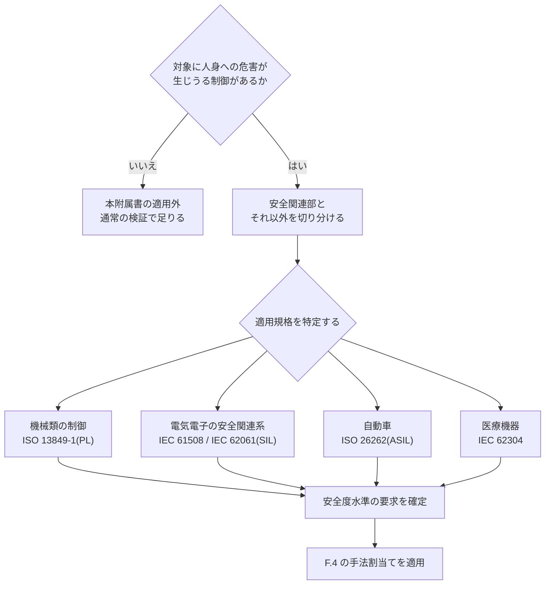

本附属書は、開発対象に**人身への危害につながりうる制御**が含まれる場合の検証手順を示します。要求事項の正本は[第5章 5.8](/process-compass/phase4-process-design/human-ai-boundary/)および[第6章](/process-compass/phase4-process-design/deliverable-templates/)であり、本附属書は実施の手引きです。

危険源の同定とリスクの低減は[第6章「AIエージェント安全リスクアセスメント」](/process-compass/phase4-process-design/deliverable-templates/)が扱います。本附属書は、そこで定めた保護方策のうち**ソフトウェアで実現する部分が、意図どおりに働くことを確かめる手順**を扱います。

## F.1 本附属書の位置づけ

本標準は特定の業界向けの規格適合ガイドではありません。したがって本附属書は、**どの規格を適用するかを標準側で決めず、適用規格を特定する手順を提供します**。

:::caution
本附属書は、機能安全に関する各規格への適合性を証明するものではありません。規格適合が必要な案件では、認証機関または適合性評価の担当部門の指示が優先します。本附属書の記述は、規格本文ではなく公開されている解説に基づく箇所を含みます。
:::

### 用語を安易に併記しない

安全度の要求を表す指標は、規格ごとに別の体系です。

| 指標 | 規格 | 対象 |
| --- | --- | --- |
| PL / PLr | ISO 13849-1 | 機械類の安全関連制御システム部。技術を問わない |
| SIL | IEC 61508 / IEC 62061 | 電気・電子・プログラマブル電子による安全関連系 |
| ASIL | ISO 26262 | 自動車の電気電子システム |

**「PLr/SIL」のように並べて書いてはなりません**。両者は算出方法が異なり、対応表は条件付きの参考情報です。PL a に対応する SIL は存在せず、算出値が区分の境界に近い場合は規格の附属書で帰属を判定する必要があります。

本標準の一般的な記述では、抽象語として「**安全度水準**」を用います。具体的な指標は適用規格を特定してから確定します。

## F.2 適用の判定

### 安全関連部の切り分け

安全関連システムに含まれるコードの**すべてが安全関連ソフトウェアではありません**。切り分けは次の基準で行い、結果を記録します。

| 区分 | 判定基準 |
| --- | --- |
| 安全関連部 | 安全機能の実現、安全状態への遷移、監視・診断のいずれかを担う |
| それ以外 | 障害時にも安全機能の動作を妨げないと、隔離または独立性の設計によって示せる |

切り分けを記録しないまま全体を安全関連として扱うと、検証の負荷が実態を超え、形式的な適合の記録だけが残ります。逆に切り分けの根拠を書かずに範囲を狭めると、安全機能へ影響する変更が通常の経路で入ります。**根拠を書くことが切り分けの成立条件です**。

### 安全関連ソフトウェアの区分

機械類の制御では、安全関連ソフトウェアを次の2種に分けます。

| 区分 | 内容 | 記述言語 |
| --- | --- | --- |
| 組込ソフトウェア | 安全部品の内部で動作するもの。部品の供給者が開発する | 完全可変言語 |
| 応用ソフトウェア | 安全制御装置の上に構築する応用プログラム | 限定可変言語または完全可変言語 |

応用ソフトウェア向けの簡略化された手順は、**限定可変言語で記述する場合にのみ適用できます**。完全可変言語で書く場合は、組込ソフトウェアと同等の措置が必要になります。

また、最上位の安全度水準では、機械安全の規格による簡略化された手順は使えません。この場合、汎用の機能安全規格によるソフトウェア要求を適用します。**要求水準が上がるほど、規格間の委譲によって手法の要求は厳しくなります**。

## F.3 AI を用いる場合の追加要求

### 2つのケースを混同しない

| ケース | 内容 | 本附属書の扱い |
| --- | --- | --- |
| AI が安全機能そのものを実現する | 推論結果が制御出力になる | **本附属書の対象外**。適用規格の特定から専門部門と行う |
| AI が開発を支援する | 実装・テスト・文書の作成を支援する | **本附属書の対象** |

前者は、学習した振る舞いを安全機能として保証する問題であり、本標準の範囲を超えます。後者は、生成物を人間と機械の検証で捕捉する問題であり、既存の検証体系で扱えます。

### 追加要求

安全関連部に AI の支援を用いる場合、[第5章 5.8](/process-compass/phase4-process-design/human-ai-boundary/)の要求に加えて次を満たします。

| # | 要求 |
| --- | --- |
| 1 | AI自律レベルは L1 に固定する。引き上げの判定の対象としない |
| 2 | 生成に用いたモデルの版と指示を構成管理下に置き、成果物から参照できるようにする |
| 3 | 生成された各行が、要求へ追跡でき、コーディング規約に適合し、独立した担当者のレビューを受け、決定論的な試験で検証されている |
| 4 | テスト生成の独立性は[5.8.4](/process-compass/phase4-process-design/human-ai-boundary/)の段階「最強」を適用する |
| 5 | 安全度の評価を、実装の責任者から組織的に独立した担当者が行う |

要求3の4条件は、生成物であるか人間の記述であるかを問わず同一です。**生成物であることは、検証を省く理由にも、追加の検証を課す理由にもなりません**。追加になるのは、要求2の再現性の確保と、要求4の独立性の確保です。

## F.4 検証手法の割当て

手法の推奨度は、機能安全の規格が用いる記法に倣います。

| 記法 | 意味 |
| --- | --- |
| HR | 強く推奨する。適用しない場合は、しない理由を記録する |
| R | 推奨する |
| — | 推奨も非推奨もしない |

| 手法 | R3 | R2 | R1 | 安全関連部 |
| --- | --- | --- | --- | --- |
| 独立レビュー(G-6) | R | HR | HR | HR |
| 静的解析・コーディング規約への適合 | R | R | HR | HR |
| 単体試験 | HR | HR | HR | HR |
| 境界値解析 | R | R | HR | HR |
| 構造カバレッジ(分岐) | R | HR | HR | HR |
| 構造カバレッジ(条件と判定の組合せ) | — | — | R | HR |
| ミューテーション試験 | — | R | R | HR |
| 故障挿入試験 | — | — | R | HR |
| 独立した安全性の評価 | — | — | — | HR |

:::note
安全関連部の列の初期値は、公開されている規格解説に基づきます。条件と判定の組合せによるカバレッジは安全度水準が最上位で強く推奨され、故障挿入は上位の水準で強く推奨されます。監視タイマは水準によらず強く推奨されます。**実際の適用にあたっては、特定した規格の該当する表を参照してください**。
:::

R1〜R3 の列は本標準が定めた初期値であり、規格に基づく値ではありません。組織の実情に応じて第8章のテーラリングで調整します。

## F.5 故障挿入試験の実施手順

故障挿入試験は、**正常系では到達しない経路を強制的に通し、保護方策が働くことを確かめる**手法です。

### 手法の分類

| 分類 | 内容 | 本標準での用途 |
| --- | --- | --- |
| 実行前の挿入 | ソースまたはバイナリを改変して欠陥を作り込む | ミューテーション試験として CI で実行する |
| 実行時の挿入 | 実行中に変数・レジスタ・メモリを破壊する | 実機または模擬環境で実行する |
| ハードウェアによる挿入 | 信号線・電源へ物理的に故障を与える | 専門部門の設備で実行する |

:::danger
**本番稼働中の安全関連システムへ故障を挿入してはなりません**。分散システムの可用性検証で用いる本番環境への障害注入は、安全関連部には適用しません。実行時の挿入は、実機を模擬した検証環境に限ります。
:::

### 最小限の試験項目

安全関連部では、少なくとも次を試験します。

| # | 項目 | 確認する挙動 |
| --- | --- | --- |
| 1 | 監視タイマの不応答 | 定めた時間内に安全状態へ遷移する |
| 2 | 監視タイマの早すぎる応答 | 時間窓を持つ監視では、早い応答も異常として検出する |
| 3 | 入力の境界値と範囲外の値 | 範囲外を検出し、危険側へ倒れない |
| 4 | 入力の欠落と滞留 | 前回値の保持によって異常が隠れない |
| 5 | メモリまたは変数の破壊 | 診断が検出し、安全状態へ遷移する |
| 6 | 処理順序の逸脱 | 順序の監視が検出する |
| 7 | 安全状態からの復帰 | 定めた条件を満たさない限り復帰しない |

項目2を省いてはなりません。**時間窓を持たない単純な監視タイマは、異常に早い応答を正常として通します**。監視の実装が単純な形式である場合、その旨と診断能力の限界を記録します。

項目7は見落とされやすい項目です。安全状態へ遷移する試験だけを行い、復帰の条件を試験しない構成では、異常が解消していない状態での自動復帰を検出できません。

### AI に故障挿入の試験項目を生成させる場合

生成させてよいのは**試験項目の候補**までです。次の順序を守ります。

1. 人間が、上表の項目と、対象に固有の安全要求から**期待する挙動**を先に書く
2. AI には期待する挙動のみを渡し、**実装コードを渡さずに**試験項目を生成させる
3. 生成された項目を、上表との突合と境界値の観点で人間が点検する
4. 不足を人間が補う

段階2で実装コードを渡すと、実装が想定している異常だけを試験する項目が生成されます。**実装が想定していない異常を試すことが故障挿入の目的**であるため、この順序を崩すと手法の意味が失われます。

## F.6 ミューテーション試験

### 位置づけ

ミューテーション試験は、コードへ意図的に小さな変更を加え、**試験がその変更を検出できるか**を測る手法です。機能安全の分野では、単体試験の水準における故障挿入の一形態として挙げられています。

本標準では、**AI が生成した試験の十分性を測る指標**として用います。

### カバレッジを試験の品質指標にしない

**行や分岐の網羅率は、AI が生成した試験の品質を表しません**。網羅率の高い試験群であっても、検出能力はほとんどない場合があります。実行はするが結果を検査しない試験は、網羅率を上げても欠陥を検出しません。

したがって、AI に試験を書かせる工程では、網羅率ではなく**ミューテーションスコアの閾値**を通過条件にします。

### CI への組み込み

| 項目 | 方針 |
| --- | --- |
| 実行範囲 | 差分に対する増分実行。全量実行は所要時間の面で現実的でない |
| 判定 | スコアの閾値による合否。閾値は組織が G-1 で定める |
| 対象 | 安全関連部および R1 の変更を優先する |
| 記録 | 生き残ったミューテーションの一覧を差し戻しの根拠として残す |

閾値の初期値は本標準では定めません。既存コードの実測値から較正します。**外部の事例の数値をそのまま閾値にしてはなりません**。

### 既知の限界を補う

AI が生成した試験は、**条件の境界をずらす変更を検出する検査を書けないことが多い**という傾向があります。生成された試験が境界値を検査しているかは、人間が別途点検します。ミューテーション試験のスコアだけで十分性を判定してはなりません。

## F.7 記録

安全関連部の検証では、次を記録します。ゲート判定記録(テンプレ4)に添付します。

| 項目 | 内容 |
| --- | --- |
| 安全関連部の切り分け | 範囲と、そう判断した根拠 |
| 適用規格と安全度水準 | 特定した規格、要求される水準、特定の根拠 |
| 適用した手法 | F.4 の表のうち適用したもの。適用しなかった HR の項目は理由を記載する |
| 故障挿入の結果 | 試験項目ごとの挙動と、期待との一致 |
| AI の利用 | 用いたモデルの版、指示の保存場所、独立性の段階 |
| 独立した評価 | 評価者、実装の責任者からの独立の関係、評価の結論 |

**適用しなかった HR の項目について理由を書かない記録は、不完全な記録として差し戻します**。強く推奨される手法を採らない判断そのものは認められますが、判断の根拠が残らない構成では後から妥当性を検証できません。

## F.8 関連する章

- AI が生成した成果物の統制と、テスト生成の独立性は[第5章 5.8](/process-compass/phase4-process-design/human-ai-boundary/)に規定する
- 危険源の同定とリスクの低減は[第6章](/process-compass/phase4-process-design/deliverable-templates/)に規定する
- 独立レビュー(G-6)の実施手順は[附属書C](/process-compass/phase4-process-design/review-guide/)に示す
- 検証の自動化と CI の構成は[フェーズ5](/process-compass/phase5-implementation/ci-gates/)に規定する
