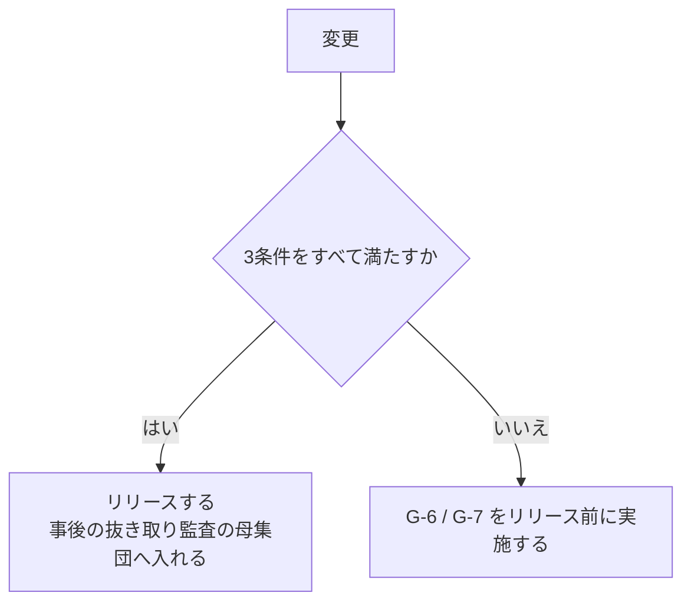

本標準は参照モデルであり、そのまま全組織に適用するものではありません。本章は、**組織の条件に応じて第1章から第7章の要求事項をどう調整するか(テーラリング)**を規定します。調整の対象となる構造は[ピットイン方式参照モデル](/process-compass/phase4-process-design/process-model/)が保持します。

:::note
本章の調整規則は、[プロセス提案ツール](/process-compass/tool/simulator/)の知識ベースとして機械可読な形式でも保持しています。本章が正本であり、データはその符号化です。データ構造は[知識ベーススキーマ設計](/process-compass/tool/knowledge-base-schema/)を参照してください。
:::

## 調整は宣言を伴う

**テーラリングは適合の放棄ではありません**。プロセスの国際規格では、規定された手順に従って調整し、その内容を宣言したうえで、調整後の状態で目的の達成を実証できる場合に適合の主張が認められます。本標準も同じ構成を採ります。

調整には次の3つを必ず伴わせます。いずれかを欠く省略は、本標準に基づく調整として扱いません。

| # | 要求事項 |
| --- | --- |
| 1 | 本章の調整軸に基づいて調整する(個別の判断で任意に省略しない) |
| 2 | **標準から外した項目、簡略化した項目を、理由とともに宣言する**(差分の一覧を残す) |
| 3 | 調整後の構成で、当該ゲートの目的が達成されることを示す |

要求事項2の宣言は、[附属書D](/process-compass/phase4-process-design/proposal-template/)の提案書に含めます。宣言のない省略は、後から妥当性を検証できません。

## 入力: 5つの調整軸

| 軸 | 選択肢 | 何に効くか |
| --- | --- | --- |
| A. チーム規模 | 1〜2名 / 3〜9名 / 10名以上 | ロールの兼務許容、独立レビューの方式 |
| B. 事業ステージ | S0 探索 / S1 価値確立 / S2 スケール | ゲートの厳格さ、コア指定の範囲、負債の扱い |
| C. 期待品質・規制 | 標準 / 高(社会インフラ・金銭) / 規制業 | 出荷判定の厳格さ、記録の粒度、監査対応 |
| D. 開発形態 | 内製 / 受託(発注側) / 受託(受注側) | 契約ゲートの位置、検収の扱い、価値責任者の所属 |
| E. 安全重要度 | CL0 / CL1 / CL2 / CL3 | 安全成果物の要否、AI自律レベルの上限、検証手法 |

:::note
軸の記号 A〜E は調整軸の識別子です。[AI実行形態](/process-compass/phase5-implementation/ai-environment/)の E1〜E3 とは関係ありません。
:::

### 軸B と事業ステージの対応

本章の軸Bは、[第2章 2.3](/process-compass/phase4-process-design/lifecycle/)の事業ステージに対応します。提案ツールは運用上の呼称で4区分を用いるため、対応を次のとおり定めます。

| 事業ステージ | ツールの区分 |
| --- | --- |
| S0 探索(別称 DR0) | 検証中(PoC) |
| S1 価値確立(別称 DR1) | 最初の顧客向け(MVP) |
| S2 スケール(別称 DR2) | 拡大中(グロース)、安定運用 |

S2 を2区分に分けるのは、負債の扱いとゲートの厳格さが実務上異なるためです。**規定上はいずれも S2 です**。

## 軸A: チーム規模による調整

| 項目 | 1〜2名 | 3〜9名 | 10名以上 |
| --- | --- | --- | --- |
| 価値責任者×技術判断者の兼務 | 許容(1人が両方) | 避けたい(分離推奨) | 分離必須 |
| 独立レビュー | **外部依頼**(他チーム・コミュニティ・別部門) | チーム内で分離 | チーム内+コア機能は別チーム |
| 出荷判定 | 価値責任者が兼ねる([3.5.2](/process-compass/phase4-process-design/roles-responsibilities/)の代償措置を満たすこと) | 兼務者を指名 | QA部門・専任 |
| 機能仕様承認の委譲 | 不要(全部自分) | 必要に応じて | 機能責任者へ積極委譲 |

最小体制(3名)未満では「作成指示者・レビュア・判定者の分離」が成立しません。1〜2名の場合、**独立レビューだけは外部に求める**ことが唯一の必須要件です。それすら難しい場合は、このプロセスの前提が満たせないため、CI(機械検証)の基準を厳しくして代替します。

### 極小規模での事後監査への切替

軸Aの表は、1〜2名の体制でも独立レビュー(G-6)だけは外部に求めると定めています。ただし外部への依頼は待ち時間を伴うため、ライブラリのパッチ適用や文言修正のような定常変更へ一律に適用すると、変更のたびに滞留が生じます。本節は、**判定の時点をリリース前からリリース後の抜き取りへ移す**調整を規定します。

**判定の省略ではありません**。判定はなくならず、時点と対象範囲が変わります。

#### 切替が成立する条件

代替の根拠は「機械が代わりに読むこと」ではなく、**壊れたことを検出でき、壊れたら取り消せること**に置きます。

| # | 条件 | なぜ必要か |
| --- | --- | --- |
| 1 | 自動検査(G-5)が全項目を通過し、変更箇所の挙動を既存のテストで検出できる | 事後監査は不具合の検出手段ではない。検出は機械が担う |
| 2 | 単独で取り消せる。かつ取り消しの手順を実行した実績がある | 監査までの間、誤りが残り続けることを許容するため |
| 3 | 確約範囲(SC-M)とコア指定に触れない | 取り消しても損害が残る変更を対象にできないため |

条件2の「実績がある」は宣言ではなく実行の記録を指します。**一度も取り消したことのない経路を、取り消せる経路として数えません**。

#### 対象にできる変更の境界

低リスクを主観で判定させないため、満たすべき属性で定義します。

| 属性 | 境界 |
| --- | --- |
| 変更の種別 | 依存パッケージのパッチ更新、表示文言、スタイル、既定値の範囲内での設定変更 |
| 導入するもの | 新たな外部呼び出し・データ構造・権限のいずれも導入しない |
| 規模 | [第4章](/process-compass/phase4-process-design/gate-criteria/)の L0 の既定値を超えない |

**切替は上限の緩和を伴いません**。時点を動かす調整と、1件あたりの規模を広げる調整は別物です。

種別の列挙は組織が拡張してよいものとします。ただし拡張は、事後監査の記録を根拠として行います。

#### 事後監査の手続

| 項目 | 規定 |
| --- | --- |
| 実施者 | 開発ラインの外の者(他チーム・別部門・外部の助言者) |
| 頻度 | 月次を既定とする |
| 対象 | 当月の切替対象リリースから抜き取る。**全件ではない** |
| 抜き取り数 | 組織で定める。定めがない場合、当月の全件と5件のいずれか少ないほう |
| 確認すること | 切替条件の充足、取り消し可能性の実在、種別の逸脱 |
| 記録 | ゲート判定記録(テンプレ4)と同じ書式で残す |

実施者の要件、対象の抽出方法、所見の是正の追跡は、[フェーズ6(プロセス内部監査)](/process-compass/phase6-operation/process-audit/)によります。本項の事後監査は、同ページの手続を極小規模の切替へ適用したものです。**別の監査を新設したものではありません**。

逸脱を見つけた場合、当該の変更を差し戻すのではなく、**切替の適用範囲を狭めます**。稼働中の変更を事後に差し戻す手続は、取り消し可能性の担保とは別の問題です。

逸脱が2期連続で出た場合、切替を停止してリリース前の判定へ戻します。

:::caution[暫定 EV-0004 / 見直し 2027-08]
**対象**: 抜き取り数(当月の全件と5件のいずれか少ないほう)と、切替を停止する条件(逸脱が2期連続)。
**根拠の水準**: E0(なし)。
**差し替え条件**: 自組織における、抜き取り数別の逸脱検出率。

抜き取り監査の標本設計に関する一般的な手法はありますが、この用途で必要な抜き取り数を測った資料を確認できていません。
:::

#### AI を独立レビュアの代替に置きません

自動レビューエージェントの判定記録をもって人手のレビューに代えることは、本標準では認めません。理由は2つです。

- レビュー負荷の削減効果を測った一次資料を確認できていない([第4章](/process-compass/phase4-process-design/gate-criteria/))
- 生成物の確認を生成器へ委ねる構成は、**自動化バイアス**によって見落としを増やす方向に働く

AI の出力は監査の**入力**として使えます。判定そのものには使いません。

#### 指示資産の監査証跡

AI を補助として使う場合、指示資産(プロンプト・恒久層コンテキスト)は成果物と同じ扱いにします。

- リポジトリへコミットし、変更履歴で追跡する
- リリースの記録に、そのとき有効だった指示資産の版を残す
- 版を特定できない実行の出力は、監査の入力に用いない

管理の責任は AI維持管理者が持ちます([第3章](/process-compass/phase4-process-design/roles-responsibilities/))。

#### 適用できない場合

| 条件 | 扱い |
| --- | --- |
| CL1 以上 | 認めない。回復可能であっても、監査までの期間に個人の権利へ影響が及ぶ |
| 規制業(軸C) | 認めない。判定の時点そのものが監査要件になる |
| 緊急のセキュリティ修正 | 本節の対象外。[第7章 7.4](/process-compass/phase4-process-design/exception-escalation/)のファストトラックによる |

**緊急性は低リスクの根拠になりません**。急ぐ変更を本節で処理すると、事後監査の母集団が壊れます。

## 軸B: 事業ステージによる調整

| 項目 | S0(PoC) | S1(MVP) | S2(グロース) | S2(安定運用) |
| --- | --- | --- | --- | --- |
| 企画承認(G-1) | 簡略化(1枚企画書) | 標準 | 標準 | 標準 |
| 要件合意(G-2) | 省略可(仕様承認G-4に統合) | 標準 | 標準 | 標準 |
| 独立レビュー(G-6) | 省略可 | コア機能のみ | 標準 | 標準 |
| 出荷判定(G-7) | 省略可 | 簡略化 | 標準 | 厳格(変更影響の確認強化) |
| コア指定の範囲 | なし(全部使い捨て前提) | 最小限 | 拡大していく | 確定済みを維持 |
| 負債台帳 | 記録のみ(返却しない) | 記録+返却目安 | 計画返却の開始 | 定常の返却サイクル |

PoC の本質は「捨てる前提で速く学ぶ」ことなので、ゲートを大胆に省略します。ただし **PoC がそのまま本番化する事故**が最頻の失敗パターンです。PoC→MVP の切り替え時に「省略したゲートを復活させ、コア指定をやり直す」ことを、企画承認(G-1)の条件に含めてください。

## 軸C: 期待品質・規制による調整

| 項目 | 標準 | 高(社会インフラ・金銭) | 規制業(医療・金融等) |
| --- | --- | --- | --- |
| CI基準(G-5) | 参照モデルどおり | カバレッジ基準を引き上げ | +規制要件の自動チェック |
| 独立レビュー(G-6) | 1名 | コア機能は2名 | 2名+記録の監査対応書式 |
| 出荷判定(G-7) | 記録突合 | +限定的な抜き取り確認 | +規制当局向けエビデンス、AI関与範囲の明記 |
| AI利用の制約 | 制約なし | コア機能の設計判断はAI単独不可 | AI生成箇所のトレーサビリティ必須 |

規制業では「どこをAIが生成し、誰が承認したか」の追跡が監査要件になります。ゲート判定記録(テンプレ4)を最初から監査書式で運用してください。

## 軸D: 開発形態による調整

| 項目 | 内製 | 受託(発注側) | 受託(受注側) |
| --- | --- | --- | --- |
| 価値責任者の所属 | 自社 | **発注側に置く**(必須) | 受注側はなれない(機能責任者まで) |
| 契約ゲート | なし | G-2(要件合意)とG-8(リリース)を検収に対応づけ | 同左 |
| AI生成物の検収 | 不要 | **検収対象を仕様適合に限定**(生成手段を問わない)と契約に明記 | 同左 |
| コア理解の維持 | 自社開発者 | 発注側にも理解保持者を置く(丸投げ禁止) | 引き継ぎ文書の粒度を契約で規定 |
| 確約範囲(SC-M)の変更 | 価値責任者と B-2 の判定で完結 | **契約変更の起点として扱う**(追加費用・納期の再合意) | 同左。受注側は単独で確約範囲を動かせない |
| 知財潔白性の検査 | 自社で実施し記録する | **納品時の提出物として契約に明記**(テンプレ8 第7項) | 同左。実施と記録が納品要件 |
| 知財潔白性の結果責任 | 自社 | 受注側に負わせる場合、**検査の範囲と手段を契約で特定する**(「潔白であること」だけを書かない) | 同左 |
| 計画範囲・調整枠の調整 | 価値責任者の単独判定 | 同左(契約変更を伴わないことを契約に明記) | 同左 |

確約範囲(SC-M)を契約変更の起点に対応づける理由は、受託において範囲外の変更が追加費用と納期へ直結するためです。層を区別せずにすべての変更を契約変更として扱うと、通常の調整のたびに契約の手続が起動し、内側の反復が止まります。層の定義は[第2章 2.10](/process-compass/phase4-process-design/lifecycle/)によります。

受託では、AI生成コードの瑕疵担保責任が未整備の論点です(フェーズ2で確認)。現時点の推奨は「**検収基準を受入基準(spec)への適合に限定し、生成手段(人・AIの別)を契約上問わない**」構成です。これにより既存の検収実務に載せられます。

**この構成は知財潔白性の要求と矛盾しません**。検収は仕様適合の判定であり、知財潔白性は成果物の属性です。両者は別の軸として併存します。**知財潔白性の要求を、AI を利用する場合に限って課してはなりません**。人が書いたコードにも他者の著作物は混入するためです([第4章 G-5](/process-compass/phase4-process-design/gate-criteria/))。

**「知財潔白であること」だけを契約に書いてはなりません**。検知に完全さを期待できない以上、この文言は達成できない義務になります。契約に書くのは、実施する検査の範囲と手段、提出する記録、指摘が出た場合の措置です。

### 判定をどちらの組織へ置くか

上表が定めるのは所属です。**判定そのものをどちらの組織へ置くか**は、これとは別に決めます。決めないまま開始すると、独立レビューと出荷判定の位置が案件ごとに動き、責任の所在が契約の解釈に委ねられます。

| 判定 | 置く先 | 理由 |
| --- | --- | --- |
| 仕様承認(G-4) | **発注側**(固定) | 価値責任者の A を移せない |
| 技術設計(G-3) | どちらでもよい | 置いた側の技術判断者が A を負う |
| 独立レビュー(G-6) | どちらでもよい | 置いた側が読解の帯域を負う |
| 出荷判定(G-7) | **発注側**(固定) | 市場へ出す主体が判定する |
| リリース決裁(G-8) | **発注側**(固定) | 既存の決裁権限規程による |

G-6 を発注側へ置くと完成責任が移るという懸念があります。**レビューの実施は、成果物の完成の承認ではありません**。この区別を契約へ明記しない場合、実施そのものが承認と読まれます。

置き先による違いは次のとおりです。

| 置き先 | 発注側が確かめられること | 発注側が負うもの |
| --- | --- | --- |
| 発注側 | 実装が受入基準と一致すること | 読解の帯域 |
| 受注側 | 分離の記録が提出されたこと | 記録の受領と、その扱いの規定 |

検収の対象を仕様適合へ限定する構成は、どちらを選んでも変わりません。

### 強制層をどちらが所有するか

作成指示者と独立レビュアの分離は、[第3章 3.11.3](/process-compass/phase4-process-design/roles-responsibilities/)の強制層によって成立します。誘導層に書いた規則の遵守は保証されません。委託では、**この強制層をどちらの組織が所有するか**が分離の成否を決めます。

| 所有の形 | 分離の成立 | 発注側が確認できるもの |
| --- | --- | --- |
| 発注側がリポジトリと CI を所有し、受注側が作業する | 機械的に成立する | 判定の記録そのもの |
| 受注側が所有し、成果物を納品する | 受注側の運用に依存する | 提出された記録のみ |

2行目を選んだ場合、**発注側は分離を確認できません**。確認できるのは、受注側が提出した記録だけです。この差を締結時に決めず、後から監視で埋めようとしても埋まりません。委託が多層になるほど、監視の対象そのものが見えなくなります。

**監視によって分離を担保する構成を採りません**。所有を決めるか、確認できない状態を受け入れるかのいずれかです。受け入れる場合、その事実を契約の記録へ残します。

### 受領する記録が保証するもの

発注側が受け取るレビューパッケージは、**判定の手がかりであって品質の保証ではありません**([ADR-0023](/process-compass/adr/0023-review-package-cues-not-conclusions/))。知財潔白性の記録も同じ構造です。検査を実施した事実を示すものであり、潔白の証明ではありません([ADR-0021](/process-compass/adr/0021-ip-clearance-evidence-not-guarantee/))。

契約では次の3点を区別して書きます。

- 提出を求める記録の一覧と、その様式
- 記録が欠落した場合の措置
- 記録の内容と実態の不一致が判明した場合の措置

3点目が抜けやすい箇所です。**提出だけを義務にすると、提出の形式を満たす動機だけが働きます**。

### 受け入れの速度を契約で合意する

受注側の検証が不十分な場合、その分は発注側の判定帯域へ移ります。帯域は増えません。[第4章 G-6](/process-compass/phase4-process-design/gate-criteria/)の同時保有数の上限は、委託でも同じように働きます。

- 上限に達した場合、受け入れを止める。**判定を省略して受け入れない**
- 期間あたりに受け入れる変更単位の数を、契約または個別の合意で定める
- 上限へ繰り返し到達する場合、原因は受注側の検証の水準にある。受け入れ速度ではなく、そちらを是正の対象とする

### 計算資源の負担を決める

エージェントの実行に伴う計算資源の費用は、変更の量ではなく試行の回数で増えます。自己修復のループが収束しない場合、費用は成果物を伴わずに増加します。**この費用の帰属を契約で定めない場合、増加が判明した時点で交渉になります**。

契約に定める項目は次の3点です。

| # | 定める内容 |
| --- | --- |
| 1 | 費用の負担者。実行環境の所有者と一致させる |
| 2 | 期間あたりの上限額と、上限へ到達した場合の措置 |
| 3 | 上限を超える実行を許可する手続と、その承認者 |

上限へ到達した場合の措置は、[計算資源とコスト戦略](/process-compass/phase5-implementation/compute-strategy/)の強制停止によります。**超過を検知して報告する構成を採りません**。報告は費用が発生し終えたあとに届きます。

費用の負担者は、実行環境を所有する側とします。所有していない側へ負担させた場合、費用を抑える操作はその側にありません。

### 発注側に読解の帯域がない場合

発注側が AI 生成コードを読み解けない状態で、受注側の検証の正しさを確かめる方法はありません。本標準はこの状態に対する代替手段を規定しません。**読めないまま統治する構成が存在しないためです**。

選択肢は3つです。

- 発注側へ読解の担い手を置く。人数は独立レビューの対象範囲によって決める
- 読解を第三者へ委託する。委託先は当該案件の開発に関与していない者とする
- 対象を、読解しなくても受け入れられる範囲へ限定する

3つ目は機能を落とす選択です。**いずれも選ばない状態を認めません**。選ばない場合、成立しているのは検収の外形だけになります。

## 軸E: 安全重要度による調整

安全重要度は、**想定できる最悪の故障が起きたときの帰結**で判定します。技術的な難しさやチームの規模では判定しません。軸Cが可用性と監査対応を扱うのに対し、軸Eは**危害の深刻度**を扱います。

| 記号 | 名称 | 判定基準(最悪の場合の帰結) | 典型例 |
| --- | --- | --- | --- |
| CL0 | 一般 | 経済的な損失や業務の中断にとどまる | 社内ツール、コンテンツ配信 |
| CL1 | 準規制 | 個人の権利・利益に実質的な影響が及ぶ(回復可能) | 決済、与信、人事評価の支援 |
| CL2 | 規制 | 適合性評価または第三者認証の対象。危害は重篤ではない | 医療機器ソフトウェアの一部、高リスクに分類される用途 |
| CL3 | 生命重要 | 死亡または重篤な傷害が起こりうる | 車載制御、生命維持に関わる機器 |

判定の規則は3つです。

- **上位は下位を包含する**。CL2 は CL1 の要求をすべて含む。上位で別のことをするのではなく、追加で行う
- **構成要素ごとに判定し、最も高い区分がシステム全体の区分になる**
- **設計によって最悪の帰結そのものを下げた場合に限り、区分を下げてよい**。低減後の区分を根拠とともに記録する。手順は下記「設計によって区分を下げる」による

### 区分ごとの調整

| 項目 | CL0 | CL1 | CL2 | CL3 |
| --- | --- | --- | --- | --- |
| AI生成箇所の追跡 | 任意 | 必須 | 必須 | 必須 |
| 安全リスクアセスメント(テンプレ9) | 不要 | 不要 | **必須**(G-1 の前提条件) | 必須 |
| 安全適合性の検証記録(附属書F) | 不要 | 不要 | **必須**(G-7 の判定基準) | 必須 |
| 独立した安全性の評価 | 不要 | 不要 | 必須(G-6 に重ねる) | 必須 |
| AI自律レベルの上限 | 制限なし | 制限なし | L2 | **L1(固定)** |
| 独立レビューの人数 | 1名 | 1名 | 1名 | 2名 |
| CI の必須チェック | 参照モデルどおり | 同左 | 同左 | +故障挿入試験、ミューテーション試験 |
| テスト生成の独立性 | 弱〜中 | 中 | 強 | **最強(組織的独立)** |

**差は列挙できる形で定義します**。「上位ではより厳格に検証する」のような抽象的な表現を用いません。何を追加するかを成果物名とゲート名で示します。

### 適用してはならない組み合わせ

危害の深刻度と AI自律レベルの組み合わせには、**厳格化では埋められない領域**があります。

| 組み合わせ | 扱い |
| --- | --- |
| CL3 の安全関連部 × L2 以上 | **許容しない**。適用範囲を安全関連部の外へ限定する |
| CL2 以上 × 安全リスクアセスメントの省略 | **許容しない**。省略するなら区分の判定自体を見直す |

段階を増やして「さらに厳しくすれば実施してよい」とはしません。**上限を段階の延長として表現すると、厳格化によって到達できるという誤読を招きます**。

### 設計によって区分を下げる

区分を下げる正当な経路は、**プロダクトを変えて最悪の帰結を実際に下げること**です。回答を書き換えることではありません。

該当する設計は2種類です。いずれも[第6章 RRS1(本質的安全設計方策)](/process-compass/phase4-process-design/deliverable-templates/)に属します。

| 種類 | 内容 | 例 |
| --- | --- | --- |
| 危害を実行不能にする | 危険な操作を実行できない構成にする | 本番のデータへ書き込む経路を持たせない |
| 帰結の深刻度を下げる | 実行は可能だが、結果が回復可能・限定的になる | 物理削除を取り消し可能な方式へ変える、送信を保留してから確定する |

引き下げには4つの要求事項をすべて満たします。

| # | 要求事項 |
| --- | --- |
| 1 | 低減の前後の区分と、根拠となる設計を記録する(CL2 以上では[テンプレ9 安全リスクアセスメント](/process-compass/phase4-process-design/deliverable-templates/)へ、CL1 以下では ADR へ) |
| 2 | 設計上の制約を、**該当機能の受入基準に必須制約として書き込む** |
| 3 | 引き下げの判断を [ADR](/process-compass/adr/) として記録する。**採らなかった選択肢(体制の確保・機能の非実施)とその理由を含める** |
| 4 | 当該の制約を外す変更を、区分の再判定の対象にする |

要求事項2を欠くと、**低減の根拠は次の反復で失われます**。「取り消し可能にした」という設計判断は、機能の追加や書き直しの過程で容易に消えます。受入基準に必須制約として残っていれば、消えたことが G-5 で検出されます。

### 設計で下げられない危害

次のいずれかに当たる危害は、**設計による引き下げの対象外**です。実行後に取り消せる構成を作れないためです。

- 人体への危害(不可逆)
- 外部へ出た情報(公開、第三者への送信、漏えい)
- 外部との間で確定した取引(送金、発注、契約の成立)
- 第三者の資産・環境への物理的な影響

これらは「取り消し操作を用意した」ことをもって区分を下げられません。取り消しの可否ではなく、**取り消せない時間帯が存在すること**で判定します。

### 人員が足りない場合

安全重要度による要求は、**人員や期日の制約によって外れません**。1〜2名の体制で独立レビューの担い手がいない場合、軸Aの代替措置(CI 基準の厳格化)は CL2 以上では成立しません。この場合の選択肢は3つです。

1. **設計を変えて危害の帰結を下げる**(上記の手順による。区分が実際に下がる)
2. 体制を確保する(外部の評価者を含む)
3. 当該の機能を実施しない

順序に意味があります。選択肢1は**プロダクトの側を変えて危害を減らす**もので、他の2つより先に検討する価値があります。ただし成立するのは、「設計で下げられない危害」へ当たらない場合だけです。

**危害の深刻度は、体制の都合では下がりません**。下がるのは設計を変えたときだけです。区分を下げた回答は、設計の変更と記録を伴っていない限り、回答の書き換えにすぎません。

## 組み合わせ例(3つの典型)

### 会議体と体制図の調整

[第3章の会議体](/process-compass/phase4-process-design/roles-responsibilities/)は、組織の規模によって**設置ではなく対応づけ**で扱います。

| 項目 | 1〜2名 | 3〜9名 | 10名以上 |
| --- | --- | --- | --- |
| B-1 IT投資委員会 | 既存の決裁者1名が兼ねる | 既存の決裁制度へ対応づける | 対応づけまたは設置 |
| B-2 ステアリングコミッティ | 設置しない(記録のみ残す) | 月次の定例へ対応づける | 設置 |
| B-3 設計審査会 | 設置しない(G-3 の単独判定で足りる) | 必要時のみ招集 | 設置 |
| B-4 リリース判定会 | 設置しない(G-7 の判定記録で代替) | 既存のリリース会議へ対応づける | 設置 |
| D-0 体制図 | **必須**(1枚。兼務を明記する) | 必須 | 必須 |

**D-0 は規模によらず必須です**。人数が少ないほど兼務が増え、誰が決めるかが曖昧になるためです。会議体は減らせますが、**決定の権限と境界の記述は減らせません**。

### 社会実装の段階の調整

[社会実装計画](/process-compass/phase5-implementation/enablement/)の移行段階も調整の対象です。

| 項目 | 1〜2名 | 3〜9名 | 10名以上 |
| --- | --- | --- | --- |
| T-1 限定試行 | 実施する(対象そのものが試行になる) | 実施する | 実施する |
| T-2 増分展開 | 該当しない | 該当しない | 実施する |
| EN-1 移行支援担当 | 外部の助言者で代替 | 兼務可 | 専任を置く |
| EN-3 標準所管 | 兼務可 | 兼務可 | **監査と分離して設置** |

3〜9名までは EN-1 と EN-3 の兼務を認めます。10名以上では、支援を求めることが評価上の不利益にならないよう報告線を分離します。

### 例1: スタートアップの PoC(2名・S0・標準品質・内製・CL0)

- ゲートは G-4(仕様承認)と G-5(CI)だけ残し、他は省略
- 独立レビューなし。代わりに CI 基準を厳格化(カバレッジ+静的解析)
- 負債は記録のみ。MVP移行時にゲート復活を条件化

### 例2: 事業会社のグロース期プロダクト(8名・S2・高品質・内製・CL1)

- 参照モデルをほぼそのまま適用
- 価値責任者・技術判断者を分離。コア機能の独立レビューは2名
- 負債の計画返却を開始。文脈オーナーを専任化
- CL1 のため AI生成箇所の追跡を必須化。安全成果物は不要

### 例3: SIer の受託開発(15名・S2・規制業・受託受注側・CL2)

- 価値責任者は発注側に置くことを契約時に合意(最大の交渉点)
- G-2 / G-8 を多段階契約の検収に対応づけ。検収基準は受入基準への適合に限定
- ゲート判定記録を監査書式で運用。AI生成箇所のトレーサビリティを維持
- CL2 のため、安全リスクアセスメントを G-1 の前提条件、安全適合性の検証記録を G-7 の判定基準に加える。AI自律レベルの上限は L2

## テーラリングの禁止事項

どの組み合わせでも、次の6つは調整で外してはなりません(外すと参照モデルの成立条件が崩れます)。

1. **A(結果責任)を2人以上にする** — どの規模でも責任は1人
2. **AIをA(結果責任)にする** — AIはどこまでもR(実行)
3. **差し戻し基準のないゲートを作る** — チェックリストのないゲートは滞留と素通しの温床
4. **CL3 の安全関連部で AI自律レベルを L1 より上げる** — 生成物を後段の検証で捕捉しきる構成が成立しなくなる
5. **CL2 以上で安全リスクアセスメントと検証記録を省略する** — 制約は危害の深刻度を下げない
6. **標準から外した項目を宣言せずに運用する** — 宣言のない省略は追跡できない

:::caution
このガイドは v0 です。実組織への適用フィードバックで調整表を更新していきます。「うちの条件だとどうなるか」という質問・事例を [GitHub Issues](https://github.com/Takenori-Kusaka/process-compass/issues) へお寄せください。そのやり取り自体が提案ツールの知識ベースを鍛えます。
:::
