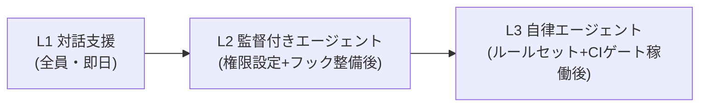

AIエージェントをチームで運用するには、個人の野良利用とは違う環境設計が要ります。このページは、実行環境のレベルで参照モデルの統制(AIはRになれるがAになれない・ガードレールの符号化)を担保するためのガイドです。

## 実行形態の3層

AIの実行形態を統制レベルで3層に分け、段階導入します。

| 層 | 形態 | 統制 | 導入順 |
| --- | --- | --- | --- |
| L1 対話支援 | IDE 補完・チャット | 人が全出力を直接確認 | 最初 |
| L2 エージェント(監督付き) | CLI エージェント(ローカルで人が監督) | 権限設定+人の承認 | 中核 |
| L3 自律エージェント | CI・クラウド上で非同期実行 | 全ゲート機械強制+独立レビュー必須 | 最後 |

L3(自律)へ進むほど、[Git 戦略](/process-compass/phase5-implementation/git-strategy/)のルールセットと [CI ゲート](/process-compass/phase5-implementation/ci-gates/)が生命線になります。**ゲートの機械強制ができていない段階で L3 を解禁しない**ことが原則です。

## 権限設計(最小権限+強制層)

エージェントへの指示ファイル(CLAUDE.md 等)は「ガイダンス」であり、確実に禁止したい操作は**設定の強制層**で縛ります。

設定例(Claude Code の場合の `.claude/settings.json`):

```json
{
  "permissions": {
    "allow": [
      "Bash(npm run check:*)",
      "Bash(npm test:*)",
      "Bash(git status:*)", "Bash(git diff:*)"
    ],
    "deny": [
      "Read(./.env)", "Read(./.env.*)",
      "Bash(git push --force:*)"
    ]
  },
  "hooks": {
    "PostToolUse": [
      { "matcher": "Edit|Write",
        "hooks": [ { "type": "command", "command": "node .claude/hooks/lint-on-save.mjs" } ] }
    ]
  }
}
```

- **秘密情報(.env 等)は deny で読み取り自体を禁止**する。指示ファイルに「読むな」と書くだけでは統制にならない
- フックで「保存のたびに検査」を強制すると、AIの生成物が規約違反のまま進むことを防げる(本サイトでは textlint を全編集にフックし、実際にAIの執筆ミスを何度もその場で止めている)

## ガードレールの符号化(steering)

組織標準・規約・禁止事項は、リポジトリに常駐するファイルとして符号化します。

| ファイル | 内容 | オーナー |
| --- | --- | --- |
| CLAUDE.md / AGENTS.md | プロジェクトの前提・コマンド・執筆規約 | 文脈オーナー |
| ルール(スコープ付き) | 特定ディレクトリでの追加規約 | 同上 |
| 成果物テンプレート | AI出力の形式指定 | 同上 |
| 禁止語・禁止操作 | 曖昧語リスト、触ってはならない領域 | 同上 |

これは[コンテキスト基盤](/process-compass/phase5-implementation/context-base/)の恒久層そのものです。**ガードレールが正しく符号化されていることが AIDLC の前提条件(K3)**であり、その保守責任は文脈オーナーに一意に紐づけます。

## 監査ログとトレーサビリティ

| 記録 | 実装 |
| --- | --- |
| AI の関与範囲 | コミットトレーラ(Co-Authored-By)の集計 |
| 誰が何を承認したか | ゲート判定記録+PR承認履歴(API で収集可能) |
| エージェントの操作履歴 | セッションログの保全(組織ポリシーで保存期間を規定) |
| モデル・バージョン | 実行環境の設定として固定・記録(再現性) |

## モデルアクセスの管理

- **API キーは個人配布しない**。組織のシークレット管理(環境変数・シークレットマネージャ)経由で配り、リポジトリへの混入は CI のシークレットスキャンで検査する
- モデルのバージョン更新は「いつでも最新」ではなく、**検証してから切り替える**運用にする(モデル更新で生成品質・挙動が変わるため。切り替え判断は技術判断者)
- 外部送信の範囲(コード・データがどこまでプロバイダへ送られるか)を情報セキュリティ部門と事前合意し、対象外データ(顧客情報等)は deny 設定と運用の両方で遮断する

## 段階導入の目安



| 前提条件 | L2 解禁 | L3 解禁 |
| --- | --- | --- |
| 権限設定(allow/deny)整備 | 必須 | 必須 |
| 検査フック(保存時 lint 等) | 必須 | 必須 |
| コンテキスト基盤(恒久層) | 推奨 | 必須 |
| ルールセット(独立レビュー強制) | — | 必須 |
| CI ゲート(G-5)稼働 | — | 必須 |
