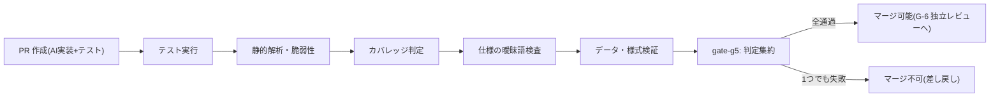
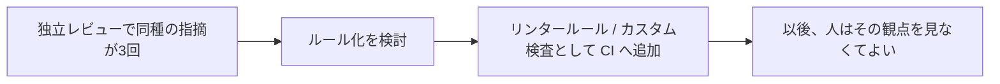

参照モデルの原則「**合意済みルールはすべて機械化して CI に載せ、人の目を通さない**」を実装します。人間の検証帯域を判断業務に温存するための、最重要の実装ポイントです。

## G-5(自動検証)のパイプライン構成



GitHub Actions での骨格例:

```yaml
name: gate-g5
on: [pull_request]
jobs:
  test:
    runs-on: ubuntu-latest
    steps:
      - uses: actions/checkout@v4
      - run: npm ci && npm test -- --coverage
      - name: カバレッジ判定(新規コード80%目安・組織で調整)
        run: npx coverage-check --threshold 80
  static-analysis:
    runs-on: ubuntu-latest
    steps:
      - uses: actions/checkout@v4
      - name: 静的解析・脆弱性(Critical/High は 0 件で失敗させる)
        run: |
          npx eslint . --max-warnings 0
          npm audit --audit-level=high
  spec-lint:
    runs-on: ubuntu-latest
    steps:
      - uses: actions/checkout@v4
      - name: 仕様・ドキュメントの曖昧語検査(禁止語リスト)
        run: npx textlint "specs/**/*.md" "docs/**/*.md"
  gate-g5:
    needs: [test, static-analysis, spec-lint]
    runs-on: ubuntu-latest
    steps:
      - run: echo "G-5 all green"
```

- 最後の `gate-g5` ジョブが、ルールセットの必須ステータスチェック名になる([Git 戦略](/process-compass/phase5-implementation/git-strategy/)と対応)
- **曖昧語検査は textlint で実装できる**。ゲート基準 G-2 の禁止語リスト(「適切に」「柔軟に」等)をカスタムルール化し、仕様書を機械検査する

## 「人が毎回指摘すること」を CI へ移す運用

CI ゲートは一度作って終わりではなく、**独立レビューの指摘を吸い上げて成長させます**。



- 目安は「同種の指摘が3回出たらルール化を検討」。レビューコメントのラベル付け(`rule-candidate`)で候補を収集する
- 逆に、機械化できない指摘(設計の妥当性・仕様との一致)こそが人間のレビューの本務として残る

## 様式・データの検証もゲートに載せる

成果物テンプレートの様式は、CI で検査できます。

| 検査対象 | 方法 | 落とす条件 |
| --- | --- | --- |
| 機能仕様書 | frontmatter・必須節の存在チェック+曖昧語検査 | 必須欄の欠落、禁止語の使用 |
| 負債台帳 | スキーマ検証(列の欠落・状態の不正値) | 様式違反 |
| コミット | トレーラ検査(Spec: / Co-Authored-By:) | 参照の欠落(規制業テーラリング時) |
| プロセスデータ | スキーマ検証(Zod 等の型定義) | 型違反でビルド失敗 |

:::note
本サイト自体がこの構成の実例です。日本語文書は textlint、内部リンクはビルド時検証、プロセスデータは Zod スキーマで検査され、どれか1つでも失敗すると `npm run check` が落ちます。「合意したルールの機械化」はドキュメントプロジェクトでも同じ形で機能します。
:::

## 出荷判定(G-7)エビデンスの自動集約

出荷判定を「記録の突合」に限定するには、突合対象が自動で揃っている必要があります。

```yaml
name: ship-evidence
on:
  push:
    tags: ['v*']
jobs:
  aggregate:
    runs-on: ubuntu-latest
    steps:
      - uses: actions/checkout@v4
      - name: エビデンス集約(前タグからの差分に対して)
        run: |
          # 1. 対象PRの一覧と G-6 承認記録(挙動要約含む)を API で収集
          # 2. gate-g5 の通過記録・カバレッジ推移を収集
          # 3. 負債台帳の差分(新規記録・返却)を抽出
          # 4. 品質レポート(テンプレ様式)を生成して artifact 化
          node scripts/aggregate-evidence.mjs
```

QA はこの自動生成レポートとチェックリストを突合するだけで判定できます。集約を人手でやると G-7 が滞留するため、**エビデンス集約の自動化は出荷判定の前提**と位置づけます。

## デプロイゲート

- リリース決裁(G-8)は GitHub Environments の approval(環境保護ルール)で実装できる。`production` 環境に事業決裁者を required reviewer として設定すれば、決裁の記録も自動で残る
- ロールバック手順は運用引き継ぎ文書(テンプレ5)に記載し、デプロイ自動化とセットで整備する
