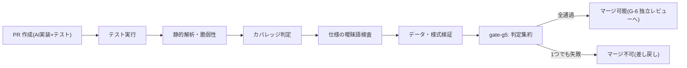
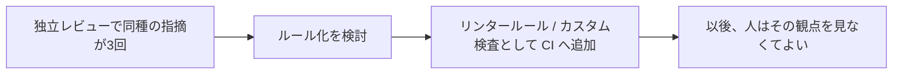

参照モデルの原則「**合意済みルールはすべて機械化して CI に載せ、人の目を通さない**」を実装します。人間の検証帯域を判断業務に温存するための、最重要の実装ポイントです。

## G-5(自動検証)のパイプライン構成


```mermaid
graph LR
  PR["PR 作成(AI実装+テスト)"] --> T["テスト実行"]
  T --> S["静的解析・脆弱性"]
  S --> C["カバレッジ判定"]
  C --> W["仕様の曖昧語検査"]
  W --> V["データ・様式検証"]
  V --> G["gate-g5: 判定集約"]
  G -->|全通過| M["マージ可能(G-6 独立レビューへ)"]
  G -->|1つでも失敗| X["マージ不可(差し戻し)"]
```

GitHub Actions での骨格例:

```yaml
name: gate-g5
on: [pull_request]
jobs:
  test:
    runs-on: ubuntu-latest
    steps:
      - uses: actions/checkout@v4
      - run: npm ci && npm test -- --coverage
      - name: カバレッジ判定(新規コード80%目安・組織で調整)
        run: npx coverage-check --threshold 80
  static-analysis:
    runs-on: ubuntu-latest
    steps:
      - uses: actions/checkout@v4
      - name: 静的解析・脆弱性(Critical/High は 0 件で失敗させる)
        run: |
          npx eslint . --max-warnings 0
          npm audit --audit-level=high
  spec-lint:
    runs-on: ubuntu-latest
    steps:
      - uses: actions/checkout@v4
      - name: 仕様・ドキュメントの曖昧語検査(禁止語リスト)
        run: npx textlint "specs/**/*.md" "docs/**/*.md"
  gate-g5:
    needs: [test, static-analysis, spec-lint]
    runs-on: ubuntu-latest
    steps:
      - run: echo "G-5 all green"
```

- 最後の `gate-g5` ジョブが、ルールセットの必須ステータスチェック名になる([Git 戦略](/process-compass/phase5-implementation/git-strategy/)と対応)
- **曖昧語検査は textlint で実装できる**。ゲート基準 G-2 の禁止語リスト(「適切に」「柔軟に」等)をカスタムルール化し、仕様書を機械検査する

## 「人が毎回指摘すること」を CI へ移す運用

CI ゲートは一度作って終わりではなく、**独立レビューの指摘を吸い上げて成長させます**。


```mermaid
graph LR
  R["独立レビューで同種の指摘が3回"] --> L["ルール化を検討"]
  L --> CI["リンタールール / カスタム検査として CI へ追加"]
  CI --> F["以後、人はその観点を見なくてよい"]
```

- 目安は「同種の指摘が3回出たらルール化を検討」。レビューコメントのラベル付け(`rule-candidate`)で候補を収集する
- 逆に、機械化できない指摘(設計の妥当性・仕様との一致)こそが人間のレビューの本務として残る

## 様式・データの検証もゲートに載せる

成果物テンプレートの様式は、CI で検査できます。

| 検査対象 | 方法 | 落とす条件 |
| --- | --- | --- |
| 機能仕様書 | frontmatter・必須節の存在チェック+曖昧語検査 | 必須欄の欠落、禁止語の使用 |
| 負債台帳 | スキーマ検証(列の欠落・状態の不正値) | 様式違反 |
| コミット | トレーラ検査(Spec: / Co-Authored-By:) | 参照の欠落(規制業テーラリング時) |
| プロセスデータ | スキーマ検証(Zod 等の型定義) | 型違反でビルド失敗 |

:::note
本サイト自体がこの構成の実例です。日本語文書は textlint、内部リンクはビルド時検証、プロセスデータは Zod スキーマで検査され、どれか1つでも失敗すると `npm run check` が落ちます。「合意したルールの機械化」はドキュメントプロジェクトでも同じ形で機能します。
:::

## 出荷判定(G-7)エビデンスの自動集約

出荷判定を「記録の突合」に限定するには、突合対象が自動で揃っている必要があります。

```yaml
name: ship-evidence
on:
  push:
    tags: ['v*']
jobs:
  aggregate:
    runs-on: ubuntu-latest
    steps:
      - uses: actions/checkout@v4
      - name: エビデンス集約(前タグからの差分に対して)
        run: node scripts/aggregate-evidence.mjs --from "$(git describe --tags --abbrev=0 HEAD^)" --to "$GITHUB_REF_NAME"
      - uses: actions/upload-artifact@v4
        with:
          name: ship-evidence-${{ github.ref_name }}
          path: evidence/
```

### 集約スクリプトの入出力仕様

**対象範囲**: 前リリースタグ(`--from`)から今回タグ(`--to`)までにマージされた全 PR。

**入力(3系統)**:

| 系統 | 取得内容 | 取得手段 |
| --- | --- | --- |
| GitHub API | 対象 PR の一覧、G-6 承認記録(承認者・挙動要約・日時)、必須チェック(gate-g5)の結果 | `gh api`(トークンはワークフローの `GITHUB_TOKEN`) |
| CI 成果物 | テスト消化数・カバレッジ・静的解析と脆弱性の指摘件数、統合検証(非機能)の判定結果 | 各ワークフローが保存した artifact / JSON |
| リポジトリ内の記録 | 負債台帳の差分(新規記録・返却)、ゲート判定記録、運用引き継ぎ文書の更新有無 | 固定様式(テンプレ3・4・5)の Markdown をパース |

**出力(2ファイル、`evidence/` 配下)**:

- `evidence.json` — 機械可読の集約結果。ダッシュボード・監査ツールの入力になる

```json
{
  "range": { "from": "v1.3.0", "to": "v1.4.0" },
  "prs": [{ "number": 123, "spec": "F-012/Task-3", "g5": "passed",
            "g6": { "approver": "...", "summaryPresent": true } }],
  "tests": { "planned": 214, "executed": 214, "coverage": 0.87 },
  "defects": { "criticalOpen": 0 },
  "debt": { "added": ["D-031"], "paid": ["D-018"], "unrecorded": [] },
  "handover": { "updated": true },
  "gaps": []
}
```

- `quality-report.md` — 品質レポート(テンプレ様式)。G-7 の判定基準4項目と1対1の節構成で、QA が読んで署名する

**判定基準との対応と欠落時の挙動**:

| G-7 判定基準 | evidence.json の対応フィールド | 欠落時 |
| --- | --- | --- |
| テスト消化率 100% | `tests.executed / tests.planned` | `gaps` に記録しジョブを **fail** |
| 未解決の重大欠陥 0 件 | `defects.criticalOpen` | 同上 |
| 受容した負債の台帳記録 | `debt.unrecorded`(コミットの TODO と台帳の突合) | 同上 |<!-- tone-ok: 検査対象としての TODO への言及 -->
| 運用引き継ぎ文書の完備 | `handover.updated` | 同上 |
| (前提)全 PR の G-6 通過 | `prs[].g6.summaryPresent` がすべて true | 同上 |

- **欠落があればジョブを fail させ、不完全なレポートで G-7 を始めない**(「あとで揃えます」を構造的に禁止する)
- `gaps` には「何が・どの PR / 記録で欠けているか」を人が直せる粒度で書き出す

QA はこの自動生成レポートとチェックリストを突合するだけで判定できます。集約を人手でやると G-7 が滞留するため、**エビデンス集約の自動化は出荷判定の前提**と位置づけます。

## デプロイゲート

- リリース決裁(G-8)は GitHub Environments の approval(環境保護ルール)で実装できる。`production` 環境に事業決裁者を required reviewer として設定すれば、決裁の記録も自動で残る
- ロールバック手順は運用引き継ぎ文書(テンプレ5)に記載し、デプロイ自動化とセットで整備する
