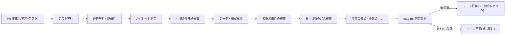
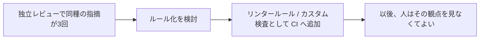

参照モデルの原則「**合意済みルールはすべて機械化して CI に載せ、人の目を通さない**」を実装します。人間の検証帯域を判断業務に温存するための、最重要の実装ポイントです。

## G-5(自動検証)のパイプライン構成


```mermaid
graph LR
  PR["PR 作成(AI実装+テスト)"] --> T["テスト実行"]
  T --> S["静的解析・脆弱性"]
  S --> C["カバレッジ判定"]
  C --> W["仕様の曖昧語検査"]
  W --> V["データ・様式検証"]
  V --> I["知財潔白性の検査"]
  I --> K["秘匿情報の混入検査"]
  K --> D["依存の追加・更新の出力"]
  D --> G["gate-g5: 判定集約"]
  G -->|全通過| M["マージ可能(G-6 独立レビューへ)"]
  G -->|1つでも失敗| X["マージ不可(差し戻し)"]
```

GitHub Actions での骨格例:

```yaml
name: gate-g5
on: [pull_request]
jobs:
  test:
    runs-on: ubuntu-latest
    steps:
      - uses: actions/checkout@v4
      - run: npm ci && npm test -- --coverage
      - name: カバレッジ判定(新規コード80%目安・組織で調整)
        run: npx coverage-check --threshold 80
  static-analysis:
    runs-on: ubuntu-latest
    steps:
      - uses: actions/checkout@v4
      - name: 静的解析・脆弱性(Critical/High は 0 件で失敗させる)
        run: |
          npx eslint . --max-warnings 0
          npm audit --audit-level=high
  spec-lint:
    runs-on: ubuntu-latest
    steps:
      - uses: actions/checkout@v4
      - name: 仕様・ドキュメントの曖昧語検査(禁止語リスト)
        run: npx textlint "specs/**/*.md" "docs/**/*.md"
  ip-clearance:
    runs-on: ubuntu-latest
    steps:
      - uses: actions/checkout@v4
      - name: 依存関係のライセンス検査(合否条件・G-5 基準5)
        run: |
          npx license-checker --production --summary
          npx license-checker --production --onlyAllow "$ALLOWED_LICENSES" --excludePrivatePackages
        env:
          ALLOWED_LICENSES: 'MIT;Apache-2.0;BSD-2-Clause;BSD-3-Clause;ISC'
      - name: 類似の検知(記録のみ・合否条件にしない)
        continue-on-error: true
        run: node scripts/similarity-scan.mjs --out evidence/ip/similarity.json
      - uses: actions/upload-artifact@v4
        with:
          name: ip-clearance-${{ github.event.pull_request.number }}
          path: evidence/ip/
  secret-scan:
    runs-on: ubuntu-latest
    steps:
      - uses: actions/checkout@v4
        with:
          fetch-depth: 0
      - name: 秘匿情報の混入検査(G-5 基準7・検出で失敗させる)
        run: npx secretlint "**/*"
  dependency-diff:
    runs-on: ubuntu-latest
    steps:
      - uses: actions/checkout@v4
      - name: 依存の追加・更新を PR へ機械出力(G-5 基準8)
        run: node scripts/dependency-diff.mjs --base origin/main --comment
  gate-g5:
    needs: [test, static-analysis, spec-lint, ip-clearance, secret-scan, dependency-diff]
    runs-on: ubuntu-latest
    steps:
      - run: echo "G-5 all green"
```

- 最後の `gate-g5` ジョブが、ルールセットの必須ステータスチェック名になる([Git 戦略](/process-compass/phase5-implementation/git-strategy/)と対応)
- **曖昧語検査は textlint で実装できる**。ゲート基準 G-2 の禁止語リスト(「適切に」「柔軟に」等)をカスタムルール化し、仕様書を機械検査する

### 知財潔白性の2つのジョブを分ける

`ip-clearance` の中で、**合否条件にするステップと記録だけを残すステップを分けています**。設計の根拠は[第4章 G-5](/process-compass/phase4-process-design/gate-criteria/)によります。

| ステップ | 扱い | 理由 |
| --- | --- | --- |
| 依存関係のライセンス検査 | **失敗させる**(合否条件) | 実務として確立しており、判定材料が観測可能な事実に限られる |
| 類似の検知 | `continue-on-error: true` で**失敗させない**。成果物として保存する | 検知に完全さを期待できない。失敗しなかったことを潔白の根拠にしないため |

- `ALLOWED_LICENSES` は案件ごとに定める。**許可リスト方式にする**。禁止リスト方式では、リストにない新しいライセンスが素通りする
- ライセンスを判定できない依存が残る場合、技術負債台帳(テンプレ3)へ記録して通過させる。**判定できないことを隠して通過させない**
- 類似の検知の実装は、利用する AI サービスが提供する機能、または独立のツールによる。**本標準は特定の手段を指定しない**。指定すると、手段の提供条件が変わったときに規定が破綻する
- 生成した記録は成果物として保存し、[出荷判定(G-7)のエビデンス集約](#出荷判定g-7エビデンスの自動集約)へ渡す(G-7 判定基準8)

### 秘匿情報の検査は履歴の全体を対象にする

`fetch-depth: 0` を指定しているのは、差分だけを検査すると**過去のコミットで混入した値を見落とす**ためです。混入した資格情報は、削除するコミットを積んでも履歴から取り出せます。

- 検出時の一次対応は当該資格情報の無効化である。実装の修正を先に行わない([第4章 G-5 基準7](/process-compass/phase4-process-design/gate-criteria/))
- 検査の除外設定を、リポジトリの利用者が個別に追加できる状態にしない。除外の追加は統制側の承認を要する
- 全履歴の走査は実行時間を要する。PR 契機では差分、週次では全履歴、という二段構成でよい

### 依存の追加を PR の記述へ出力する

`dependency-diff` は合否を判定しません。**追加・更新された依存の一覧を PR へ出力し、独立レビュー(G-6)の確認対象にすることが目的です**。

| 出力する項目 | 用途 |
| --- | --- |
| 追加・更新されたパッケージ名と版 | 追加の必要性の確認 |
| 直接依存か推移的依存かの区別 | 意図しない取り込みの検出 |
| 各パッケージのライセンス | 基準5の判定結果との突合 |

ライセンスの適合は `ip-clearance` が機械判定します。**この出力を読んでライセンスを人間が判定させる運用にしないでください**。判定の場が二重になり、機械判定の結果が参考値へ格下げされます。

### 独立レビュー(G-6)への引き継ぎ

G-5 のパイプラインでは、独立レビュアが読む[レビューパッケージ](/process-compass/phase5-implementation/review-package/)も生成します。**生成は機械的な導出に限り、要約と評価を含めません**。提示の順序に制約があるため、構成と生成方法は当該ページに規定します。

## ゲートの前提条件を機械検査する(D-0 の統制)

[第4章](/process-compass/phase4-process-design/gate-criteria/)が区別する「前提条件」は、判定基準と違って人の判断を介在させません。整っていなければ審議を開始しない、という二値の検査です。

企画承認(G-1)の前提条件である意思決定・エスカレーション体制図(D-0)を例に、構成を示します。

```markdown
<!-- docs/governance/P-042-d0.md の frontmatter -->
---
project_id: P-042
version: v1.2
approver: <氏名>
approved_at: 2026-08-05T10:30:00+09:00
approval_scope: 権限配分と通知経路への合意
next_review: 2026-11-05
---
```

```yaml
# .github/workflows/gate-entry.yml(構成例)
name: gate-entry
on:
  pull_request:
  schedule:
    - cron: '0 0 * * 1' # 週次で期限切れを検出する
jobs:
  d0-check:
    runs-on: ubuntu-latest
    steps:
      - uses: actions/checkout@v4
      - name: D-0 の存在・承認・有効期限を検査
        run: node scripts/governance/check-d0.mjs
```

検査する内容は次のとおりです。

| # | 検査 | 失敗時の扱い |
| --- | --- | --- |
| 1 | 案件IDに対応する D-0 ファイルが存在する | G-1 の審議を開始できない |
| 2 | `approver` と `approved_at` が空でない | 同上 |
| 3 | `next_review` が未来日である | ステージ移行ゲート(SG)の判定を開始できない |
| 4 | 表5(役割と現任者の対応)の空欄がない | 同上 |

期限切れの検出を週次で回すことが要点です。前提条件を PR 契機だけで検査すると、変更のない案件の D-0 は永久に検査されません。

### 承認記録を監査証跡として成立させる

[第6章 テンプレ0](/process-compass/phase4-process-design/deliverable-templates/)が求める記録要件を、Git の機能へ対応づけます。

| 記録要件 | 実装 |
| --- | --- |
| 承認者を後から同定できる | 所有者定義ファイルで決定者を指定し、所有者のレビューを必須にする |
| 承認の日時が記録されている | 承認 PR のマージ日時 |
| 承認が何に対するものかが明記されている | PR 様式に承認の対象と意味を記載させる |
| 変更の履歴が保持される | 版管理。過去の版を書き換えない |
| 改ざん耐性 | 署名済みコミットのみを許可する設定(規制対象の場合) |

アカウントと実在する人物の対応表は、リポジトリの外側で保守します。この対応表がない場合、承認者の同定は成立しません。

## 「人が毎回指摘すること」を CI へ移す運用

CI ゲートは一度作って終わりではなく、**独立レビューの指摘を吸い上げて成長させます**。


```mermaid
graph LR
  R["独立レビューで同種の指摘が3回"] --> L["ルール化を検討"]
  L --> CI["リンタールール / カスタム検査として CI へ追加"]
  CI --> F["以後、人はその観点を見なくてよい"]
```

- 目安は「同種の指摘が3回出たらルール化を検討」。レビューコメントのラベル付け(`rule-candidate`)で候補を収集する
- 逆に、機械化できない指摘(設計の妥当性・仕様との一致)こそが人間のレビューの本務として残る

## 様式・データの検証もゲートに載せる

成果物テンプレートの様式は、CI で検査できます。

| 検査対象 | 方法 | 落とす条件 |
| --- | --- | --- |
| 機能仕様書 | frontmatter・必須節の存在チェック+曖昧語検査 | 必須欄の欠落、禁止語の使用 |
| 負債台帳 | スキーマ検証(列の欠落・状態の不正値) | 様式違反 |
| コミット | トレーラ検査(Spec: / Co-Authored-By:) | 参照の欠落(規制業テーラリング時) |
| プロセスデータ | スキーマ検証(Zod 等の型定義) | 型違反でビルド失敗 |

:::note
本サイト自体がこの構成の実例です。日本語文書は textlint、内部リンクはビルド時検証、プロセスデータは Zod スキーマで検査され、どれか1つでも失敗すると `npm run check` が落ちます。「合意したルールの機械化」はドキュメントプロジェクトでも同じ形で機能します。
:::

## 出荷判定(G-7)エビデンスの自動集約

出荷判定を「記録の突合」に限定するには、突合対象が自動で揃っている必要があります。

```yaml
name: ship-evidence
on:
  push:
    tags: ['v*']
jobs:
  aggregate:
    runs-on: ubuntu-latest
    steps:
      - uses: actions/checkout@v4
      - name: エビデンス集約(前タグからの差分に対して)
        run: node scripts/aggregate-evidence.mjs --from "$(git describe --tags --abbrev=0 HEAD^)" --to "$GITHUB_REF_NAME"
      - uses: actions/upload-artifact@v4
        with:
          name: ship-evidence-${{ github.ref_name }}
          path: evidence/
```

### 集約スクリプトの入出力仕様

**対象範囲**: 前リリースタグ(`--from`)から今回タグ(`--to`)までにマージされた全 PR。

**入力(3系統)**:

| 系統 | 取得内容 | 取得手段 |
| --- | --- | --- |
| GitHub API | 対象 PR の一覧、G-6 承認記録(承認者・挙動要約・日時)、必須チェック(gate-g5)の結果 | `gh api`(トークンはワークフローの `GITHUB_TOKEN`) |
| CI 成果物 | テスト消化数・カバレッジ・静的解析と脆弱性の指摘件数、統合検証(非機能)の判定結果、**知財潔白性の検査記録** | 各ワークフローが保存した artifact / JSON |
| リポジトリ内の記録 | 負債台帳の差分(新規記録・返却)、ゲート判定記録、運用引き継ぎ文書の更新有無 | 固定様式(テンプレ3・4・5)の Markdown をパース |

**出力(2ファイル、`evidence/` 配下)**:

- `evidence.json` — 機械可読の集約結果。ダッシュボード・監査ツールの入力になる

```json
{
  "range": { "from": "v1.3.0", "to": "v1.4.0" },
  "prs": [{ "number": 123, "spec": "F-012/Task-3", "g5": "passed",
            "g6": { "approver": "...", "summaryPresent": true } }],
  "tests": { "planned": 214, "executed": 214, "coverage": 0.87 },
  "defects": { "criticalOpen": 0 },
  "debt": { "added": ["D-031"], "paid": ["D-018"], "unrecorded": [] },
  "handover": { "updated": true },
  "ipClearance": { "licenseScan": "passed", "unresolvedDeps": [],
                   "similarityScanRun": true, "findings": [], "scannedAt": "..." },
  "seededErrors": { "scanRun": true, "residual": 0, "openDrills": [] },
  "gaps": []
}
```

- `quality-report.md` — 品質レポート(テンプレ様式)。G-7 の判定基準4項目と1対1の節構成で、QA が読んで署名する

**判定基準との対応と欠落時の挙動**:

| G-7 判定基準 | evidence.json の対応フィールド | 欠落時 |
| --- | --- | --- |
| テスト消化率 100% | `tests.executed / tests.planned` | `gaps` に記録しジョブを **fail** |
| 未解決の重大欠陥 0 件 | `defects.criticalOpen` | 同上 |
| 受容した負債の台帳記録 | `debt.unrecorded`(コミットの TODO と台帳の突合) | 同上 |<!-- tone-ok: 検査対象としての TODO への言及 -->
| 運用引き継ぎ文書の完備 | `handover.updated` | 同上 |
| (前提)全 PR の G-6 通過 | `prs[].g6.summaryPresent` がすべて true | 同上 |
| 知財潔白性の検査記録 | `ipClearance`(検査の**実施**と結果の記録の有無) | 同上 |
| (欠陥注入を運用する場合)注入の残存 | `seededErrors`(実施記録と残存件数) | 同上。`residual` が 0 でない場合も **fail** |

- **欠落があればジョブを fail させ、不完全なレポートで G-7 を始めない**(「あとで揃えます」を構造的に禁止する)
- `ipClearance` で fail させる条件は、**検査を実施していないこと、または記録が欠けていること**である。`findings` が空でないことでは fail させない。指摘が出た項目は、除去・代替実装・表示の追加・受容の決裁のいずれかを記録して通過させる
- `seededErrors` は、`residual` が 0 でない場合も fail させる。知財潔白性と扱いが分かれるのは、注入の残存が観測可能な事実であり、判定に推定を含まないためである。遮断の設計は[欠陥注入の隔離設計](/process-compass/phase5-implementation/seeded-error-safety/)による
- `gaps` には「何が・どの PR / 記録で欠けているか」を人が直せる粒度で書き出す

QA はこの自動生成レポートとチェックリストを突合するだけで判定できます。集約を人手でやると G-7 が滞留するため、**エビデンス集約の自動化は出荷判定の前提**と位置づけます。

## デプロイゲート

- リリース決裁(G-8)は GitHub Environments の approval(環境保護ルール)で実装できる。`production` 環境に事業決裁者を required reviewer として設定すれば、決裁の記録も自動で残る
- ロールバック手順は運用引き継ぎ文書(テンプレ5)に記載し、デプロイ自動化とセットで整備する
