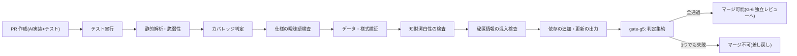
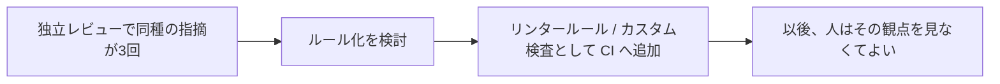

参照モデルの原則「**合意済みルールはすべて機械化して CI に載せ、人の目を通さない**」を実装します。人間の検証帯域を判断業務に温存するための、最重要の実装ポイントです。

## G-5(自動検証)のパイプライン構成


```mermaid
graph LR
  PR["PR 作成(AI実装+テスト)"] --> T["テスト実行"]
  T --> S["静的解析・脆弱性"]
  S --> C["カバレッジ判定"]
  C --> W["仕様の曖昧語検査"]
  W --> V["データ・様式検証"]
  V --> I["知財潔白性の検査"]
  I --> K["秘匿情報の混入検査"]
  K --> D["依存の追加・更新の出力"]
  D --> G["gate-g5: 判定集約"]
  G -->|全通過| M["マージ可能(G-6 独立レビューへ)"]
  G -->|1つでも失敗| X["マージ不可(差し戻し)"]
```

GitHub Actions での骨格例:

```yaml
name: gate-g5
on: [pull_request]
jobs:
  test:
    runs-on: ubuntu-latest
    steps:
      - uses: actions/checkout@v4
      - run: npm ci && npm test -- --coverage
      - name: カバレッジ判定(新規コード80%目安・組織で調整)
        run: npx coverage-check --threshold 80
  static-analysis:
    runs-on: ubuntu-latest
    steps:
      - uses: actions/checkout@v4
      - name: 静的解析・脆弱性(Critical/High は 0 件で失敗させる)
        run: |
          npx eslint . --max-warnings 0
          npm audit --audit-level=high
  spec-lint:
    runs-on: ubuntu-latest
    steps:
      - uses: actions/checkout@v4
      - name: 仕様・ドキュメントの曖昧語検査(禁止語リスト)
        run: npx textlint "specs/**/*.md" "docs/**/*.md"
  ip-clearance:
    runs-on: ubuntu-latest
    steps:
      - uses: actions/checkout@v4
      - name: 依存関係のライセンス検査(合否条件・G-5 基準5)
        run: |
          npx license-checker --production --summary
          npx license-checker --production --onlyAllow "$ALLOWED_LICENSES" --excludePrivatePackages
        env:
          ALLOWED_LICENSES: 'MIT;Apache-2.0;BSD-2-Clause;BSD-3-Clause;ISC'
      - name: 類似の検知(記録のみ・合否条件にしない)
        continue-on-error: true
        run: node scripts/similarity-scan.mjs --out evidence/ip/similarity.json
      - uses: actions/upload-artifact@v4
        with:
          name: ip-clearance-${{ github.event.pull_request.number }}
          path: evidence/ip/
  secret-scan:
    runs-on: ubuntu-latest
    steps:
      - uses: actions/checkout@v4
        with:
          fetch-depth: 0
      - name: 秘匿情報の混入検査(G-5 基準7・検出で失敗させる)
        run: npx secretlint "**/*"
  dependency-diff:
    runs-on: ubuntu-latest
    steps:
      - uses: actions/checkout@v4
      - name: 依存の追加・更新を PR へ機械出力(G-5 基準8)
        run: node scripts/dependency-diff.mjs --base origin/main --comment
  gate-g5:
    needs: [test, static-analysis, spec-lint, ip-clearance, secret-scan, dependency-diff]
    runs-on: ubuntu-latest
    steps:
      - run: echo "G-5 all green"
```

- 最後の `gate-g5` ジョブが、ルールセットの必須ステータスチェック名になる([Git 戦略](/process-compass/phase5-implementation/git-strategy/)と対応)
- **曖昧語検査は textlint で実装できる**。ゲート基準 G-2 の禁止語リスト(「適切に」「柔軟に」等)をカスタムルール化し、仕様書を機械検査する

### 知財潔白性の2つのジョブを分ける

`ip-clearance` の中で、**合否条件にするステップと記録だけを残すステップを分けています**。設計の根拠は[第4章 G-5](/process-compass/phase4-process-design/gate-criteria/)によります。

| ステップ | 扱い | 理由 |
| --- | --- | --- |
| 依存関係のライセンス検査 | **失敗させる**(合否条件) | 実務として確立しており、判定材料が観測可能な事実に限られる |
| 類似の検知 | `continue-on-error: true` で**失敗させない**。成果物として保存する | 検知に完全さを期待できない。失敗しなかったことを潔白の根拠にしないため |

- `ALLOWED_LICENSES` は案件ごとに定める。**許可リスト方式にする**。禁止リスト方式では、リストにない新しいライセンスが素通りする
- ライセンスを判定できない依存が残る場合、技術負債台帳(テンプレ3)へ記録して通過させる。**判定できないことを隠して通過させない**
- 類似の検知の実装は、利用する AI サービスが提供する機能、または独立のツールによる。**本標準は特定の手段を指定しない**。指定すると、手段の提供条件が変わったときに規定が破綻する
- 生成した記録は成果物として保存し、[出荷判定(G-7)のエビデンス集約](#出荷判定g-7エビデンスの自動集約)へ渡す(G-7 判定基準8)

### 秘匿情報の検査は履歴の全体を対象にする

`fetch-depth: 0` を指定しているのは、差分だけを検査すると**過去のコミットで混入した値を見落とす**ためです。混入した資格情報は、削除するコミットを積んでも履歴から取り出せます。

- 検出時の一次対応は当該資格情報の無効化である。実装の修正を先に行わない([第4章 G-5 基準7](/process-compass/phase4-process-design/gate-criteria/))
- 検査の除外設定を、リポジトリの利用者が個別に追加できる状態にしない。除外の追加は統制側の承認を要する
- 全履歴の走査は実行時間を要する。PR 契機では差分、週次では全履歴、という二段構成でよい

### 依存の追加を PR の記述へ出力する

`dependency-diff` は合否を判定しません。**追加・更新された依存の一覧を PR へ出力し、独立レビュー(G-6)の確認対象にすることが目的です**。

| 出力する項目 | 用途 |
| --- | --- |
| 追加・更新されたパッケージ名と版 | 追加の必要性の確認 |
| 直接依存か推移的依存かの区別 | 意図しない取り込みの検出 |
| 各パッケージのライセンス | 基準5の判定結果との突合 |

ライセンスの適合は `ip-clearance` が機械判定します。**この出力を読んでライセンスを人間が判定させる運用にしないでください**。判定の場が二重になり、機械判定の結果が参考値へ格下げされます。

### 独立レビュー(G-6)への引き継ぎ

G-5 のパイプラインでは、独立レビュアが読む[レビューパッケージ](/process-compass/phase5-implementation/review-package/)も生成します。**生成は機械的な導出に限り、要約と評価を含めません**。提示の順序に制約があるため、構成と生成方法は当該ページに規定します。

## ゲートの前提条件を機械検査する(D-0 の統制)

[第4章](/process-compass/phase4-process-design/gate-criteria/)が区別する「前提条件」は、判定基準と違って人の判断を介在させません。整っていなければ審議を開始しない、という二値の検査です。

企画承認(G-1)の前提条件である意思決定・エスカレーション体制図(D-0)を例に、構成を示します。

```markdown
<!-- docs/governance/P-042-d0.md の frontmatter -->
---
project_id: P-042
version: v1.2
approver: <氏名>
approved_at: 2026-08-05T10:30:00+09:00
approval_scope: 権限配分と通知経路への合意
next_review: 2026-11-05
---
```

```yaml
# .github/workflows/gate-entry.yml(構成例)
name: gate-entry
on:
  pull_request:
  schedule:
    - cron: '0 0 * * 1' # 週次で期限切れを検出する
jobs:
  d0-check:
    runs-on: ubuntu-latest
    steps:
      - uses: actions/checkout@v4
      - name: D-0 の存在・承認・有効期限を検査
        run: node scripts/governance/check-d0.mjs
```

検査する内容は次のとおりです。

| # | 検査 | 失敗時の扱い |
| --- | --- | --- |
| 1 | 案件IDに対応する D-0 ファイルが存在する | G-1 の審議を開始できない |
| 2 | `approver` と `approved_at` が空でない | 同上 |
| 3 | `next_review` が未来日である | ステージ移行ゲート(SG)の判定を開始できない |
| 4 | 表5(役割と現任者の対応)の空欄がない | 同上 |

期限切れの検出を週次で回すことが要点です。前提条件を PR 契機だけで検査すると、変更のない案件の D-0 は永久に検査されません。

### 承認記録を監査証跡として成立させる

[第6章 テンプレ0](/process-compass/phase4-process-design/deliverable-templates/)が求める記録要件を、Git の機能へ対応づけます。

| 記録要件 | 実装 |
| --- | --- |
| 承認者を後から同定できる | 所有者定義ファイルで決定者を指定し、所有者のレビューを必須にする |
| 承認の日時が記録されている | 承認 PR のマージ日時 |
| 承認が何に対するものかが明記されている | PR 様式に承認の対象と意味を記載させる |
| 変更の履歴が保持される | 版管理。過去の版を書き換えない |
| 改ざん耐性 | 署名済みコミットのみを許可する設定(規制対象の場合) |

アカウントと実在する人物の対応表は、リポジトリの外側で保守します。この対応表がない場合、承認者の同定は成立しません。

## 「人が毎回指摘すること」を CI へ移す運用

CI ゲートは一度作って終わりではなく、**独立レビューの指摘を吸い上げて成長させます**。


```mermaid
graph LR
  R["独立レビューで同種の指摘が3回"] --> L["ルール化を検討"]
  L --> CI["リンタールール / カスタム検査として CI へ追加"]
  CI --> F["以後、人はその観点を見なくてよい"]
```

- 目安は「同種の指摘が3回出たらルール化を検討」。レビューコメントのラベル付け(`rule-candidate`)で候補を収集する
- 逆に、機械化できない指摘(設計の妥当性・仕様との一致)こそが人間のレビューの本務として残る

## 様式・データの検証もゲートに載せる

成果物テンプレートの様式は、CI で検査できます。

| 検査対象 | 方法 | 落とす条件 |
| --- | --- | --- |
| 機能仕様書 | frontmatter・必須節の存在チェック+曖昧語検査 | 必須欄の欠落、禁止語の使用 |
| 負債台帳 | スキーマ検証(列の欠落・状態の不正値) | 様式違反 |
| コミット | トレーラ検査(Spec: / Co-Authored-By:) | 参照の欠落(規制業テーラリング時) |
| プロセスデータ | スキーマ検証(Zod 等の型定義) | 型違反でビルド失敗 |

:::note
本サイト自体がこの構成の実例です。日本語文書は textlint、内部リンクはビルド時検証、プロセスデータは Zod スキーマで検査され、どれか1つでも失敗すると `npm run check` が落ちます。「合意したルールの機械化」はドキュメントプロジェクトでも同じ形で機能します。
:::

## 出荷判定(G-7)エビデンスの自動集約

出荷判定を「記録の突合」に限定するには、突合対象が自動で揃っている必要があります。

```yaml
name: ship-evidence
on:
  push:
    tags: ['v*']
jobs:
  aggregate:
    runs-on: ubuntu-latest
    steps:
      - uses: actions/checkout@v4
      - name: エビデンス集約(前タグからの差分に対して)
        run: node scripts/aggregate-evidence.mjs --from "$(git describe --tags --abbrev=0 HEAD^)" --to "$GITHUB_REF_NAME"
      - uses: actions/upload-artifact@v4
        with:
          name: ship-evidence-${{ github.ref_name }}
          path: evidence/
```

### 集約スクリプトの入出力仕様

**対象範囲**: 前リリースタグ(`--from`)から今回タグ(`--to`)までにマージされた全 PR と、PR を経ていないコミット。

- **コミットを PR の変更として扱うのは、そのコミットが当該 PR のマージコミットと一致する場合に限る**。件名に `(#N)` を持つコミットでも、PR #N のマージコミットと一致しなければ、PR を経ていないコミットとして扱う。件名へ番号を書くだけでは、承認済みの PR の変更に数えない
- マージコミットを取得できない PR の番号を件名に持つコミットも、PR を経ていないコミットとして扱い、その旨を表示する
- 取り消しのコミット(件名が `Revert "… (#N)"` の形になる)も、同じ規則で扱う。取り消しが別の PR を経ていれば、その PR の変更として数える
- 構成の初期化の記録(`changeLog[]` の1件目)より前の履歴(`pre-init`)は、変更の件数に数えず、欠落にもしない。製品のコード(記録の置き場の外)を変えたコミットは、件数を保証の開示の項目1・5 に出し、品質レポートに一覧を出す。テンプレート由来の初期コミット(親を持たず、テンプレートのファイルだけを持つもの)は、一覧から除いて件数だけ出す

**入力(4系統)**:

| 系統 | 取得内容 | 取得手段 |
| --- | --- | --- |
| GitHub API | 対象 PR のマージコミット、PR 本文(作成を指示した者・リスク区分・検証方法と結果)、G-6 承認記録(レビューしたアカウント・レビューの状態・本文・日時)、必須チェック(gate-g5)の結果 | `gh`(トークンはワークフローの `GITHUB_TOKEN`) |
| CI 成果物 | カバレッジの測定結果、依存の追加・更新の出力、依存関係のライセンス検査の記録、欠陥注入による検出率の記録 | 各ワークフローが保存した artifact / JSON |
| リポジトリ内の記録 | 技術負債台帳(区分・状態・例外承認の行)、ゲート判定記録、運用引き継ぎ文書の有無、構成(`process.config.json`)と変化点の記録 | 固定様式(テンプレ3・4・5)の Markdown をパース |
| コミット | トレーラ(`Spec`・`Delegated`・`Co-Authored-By`・`Risk`・`Verification`)、変更したファイル | `git log` |

**準拠テンプレートの集約が取り込んでいないものがあります**。テストの計画数と消化数、未解決の欠陥の件数、静的解析と脆弱性の指摘件数、統合検証(非機能)の判定結果、類似の検知の記録です。これらに対応する G-7 の基準は、機械では確かめていません。出荷判定者が記録と突合します(後掲「判定基準との対応」)。

**出力(3ファイル、`evidence/` 配下)**:

- `evidence.json` — 機械可読の集約結果。ダッシュボード・監査ツールの入力になる

```json
{
  "range": { "from": "v1.3.0", "to": "v1.4.0" },
  "prs": [{ "number": 123, "mergeCommit": "9f8e7d6c", "mergeMethod": "squash", "g5": "success",
            "riskClass": "R2", "delegated": false, "g6PostHoc": false,
            "authorVerificationPresent": true,
            "instructedBy": ["..."], "instructedBySource": "declared",
            "exceptionRecords": [],
            "g6": { "approvers": ["..."], "approvals": 1,
                    "independentHuman": true, "notCountedReason": null,
                    "reviewerSummaryPresent": true,
                    "reviewerSummarySource": "review" } }],
  "directChanges": [{ "commit": "1a2b3c4d", "riskClass": "R3",
                      "riskClassSource": "trailer",
                      "authorVerificationPresent": true,
                      "authorVerificationSource": "trailer", "exempt": null }],
  "gatesInRange": [{ "gate": "G-4", "records": 2 }],
  "specsWithoutG4": [],
  "preInit": { "commits": 2, "productChanges": [{ "commit": "5e6f7a8b", "files": 3 }],
               "templateOrigin": 1, "recordOnly": 0 },
  "criteria": [{ "id": 1, "machine": "not-checked", "result": null,
                 "humanReconcile": "G-7 の判定記録の「未消化のテスト」" }],
  "g8Objection": { "matters": [], "notJudged": [], "records": [] },
  "tests": { "coverage": { "measured": true, "pct": 87, "threshold": 80 } },
  "debt": { "ledgerPresent": true },
  "handover": { "updated": true },
  "ipClearance": { "scanRun": true, "result": "passed" },
  "gaps": []
}
```

- `assurance-disclosure.external.md` — 組織の外へ渡す形の保証の開示(後掲「組織の外へ渡す出力」)
- `quality-report.md` — 品質レポート(テンプレ様式)。[第4章 G-7](/process-compass/phase4-process-design/gate-criteria/)の判定基準(2026-10-01 時点で基準1〜9)と突合できる節構成で、出荷判定者が読んで署名する。基準と出力の対応は下表による

### 判定基準との対応(機械が確かめる範囲と、人が突合する範囲)

**集約は、G-7 の基準1〜9 のすべてを機械で確かめるものではありません**。準拠テンプレートの実装(2026-10-01 時点)が機械で確かめる範囲と、出荷判定者が記録と突合する範囲は、基準ごとに次のとおりです。品質レポートは、基準ごとに、機械が確かめた結果を出します。機械で確かめていない基準には、「機械では確かめていない。出荷判定者が次の記録と突合する」と、突合する記録を出します(`criteria[]`。`machine` は `checked`・`partial`・`not-checked` のいずれか。品質レポートでは「G-7 の基準ごとの確認範囲」の表)。

| G-7 判定基準 | テンプレートの実装 | 機械が確かめること | 出荷判定者が突合する記録 |
| --- | --- | --- | --- |
| 1 計画したテストの消化率 | **なし** | 確かめない。テストの計画数と消化数を取り込んでいない。出力するのは、G-5 のカバレッジの測定結果(`tests.coverage`)と、PR ごとの必須チェックの結果(`prs[].g5`)に留まる | テスト計画と実行の記録。未消化がある場合は、G-7 の判定記録の「未消化のテスト」 |
| 2 未解決の欠陥 | **なし** | 確かめない。欠陥の台帳を持たず、既知の不具合は「記録なし」と出力する | 欠陥管理の記録と、[第4章](/process-compass/phase4-process-design/gate-criteria/)の欠陥トリアージ基準 |
| 3 受容した負債の台帳記録 | 一部 | 技術負債台帳の有無(`debt.ledgerPresent`)。**記録漏れは検出しない**。コミットに残る未了の記述と台帳を突合していない | 変更の記録(PR 本文、判定記録)と、技術負債台帳 |
| 4 運用引き継ぎ文書 | 一部 | 文書の有無(`handover.updated`)。監視項目・障害時連絡先・復旧手順の記載は確かめない | 運用引き継ぎ文書(テンプレ5)の3項目 |
| 5 全ゲートの通過記録 | 一部 | 機械で導ける範囲に限る(下表) | 機械で導けないゲートの判定記録 |
| 6 AI 品質指標の確認 | **なし** | 確かめない | 第4章「AI 品質指標の扱い」による記録 |
| 7 (安全関連ソフトウェアのみ)安全適合性の検証記録 | **なし** | 確かめない | [附属書F](/process-compass/phase4-process-design/safety-verification/) F.7 の項目 |
| 8 知財潔白性の検査記録 | 一部 | 依存関係のライセンス検査の実施記録の有無(`ipClearance.scanRun`)。類似の検知の実施記録、判定できなかった項目の台帳記録、期限を超過した指摘は確かめない | 類似の検知の記録、台帳の記録、指摘ごとの措置と期限 |
| 9 保証の開示の完備 | あり | 7項目の出力と、導出元の記録の欠落(後掲「記載の欠落と、値として受け入れるもの」) | 機械が確かめていない事項(後掲「実装の制約」) |
| (前提)作成側の検証の記載 | あり | PR 本文の「検証方法と結果」の有無(`prs[].authorVerificationPresent`)。PR を経ていないコミットは、トレーラ `Verification`。G-6 の状態に依らない | 記載の内容 |
| (欠陥注入を運用する場合)注入の残存 | **なし** | 確かめない。集約が読むのは、検出率の記録だけである | [欠陥注入の隔離設計](/process-compass/phase5-implementation/seeded-error-safety/)による回収の記録 |

<!-- impl IMPL-0040 target=evidence-aggregation state=undelivered note="G-7 基準1。計画したテストの消化率を、出荷の証跡の集約で確かめる。計画数と消化数の取り込みが降りていない" -->
<!-- impl IMPL-0041 target=evidence-aggregation state=undelivered note="G-7 基準2。未解決の欠陥を欠陥トリアージ基準と突合する。欠陥の台帳の取り込みが降りていない" -->
<!-- impl IMPL-0042 target=evidence-aggregation state=undelivered note="G-7 基準3。受容した負債の記録漏れの検出。台帳の有無だけを確かめており、変更との突合が降りていない" -->
<!-- impl IMPL-0043 target=evidence-aggregation state=undelivered note="G-7 基準4。運用引き継ぎ文書の3項目の記載の確認。文書の有無だけを確かめている" -->
<!-- impl IMPL-0044 target=evidence-aggregation state=undelivered note="G-7 基準6。AI 品質指標の確認の記録を集約へ取り込む" -->
<!-- impl IMPL-0045 target=evidence-aggregation state=undelivered note="G-7 基準7。安全適合性の検証記録の欠落を集約で確かめる" -->
<!-- impl IMPL-0046 target=evidence-aggregation state=undelivered note="G-7 基準8。類似の検知の実施記録と、期限を超過した未処理の指摘を集約で確かめる。ライセンス検査の実施記録の有無だけを確かめている" -->
<!-- impl IMPL-0047 target=evidence-aggregation state=undelivered note="欠陥注入の残存を、出荷の証跡の集約で確かめる" -->

基準5 のうち、機械で導ける範囲は次のとおりです。出荷に対応する判定記録の数を機械で決められないゲートは、件数を表示し、人が突合する範囲として出します。

| 対象 | 機械が確かめること | 欠落時 |
| --- | --- | --- |
| 機能仕様承認(G-4) | 変更がトレーラ `Spec: F-NNN` で仕様を指す場合に、その仕様を対象とする G-4 の判定記録の有無。対応は、判定記録の「対象」欄が仕様の ID を指していることで確かめる。ファイル名だけでは対応づけない。判定記録は出荷の範囲に限らず、リポジトリ全体から探す | 判定記録が無い仕様を `gaps` に記録し **fail** |
| 自動検証(G-5) | PR ごとの必須チェック `gate-g5` の結果(`prs[].g5`) | 成功でない PR を `gaps` に記録し **fail**。結果を取得できない PR は、その旨を表示する |
| 独立レビュー(G-6) | PR ごとの承認記録と、独立した人の確認の条件(後掲「独立した人の確認の数え方」) | G-6 を適用する体制では、独立した人の確認を経ていない変更を `gaps` に記録し **fail**。G-6 の判定を事後へ移した変更と、例外承認の記録が対応づく変更(リスク区分を問わない)を除く |
| G-6 未達のまま出荷する R1 の変更の例外承認 | 独立した人の確認を経ていない R1 の変更ごとの、[第7章 7.3](/process-compass/phase4-process-design/exception-escalation/)の例外承認の記録(`prs[].exceptionRecords[]`・`directChanges[].exceptionRecords[]`) | 記録が対応づかない変更を `gaps` に記録し **fail** |
| 構成で適用するゲートごとの判定記録 | 当該出荷の範囲で追加された判定記録の、ゲートごとの件数(`gatesInRange[]`) | 範囲に1件も無ければ `gaps` に記録し **fail**。過去の出荷の判定記録では満たさない。期間を指定した実行(`--period-from`・`--period-to`)では、この検査を行わない |
| 上のほかのゲート(企画承認、要件合意、技術設計判断、出荷判定、リリース決裁) | 確かめない。件数の表示に留まる | fail させない。出荷判定者が、判定記録と突合する |

- **機械が確かめる範囲に欠落があれば、ジョブを fail させ、不完全なレポートで G-7 を始めない**(「あとで揃えます」を構造的に禁止する)
- **機械で確かめていない基準を、欠落として fail させない**。実装に無い検査を、通過したものとして表示しない。品質レポートには「機械では確かめていない」と出す
- `ipClearance` で fail させる条件は、**ライセンス検査を実施していないこと、または記録が欠けていること**である。指摘があることでは fail させない。指摘が出た項目は、除去・代替実装・表示の追加・受容の決裁のいずれかを記録して通過させる
- 期限を超過した未処理の指摘が残る場合に出荷を止める規定([第4章 G-5](/process-compass/phase4-process-design/gate-criteria/))は、集約へ実装していない。出荷判定者が、台帳の期限で確かめる
- 欠陥注入の残存を出荷の前に確かめる規定([欠陥注入の隔離設計](/process-compass/phase5-implementation/seeded-error-safety/))も、集約へ実装していない。回収の記録で確かめる
- `gaps` には「何が・どの PR / 記録で欠けているか」を人が直せる粒度で書き出す
- 「作成側の検証の記載」は、作成側が書く記録である。レビュアの挙動要約(G-6 基準2)とは別の記録であり、人確定・協働の変更では、開発者の席の人が書く。開発者の席の委任の範囲の変更では、担い手が実行結果の証拠として書く([PR 運用リファレンス](/process-compass/phase5-implementation/pr-workflow/))
- 作成側の検証の記載の欠落は、G-6 が未達・省略の構成でも `gaps` へ記録する。独立レビューを置けない体制では、人が変更ごとに残す検証の記録が、この記載だけになるためである。独立した人の確認が無いことを `gaps` へ記録するのは、G-6 を適用する構成に限る

### 保証の開示の出力

集約スクリプトは、[第4章 G-7](/process-compass/phase4-process-design/gate-criteria/)の基準9 が突合する**保証の開示**の7項目を、`evidence.json` と `quality-report.md` へ出力します。`evidence.json` では `assurance` キー、`quality-report.md` では「保証の開示」の節です。構成と既存の記録からの投影であり、人に新しい記述を書かせません。

| # | 項目 | `assurance` のキー | 導出元 |
| --- | --- | --- | --- |
| 1 | 体制と独立性の成立状況 | `independence` | 構成の `unmet[]`・`deviations[]`・`seats[]`・`people[]`(人の名簿と、人ごとのアカウント)、PR の承認記録、PR 本文の「作成を指示した者」 |
| 2 | テーラリングの宣言 | `tailoring` | 構成の `gates`(適用以外の状態と理由) |
| 3 | リスク区分ごとの件数と、確定の形態の内訳 | `changes` | PR 本文のリスク区分、コミットのトレーラ `Risk` と `Delegated`、判定記録の「確定の形態」と「リスク区分を確定した者」 |
| 4 | 機械検査の結果 | `machineChecks` | 必須チェックの結果、アダプタのコマンドの有無、CI 成果物 |
| 5 | 残存リスク、既知の不具合、未回収の例外 | `residual` | 構成の未達と逸脱、技術負債台帳の区分 |
| 6 | 検出能力の測定値と測定時点 | `detection` | 欠陥注入の記録。構成の適合性確認の記録は、検出能力の値とは別の行(`detection.conformity[]`)に出す |
| 7 | 生成の条件と、期間中の体制の変化点 | `generation` | 構成の担い手の識別と `changeLog[]`(即時通知の通知先と通知日、AI が使えなかった期間の記録を含む)、コミットの共著者、指示資産の最終変更 |

- 導けない項目は「未測定」「記録なし」を値として出力する。空欄にしない
- 値の良否でジョブを fail させない。fail させるのは記録の欠落だけである
- AI が作った要約と評価を、項目の値にしない
- 独立した人の確認を経ていない変更が1件でもある場合は、[附属書H H.6](/process-compass/phase4-process-design/assurance-case/)の定型の文を件数とともに出力する
- 出荷判定者の席と事業決裁者の席の責任者が同一人物である体制(1〜2名の体制の逸脱)では、項目1 へ「異議を書く者と、残存リスクを受容する者が同一である」と出力する([第3章 3.5](/process-compass/phase4-process-design/roles-responsibilities/))
- 項目1・3・6 には、前回の出荷の値を併記する。項目6 が「未測定」のときは、未測定が続いている期間を併記する(附属書H H.6)
- 項目3 のリスク区分が、作成を指示した者の自己記載だけに依る場合は、その旨を出力する。区分を確定した者の記名は、判定記録から取る([第3章 3.8.1](/process-compass/phase4-process-design/roles-responsibilities/))
- 項目6 の AI の層には、欠陥注入による検出率だけを出す。適合性確認(第3章 3.4.2)の結果は、「適合性確認の結果」として別の行に出す。検出能力の測定値として出さない
- 出荷判定者の異議で理由の記載を要する事項(第4章 G-8「出荷判定者の異議」)に当たるかを、値から判定して出力する(`assurance.objectionMatters`)。判定できなかった事項は、その旨を出力する
- 構成の初期化より前に製品のコードを変えたコミットがある場合は、件数を項目1 と項目5 に出す。一覧は品質レポートの「変更単位」に出す。欠落にはしない
- 項目7 の即時通知の通知先は、名簿の人へ正規化した氏名で出す。名簿の人でない名義(品質保証部門の通知先など)は、その旨を添えて出す
- 項目7 の変化点に人の名簿の表記の変更(`rosterEdits`)があれば、旧い値と新しい値を概要へ出す。席の責任者の行なら、その席も出す。組織の外へ渡す形では、氏名とアカウントを出さず件数で出す

`assurance` の主なキーは次のとおりです。

| キー | 内容 |
| --- | --- |
| `independence.changes` | `total`(変更の件数)、`withoutIndependentHuman`、`approvalRecordNotFound`、`approverNotInRoster`、`withoutReviewerSummary`、`r1WithoutException`、`instructorsByDefault`、`unconfirmed`(数えなかった理由ごとの件数) |
| `independence.r1WithoutIndependentHuman` | 独立した人の確認を経ていない R1 の変更の件数と、例外承認の記録の有無 |
| `independence.unclassifiedWithoutIndependentHuman` | リスク区分が未記入で、独立した人の確認を経ていない変更の件数。R1 かどうかを判定していない |
| `independence.reviewerSummary` | レビュアの挙動要約を伴う承認の件数と、挙動要約が無いために数えなかった承認の件数 |
| `changes.byReviewerSeat`・`changes.notByReviewerSeat` | 独立した人の確認に数えた変更のうち、承認した者が独立レビュアの席の責任者である件数と、そうでない件数。`gaps` にしない |
| `changes.withdrawnApprovals` | 承認の後に同じ人が変更要求を出し、数えなかった承認の件数(PR ごとには `prs[].g6.withdrawnApprovals`) |
| `independence.objectionSelfAccepted` | 出荷判定者の席と事業決裁者の席の責任者が同一人物であるか。同一の場合、項目1 へ「異議を書く者と、残存リスクを受容する者が同一である」と出す |
| `residual.exceptedChanges` | 例外承認の記録が対応づき、`gaps` にしなかった変更。未回収の例外として項目5 に出す |
| `independence.preInit`・`residual.preInitProductChanges` | 構成の初期化より前に、製品のコードを変えたコミットの件数と、テンプレート由来の初期コミットの件数。一覧は `evidence.json` の `preInit.productChanges` |
| `independence.accountsRegistered` | 人の名簿にアカウントが1件でも登録されているか。登録が無ければ、すべての承認を未確認に数える |
| `changes.delegated` | `inScope`(トレーラ `Delegated` で識別した、規則の範囲の変更)、`withIndependentHuman`(うち、独立した人が事前に承認した変更)、`withoutPriorHuman`(うち、独立した人の事前の承認が無い委任の変更)、`withoutPriorHumanBreakdown`(その内訳。`g6PostHoc` は G-6 を事後へ移した変更で、本標準のいう「人の事前確認を経ていない変更」。`other` はそれ以外の未確認の変更)、`outOfScope`(範囲の逸脱) |
| `changes.directCommits` | PR を経ていないコミットの件数。リスク区分ごとの件数と、対象外にした件数(`exempt.recordOnly`・`exempt.empty`。初期化の記録より前の履歴は `preInit`) |
| `detection.conformity[]` | 席ごとの適合性確認の結果と確認日。検出能力の測定値ではない |
| `detectionExternal` | 項目6 の、組織の外へ渡す形。値を含まない |
| `objectionMatters` | `matters[]`(当たった事項)、`notJudged[]`(判定できなかった事項と理由) |

#### 記載の欠落と、値として受け入れるもの

G-7 の基準9 が差し戻すのは、記載の欠落です。集約は、欠落を次のとおり判定します。

| 区分 | 該当するもの | 扱い |
| --- | --- | --- |
| 欠落 | 7項目のいずれかが出力に無い | `gaps` に記録し **fail** |
| 欠落 | 導出元の記録が無い(下表の事象) | 同上 |
| 欠落でない | 「未測定」「記録なし」と出力された項目 | 値として出力する。開示された事実であり、G-8 の受容と、出荷判定者の異議の対象になる |

`gaps` へ記録し、ジョブを fail させる事象は次のとおりです。

| 検出する事象 | 対応づけの方法 | 規定 |
| --- | --- | --- |
| G-6 を適用する構成で、独立した人の確認を経ていない変更がある。G-6 を事後へ移した変更と、例外承認の記録が対応づく変更を除く | PR の承認記録と、後掲「独立した人の確認の数え方」の条件。承認の記録があっても、条件を満たさなければ欠落である。PR を経ていないコミットも当たる | 第4章 G-6、G-7 基準5 |
| 作成側の検証の記載が無い。G-6 の状態に依らない | PR 本文の「検証方法と結果」。PR を経ていないコミットは、トレーラ `Verification`。書き忘れたコミットは、判定記録で確定できる(後述) | 第5章 5.5.6 |
| 独立した人の確認を経ていない R1 の変更に、例外承認の記録が対応づかない | 後掲「例外承認の記録が対応づく条件」による | 第4章 G-6・G-7 基準5、[第7章 7.3](/process-compass/phase4-process-design/exception-escalation/) |
| PR のリスク区分が未記入である。選択肢を残したままの欄も未記入として扱う | PR 本文の「リスク区分」 | 第3章 3.8.1 |
| PR を経ていないコミットに、リスク区分の記録が無い | コミットのトレーラ `Risk: R1 / R2 / R3`。書き忘れたコミットは、判定記録で確定できる(後述) | 第3章 3.8.1 |
| 委任の範囲の逸脱(トレーラが指す規則の対象外のファイルを含む、規則が無い、規則が有効に成立していない、確約範囲とコア指定のパスが未登録である、リスク区分が R3 でない) | コミットのトレーラ `Delegated` と、当該コミットの直前の構成の規則、変更のリスク区分 | [第5章 5.5.4](/process-compass/phase4-process-design/human-ai-boundary/)の条件2・5・7 |
| 判定記録が参照する D-0 の版と、判定の時点で構成が追随していた版の不一致 | 判定記録の「参照した D-0 の版」と判定日時、`changeLog[]` の版と時刻(後述) | 第3章 3.13.5 |
| 当該出荷の範囲で追加された判定記録が1件も無い | `gatesInRange[]` | 第4章 G-7 基準5 |
| 変更が指す仕様に、機能仕様承認(G-4)の判定記録が無い | コミットのトレーラ `Spec:` と、G-4 の判定記録の「対象」 | 第4章 G-4、G-7 基準5 |
| 必須チェック `gate-g5` が成功でない PR がある | PR の必須チェックの結果 | 第4章 G-5、G-7 基準5 |
| 変化点の記録の連鎖が切れている。または、現在の構成が最後の記録と一致しない | `changeLog[]` の要約値(`stateHash`・`prevHash`)。契約検査の該当部分を、集約でも実行する | 第3章 3.13.5 |
| 回答と名簿が矛盾している | 確認者を置けないという回答と、外部の確認者を席へ記入した名簿の併存など | 第3章 3.5、3.13.5 |
| 即時通知の対象となる体制の変化点に、通知先と通知日の記録が無い | `changeLog[]` の通知の記録。通知する者と通知先が同一人物である場合は、入力を要求せず、「通知する者と通知先が同一」と自動で記録して表示する | 第3章 3.13.6 |
| リリース決裁(G-8)の決断の記録で、出荷判定者の異議の欄が空である。または欄が無い | 当該出荷の範囲で追加された G-8 の記録と、「対象」が今回のタグを指す G-8 の記録 | 第4章 G-8「出荷判定者の異議」 |
| 理由の記載を要する事項に当たるのに、異議の欄に理由の記載が無い | 同上。欄から、異議の有無を表す語と区切りを除いた残りが無い | 同上 |
| 委任の期間ごとの保証の開示に、受容と異議の記録が対応づかない。または異議の欄が空である。判定者の記名が名簿の人でない、結果が差し戻し、結果が未記入である | 判定記録の「対象」が当該の期間を指す G-8 の記録(後掲「委任の期間ごとの保証の開示」) | 第4章 G-8、第5章 5.5.4 |
| 責任者が未記入の席がある | 構成の `seats[]` | 第5章 5.5.1 |
| 出荷できない状態である | 構成の `shipBlocked` | [第8章 軸E](/process-compass/phase4-process-design/tailoring-guide/)「人員が足りない場合」 |

G-6 が未達の体制(1〜2名で、作成を指示した者以外の確認者を置けない体制)では、独立した人の確認を経ていない変更を `gaps` に記録しません。未確認として件数を開示します。R1 の変更は、例外承認の記録を要します。

G-6 を適用する体制で、例外承認の記録が対応づく変更は、リスク区分を問わず `gaps` に記録しません。独立した人の確認を経ていない変更の件数には数えたまま、未回収の例外として保証の開示の項目5 へ出します([第4章 G-7](/process-compass/phase4-process-design/gate-criteria/)の基準5)。

#### 例外承認の記録が対応づく条件

例外承認の記録は、番号の文字列が一致するだけでは対応づけません。[第7章 7.3](/process-compass/phase4-process-design/exception-escalation/)が定める記録の5つの事項(対象・状態・承認した者・理由・期限)について、次の4つをすべて満たす記録に限ります。正本は[第4章 G-7](/process-compass/phase4-process-design/gate-criteria/)の基準5 の突合です。

| # | 条件 |
| --- | --- |
| 1 | 記録が、当該の変更を対象として明示している。技術負債台帳([第6章 テンプレ3](/process-compass/phase4-process-design/deliverable-templates/))の区分「例外」の行の「対象」の欄が、PR の番号またはコミットの識別子(先頭7桁以上)を指す。PR を指すのは、`PR #N`、前に語の無い `#N`、PR の URL に限る。`Issue #N` のように前に PR 以外の語がある番号は、PR を指さない。例外承認の記録の置き場は台帳であるため([第7章 7.3](/process-compass/phase4-process-design/exception-escalation/))、判定記録(`docs/gates/`)だけでは対応づけない |
| 2 | 記録の状態が、有効を示す値(台帳の「未返却」)と完全に一致する。返却済み・取り下げ・失効の記録と、「未返却(…)」のように書き足した記録は対応づけない |
| 3 | 承認した者の記名、理由、期限が記入されている。期限は、日付として解釈できる値に限る。「未定」「—」、様式の文言(`<…>`)は記入なしとして扱う |
| 4 | 承認した者が名簿の人へ対応づき、その人が当該の変更の作成を指示した者でない。氏名の空白・括弧書き・敬称と、アカウントの `@` の有無を正規化して、氏名・名簿の id・アカウントのいずれかで名簿の人へ対応づける。名簿の人へ対応づかない記名の行は、理由を出して対応づけない。作成を指示した者も同じ正規化で名簿の人へ対応づけ、人として比べる(文字列の完全一致で比べない)。**作成を指示した者のうち1人でも名簿の人へ対応づかない場合は、承認した者と別の人かを確かめられないため、対応づけない**(理由「作成を指示した者を名簿と対応づけられない」)。欄が未記入の PR は、PR の作成者と開発者の席の責任者を指示した者とみなす。PR を経ていないコミットは、コミットの作者と開発者の席の責任者とする。名簿に無いコミットの作者は、対応づかない指示者として扱う。AI の名義の記名は対応づけない |

- 対象でない欄(内容、備考)に番号が含まれるだけの行は、対応づけない
- 対応づけなかった行は、理由とともに出力する(`prs[].exceptionRejected` と `gaps` の文)
- 機械が確かめるのは、記入の有無と状態である。承認した者が D-0 表1「例外承認」の決定者であるか、理由が妥当かは判定しない。出荷判定者も、例外承認の当否を判定しない(第4章 G-7)

判定記録が参照する D-0 の版は、判定の時点の版と突合します。成立済みの判定記録は書き換えないため、変化点より前の記録は、当時の版を正とします。

| 場合 | 比べ方 |
| --- | --- |
| 変化点の記録が時刻(`at`)を持ち、判定記録の判定日時も時刻を持つ | 時刻の前後で、判定の時点の版を定める |
| 判定記録の判定日時が日付だけである。または、同じ日の変化点の時刻が分からない | その日の開始時点の版と、その日に改訂された版の、どれを参照していても一致とする |
| 変化点の記録が時刻を持たない(旧い記録) | 日付で比べる |

保証の開示の項目7 へ出す「期間中の体制の変化点」は、期間の起点の構成に無かった記録として数えます。日付では比べません。起点の構成を読めない場合に限り、日付で比べます。

PR を経ていないコミットの扱いは次のとおりです。

- リスク区分は、コミットのトレーラ `Risk: R1`・`Risk: R2`・`Risk: R3` のいずれかから読む。PR 本文の欄を持たないためである
- 検証の記載は、コミットのトレーラ `Verification` から読む。実行した検証と結果の要点か、証跡の所在を書く。PR 本文の「検証方法と結果」に当たる記録である。トレーラが無いコミットと、値が空のコミットは、記録の欠落として扱う
- 複数行の記載をコミットの本文へ書く場合も、トレーラ `Verification:` に値が1行要る。機械が読むのは、トレーラの値である
- トレーラを書き忘れたコミットは、履歴を書き換えずに、判定記録で確定できる(下表)
- PR を経ていないコミットは、独立した人の確認を経ていない変更に数える。`Risk: R1` のコミットは、例外承認の記録を要する
- **記録だけのコミットは対象外とする**。変更の件数にも、独立した人の確認を経ていない変更の件数にも数えない。対象外にした件数は表示する

書き忘れを判定記録で確定する条件は、次のとおりです。成立済みのコミットは書き換えません。

| 確定するもの | 判定記録に要ること | 出力 |
| --- | --- | --- |
| 共通 | 判定記録の「対象」が、コミットの識別子(先頭7桁以上)を指している | — |
| リスク区分 | 「変更のリスク区分」が、1つに定まっている。選択肢を残したままの欄は未記入として扱う | `directChanges[].riskClass` と `riskClassSource`(`trailer`、または判定記録のパス) |
| 検証の記載 | 「検証方法と結果」の表の行、または節があり、記載がある | `directChanges[].authorVerificationPresent` と `authorVerificationSource`(`trailer`、または判定記録のパス) |

判定記録の「検証方法と結果」は、[第6章 テンプレ4](/process-compass/phase4-process-design/deliverable-templates/)の必須欄ではありません。トレーラの書き忘れを補う場合にだけ足します。

対象外にする条件は次のとおりです。変更したファイルのすべてが、いずれかに当たる場合に限ります。

| ファイル | 対象外にする条件 |
| --- | --- |
| 判定記録(`docs/gates/`)、証跡(`evidence/`)、技術負債台帳、D-0 体制図、構成書(`PROCESS-PROFILE.md`) | 無条件 |
| `CLAUDE.md` | 生成区間の外(手書き部分)が、前後で同じである |
| `process.config.json` | 変化点の記録(`changeLog[]`)が追記され、既存の記録が先頭部分として保たれている |
| ファイルの変更を持たないコミット | 無条件 |

構成の初期化の記録より前のコミット(`pre-init`)は、ファイルによらず変更の件数に数えず、欠落にもしません。ただし、製品のコード(上表の記録の置き場の外)を変えたコミットは隠しません。件数を保証の開示の項目1・5 に出し、品質レポートの「変更単位」に一覧を出します。テンプレート由来の初期コミット(親を持たず、テンプレートのファイルだけを持つもの)は、一覧から除いて件数だけ出します。初期化のコミットそのものは対象であり、トレーラ `Risk` と `Verification` を書きます。`Verification` には、契約検査の結果を書きます。

#### 独立した人の確認の数え方

承認の記録があることと、独立した人が確認したことは別です。承認したアカウントが人のものであっても、作成を指示した本人の承認は独立した確認ではありません。集約は、承認を次の条件で数えます。

承認を「独立した人の確認」に数えるのは、次の4つをすべて満たす場合に限ります。

| # | 条件 |
| --- | --- |
| 1 | 承認したアカウントが、人の名簿(`people[].accounts[]`)の人へ対応づく |
| 2 | その人が、当該変更の作成を指示した者でない |
| 3 | 構成上、G-6 が「未達」でも「成立しない(責任者が同一)」でもない。承認した人が名簿で外部の確認者である場合は、この条件によらず数える |
| 4 | 承認に、レビュアの挙動要約が伴う(G-6 基準2)。要約を伴わない承認は差し戻しとして扱うためである([第4章 G-6](/process-compass/phase4-process-design/gate-criteria/)) |

- **レビューは、レビュアごとの最後の状態で数える**。承認の後に同じ人が変更要求を出した場合、取り下げられた承認は数えない
- 承認した者が独立レビュアの席の責任者であるかは、条件にしない。席の作業を複数の人が担う体制を妨げないためである。独立レビュアの席の責任者による承認の件数と、そうでない者による承認の件数を、別に出力する。`gaps` にはしない
- 作成を指示した者は、PR 本文の欄「作成を指示した者」から取る。氏名、または `@アカウント` で書く。複数可とし、改行・「、」「,」「/」で区切る。区切れない書き方(「A と B」など)と、姓だけなど名簿の複数の人に当たり得る記名は、名簿と対応づかない指示者として扱う
- 作成を指示した者のうち1人でも名簿と対応づかない変更は、独立した人の確認に数えない(`instructor-not-in-roster`)。PR を経ていないコミットの作者が名簿に無い場合も同じである
- 欄が未記入の変更は、PR の作成者(人のアカウントの場合)と、開発者の席の責任者を指示した者とみなす。`prs[].instructedBySource` が `default` になり、既定値で判定した件数を出力する
- 2名体制で、2人とも作成の指示に関与した変更は、相互の確認では成立しない([第3章 3.5](/process-compass/phase4-process-design/roles-responsibilities/))。独立した人の確認を経ていない変更に数える
- PR を経ていないコミットは、独立した人の確認を経ていない変更に数える

数えなかった変更には、理由を1つ出力します(`prs[].g6.notCountedReason`)。理由ごとの件数は、品質レポートの項目1 の内訳に出ます。

| `notCountedReason` | 数えない理由 |
| --- | --- |
| `record-not-found` | 承認記録を取得できない |
| `no-approval-record` | 人のアカウントによる承認が無い |
| `ai-or-bot` | AI・bot のアカウントによる承認だけである |
| `approver-not-in-roster` | 承認者を名簿と対応づけられない |
| `approver-instructed` | 承認者が、作成を指示した者である |
| `g6-not-established` | 構成上、G-6 が未達または成立しない。体制の内の人の承認を数えない |
| `instructor-not-in-roster` | 作成を指示した者を名簿と対応づけられない |
| `direct-commit` | PR を経ていないコミットである。件名に PR の番号を持つが、その PR のマージコミットと一致しないコミットを含む(`directChanges[].claimedPr`) |
| `no-reviewer-summary` | 条件1〜3 を満たす承認に、レビュアの挙動要約が無い |

レビュアの挙動要約(G-6 基準2)の有無は、次のとおり確かめます。

- 挙動要約は、承認レビューの本文、または G-6 の判定記録の「挙動要約」の節から取る(`prs[].g6.reviewerSummarySource` が `review` または `gate-record`)。PR 本文の「検証方法と結果」は作成側の記入であり、挙動要約として数えない
- 挙動要約を伴わない承認は、独立した人の確認に数えない。件数と PR の番号を出力する。G-6 を適用する体制では、当該の変更を `gaps` に記録し **fail** させる
- 挙動要約の内容が挙動を記述しているかは、機械で判定しない。[プロセス内部監査](/process-compass/phase6-operation/process-audit/)の観点1 が確かめる

#### 委任で先へ進めた変更と、G-6 の判定を事後へ移した変更

コミットのトレーラ `Delegated: <規則ID>` は、変更ごとの検証を担い手へ委ねたことの識別です。語を次のとおり呼び分けます。

| 語 | 指すもの | 出力 |
| --- | --- | --- |
| 人の事前確認を経ていない変更 | **G-6 の判定を事後へ移した変更**。本標準の定義である(第5章 5.5.4 の条件7、第4章 G-7) | `withoutPriorHumanBreakdown.g6PostHoc`(PR ごとには `prs[].g6PostHoc`) |
| 独立した人の事前の承認が無い委任の変更 | トレーラ `Delegated` を持つ変更のうち、独立した人の事前の承認が無いもの。上の変更と、それ以外(未確認。`withoutPriorHumanBreakdown.other`)の合計である | `withoutPriorHuman` |

委任の変更を、事前の承認の記録を持たない変更として一律には扱いません。開発者の席だけが委任の変更は、独立レビュアが事前に承認します。変更ごとの数え方は次のとおりです。

| 変更 | 数え方 |
| --- | --- |
| 開発者の席の規則にだけ該当し、独立レビュアが事前に承認した | 委任で先へ進めた変更に数える。独立した人の確認を経た変更に数える。人の事前確認を経ていない変更に数えない |
| 開発者の席の規則にだけ該当し、独立した人の事前の承認が無い | 独立した人の事前の承認が無い委任の変更のうち、未確認の変更に数える。人の事前確認を経ていない変更には数えない。G-6 を適用する体制では、例外承認の記録が対応づかない限り `gaps` へ記録する。G-6 が未達の体制では、未確認として開示する |
| 独立レビュアの席の規則にも該当し、G-6 の判定を事後へ移した | 人の事前確認を経ていない変更に数える。G-6 の承認記録の欠落として扱わない |
| トレーラが指す規則に該当しない | 委任の範囲の逸脱として `gaps` へ記録する |
| トレーラ `Delegated` を持つのに、リスク区分が R3 でない | 委任の範囲の逸脱として `gaps` へ記録する。委任の範囲は R3 の変更に限るためである |

G-6 の判定を事後へ移すのは、次の3つをすべて満たす変更に限ります。

| # | 条件 |
| --- | --- |
| 1 | 独立レビュアの席が委任を宣言している |
| 2 | 変更が、その席の機械の規則に該当する |
| 3 | PR のリスク区分が R3 と記録されている |

- 開発者の席の規則にだけ該当する変更は、事後へ移さない。独立した人の確認が無ければ、G-6 を適用する体制では `gaps` へ記録する
- リスク区分が R1・R2 の変更と、区分が未記入の変更も、事後へ移さない
- 該当は、当該コミットの直前の構成の規則で判定する。コミット自身が足した規則で、自らを委任の範囲へ入れる経路を作らないためである
- 独立レビュアの席だけが委任で、開発者の席が協働である構成では、G-6 を事後へ移しても、開発者の席の検証は人が変更ごとに行う([第5章 5.5.6](/process-compass/phase4-process-design/human-ai-boundary/))。人の確認が一切ない経路にはならない(後掲「委任の該当の判定とマージの経路」)

#### 出荷判定者の異議の検査

第4章 G-8「出荷判定者の異議」の4つの事項に当たるかを、集約が値から判定します。当たる場合に、G-8 の決断の記録の異議の欄に理由が無ければ、`gaps` へ記録します。

| 事項 | 判定 |
| --- | --- |
| 1 独立した人の確認を経ていない R1 の変更がある | 当該の変更が1件以上ある。PR を経ていない `Risk: R1` のコミットを含む |
| 2 検出能力が、前回の出荷に続いて未測定である | 人の層または AI の層の、未測定の連続した出荷の回数が2回以上である |
| 3 独立した人の確認を経ていない変更の件数、または構成上の未達のゲートと逸脱の数が、前回の出荷より増えた | どちらか一方の増加で当たる。前回の出力の値と比べる。前回の出力が無い場合は判定せず、その旨を出力する |
| 4 事後の抜き取りを、作成を指示した本人が行っている | G-6 を事後へ移した変更があり、構成上、G-6 が未達または独立レビュアと開発者の責任者が同一である |

- 理由の有無は、異議の欄から、異議の有無を表す語(「異議」「なし」「あり」など)と区切りを除いた残りがあるかで判別する。**理由の内容は判定しない**
- リスク区分が未記入で、独立した人の確認を経ていない変更がある場合は、事項1 に当たるかを判定していない旨を出力する

#### 組織の外へ渡す出力

集約スクリプトは、組織の外へ渡す形の保証の開示を、別のファイル(`evidence/assurance-disclosure.external.md`)として出力します。人が値を差し替える手順を置きません。

- 項目6 は、検出率の値を出さない。測定している事実・測定時点・推移の向きで出す(附属書H H.6「組織の外へ渡すとき」)
- 未測定は「未測定」と、続いている期間を出す
- 適合性確認は、実施済みか、未実施または失効かだけを出す
- **氏名と自由記述を出さない**。責任者・承認した者・通知先は、席の名前と件数で出す。変化点の理由など、人が書いた文は出さず、変化点の種別と日付で出す
- 上のほかは、内側の出力と同じ項目と件数を出す

#### 委任の期間ごとの保証の開示

委任で先へ進めた変更は、G-7・G-8 を変更ごとには行わず、期間ごとの保証の開示で扱います([第5章 5.5.4](/process-compass/phase4-process-design/human-ai-boundary/))。出荷の範囲(タグ間)だけを集約する構成では、出荷を伴わない期間の開示が出ません。集約は、出荷の範囲によらず、期間を指定して開示を出す入力を持ちます。

| 項目 | 内容 |
| --- | --- |
| 入力 | 期間の起点と終点(日付。`--period-from`・`--period-to`)。出荷のタグを要しない。出力は `evidence/period-<起点>_<終点>/` に置く |
| 期間の切り方 | コミットの日付(committer date)を、手元の時刻帯(実行した環境の時刻帯)の日付に直し、起点から終点まで(両端を含む)で切る。変化点の記録は、記録した時刻(時刻帯つき)の日付で同じ期間に切る。切り方を開示に書く |
| 出力 | 期間の保証の開示。期間中に委任で先へ進めた変更の件数と内訳、事後の抜き取りの結果(抜き取りの判定記録の件数と、実施者が作成を指示した本人であるか)を含む |
| 実行の契機 | 定期の実行(ワークフロー `assurance-period`)。月次を既定とする([第8章「事後監査の手続」](/process-compass/phase4-process-design/tailoring-guide/)の周期に合わせる)。手動でも実行できる。構成に委任の席または承認済みの委任の規則がある場合だけ、期間の開示を行う。起点の時点・期間中・現在の構成のいずれにも無く、期間中にトレーラ `Delegated` を持つコミットも無い構成では、「委任を使っていないため、期間の開示は要らない」と出して成功で終える |
| 受容と異議の記録 | 判定記録(テンプレ4)の「対象」へ期間を書いた G-8 の決断の記録に残す。新しい様式を足さない |
| 検査 | 期間の開示に対応する記録の有無と、出荷判定者の異議の欄を確かめる。対応づけるのは、「対象」に書かれた日付が起点と終点の2つだけで、その間が期間の区切り(〜、~、-、から)である記録に限る。対応づいた記録の判定者の記名(名簿の人。AI の名義でない)と判定の結果(通過 / 差し戻し)を確かめる。結果が差し戻しの記録は、期間の開示を受容していないものとして扱う。いずれも欠ければ `gaps` に記録する |

<!-- impl IMPL-0048 target=evidence-aggregation state=undelivered note="委任の期間ごとの保証の開示を、期間を指定して出力し、期間の受容と異議の記録を確かめる。定期の実行は、実際の GitHub 上で確かめていない" -->

#### 出荷判定者が突合するもの

**出荷判定者は、この品質レポートだけでは G-7 を判定できません**。機械が確かめた範囲は、レポートの結果を読みます。機械で確かめていない基準は、レポートが示す記録と、出荷判定者が突合します(前掲「判定基準との対応」)。

| 範囲 | 出荷判定者が行うこと |
| --- | --- |
| 機械が確かめた範囲(基準5 の機械で導ける部分、基準8 のライセンス検査、基準9、前提) | `gaps` が空であることを確かめる |
| 機械で確かめていない範囲(基準1・2・6・7、基準3・4・8 の残り、基準5 の残りのゲート) | 品質レポートが示す記録と、G-7 の基準を突合する |

集約を人手でやると G-7 が滞留するため、**エビデンス集約の自動化は出荷判定の前提**と位置づけます。ただし、自動化した範囲を超えて「機械が確かめた」と読ませてはなりません。署名の第1の意味(出荷基準の充足。[第4章 G-7](/process-compass/phase4-process-design/gate-criteria/)「出荷判定者の署名の意味」)は、機械で確かめていない基準の突合を含みます。

### 委任の該当の判定とマージの経路

委任([第5章 5.5.4](/process-compass/phase4-process-design/human-ai-boundary/))の範囲に当たる変更を、人の事前の承認なしにマージする経路には、次を要求します。

| # | 要求事項 |
| --- | --- |
| 1 | 該当の判定は、決定的な検査として実装する。AI に判定させない |
| 2 | **判定のコードと構成は、基底ブランチから読む**。変更の側(PR のブランチ)から読まない。行為する側が、判定を書き換えられない形にする |
| 3 | 判定の結果は、必須でないステータスとして PR へ出す(該当する / 該当しない理由) |
| 4 | 機械は、承認のレビューを付けない。「人の事前確認を経ていない変更として、規則により先へ進めた。承認ではない」と PR へ記録する |
| 5 | マージの実行は、組織が明示的に有効化した場合に限る |
| 6 | マージは、判定した時点のコミットに固定して実行する。判定の後に足されたコミットを、判定なしに取り込まない |

準拠テンプレートの実装は次のとおりです(2026-09-30 時点)。

| 項目 | 実装 |
| --- | --- |
| ワークフロー | `.github/workflows/delegation.yml`(ジョブ `delegation-check`)。PR の更新と、G-5 の完了で動く。PR の番号を入力して手動でも再判定できる(`workflow_dispatch`) |
| 基底ブランチから読む方法 | ワークフローの定義を基底ブランチから読む契機(`pull_request_target`・`workflow_run`)で起動し、既定ブランチを checkout する。PR の側のコードを実行しない。スクリプトへ渡すのは、PR の番号とコミットの識別子だけである |
| 判定のスクリプト | `scripts/gate/check-delegation.mjs`。作業ツリーが PR の先頭のコミットである場合は、判定しない |
| ステータス | `delegation-eligibility`。必須にしない。判定できなかった場合も、協働として扱う旨を出す |
| マージの実行の有効化 | リポジトリの変数 `DELEGATED_MERGE_ENABLED` を `true` にし、シークレット `DELEGATED_MERGE_TOKEN` へ、必須承認を回避できる権限を持つ専用のトークンを置く。**既定は無効**である |
| マージの方法 | スカッシュ。判定した時点の先頭のコミットを指定して実行する。スカッシュしたコミットへ、トレーラ `Delegated: <規則ID>` を残す |
| 記録 | マージした後に、PR へ記録を残す。承認のレビューを付けない |

判定の結果は、3つの扱いのいずれかになります。

| 扱い | 当たる変更 | G-6 | マージ |
| --- | --- | --- | --- |
| 事後の抜き取りへ移す | 下表の条件をすべて満たし、独立レビュアの席の規則にも該当する | 事後の抜き取りで判定する | 有効化されている場合に限り、機械がマージする。無効のあいだは、協働として人の承認を待つ。**開発者の席が委任でない変更、または開発者の席の規則に該当しない変更は、開発者の席の責任者(人)の承認があることを、機械がマージする条件に加える** |
| 担い手が検証し、独立レビュアが事前に承認する | 開発者の席の規則にだけ該当する。ほかの条件は満たす | 独立レビュアが、人として事前に承認する | **機械はマージしない**。有効化していても同じである。現在のブランチ保護のまま、人の承認でマージする |
| 協働 | 上のいずれにも当たらない。判定できなかった場合を含む | 事前に判定する | 人の承認でマージする |

判定が機械で確かめる条件と、確かめない条件は次のとおりです。

| 条件 | 機械の判定 |
| --- | --- |
| 前提 | 判定する。PR が open で Draft でない。基底が既定ブランチである。フォークからの PR でない。変更ファイルとコミットの一覧を取得しきれている。委任の範囲の変更を Ready にする者は、[PR 運用リファレンス](/process-compass/phase5-implementation/pr-workflow/)「誰が PR を作るか」による |
| 5.5.4 条件1 案件が委任を許している | 判定する。安全重要度が CL0 で、規制業でなく、出荷できない状態でない |
| 5.5.4 条件2 登録した変更種別に当たる | 判定する。変更したファイルがすべて、承認済みの1つの規則の範囲に入る。強制層・構成の正本・判定の記録に触れない。規則が有効に成立している(決定した者の記名、AI維持管理者の承認、変更種別の登録)。PR のリスク区分が R3 である |
| G-6 を事後へ移せるか | 判定する。独立レビュアの席の規則にも該当する |
| 開発者の席の検証を担い手へ委ねているか | 判定する。トレーラが指す規則が、行為した席(開発者の席)の規則であるかを見る。開発者の席が協働である変更は、開発者の席の人による検証を変更ごとに要する(第5章 5.5.6)。この場合は「人の記入を要求しない」と案内しない |
| 5.5.4 条件3 G-5 の全項目を通過している | 判定する。必須チェック `gate-g5` の通過を見る。変更箇所の挙動を既存のテストで検出できるかは、種別の登録時に人が確かめる |
| 5.5.4 条件4 取り消しを実行した実績がある | **判定しない**。種別の登録時の、人の判断である。判定していない旨を出力する |
| 5.5.4 条件5 確約範囲とコア指定に触れない | 判定する。構成に、確約範囲とコア指定のパス(`delegation.protectedPaths`)が登録されていることを要する。**未登録の構成は、該当しないものとして扱う**。該当するパスが無い案件は、空の一覧を明示して宣言する |
| 5.5.4 条件6 事後の抜き取り | **判定しない**。事後の、人の判断である。判定していない旨を出力する |
| 5.5.4 条件7 変更単位で識別できる | 判定する。すべてのコミットに、同じ規則を指すトレーラ `Delegated: <規則ID>` が1つある |

- 無効のあいだは、委任の範囲の変更も協働として人の承認を待つ。該当の判定の結果だけが PR へ出る
- 委任の範囲の変更では、マージの経路の有効・無効にかかわらず、コミットへトレーラ `Delegated: <規則ID>` を書く
- **判定とマージの経路は、実際の GitHub 上で実行して確かめていない**。確かめたのは、模擬の入力による判定と、模擬の手順に留まる。第5章 5.5.4 の実装マーク(IMPL-0026)は、実環境での確認が取れるまで、降りていない規定として表示し続ける
- 有効化する組織は、試験用のリポジトリで、該当する変更と該当しない変更を流して確かめてから使う

### 実装の制約

準拠テンプレートの実装には、2026-10-01 時点で次の制約があります。

機械で確かめていないこと:

- **G-7 の基準のうち、集約へ実装していないもの**。基準1(テストの消化率)、基準2(未解決の欠陥)、基準6(AI 品質指標)、基準7(安全適合性の検証記録)は、機械で確かめていない。基準3・4・8 は、記録の有無の一部だけを確かめる。基準5 は、機械で導ける範囲に限る(前掲「判定基準との対応」)。降りていない規定として、実装マーク(IMPL-0040〜0047)で表示し続ける
- **名簿の記載が正しいか**。承認したアカウントと人の対応は、名簿の記載による。実在しない2人目を名簿へ書けば、相互の確認として数えられる。名簿の記載は、プロセス内部監査の観点6 で確かめる。確認者を置けないという回答と、外部の確認者を記入した名簿の矛盾は、機械で検出する。回答も名簿に合わせて書き換えた構成は、検出しない
- **承認した者が、独立レビュアの席の責任者であるか**。条件にせず、件数を別に出力するに留まる。承認者が所有者定義上の権限者と一致するかは、プロセス内部監査の観点6 で確かめる
- **例外承認の記録の内容**。対象の明示、状態、承認した者・理由・期限の記入の有無と、承認した者が名簿の人へ対応づき、作成を指示した者でないことだけを確かめる。作成を指示した者に名簿と対応づかない記名が1つでもあれば、対応づけない。記名の正規化で落とすのは、空白・括弧書き・末尾の敬称・アカウントの `@` である。旧字体と新字体、読み、略称は同じ人として照合しない。承認した者が例外承認の決定の権限を持つか、理由が妥当かは判定しない
- **構成の初期化より前のコミットの内容**。初期化より前のコミットは、独立した人の確認・リスク区分・検証の記載を確かめない。製品のコードを変えたコミットの件数と一覧を出すに留まる。テンプレート由来の初期コミットかどうかは、親を持たないことと、ファイルがテンプレートの置き場に収まることで見分ける。テンプレートのファイルの中身を書き換えた初期コミットも、テンプレート由来として件数だけに数える
- **作成を指示した者の記載に漏れが無いか**。記載に漏れがあれば、指示に関与した人の承認を独立した確認として数える。未記入の場合は既定値で判定し、その件数を出力する。名簿の別の人の氏名と同じ記名を書けば、その人として対応づく
- **PR を指す番号の書き方**。「対象」の欄は、`PR #N`・前に語の無い `#N`・PR の URL を PR の番号として読む。前に語のある番号(`Issue #N`、`課題#N`、`org/repo#N`)は PR を指さないものとして扱うため、PR を指していても対応づかない。判定記録の「対象」の照合も同じである
- **リスク区分の記載が正しいか**。PR 本文の区分も、コミットのトレーラ `Risk` も、自己記載である。低い区分へ記載した変更は、低い区分の件数として集計される。区分を確定した者の記名は、記名のある判定記録の件数として出所へ表示する。PR と判定記録を1対1では突合していない
- **レビュアの挙動要約の内容**。有無だけを確かめる。作成側の記載の転記かどうかは判定しない。1語でも書かれていれば、要約を伴う承認として数える
- **作成側の検証の記載の内容**。PR 本文の欄も、コミットのトレーラ `Verification` も、有無だけを確かめる。書かれた検証が実際に行われたか、誰が書いたかは判定しない。開発者の席が協働である変更で、記載を人が書いたかどうかも判定しない
- **出荷判定者の異議の理由の内容**。異議の有無を表す語のほかに記載があるかだけを見る。1語を足せば通る。理由が開示された事実に触れているかは、プロセス内部監査の観点14 で確かめる
- **事後の抜き取りが済んだか**。件数を出力するに留まる
- **既知の不具合**。台帳を持たないため、「記録なし」を出力する
- **確約範囲とコア指定のパスの宣言が正しいか**。空の一覧の宣言も、そのまま受け付ける
- **人の名簿の記載と、名義の機械検査を人が上書きした旨を、誰が書いたか**。上書きは、氏名とともにレポートへ表示する

判定の時点と入力に依ること:

- **作成を指示した者の承認は、マージの時点では止まらない場合がある**。PR の作成者が AI・bot のアカウントである場合、ブランチ保護(`require_last_push_approval`)は、作成を指示した者の承認を止めない。止めるのは、出荷の証跡の集約である。集約は出荷の時点で働く
- 今回の出荷の G-8 の決断の記録は、集約の後に書かれる。**記録を書いた後に集約し直さないと、異議の欄は検査されない**。当該出荷の範囲で追加された G-8 の記録と、「対象」が今回のタグを指す記録だけが検査の対象になる
- 異議の事項3(独立した人の確認を経ていない変更の件数、または未達のゲートと逸脱の数の増加)は、前回の出力が無いと判定しない。判定していない旨を出力する
- PR の変更として扱うのは、PR のマージコミットと一致するコミットである。テンプレートの既定のマージ方式はスカッシュであり、1つの PR が1つのコミットに対応する。マージコミット方式とリベース方式では、PR のブランチのコミットを当該 PR の変更として数え、直接のコミットにも、二重にも数えない。確かめたのは模擬の入力までである。リベース方式で GitHub がマージコミットを返さない PR は、PR を経ていないコミットとして扱い、その旨を表示する
- 構成の初期化の記録より前の履歴は、変更の件数に数えない。初期化の記録を持たない構成では、この除外は働かない
- 委任の期間ごとの保証の開示は、期間の起点と終点の日付で区切る。日付は実行した環境の時刻帯で切る。ワークフローの実行環境は UTC である。日付の境界の前後のコミットは、手元(例えば日本時間)で実行した開示と別の期間に入る場合がある。期間の受容と異議の記録は、判定記録の「対象」に書かれた起点と終点の日付で対応づける。日付の書き方が入力と異なる記録(年を省いたものなど)は、対応づかない
- 期間の開示が要るかは、起点の時点・期間中・現在の構成と、期間中のトレーラ `Delegated` で判定する。期間中に委任の席を宣言して外した構成のうち、構成の書き換えのコミットが期間の外の日付を持つものは、見落とす場合がある
- D-0 の版の突合では、判定記録の判定日時を、変化点の記録と同じ時刻帯で書かれたものとして比べる。判定記録の様式に、時刻帯の欄が無いためである。時刻帯の異なる場所で書いた判定記録は、前後を取り違える場合がある
- 前回の出荷の値は、ワークフローが取り込んだ前回の成果物(`evidence/previous/evidence.json`)から取る。取得できない場合は「前回なし」を出力する
- 未測定が続いている期間は、未測定のまま出荷した最初の出荷を起点とし、連続した出荷の回数とあわせて出力する。起点と回数は前回の成果物から引き継ぐ。前回の成果物が無い場合は「前回の出力なし。起点は今回」を出力する
- 人の層の検出能力は、欠陥注入の記録(`evidence/seeded-errors.json`)がある場合にだけ値を出力する。無い場合は「未測定」を出力する
- 宣言した担い手の識別と実際に動いたモデルの突合は、コミットの共著者の記載との文字列の照合に留まる。ずれは警告として出力し、fail させない
- 宣言した人数と実態の突合は、期間中の承認者の数が宣言の上限を超えた場合の警告に留まる
- PR を経ていないコミットを対象外にする判定には、抜けがある。`changeLog[]` を追記しつつ、構成のほかのキーを手で書き換えたコミットは、対象外になる。この書き換えは、要約値の照合が検出する。照合は、契約検査に加えて、証跡の集約でも実行し、不整合を `gaps` へ記録する。PR を経ない体制でも、出荷までに検出が働く。D-0 体制図の手書き部分の変更も、対象外になる
- 要約値を計算し直して追記した偽造は、集約の照合も通る([準拠テンプレートリポジトリ](/process-compass/phase5-implementation/template-repository/)「実装の制約」)
- コミットが 250 件以上、または変更ファイルが 3,000 件以上の PR は、委任の該当を判定しない。協働として扱う
- 出荷できない状態(安全重要度 CL1 以上または規制業で、体制が3名を割った状態)の構成で fail するのは、証跡の集約だけである。G-5 のパイプラインと契約検査は、記録のある構成を通し、表示に留める

実際の環境で確かめていないこと:

- 委任の該当の判定とマージの経路は、実際の GitHub 上で実行していない。マージの実行は、既定で無効である
- 前回の成果物を取り込むワークフローの手順と、PR の承認記録・マージコミットの取得は、実際の CI で実行していない。手元の模擬の入力で確かめた範囲に留まる
- 委任の期間ごとの保証の開示を出す定期の実行と、既定ブランチへの push を契機とする契約検査は、実際の GitHub 上で実行していない

## デプロイゲート

- リリース決裁(G-8)は GitHub Environments の approval(環境保護ルール)で実装できる。`production` 環境に事業決裁者を required reviewer として設定すれば、決裁の記録も自動で残る
- ロールバック手順は運用引き継ぎ文書(テンプレ5)に記載し、デプロイ自動化とセットで整備する
