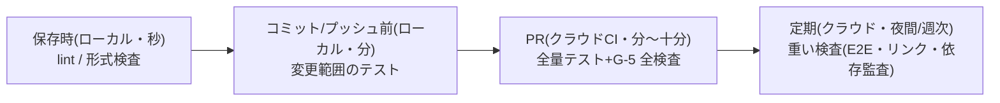

統合プロセスでは、機械検査(G-5)とAIエージェントが従来より桁違いに多く実行されます。全部をクラウド CI に載せるとコストと待ち時間が破綻するため、**検査の実行場所を多段化**する戦略を取ります。

## ローカルファーストの多段検査



| 段 | 実行場所 | 内容 | 狙い |
| --- | --- | --- | --- |
| 保存時 | 開発者(とAI)のローカル | lint・形式検査を編集フックで即時実行 | 違反を「作った瞬間」に潰し、CI まで運ばない |
| プッシュ前 | ローカル | 変更範囲に絞ったテスト | CI の失敗率を下げる(クラウド実行の節約) |
| PR | クラウド CI | G-5 の全量検査 | ゲートとしての公式判定(記録が残る) |
| 定期 | クラウド(夜間・週次) | E2E・外部リンク・依存関係監査など重い検査 | PR を遅くせずに網羅性を確保 |

原則は「**軽い検査ほど手前(ローカル)で、公式判定と重い検査だけをクラウドで**」です。AIエージェントが生成するたびにローカルフックで検査が走る構成(本サイトの textlint フックが実例)は、CI 実行回数そのものを減らします。

## クラウド CI のコスト最適化

| 手法 | 内容 |
| --- | --- |
| キャッシュ | 依存パッケージ・ビルド成果物をキャッシュし、実行時間を短縮する |
| 差分実行 | 変更ファイルに関係するテストだけを PR で回し、全量は夜間に回す(モノレポでは必須) |
| 並列度の設計 | ジョブ分割は「最も遅いジョブ」を基準に。分割しすぎは起動オーバーヘッドで逆効果 |
| セルフホストランナー | 実行量が多い組織は、社内マシン・安価なクラウドVMをランナー化して従量課金を回避する |
| タイムアウト | 全ジョブに明示的なタイムアウトを設定し、暴走の課金を止める |

## AI トークン予算の管理

計算資源には CI だけでなく **AI のトークンコスト**が加わります。

- **用途別に予算枠を分ける**: 対話支援(上限緩め)/ エージェント実行(タスク単位の目安)/ 自律実行(明示的な予算とアラート)
- **モデルの使い分け**: 定型作業(形式チェック・要約)は軽量モデル、設計判断の支援・複雑な実装は上位モデル。使い分け基準を恒久層コンテキストに書き、AI 自身にも従わせる
- **コンテキストの節約はコスト削減**: [コンテキスト基盤](/process-compass/phase5-implementation/context-base/)の「必要分だけ渡す」設計は、品質(context rot 回避)とコストの両方に効く
- **計測**: トークン消費をタスク・機能単位で集計し、費用対効果の異常(1機能に異常な再試行が集中等)を検知する

## ローカル実行環境の整備

開発者(とローカルで動くAIエージェント)のマシンが検査の一段目になるため、環境の均質化が必要です。

```yaml
# 例: 開発コンテナ/セットアップスクリプトで揃えるもの
- ランタイムとパッケージのバージョン固定(ロックファイル)
- 編集フック(保存時 lint)の自動セットアップ
- プッシュ前検査のコマンド統一(例: npm run check)
- AI エージェントの権限設定・フック設定(リポジトリにコミットして配布)
```

「ローカルで通れば CI でも通る」を保証できるほど、クラウド実行の無駄が減ります。設定はすべてリポジトリにコミットして共有し、個人環境の差で検査結果が変わる状態を避けます。

## 規模別の目安

| 規模 | 構成 |
| --- | --- |
| 1〜9名 | マネージド CI(GitHub Actions 等)+ローカルフック。キャッシュと差分実行で十分 |
| 10名以上・実行量大 | +セルフホストランナー、夜間バッチの分離、トークン集計の自動化 |
| 規制業・機密 | +実行環境の分離(機密データを扱う検査はオンプレ/専用環境)、ログ保全 |
