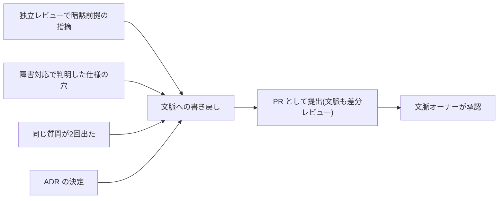

[コンテキスト明文化・補完基盤の要件](/process-compass/phase3-gap-analysis/context-infrastructure/)(R1〜R5)を、実際のリポジトリ構成として実装します。目的は一貫して「**一度書いた文脈を再利用し、人間の明文化負担を最小にする**」ことです。

## リポジトリ配置(恒久層・案件層)

```text
repo/
├── CLAUDE.md / AGENTS.md      # 恒久層の入口(常駐・200行以内)
├── .claude/ (または同等)
│   ├── rules/                 # スコープ付き規約(対象ディレクトリ編集時のみロード)
│   ├── skills/                # 定型手順(呼び出し時のみロード)
│   └── settings.json          # 強制層(権限・フック)
├── context/
│   ├── glossary.md            # ドメイン用語集(ユビキタス言語)
│   ├── decisions/             # ADR(判断記録)の置き場
│   ├── standards/             # 設計標準・レビュー観点
│   └── projects/<案件ID>.md   # 案件層(目的・制約・体制・暗黙前提の登録先)
└── specs/<機能ID>/            # 機能仕様(作業層の入力)
```

- **常駐は最小限に**(CLAUDE.md は200行以内目安)。詳細はスコープ付きルール・スキル・参照ファイルへ分離し、必要時のみロードさせる(context rot 対策=R4)
- 案件層(`context/projects/`)は、要件合意ゲート(G-2)の基準3「暗黙の前提が登録済み」の登録先そのもの

## 要件との対応

| 要件 | 実装 |
| --- | --- |
| R1 恒久的な文脈の常駐 | CLAUDE.md / AGENTS.md+スコープ付きルール |
| R2 既存資産の接続 | 段階導入: まずリポジトリ内 Markdown(AIが検索)→ 必要になったら MCP で社内システム接続 → 大規模で RAG |
| R3 経験の蓄積 | 書き戻しワークフロー(下記)+ADR の蓄積 |
| R4 優先順位付け | 常駐最小・スコープ分離・呼び出し時ロード |
| R5 責任の割り当て | 文脈ファイルごとの CODEOWNERS 指定(下記) |

R2 は最初から RAG 基盤を作らないことが要点です。**リポジトリ内の Markdown を AI に検索させるだけで大半の用途は足ります**。MCP・RAG は「リポジトリ外の資産(チケット・社内Wiki・基幹システム)に頻繁にアクセスする必要が出てから」で十分です。

## 書き戻しワークフロー(R3)

文脈は書いて終わりではなく、運用の学びで育てます。書き戻しの契機を作業に埋め込みます。



- **文脈の変更も PR で行う**。差分レビューできることが、文脈の信頼性(AIがそれを参照して生成する以上、間違った文脈は間違ったコードを量産する)を守る
- 「同じ質問が2回出たら文脈化する」を目安ルールにする(3回目を発生させない)
- AI 自身に書き戻し案を起案させてよい(承認は文脈オーナー=人間)

## オーナーシップの実装(R5)

文脈ファイルの責任者を CODEOWNERS で機械的に紐づけます。

```text
# .github/CODEOWNERS(文脈基盤の部分)
/CLAUDE.md            @context-owner-a
/context/glossary.md  @domain-expert-b
/context/standards/   @tech-lead-c
/context/projects/    @value-owner-d
```

- オーナー不在の文脈ファイルを作らない(作る時にオーナー指定を必須にする)
- 文脈ファイルの変更 PR は該当オーナーが自動でレビュアーに入る=「誰が正しさを保証するか」が常に明確

## 陳腐化の検知

文脈基盤の最大のリスクは静かな陳腐化です(アンチパターン「コンテキスト基盤の放置」)。機械検知を仕込みます。

| 検知 | 実装例 |
| --- | --- |
| 参照切れ | 文脈内のリンク・ファイルパスの存在チェックを CI に追加 |
| 更新の停滞 | 最終更新から N か月超の文脈ファイルを定期ジョブで一覧化し、オーナーに棚卸しを促す |
| 実態との乖離 | 独立レビューで「文脈と実装が食い違う」指摘が出たら、実装でなく文脈側の修正 Issue を必ず起票 |

:::note
本サイトのリポジトリがこの構成の縮小実例です。CLAUDE.md(恒久層)+スキル(定型手順)+設定の強制層(権限・textlint フック)+ADR(判断記録)で運用しており、執筆規約の違反はAIの生成時点でフックが止めています。
:::

## 段階導入(テーラリング)

| 段階 | 整備範囲 |
| --- | --- |
| 小規模・初期 | CLAUDE.md+用語集+ADR だけで開始(1日で整備できる範囲) |
| チーム化 | +スコープ付きルール、案件層、CODEOWNERS、書き戻しワークフロー |
| 大規模・複数チーム | +MCP による社内資産接続、RAG、陳腐化検知の自動化 |
