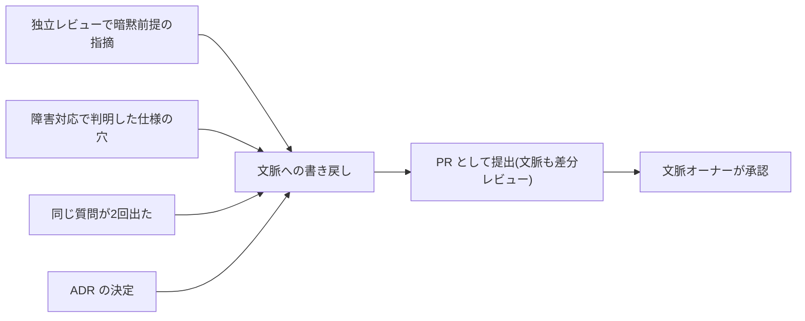

[コンテキスト明文化・補完基盤の要件](/process-compass/phase3-gap-analysis/context-infrastructure/)(R1〜R5)を、実際のリポジトリ構成として実装します。目的は一貫して「**一度書いた文脈を再利用し、人間の明文化負担を最小にする**」ことです。

## リポジトリ配置(恒久層・案件層)

```text
repo/
├── CLAUDE.md / AGENTS.md      # 恒久層の入口(常駐・200行以内)
├── .claude/ (または同等)
│   ├── rules/                 # スコープ付き規約(対象ディレクトリ編集時のみロード)
│   ├── skills/                # 定型手順(呼び出し時のみロード)
│   └── settings.json          # 強制層(権限・フック)
├── context/
│   ├── glossary.md            # ドメイン用語集(ユビキタス言語)
│   ├── decisions/             # ADR(判断記録)の置き場
│   ├── standards/             # 設計標準・レビュー観点
│   └── projects/<案件ID>.md   # 案件層(目的・制約・体制・暗黙前提の登録先)
└── specs/<機能ID>/            # 機能仕様(作業層の入力)
```

- **常駐は最小限に**(CLAUDE.md は200行以内目安)。詳細はスコープ付きルール・スキル・参照ファイルへ分離し、必要時のみロードさせる(context rot 対策=R4)
- 案件層(`context/projects/`)は、要件合意ゲート(G-2)の基準3「暗黙の前提が登録済み」の登録先そのもの

## 要件との対応

| 要件 | 実装 |
| --- | --- |
| R1 恒久的な文脈の常駐 | CLAUDE.md / AGENTS.md+スコープ付きルール |
| R2 既存資産の接続 | 段階導入: まずリポジトリ内 Markdown(AIが検索)→ 必要になったら MCP で社内システム接続 → 大規模で RAG |
| R3 経験の蓄積 | 書き戻しワークフロー(下記)+ADR の蓄積 |
| R4 優先順位付け | 常駐最小・スコープ分離・呼び出し時ロード |
| R5 責任の割り当て | 文脈ファイルごとの CODEOWNERS 指定(下記) |

R2 は最初から RAG 基盤を作らないことが要点です。**リポジトリ内の Markdown を AI に検索させるだけで大半の用途は足ります**。MCP・RAG は「リポジトリ外の資産(チケット・社内Wiki・基幹システム)に頻繁にアクセスする必要が出てから」で十分です。

## 書き戻しワークフロー(R3)

文脈は書いて終わりではなく、運用の学びで育てます。書き戻しの契機を作業に埋め込みます。


```mermaid
graph LR
  A["独立レビューで暗黙前提の指摘"] --> W["文脈への書き戻し"]
  B["障害対応で判明した仕様の穴"] --> W
  C["同じ質問が2回出た"] --> W
  D["ADR の決定"] --> W
  W --> P["PR として提出(文脈も差分レビュー)"]
  P --> O["文脈オーナーが承認"]
```

- **文脈の変更も PR で行う**。差分レビューできることが、文脈の信頼性(AIがそれを参照して生成する以上、間違った文脈は間違ったコードを量産する)を守る
- 「同じ質問が2回出たら文脈化する」を目安ルールにする(3回目を発生させない)
- AI 自身に書き戻し案を起案させてよい(承認は文脈オーナー=人間)

## オーナーシップの実装(R5)

文脈ファイルの責任者を CODEOWNERS で機械的に紐づけます。

```text
# .github/CODEOWNERS(文脈基盤の部分)
/CLAUDE.md            @context-owner-a
/context/glossary.md  @domain-expert-b
/context/standards/   @tech-lead-c
/context/projects/    @value-owner-d
```

- オーナー不在の文脈ファイルを作らない(作る時にオーナー指定を必須にする)
- 文脈ファイルの変更 PR は該当オーナーが自動でレビュアーに入る=「誰が正しさを保証するか」が常に明確

## 陳腐化の検知

文脈基盤の最大のリスクは静かな陳腐化です(アンチパターン「コンテキスト基盤の放置」)。機械検知を仕込みます。

| 検知 | 実装例 | 扱い |
| --- | --- | --- |
| 参照切れ | 文脈内のリンク・ファイルパスの存在チェックを CI に追加 | **落とす** |
| 分量の上限超過 | 1ファイル200行([第3章 3.11.4](/process-compass/phase4-process-design/roles-responsibilities/))を超えたら失敗させる | **落とす** |
| コードの変更との乖離 | 下記「乖離の監査」 | **落とさない。記録する** |
| 更新の停滞 | 最終更新から N か月超の文脈ファイルを定期ジョブで一覧化し、オーナーに棚卸しを促す | 記録する |
| 実態との乖離 | 独立レビューで「文脈と実装が食い違う」指摘が出たら、実装でなく文脈側の修正 Issue を必ず起票 | 人が判定する |

### 落とすものと記録するものを分ける理由

大規模な静的解析の運用から得られた指針では、**ビルドを落とすか、そもそも出さないかの2つしか置かない**構成が採られています。無視できる警告として出し続ける形を避けるためです。ビルドを落としてよいのは「機械的で、実効的な偽陽性がない」検査に限るとされ、それ以外はレビューの時点で提示します。ここでいう偽陽性は技術的な誤検出ではなく、**開発者が見て何も行動しなかった指摘**を指します。

本ページの検査を、この基準で仕分けます。

| 検査 | 機械的か | 実効偽陽性 | 判断 |
| --- | --- | --- | --- |
| 参照切れ(**リポジトリ内のパスに限る**) | 機械的 | ない | 落とす |
| 分量の上限超過 | 機械的 | ない | 落とす |
| コードの変更との乖離 | 対応関係の推定を含む | ある | 落とさず、警告としても出さない |

:::caution
外部リンクの死活は**落とす対象に含めません**。ネットワークの一時的な障害で失敗するため、実効的な偽陽性が生じます。外部リンクは定期ジョブで別に検査します。
:::

乖離は「落とす」にも「出さない」にも当てはまりません。**第三の置き場として、台帳への記録と四半期の棚卸しを用います**。新しい判定の場は設けません。

## 乖離の監査

### 対応関係を文脈ファイル自身に書く

**コードと文脈の対応表を別ファイルで保守してはなりません**。その表自体が陳腐化します。対応は文脈ファイルの frontmatter に書きます。

```markdown
---
owner: "@tech-lead-c"
scope:
  - "src/payment/**"
  - "src/billing/**"
---

# 決済まわりの設計標準
...
```

- 文脈ファイルを削除すれば対応も同時に消え、移動すれば一緒に動く。**別置きの表にならない**ことが要点
- `scope` を持たない文脈ファイルは、乖離の監査の対象外とする(用語集や一般則など、特定のコードに紐づかないもの)

### 乖離の定義

**内容を読まずとも判定できる定義にします**。

> **乖離**: 文脈ファイルの `scope` に該当するコードが、当該文脈ファイルの最終更新以降に一定回数以上変更された状態。

閾値は組織が定めます。実証がないため、**本標準は初期値を示しません**。

```yaml
# 週次ジョブの構成例
name: context-drift-audit
on:
  schedule:
    - cron: '0 0 * * 1'
jobs:
  audit:
    runs-on: ubuntu-latest
    steps:
      - uses: actions/checkout@v4
        with: { fetch-depth: 0 }
      - name: 乖離の集計(落とさない。台帳を更新するだけ)
        run: node scripts/context-drift.mjs --out context/audit/drift.md
      - name: 台帳の更新を PR にする
        run: node scripts/open-audit-pr.mjs
```

**このジョブを PR の必須チェックにしてはなりません**。落とすと、内容のない形式的な更新が入ります。

## 忘却の手続

### 検知より削減を主とする

[第3章 3.11.4](/process-compass/phase4-process-design/roles-responsibilities/)は、指示資産の分量が増えるほど遵守率が下がること、入力長の増加に伴い精度が非一様に低下すること、指示ファイルの付与で成功率は改善せず費用が増えたことを根拠に、分量の上限と記載しない内容を定めています。

**「多く書く」方向の解決は、精度と費用の両面で不利です**。したがって次の順序をとります。

1. **記載内容の削減を主とする**。コードベースから導出できる内容を書かなければ、乖離しうる記述そのものが減る
2. **検知は削減の入力とする**。乖離の監査は、外す候補を挙げるために行う

**忘却は、鮮度の維持と分量の抑制を同時に果たす操作です**。

### 何を外すか

意味の判定を要しない基準を優先します。

| 順位 | 基準 | 判定の材料 |
| --- | --- | --- |
| 1 | **読み込まれていない** | [3.11.4](/process-compass/phase4-process-design/roles-responsibilities/)要求事項6 の読み込み実績が、一定期間 0 回 |
| 2 | 乖離が閾値を超え、棚卸しで更新されなかった | 変更履歴 |
| 3 | コードベースから導出できる | 3.11.4 要求事項5 の違反 |
| 4 | 他の記述と重複または矛盾する | 記述の突合 |

**基準1を主とします**。実績に基づき、意味の判定を要さず、**そもそも効果を持っていない記述**を特定できます。新しい計測を追加しません。

### 削除ではなく保管する

**外した記述を削除してはなりません**。誤って外した場合に取り返せる必要があります。

```text
context/
├── standards/          # 参照対象
└── _archive/           # 保管領域(エージェントの参照対象から外す)
    └── 2026-08-standards-payment.md
```

- 保管領域を、エージェントが読み込むパスの指定から**明示的に除外する**。置き場を移すだけでは参照が止まらない
- 保管の記録に次を残す。**外した日 / 外した理由(上表の基準) / 外した者 / 復帰の条件**
- 復帰の条件の例: 同じ問いが再び出た、保管した記述に該当する誤りが再発した

### 誰が外すか

**外す判断を AI に行わせてはなりません**。[3.11.4](/process-compass/phase4-process-design/roles-responsibilities/)要求事項3 のとおり、削除と統合の権限は AI維持管理者1名に集約します。

AI が行ってよいのは**候補の提示**までです。第5章 5.7.4(記述の質を機械判定して承認可否を自動決定しない)、および第4章 G-4(範囲内外の判定を機械が行わない)と同じ切り分けです。

判定は四半期の棚卸し(3.11.4 要求事項4)で行います。**新しい判定の場を設けません**。乖離の台帳と読み込み実績が、その棚卸しの入力になります。

:::note
本サイトのリポジトリがこの構成の縮小実例です。CLAUDE.md(恒久層)+スキル(定型手順)+設定の強制層(権限・textlint フック)+ADR(判断記録)で運用しており、執筆規約の違反はAIの生成時点でフックが止めています。
:::

## 段階導入(テーラリング)

| 段階 | 整備範囲 |
| --- | --- |
| 小規模・初期 | CLAUDE.md+用語集+ADR だけで開始(1日で整備できる範囲) |
| チーム化 | +スコープ付きルール、案件層、CODEOWNERS、書き戻しワークフロー |
| 大規模・複数チーム | +MCP による社内資産接続、RAG、陳腐化検知の自動化 |
