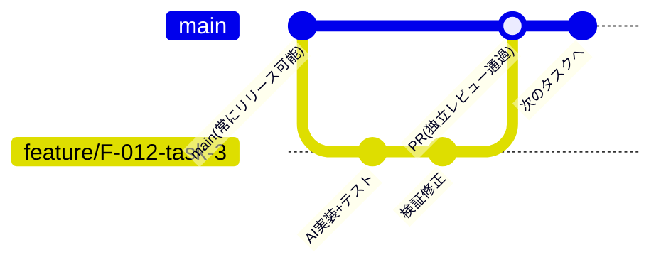

[統合プロセス参照モデル](/process-compass/processes/integrated/)のゲート(自動検証・独立レビュー)は、Git プラットフォームの機能で**機械的に強制**できます。このページはその設定リファレンスです。

## ブランチモデル: トランクベース+タスク単位ブランチ



- **main は常にリリース可能**に保つ。長寿命の develop ブランチは置かない(AI協調ループの回転速度に合わせる)
- **1タスク=1ブランチ=1PR**。ゲート基準 G-4「1タスク=1レビュー単位」をブランチ構造で担保する
- ブランチ名は `feature/<機能ID>-task-<N>` で機能仕様・実装計画と対応づける(トレーサビリティ)

## ブランチ保護: ゲートの機械的強制

参照モデルの2つの原則——「作成指示者は承認できない」(G-6)と「CI 通過なしにマージ不可」(G-5)——は、リポジトリのルールセットで強制します。

GitHub の場合の設定例(gh CLI):

```bash
# main へのルールセット: PR必須・承認1名・作成者の自己承認は仕組み上不可・CI必須
gh api repos/OWNER/REPO/rulesets -X POST --input - <<'EOF'
{
  "name": "integrated-process-gates",
  "target": "branch",
  "enforcement": "active",
  "conditions": { "ref_name": { "include": ["~DEFAULT_BRANCH"], "exclude": [] } },
  "rules": [
    { "type": "pull_request", "parameters": {
        "required_approving_review_count": 1,
        "dismiss_stale_reviews_on_push": true,
        "require_last_push_approval": true,
        "required_review_thread_resolution": true } },
    { "type": "required_status_checks", "parameters": {
        "required_status_checks": [ { "context": "gate-g5" } ],
        "strict_required_status_checks_policy": true } },
    { "type": "non_fast_forward" }
  ]
}
EOF
```

- `require_last_push_approval: true` が要点 — **最後に push した本人の承認を無効化**し、AIに指示して push した本人が自己承認する抜け道を塞ぐ
- `gate-g5` は[CI/CD ゲート構成](/process-compass/phase5-implementation/ci-gates/)で定義する必須チェックの名前
- ルールセットは read 権限者にも公開されるため、貢献者・監査がルールを事前に確認できる(ブランチ保護より透明)

## AI 生成コミットの扱い

AI が生成したコードのトレーサビリティを、コミット規約で残します。

```text
<種別>: <変更の要約>

<本文: 何を・なぜ>

Spec: F-012 / Task-3          ← 機能仕様・タスクへの参照(必須)
ADR: ADR-021                  ← 設計判断があれば参照
Co-Authored-By: <AIエージェント名> <noreply@...>   ← AI関与の明示(必須)
```

- **AI の関与は Co-Authored-By で明示**する。規制業のテーラリング(AI生成箇所のトレーサビリティ)はこのトレーラの集計で実装できる
- **コミットの作者(Author)は指示した人間**にする。結果責任(A)が人間に紐づく原則をコミット履歴でも維持する
- 機能ID・タスクIDへの参照を必須にすると、「business intent → spec → task → commit」の逆引きが可能になる

## マージ後の扱い

- **squash マージを既定**にする(1タスク=1コミットで main の履歴が実装計画と1対1になる)
- マージ済みブランチは自動削除。リリースはタグ(`vX.Y.Z`)で固定し、出荷判定(G-7)の対象を「タグ間の差分」として明確化する

## 段階導入(テーラリング)

| 体制 | 設定 |
| --- | --- |
| 1〜2名(PoC) | ルールセットなし・main 直 push 可。ただし CI(G-5相当)は最初から必須 |
| 3名以上 | 上記ルールセットを有効化(独立レビューの機械強制) |
| 受託・規制業 | +コミットトレーラの完全性チェックを CI に追加(Spec/Co-Authored-By の欠落を落とす) |

:::note
本サイトのリポジトリ自体が「ソロ期は main 直 push + CI 必須、コントリビューター参加でルールセット有効化」という段階導入の実例です([プロジェクト運営](/process-compass/community/project-management/)の移行チェックリスト参照)。
:::
