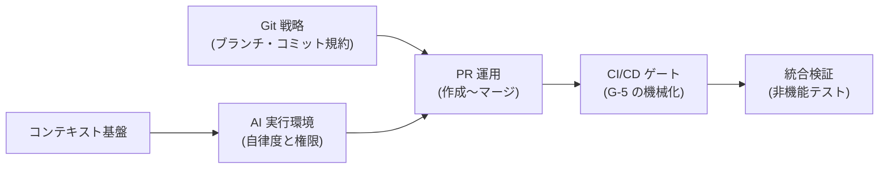

フェーズ4で定義したプロセスを、**実際のツール設定として動かす**ためのリファレンス集です。各ページはコピーして使える設定例を含みます。参照モデルの L3 ページ(個別作業)からも、対応するリファレンスへ直接リンクしています。

## リファレンスとゲートの対応

| ページ | 実装するもの | 対応ゲート |
| --- | --- | --- |
| [Git 戦略](/process-compass/phase5-implementation/git-strategy/) | ブランチモデル・命名語彙・ルールセット・コミットトレーラ | G-6 の機械強制 |
| [PR 運用](/process-compass/phase5-implementation/pr-workflow/) | PR テンプレート・サイズ上限・Draft 運用・レビュー対応 | G-5 / G-6 の日常運用 |
| [CI/CD ゲート](/process-compass/phase5-implementation/ci-gates/) | 必須チェック(gate-g5)・エビデンス自動集約 | G-5 / G-7 |
| [統合検証(非機能)](/process-compass/phase5-implementation/nonfunctional-verify/) | 性能・セキュリティ・運用シナリオの検証手順 | G-7 の入力 |
| [AI 実行環境](/process-compass/phase5-implementation/ai-environment/) | 権限設定(allow/deny/hooks)と自律度レベル L1〜L3 | AI 協調ループ全体 |
| [コンピューティング戦略](/process-compass/phase5-implementation/compute-strategy/) | CI リソースの確保と多段検査 | G-5 の運用コスト |
| [コンテキスト基盤](/process-compass/phase5-implementation/context-base/) | 恒久層・案件層の配置、CODEOWNERS、書き戻し | 文脈品質の維持 |

## 導入の順序

1. [Git 戦略](/process-compass/phase5-implementation/git-strategy/)のルールセットと [PR 運用](/process-compass/phase5-implementation/pr-workflow/)のテンプレートを設定する(半日)
2. [CI ゲート](/process-compass/phase5-implementation/ci-gates/)へ既存のテスト・静的解析を gate-g5 として束ねる
3. [コンテキスト基盤](/process-compass/phase5-implementation/context-base/)の恒久層を書き始め、[AI 実行環境](/process-compass/phase5-implementation/ai-environment/)を L1 から開始する
4. 運用が回り始めたら自律度を引き上げ、[統合検証](/process-compass/phase5-implementation/nonfunctional-verify/)とエビデンス集約をリリースフローへ組み込む
