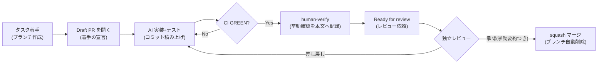

[Git 戦略](/process-compass/phase5-implementation/git-strategy/)がブランチとコミットの規約を定めるのに対し、このページは **PR(プルリクエスト)を日々どう回すか**を定義します。統合プロセスでは PR が「自動検証(G-5)・独立レビュー(G-6)の通過記録」そのものになるため、PR の運用品質がプロセスの統制品質を決めます。

## PR のライフサイクル



- **1タスク=1PR**。実装計画のタスクとの対応を本文に必ず書く(トレーサビリティの起点)
- PR は**タスク着手時に Draft で開く**。完成してから開くのではなく、着手の宣言として最初に開く(進行中の作業が全員に見える)

## サイズ上限

| 項目 | 上限(目安) | 超えたときの扱い |
| --- | --- | --- |
| 変更行数 | ±400 行(自動生成ファイル・ロックファイルを除く) | タスクを分割し実装計画へ差し戻す |
| 変更ファイル数 | 15 ファイル | 同上 |
| レビュー所要時間 | レビュアが 30 分で読み切れること | 同上 |

- AI は大きな差分を一気に作れるため、**上限は人間のレビュー帯域で決める**。差分が大きいほどレビューは形骸化(rubber stamp)に近づき、独立レビューの統制が崩れる
- リネーム・フォーマット一括変更など機械的な大差分は、実質変更と PR を分ける(`chore/` で先行させる)

## 本文の必須欄(PR テンプレート)

リポジトリの `.github/PULL_REQUEST_TEMPLATE.md` に次を置き、必須欄を空にしたままのレビュー依頼を禁止します。

```markdown
## 対応タスク

Spec: F-xxx / Task-N(実装計画のタスクID。fix/chore の場合は Issue 番号)

## 変更の概要

<!-- 何を・なぜ。仕様にない変更(リファクタ等)が混ざる場合は明示する -->

## 検証方法と結果(human-verify の記録)

<!-- 実際に動かして確認した手順と結果を、自分の言葉で書く。AI の説明の転記は不可 -->

## AI 関与範囲

- 生成: <!-- 例: 実装・テストとも AI 生成(Claude Code) -->
- 人の確認: <!-- 例: 全差分を読了、挙動をローカルで確認 -->

## レビュー観点の指定(任意)

<!-- とくに見てほしい箇所・自信のない判断 -->
```

- 「検証方法と結果」欄が**実装と検証タスク(human-verify)の完了記録**を兼ねる。空欄のまま Ready にした PR は差し戻し対象
- 「AI 関与範囲」欄は規制業テーラリング(AI 生成箇所のトレーサビリティ)の集計元になる。コミットトレーラ(Co-Authored-By)と二重になるが、PR 側は人間向けの要約、トレーラ側は機械集計用と役割が違う

## 誰が PR を作るか(自律度別)

[AI 実行環境](/process-compass/phase5-implementation/ai-environment/)の自律度レベルと対応させます。

| 自律度 | PR の作成 | Ready 化の判断 |
| --- | --- | --- |
| L1(人が全承認) | 人が `gh pr create --draft` を実行 | 人 |
| L2(定型は自動) | AI が Draft PR まで作成し、人へ通知 | 人(human-verify 後) |
| L3(例外のみ人) | AI が Draft 作成〜CI 通過まで自走 | 人(human-verify は省略しない) |

```bash
# タスク着手時(L1 の例): ブランチを切って空コミットで Draft PR を開く
git switch -c feature/F-012-task-3
git commit --allow-empty -m "feat: F-012 Task-3 着手"
git push -u origin feature/F-012-task-3
gh pr create --draft --title "feat: <タスクの要約> (F-012/Task-3)" --body-file .github/PULL_REQUEST_TEMPLATE.md
```

- どの自律度でも **Ready for review にする判断は人間**が行う。Ready 化は「human-verify を完了した」という宣言であり、AI には代行させない

## Draft PR の扱い

- Draft の間はレビュー依頼・CODEOWNERS の自動アサイン対象にならない(GitHub の仕様)。レビュアの帯域を Ready な PR に集中させる
- CI は Draft でも回す(早く壊れを検知するため)
- 48 時間以上更新のない Draft はデイリーで状況を確認する(タスク粒度が大きすぎるサイン)

## レビュー対応とマージ

- レビュー指摘は**スレッド解決を必須**にする(ルールセットの `required_review_thread_resolution`)。「見たが直さない」判断も、理由をスレッドに書いてから解決する
- 指摘の修正は AI に任せてよい。ただし修正 push で承認は自動的に無効化されるため(`dismiss_stale_reviews_on_push`)、再承認を依頼する。修正が挙動に触れる場合は human-verify も更新する
- マージは **squash を既定**とし、squash 後のコミットメッセージにも Spec / Co-Authored-By トレーラを残す(履歴の集計可能性を保つ)
- マージ後はブランチ自動削除。次のタスクは最新の main から切り直す

## アンチパターン

| 症状 | 何が起きているか | 対処 |
| --- | --- | --- |
| 巨大 PR が常態化 | タスク分解が粗い(G-4 の形骸化) | サイズ上限で機械的に差し戻し、実装計画を修正 |
| 検証欄が AI 出力のコピペ | human-verify の形骸化 | レビュアは検証欄の記述で差し戻してよい |
| Draft のまま数日放置 | タスクが大きすぎるか、着手だけして塩漬け | デイリーで Draft を確認する運用に組み込む |
| レビュー承認が即時に返る | rubber stamp 化(挙動要約がない) | 挙動要約のない承認を無効とするチーム合意 |
