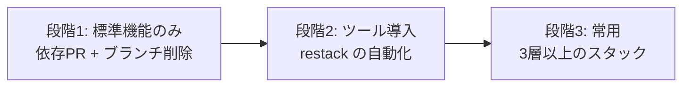

AIエージェントは、人間がレビューできる速度を超えて変更を生成します。1つの PR に大量の変更を詰め込む運用は、独立レビュー(G-6)を実質的な承認操作へ縮退させます。このページは、変更を依存関係のある小さな PR の連鎖として扱う運用を定義します。

## 前提の確認(2026-08-05 時点)

導入の検討にあたって、実在する機能と実在しない機能を区別します。

| 前提 | 実在するか |
| --- | --- |
| ベースブランチにフィーチャーブランチを指定した PR を作れる | **実在する**(標準機能) |
| 下層 PR のマージ後、上層 PR のベースが自動で付け替わる | **実在する**(条件付き。下記) |
| `gh stack submit` という公式コマンドがある | **実在しない**。GitHub CLI に `stack` サブコマンドはない |
| 大きな変更をAIが依存関係付きの複数 PR へ自動分割する製品機能がある | **未確認**。研究段階 |

スタック操作を支援する外部ツールとしては、`gt submit`(Graphite)、`ghstack`、`git spr update`、`sl pr submit`(Sapling)、`git submit`(git-branchless)が存在します。いずれも標準機能ではありません。

### 自動リターゲットの正確な挙動

GitHub は、削除されたブランチをベースに指定している未クローズの PR を検出し、そのベースをマージ先のブランチへ自動的に付け替えます。ここで重要な点が2つあります。

- **発火の契機はマージではなく、マージ後のヘッドブランチの削除である**。ブランチを残す運用では働かない
- **変わるのはベースの指定だけである**。上層ブランチのコミット列は積み直されないため、リベースするまで差分に下層の変更が混入したままになる

したがって、**自動リターゲットだけでスタック運用を完結できません**。積み直し(restack)の操作が別途必要です。この作業がツール導入の主な動機になります。

## 段階的な導入



| 段階 | 構成 | 前提条件 |
| --- | --- | --- |
| 1 | 標準機能のみ。依存 PR を手で作り、マージ後にブランチを削除する | なし |
| 2 | スタック操作ツールを導入し、積み直しを自動化する | 段階1で2層のスタックを常用できている |
| 3 | 3層以上のスタックを常用する | 段階2でコンフリクトの解消手順が定着している |

**段階1から始めます**。理由は次のとおりです。

Git の公式ドキュメントは「自分のリポジトリの外に存在し、他者がその上に作業している可能性のあるコミットをリベースしてはならない」と定めています。スタック運用は、公開済みの上層ブランチを繰り返し積み直すため、この原則と正面から衝突します。強制プッシュを伴う運用は、`--force-with-lease` を用いても完全には安全になりません。エディタなどが背後で取得すると保護が無効化されうると公式に記載されています。

段階1の構成は強制プッシュを必須としません。Git の操作に不慣れな担当者を含むチームでは、ここから始めるほうが事故を防げます。

## 段階1の手順(標準機能のみ)

```bash
# 1層目: main から切る
git switch -c feature/F-012-task-1 main
# ... 実装 ...
git push -u origin feature/F-012-task-1
gh pr create --base main --draft --title "feat: <1層目の要約> (F-012/Task-1)"

# 2層目: 1層目から切る
git switch -c feature/F-012-task-2 feature/F-012-task-1
# ... 実装 ...
git push -u origin feature/F-012-task-2
gh pr create --base feature/F-012-task-1 --draft --title "feat: <2層目の要約> (F-012/Task-2)"
```

- **下から順にマージする**。中間の層を先にマージしてはならない
- 1層目のマージ後、**ヘッドブランチを削除する**。これにより2層目のベースが `main` へ自動で付け替わる
- ベースが付け替わったら、2層目を `main` へ積み直す

```bash
git switch feature/F-012-task-2
git fetch origin
git rebase origin/main
git push --force-with-lease
```

積み直しを行わないと、2層目の差分に1層目の変更が重複して表示され、レビューが成立しません。

## 各層が満たすべき条件

| # | 条件 |
| --- | --- |
| 1 | 単独で意味が通る。1つの関心事だけを扱う |
| 2 | その層だけでビルドと自動検証(G-5)が通る |
| 3 | 新しいインタフェースを追加する層は、その利用箇所を同じ層に含める |
| 4 | 変更の規模は[第4章 G-4](/process-compass/phase4-process-design/gate-criteria/)の基準に従う |

条件3は分割しすぎを防ぐ要件です。定義だけを含み利用箇所を含まない層は、レビュアーが妥当性を判断できません。**小さくすることと、意味を成さないほど切り刻むことは別です**。

## レビューの割り当て

- 各層の PR には**個人を指名**する。チーム宛てのままにしない
- 所有者定義(CODEOWNERS)による自動指名は、下書き PR には作用しない。Ready にした時点で指名される

チーム宛ての依頼は着手が遅れます。個人への明示的な割り当てのほうがレビューの遅延を有意に減らしたという大規模な比較実験の報告があります(2023年)。一方で、チーム宛てのほうが品質と作業の分配に優れるという逆向きの報告もあります(2026年)。**速度と分配の間にはトレードオフがあります**。本標準は速度を優先し、分配は[レビュー SLA](/process-compass/phase4-process-design/gate-criteria/)の滞留監視で担保します。

## コンフリクトの解消

| 段階 | 担い手 |
| --- | --- |
| 解消案の作成 | AIエージェントに委ねてよい |
| 解消の確定 | **人間が行う** |
| 解消後の検証 | 人間が挙動を実際に確認する |

**確定を自動化してはなりません**。2026年の評価では、大規模言語モデルによるコンフリクト解消が開発者の解決と一致した割合は55〜60%未満にとどまっています。

さらに危険なのは、**構文上は解決できるものの意味の上で競合する**場合です。この種の競合は、静的解析による検出でも誤検出と見逃しの双方が大きいと報告されています。検出された事例のうち実際の干渉は半数以下という報告もあり、機械に安全側へ倒す判断を委ねられません。

同じコンフリクトが繰り返し発生する場合は、`git rerere` で解決を記録し再利用できます。ただし**誤った解決も同じように再生される**点に注意します。

同一ファイルを触る層が並走してコンフリクトが頻発する場合、原因は Git の運用ではなくタスク分解です。実装計画へ差し戻します。

## AIエージェントへ与える指示

スタック運用をAIエージェントに任せる場合、指示資産([第3章 3.11](/process-compass/phase4-process-design/roles-responsibilities/))へ次を含めます。強制が必要な項目は指示ではなく権限設定と CI へ降ろします。

| 指示する内容 | 層 |
| --- | --- |
| 各層は1つの関心事のみを扱い、単独でビルドが通ること | 誘導層(指示ファイル) |
| 層の順序と依存を、実装計画のタスク番号と一致させること | 誘導層 |
| コンフリクトの解消案を提示し、確定を人へ求めること | 誘導層 |
| `--force` を用いず `--force-with-lease` を用いること | **強制層**(権限設定で `--force` を拒否) |
| 保護されたブランチへの直接プッシュ | **強制層**(ブランチ保護) |
| 下から順にマージすること | **強制層**(中間層のマージを検査で拒否) |

強制層へ降ろす項目を指示ファイルにのみ書いてはなりません。指示ファイルの遵守は保証されません([第3章 3.11.3](/process-compass/phase4-process-design/roles-responsibilities/))。

## 導入しない判断

次のいずれかに該当する場合、スタック運用を導入しません。

- 1つのタスクが自然に1つの PR へ収まっている
- チームが Git の履歴操作に不慣れで、段階1の2層構成でも事故が起きている
- レビューの待ち時間が長く、層を増やすと滞留がさらに悪化する

**レビューの帯域が不足している状態でスタックを導入すると、待ち行列が長くなるだけです**。層を増やす前に、[レビュー SLA](/process-compass/phase4-process-design/gate-criteria/)の滞留を先に解消します。
