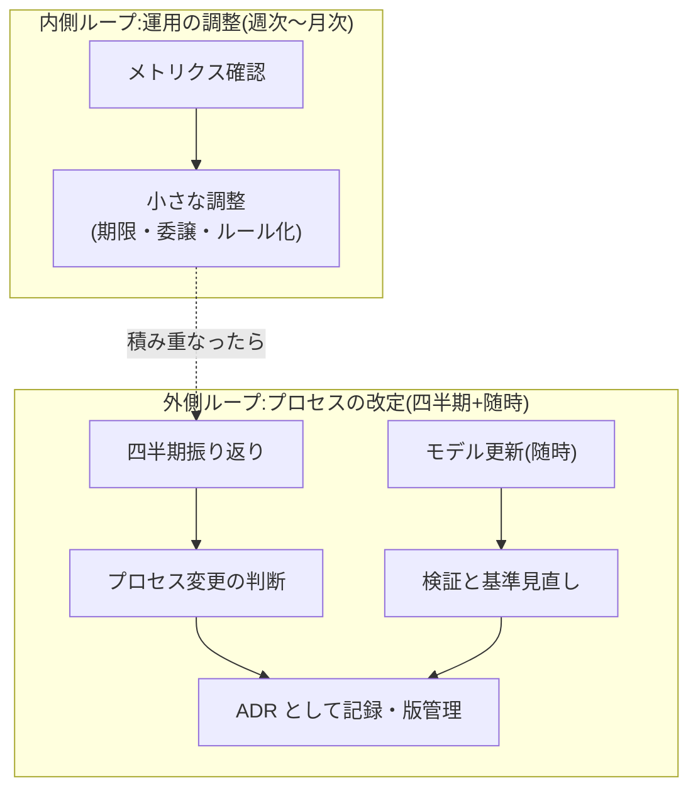
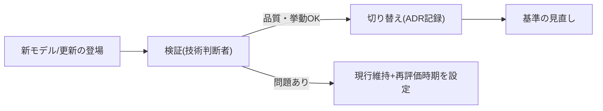

生成AIは数か月単位で能力が変わります。プロセスを一度決めて固定すると、モデルの進化とともに「過剰な統制」か「不足した統制」のどちらかへずれていきます。このページは、**プロセス自体を検査と適応の対象にする**サイクルを定義します。

## 二重の改善ループ

- **内側ループ**は運用パラメータの調整(判定期限の見直し、委譲の追加、CIルールの追加)。担当ロールの裁量で回す
- **外側ループ**はプロセス構造の変更(ゲートの追加・削除、ロールの変更、基準値の改定)。**変更は ADR として記録し、プロセス定義を版管理する**

## 四半期振り返りの進め方

参加はロール代表(価値責任者・技術判断者・開発者・QA・文脈オーナー)。判定会議ではなく検査の場です。

1. **メトリクスを先に見る**([運用メトリクス](/process-compass/phase6-operation/metrics/)の警戒サインから)。印象論から始めない
2. **アンチパターンの兆候を点検する**: 合議化・rubber stamp・コア指定のインフレ・文脈の放置([参照モデルのアンチパターン](/process-compass/processes/integrated/)をチェックリストに使う)
3. **変更候補を3つ以内に絞る**。一度に大量に変えると効果が測れない
4. **変更は ADR + 期限つきの実験として導入する**(「次の四半期まで試し、この指標で判断する」)

## モデル更新への追従(随時)

新モデルの登場・既存モデルの更新は、プロセスにとって「部材の性能が変わる」イベントです。無検証の即時切り替えと、放置の塩漬けの両方を避けます。

検証の観点(技術判断者が実施):

| 観点 | 確認内容 |
| --- | --- |
| 生成品質 | 代表タスクでの生成結果の比較(自組織の実コードベースで) |
| 指示追従 | 恒久層コンテキスト・テンプレ様式への追従度(様式が崩れないか) |
| 挙動変化 | これまで通っていた検査の通過率変化、新しい失敗パターンの有無 |
| コスト | トークン効率の変化(速くて安くなったか) |

**切り替えたら基準を見直します**。モデルが賢くなると、(a)AIに委譲できる範囲が広がる([ロール別整理](/process-compass/phase3-gap-analysis/role-mapping/)の分類の見直し)、(b)人の検証でしか担保できなかった項目が機械化できる、(c)逆に生成量が増えて検証帯域が逼迫する——のいずれも起こりえます。「モデル更新=テーラリングの再実行」と捉えてください。

## プロセス定義の版管理

- プロセス定義(ゲート・基準・ロール)は文書として版管理し、変更はADRで記録する(本サイトの[プロセスデータ](/process-compass/adr/0007-schema-driven-process-data/)がその実装例。データにschemaVersionを持たせている)
- 進行中の案件は原則として着手時の版のまま完走させ、次の案件から新版を適用する(途中でルールが変わる混乱を避ける)
- 「規定上のプロセス」と「実際の運用」の乖離に気づいたら、実態に合わせて規定を直すか、規定に合わせて実態を正すかを**明示的に選ぶ**。乖離の放置が形骸化の始まり(フェーズ1で確認した建前と実運用の乖離を、自分たちのプロセスで再生産しない)

## 本プロジェクト自体の追従

この統合プロセス参照モデルも、生成AIの進化に合わせて更新し続けます。モデルの能力が変わって前提条件([一覧](/process-compass/phase2-aidlc/assumptions/))の成立状況が変わったら、参照モデル自体を改版します。更新は本サイトの ADR と更新履歴で追えるようにします。
