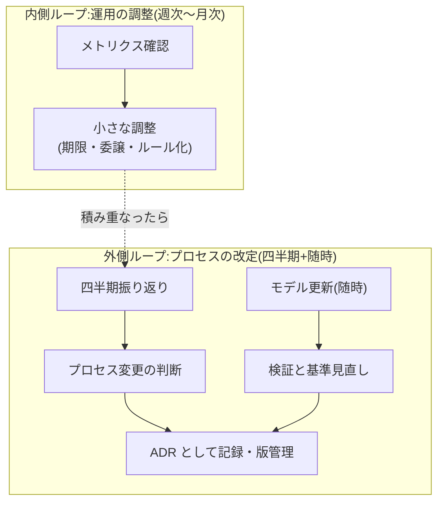
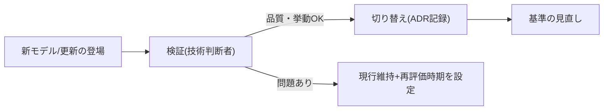

生成AIは数か月単位で能力が変わります。プロセスを一度決めて固定すると、モデルの進化とともに「過剰な統制」か「不足した統制」のどちらかへずれていきます。このページは、**プロセス自体を検査と適応の対象にする**サイクルを定義します。

## 二重の改善ループ

```mermaid
graph TD
  subgraph 内側["内側ループ:運用の調整(週次〜月次)"]
    M["メトリクス確認"] --> S["小さな調整<br>(期限・委譲・ルール化)"]
  end
  subgraph 外側["外側ループ:プロセスの改定(四半期+随時)"]
    R["四半期振り返り"] --> C["プロセス変更の判断"]
    U["モデル更新(随時)"] --> V["検証と基準見直し"]
    C --> A["ADR として記録・版管理"]
    V --> A
  end
  S -.積み重なったら.-> R
```

- **内側ループ**は運用パラメータの調整(判定期限の見直し、委譲の追加、CIルールの追加)。担当ロールの裁量で回す
- **外側ループ**はプロセス構造の変更(ゲートの追加・削除、ロールの変更、基準値の改定)。**変更は ADR として記録し、プロセス定義を版管理する**

## 四半期振り返りの進め方

参加はロール代表(価値責任者・技術判断者・開発者・QA・文脈オーナー)。判定会議ではなく検査の場です。

1. **メトリクスを先に見る**([運用メトリクス](/process-compass/phase6-operation/metrics/)の警戒サインから)。印象論から始めない
2. **アンチパターンの兆候を点検する**: 合議化・rubber stamp・コア指定のインフレ・文脈の放置([参照モデルのアンチパターン](/process-compass/processes/integrated/)をチェックリストに使う)
3. **変更候補を3つ以内に絞る**。一度に大量に変えると効果が測れない
4. **変更は ADR + 期限つきの実験として導入する**(「次の四半期まで試し、この指標で判断する」)

## 三識データを用いた振り返り(スプリントごと)

内側ループに、[三識メトリクス](/process-compass/phase6-operation/metrics/)の確認を組み込みます。四半期の振り返りを待たず、スプリントごとに回します。

### 手順

| # | 手順 | 要点 |
| --- | --- | --- |
| 1 | データを先に提示する | 個人に紐づかない集計値のみ。印象論から始めない |
| 2 | 事象を3区分へ仕分ける | システム起因 / リスク認識の不足 / 意図的な逸脱 |
| 3 | Try を3件以内に絞る | 責任者と期限を必ず付ける |
| 4 | **Try を作業バックログへ登録する** | 振り返りの記録に留めない |

手順4が最も重要です。**バックログに載らない改善は実施されません**。スクラムの公式定義でも「最も影響の大きい改善は可能なかぎり早く対処され、次スプリントのバックログに追加されることもある」と記されています。

### 犯人探しへの変質を防ぐ

| # | 規定 |
| --- | --- |
| 1 | 開始時に前提を読み上げる。「その時点で得られていた情報・技能・資源・状況のもとで、全員が最善を尽くしたと理解する」 |
| 2 | データは個人に紐づかない集計値のみを提示する |
| 3 | 書き出しと議論を分離する。各自が先に書き、その後に議論する |
| 4 | 進行役は当事者以外が務める |
| 5 | 「誰が」を主語とする問いを「どの仕組みが」へ言い換える |
| 6 | 責任者および上位者は先に意見を述べない |

規定1は、振り返りの標準的な前提宣言(2001年)です。規定6は、リーダーが一方的に記述してはならないという KPT の初期からの運用規律に対応します。

### 3区分の仕分け

**「非難しない」とだけ掲げる運用は、意図的な逸脱まで免責し、制度を形骸化させます**。仕分けの基準を明示します。

| 区分 | 対応 | 改善の対象 |
| --- | --- | --- |
| システム起因 | 慰め、仕組みを直す | プロセス・自動検査・コンテキスト基盤 |
| リスク認識の不足 | 対話による是正 | リスクの可視化、手順の見直し |
| 意図的な逸脱 | 規程に基づく措置 | 個人 |

判別は品質保証の機能が行い、振り返りの場では行いません([第5章 5.6.3](/process-compass/phase4-process-design/human-ai-boundary/))。振り返りは仕分けの結果を受け取ります。**その場で仕分けを議論すると、振り返りが査問の場になります**。

### 自己申告を促す設計

航空分野の安全報告制度は、次の3点で報告を促しています。同じ構造を、見逃しや手順の逸脱の自己申告へ適用します。

- 受領後、速やかに個人を特定できる情報を除去する
- 定められた期間内の報告に対して、措置を免除する
- 故意および悪意ある行為は免除の対象外とする

3点目を欠くと、免責が無制限になり制度が信頼を失います。

### コンテキスト基盤への還元

三識データから導かれる改善の多くは、コンテキスト基盤と指示資産の修正になります。

| 観測された状態 | 改善の対象 |
| --- | --- |
| AI の手戻り率が高い | 恒久層の規約・用語の記述、受入基準の書き方 |
| 特定の領域に差し戻しが集中している | 当該領域の設計標準および指示資産 |
| 決断記録の欠落が多い | 記録の様式と提示の設計([第5章 5.7.5](/process-compass/phase4-process-design/human-ai-boundary/)) |
| 特定の担当者へレビューが偏っている | 指名の設計、理解保持者数 |

改善が指示資産の変更を伴う場合、AI維持管理者の承認を経ます([第3章 3.11.5](/process-compass/phase4-process-design/roles-responsibilities/))。個々の担当者が独自に追記すると、指示の矛盾が蓄積します。

### 振り返りの形骸化を検知する

| 指標 | 警戒サイン |
| --- | --- |
| Try の実施率 | 低下が続く |
| 前回と同じ Problem の再掲率 | 上昇が続く |
| 参加者あたりの記入・発言数 | 低下が続く |
| 心理的安全性の測定値 | 低下 |

Try の実施率が低いまま推移する場合、原因は意欲ではなく件数です。3件以内に絞る規定を守れているかを先に確認します。

## モデル更新への追従(随時)

新モデルの登場・既存モデルの更新は、プロセスにとって「部材の性能が変わる」イベントです。無検証の即時切り替えと、放置の塩漬けの両方を避けます。

```mermaid
graph LR
  N["新モデル/更新の登場"] --> T["検証(技術判断者)"]
  T -->|品質・挙動OK| SW["切り替え(ADR記録)"]
  T -->|問題あり| K["現行維持+再評価時期を設定"]
  SW --> B["基準の見直し"]
```

検証の観点(技術判断者が実施):

| 観点 | 確認内容 |
| --- | --- |
| 生成品質 | 代表タスクでの生成結果の比較(自組織の実コードベースで) |
| 指示追従 | 恒久層コンテキスト・テンプレ様式への追従度(様式が崩れないか) |
| 挙動変化 | これまで通っていた検査の通過率変化、新しい失敗パターンの有無 |
| コスト | トークン効率の変化(速くて安くなったか) |

**切り替えたら基準を見直します**。モデルが賢くなると、(a)AIに委譲できる範囲が広がる([ロール別整理](/process-compass/phase3-gap-analysis/role-mapping/)の分類の見直し)、(b)人の検証でしか担保できなかった項目が機械化できる、(c)逆に生成量が増えて検証帯域が逼迫する——のいずれも起こりえます。「モデル更新=テーラリングの再実行」と捉えてください。

## プロセス定義の版管理

- プロセス定義(ゲート・基準・ロール)は文書として版管理し、変更はADRで記録する(本サイトの[プロセスデータ](/process-compass/adr/0007-schema-driven-process-data/)がその実装例。データにschemaVersionを持たせている)
- 進行中の案件は原則として着手時の版のまま完走させ、次の案件から新版を適用する(途中でルールが変わる混乱を避ける)
- 「規定上のプロセス」と「実際の運用」の乖離に気づいたら、実態に合わせて規定を直すか、規定に合わせて実態を正すかを**明示的に選ぶ**。乖離の放置が形骸化の始まり(フェーズ1で確認した建前と実運用の乖離を、自分たちのプロセスで再生産しない)

## 本プロジェクト自体の追従

この統合プロセス参照モデルも、生成AIの進化に合わせて更新し続けます。モデルの能力が変わって前提条件([一覧](/process-compass/phase2-aidlc/assumptions/))の成立状況が変わったら、参照モデル自体を改版します。更新は本サイトの ADR と更新履歴で追えるようにします。
