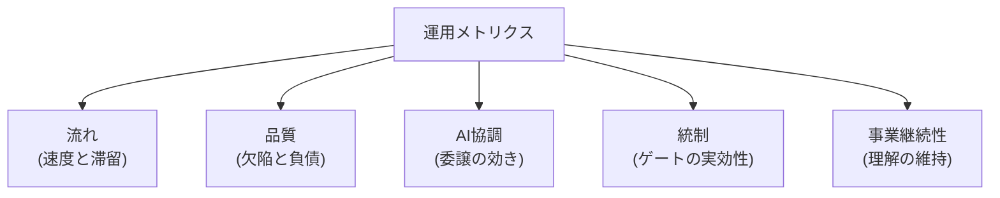

プロセスの健全性は印象でなく指標で判断します。このページは、統合プロセスの運用で継続計測する指標体系と、その**警戒サイン(いつ手を打つか)**を定義します。

## 指標体系の全体像

原則は3つです。

- **自動集計できる指標だけを正式指標にする**(手集計は続かない。集計はAIとCIの仕事)
- **単独の指標で判断しない**(速度だけ見ると品質を犠牲にする最適化が起きる。対になる指標とセットで見る)
- **個人の評価に使わない**(プロセスの健全性を測る道具であり、人を測る道具にすると数字が歪む)

## 分類別の指標と警戒サイン

### 流れ(速度と滞留)

| 指標 | 内容 | 警戒サイン |
| --- | --- | --- |
| 機能リードタイム | 仕様承認(G-4)→ 本番反映までの日数 | トレンドの継続悪化 |
| ゲート滞留時間 | 各ゲートの提出→判定 | 期限超過率 10% 超 |
| 差し戻し率 | ゲートごとの差し戻し割合 | 0% 継続(素通し)または 50% 超(手前の品質問題) |
| エスカレーション数 | 期限超過による代理判定の発生 | 特定判定者への集中(帯域不足) |

### 品質(欠陥と負債)

| 指標 | 内容 | 警戒サイン |
| --- | --- | --- |
| 重大欠陥の流出 | 本番で発覚した重大欠陥数 | 1件でも発生したら原因ゲートの特定と改修 |
| 欠陥の検出工程 | どのゲートで捕まえたか | 下流(G-7以降)での検出比率の上昇 |
| 負債残高トレンド | 台帳の未返却残高 | 3か月連続増加 |
| テスト実効性 | 変異テスト通過率等(形骸化検知) | 実装を写しただけのテストの増殖 |

### AI協調(委譲の効き)

| 指標 | 内容 | 警戒サイン |
| --- | --- | --- |
| AI関与率 | コミットのAIトレーラ比率(規制業は必須集計) | — (現状把握用) |
| 手戻り率 | AI生成→人差し戻しの割合(タスク単位) | 高止まり(仕様・文脈の品質問題)または不自然な0%(検証の放棄) |
| トークン効率 | 機能あたりのトークン消費 | 特定機能への異常な再試行集中 |
| 文脈の鮮度 | 恒久層ファイルの最終更新・参照切れ数 | 停滞ファイルの増加(陳腐化) |

### 統制(ゲートの実効性)

| 指標 | 内容 | 警戒サイン |
| --- | --- | --- |
| レビュー所要時間の分布 | 変更規模に対する独立レビューの時間 | 規模に対して極端に短い承認の続発(rubber stamp) |
| 挙動要約の品質 | 要約の欠落・定型文化 | コピペ的要約の増加 |
| ルール化の進み | 人の指摘→CI移管の件数 | ゼロが続く(ゲートが成長していない) |
| 判定記録の完備率 | ゲート判定記録の欠落 | 欠落の発生(監査可能性の毀損) |

### 事業継続性(理解の維持)

| 指標 | 内容 | 警戒サイン |
| --- | --- | --- |
| コア理解カバレッジ | コア機能ごとの理解保持者数 | 保持者1名以下のコア機能の存在(単一障害点) |
| 判断記録の充足 | コア機能のADR完備率 | 未記録のコア変更 |
| 復旧演習 | コア機能の障害対応演習の実施 | 半期を超えて未実施 |

## ダッシュボード化

- 収集は CI・リポジトリ API・台帳から自動化する([エビデンス自動集約](/process-compass/phase5-implementation/ci-gates/)と同じ仕組みに載せる)
- 週次で見るのは警戒サインの点灯だけ。全指標の眺め回しは四半期の[振り返り](/process-compass/phase6-operation/improvement-cycle/)で行う
- 将来的には、プロセス提案ツール(M7)がこの指標体系を「導入後の健全性診断」として内蔵することを構想している

## 指標が示す「次の一手」の早見表

| 症状 | 疑うべき原因 | 打ち手 |
| --- | --- | --- |
| 滞留が増えた | 判定者の帯域不足 | 委譲・機械化・タスク分割([プレイブック](/process-compass/phase4-process-design/gate-criteria/)) |
| 差し戻し率0%が続く | ゲートの素通し | 挙動要約の点検、レビュー時間の確認 |
| 負債残高が増え続ける | 返却枠の不足・記録だけ運用 | 返却枠の拡大、トリアージの実施 |
| 手戻り率が高い | 仕様・文脈の品質不足 | 受入基準の形式チェック強化、文脈の書き戻し |
| コア理解1名以下 | 理解維持の形骸化 | 理解共有の作業化(ペア読解・演習) |
