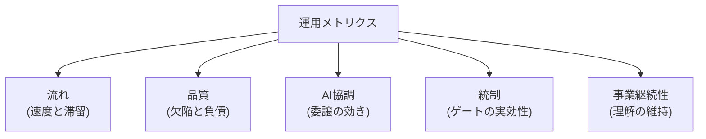

プロセスの健全性は印象でなく指標で判断します。このページは、ピットイン方式の運用で継続計測する指標体系と、その**警戒サイン(いつ手を打つか)**を定義します。

## 指標体系の全体像


```mermaid
graph TD
  M["運用メトリクス"]
  M --> F["流れ<br>(速度と滞留)"]
  M --> Q["品質<br>(欠陥と負債)"]
  M --> AI["AI協調<br>(委譲の効き)"]
  M --> G["統制<br>(ゲートの実効性)"]
  M --> B["事業継続性<br>(理解の維持)"]
```

原則は3つです。

- **自動集計できる指標だけを正式指標にする**(手集計は続かない。集計はAIとCIの仕事)
- **単独の指標で判断しない**(速度だけ見ると品質を犠牲にする最適化が起きる。対になる指標とセットで見る)
- **個人の評価に使わない**(プロセスの健全性を測る道具であり、人を測る道具にすると数字が歪む)

## 測定の副作用への歯止め

指標を置くことには副作用があります。副作用は運用の巧拙ではなく、測定という行為に構造として伴います。本節は、その構造への対処を規定します。

### 3つの原則の根拠

| 原則 | 根拠 |
| --- | --- |
| 自動集計できる指標だけを正式指標にする | 測定のコストは継続して発生し、当初の洞察は逓減する。手集計の指標は、費用だけが残る(Muller 2018) |
| 単独の指標で判断しない | 人は指標が代理にすぎないことを忘れ、指標そのものを目的として扱う。この代替は**単一の指標に報酬が結びついたとき最も強く現れ、複数の指標では弱まる**(Choi ほか 2012) |
| 個人の評価に使わない | 測れる範囲が仕事の一部に限られる状況で評価と結びつけると、努力は測れる範囲へ寄る(Austin 1996)。一部の仕事しか測定できない場合、成果連動を**弱めることが最適になりうる**(Holmström & Milgrom 1991) |

3番目が重要です。ソフトウェア開発では、成果の一部しか観測できません。**したがって「個人の評価に使わない」は配慮ではなく、部分的にしか測れない対象に対する設計上の帰結です**。守れない場合に起きるのは倫理の問題ではなく、指標が示す値と実態の乖離です。

### 参考値として測ることはできない

**「参考として測るだけで、判断には使わない」という運用は成立しません**。情報の提供のみを目的に置いた指標であっても、受け手は「仕事のどの側面が重要か」の宣言として読みます(Ridgway 1956)。

したがって、指標を追加する行為そのものが統制です。追加には手続を要します。

| # | 手続 |
| --- | --- |
| 1 | 何を知るために測るのかと、その指標で判断することの一覧を書く |
| 2 | 対になる指標(歪んだときに逆へ動く指標)を同時に指定する。指定できない指標は採用しない |
| 3 | 自動集計の実装をもって採用とする。実装前の指標を暫定として運用しない |
| 4 | 測定に要した工数を、指標の運用コストとして計上する |

### 指標を増やして対処しない

副作用への対処が指標の追加であれば、それ自体が測定への固着です。**指標の総数に上限を置きます**。

- 上限に達した状態で新しい指標を採用する場合、既存の指標を1つ廃止する
- 2期連続で「次の一手」へ接続しなかった指標は廃止の候補とする。**眺めているだけの指標を残さない**
- 廃止の判断は、値が良好であることを理由にしない。良好な値の指標こそ、観測をやめた影響が見えにくい

:::caution[暫定 EV-0012 / 見直し 2027-08]
**対象**: 指標の総数に上限を置くという規定と、その初期値(正式指標20件)。
**根拠の水準**: E0(なし)。
**差し替え条件**: 2期分の運用記録から得た、指標ごとの参照回数と打ち手への接続率。
:::

初期値は正式指標20件とします。現在の指標体系はこの範囲に収まります。

### 閾値を目標にしない

警戒サインは**点灯の契機**であり、達成すべき目標値ではありません。全員へ同一の閾値を課すと、閾値を満たした時点で改善の動機が消えます。

閾値付近の張り付きを検知します。

| 観測 | 疑う事象 |
| --- | --- |
| 値の分布が閾値のごく手前に集中している | 閾値を満たすための調整 |
| 期の終わりに集中して閾値を満たしている | 期末の帳尻合わせ |
| 閾値を大きく上回る事例が消えた | 閾値が上限として作用している |

**閾値を満たしたこと自体を成果として報告しません**。報告するのは、点灯したサインに対して何をしたかです。

### 実績を基準へ機械的に変換しない

本標準は、複数の箇所で基準値を自組織の実測から較正します。この構造は、**前期の実績が次期の基準になると知られた時点で、当期に出し切らない動機を生みます**。

較正するすべての箇所へ、次を適用します。

| # | 規定 |
| --- | --- |
| 1 | 実績の分布から基準値を自動的に更新しない。更新は人の判断を経て、判断の記録を残す |
| 2 | 基準の引き上げには、実績以外の根拠(手段の変化、測定精度の向上)を要する |
| 3 | 更新の周期を、実績を観測する周期より長く取る |
| 4 | 基準を満たさなかった場合の措置と、基準の更新を、同じ場で決めない |

規定4を欠くと、基準の更新が測定される側との交渉になります。

適用先は次のとおりです。**各ページへ同じ規定を書きません**。

| 適用先 | 較正する対象 |
| --- | --- |
| [第4章 上限を自組織の実測で較正する](/process-compass/phase4-process-design/gate-criteria/) | L0 の既定値(行数・ファイル数) |
| [第4章 流れを絞る](/process-compass/phase4-process-design/gate-criteria/) | レビュアあたりの同時保有数 |
| [AI生成テストの検出力検証](/process-compass/phase5-implementation/test-effectiveness/) | 変異スコアの合格水準 |
| [プロセス内部監査](/process-compass/phase6-operation/process-audit/) | 抽出数と頻度 |
| [第5章 5.6.2](/process-compass/phase4-process-design/human-ai-boundary/) | 注入する欠陥の難度 |

## 分類別の指標と警戒サイン

### 流れ(速度と滞留)

| 指標 | 内容 | 算出方法(データソース) | 警戒サイン |
| --- | --- | --- | --- |
| 機能リードタイム | 仕様承認(G-4)→ 本番反映までの日数 | G-4 承認コメントの日時 → 機能IDを含む最初のリリースタグの日時(GitHub API) | トレンドの継続悪化 |
| ゲート滞留時間 | 各ゲートの提出→判定 | G-5/G-6 は PR の Ready 化 → 承認の時間差(GitHub API)。その他はゲート判定記録(テンプレ4)の提出・判定日時 | 期限超過率 10% 超 |
| 差し戻し率 | ゲートごとの差し戻し割合 | G-6 は Changes requested の付いた PR 比率(GitHub API)。その他は判定記録の判定結果を集計 | 0% 継続(素通し)または 50% 超(手前の品質問題) |
| エスカレーション数 | 期限超過による代理判定の発生 | 判定記録の期限超過・代理判定欄を集計 | 特定判定者への集中(帯域不足) |
| 作業単位の滞留期間 | 未完了の作業単位の、着手から現在までの経過時間 | Issue に着手ラベルが付いた日時 → 現在(GitHub API)。**未完了の項目のみ**を対象とする | 実測サイクルタイムの85パーセンタイル超が発生 |
| 完了スループット | 単位期間あたりに完了した作業単位の個数 | クローズした Issue の件数(GitHub API)。工数ではなく**個数**で数える | 規模の合意に用いた実測値からの継続的な低下 |
| 確約範囲(SC-M)の変動 | 確約した範囲の増減 | ステージ移行ゲートの判定記録と調整の記録を突合 | [第7章 7.6](/process-compass/phase4-process-design/exception-escalation/)の閾値超過 |

:::caution
**ゲート滞留時間と作業単位の滞留期間は別の指標です**。前者は提出から判定までを測り、判定者の帯域を表します。後者は作業単位そのものの停滞を表す先行指標であり、完了した項目には適用しません。両者を合算してはなりません。定義は[第2章 2.10.4](/process-compass/phase4-process-design/lifecycle/)によります。
:::

**進捗を担当者の完了率の申告で測ってはなりません**。到達は受入基準の充足件数で数え、停滞は滞留期間で捉えます。この2つを対で見ます。


### 品質(欠陥と負債)

| 指標 | 内容 | 算出方法(データソース) | 警戒サイン |
| --- | --- | --- | --- |
| 重大欠陥の流出 | 本番で発覚した重大欠陥数 | `bug` かつ Sev1/Sev2 ラベルの Issue 起票数(GitHub API) | 1件でも発生したら原因ゲートの特定と改修 |
| 欠陥の検出工程 | どのゲートで捕まえたか | 欠陥 Issue の「検出ゲート」欄(起票テンプレートで必須化)を集計 | 下流(G-7以降)での検出比率の上昇 |
| 負債残高トレンド | 台帳の未返却残高 | 負債台帳(テンプレ3の表)を CI がパースし、状態=未返却の行数を記録 | 3か月連続増加 |
| テスト実効性 | 変異テスト通過率等(形骸化検知) | 変異テストツール(Stryker 等)のスコアを CI 成果物として保存 | 実装を写しただけのテストの増殖 |

### AI協調(委譲の効き)

| 指標 | 内容 | 算出方法(データソース) | 警戒サイン |
| --- | --- | --- | --- |
| AI関与率 | コミットのAIトレーラ比率(規制業は必須集計) | `git log --grep "Co-Authored-By"` の件数 ÷ 全コミット数(期間指定) | — (現状把握用) |
| 手戻り率 | AI生成→人差し戻しの割合(タスク単位) | Changes requested を1回以上受けた PR 比率+実装計画表の「やり直し」件数 | 高止まり(仕様・文脈の品質問題)または不自然な0%(検証の放棄) |
| トークン効率 | 機能あたりのトークン消費 | AI 利用の課金・使用量レポートを機能ID(Spec トレーラ)単位で集計 | 特定機能への異常な再試行集中 |
| 文脈の鮮度 | 恒久層ファイルの最終更新・参照切れ数 | `git log -1 --format=%cs <ファイル>` の経過日数+リンク検査(lychee 等)の失敗数 | 停滞ファイルの増加(陳腐化) |

### 統制(ゲートの実効性)

| 指標 | 内容 | 算出方法(データソース) | 警戒サイン |
| --- | --- | --- | --- |
| レビュー所要時間の分布 | 変更規模に対する独立レビューの時間 | PR の Ready 化 → 承認の時間差と差分行数の散布(GitHub API) | 規模に対して極端に短い承認の続発(rubber stamp) |
| 挙動要約の品質 | 要約の欠落・定型文化 | 承認コメントの挙動要約欄の有無を CI で検査し、欠落数を記録(文面の質は四半期に人がサンプル確認) | コピペ的要約の増加 |
| ルール化の進み | 人の指摘→CI移管の件数 | `ci:` 種別のコミットのうち「レビュー指摘由来」ラベル付き PR の件数 | ゼロが続く(ゲートが成長していない) |
| 判定記録の完備率 | ゲート判定記録の欠落 | リリースタグ時点で[エビデンス集約](/process-compass/phase5-implementation/ci-gates/)が判定記録の欠落を検査 | 欠落の発生(監査可能性の毀損) |

### 事業継続性(理解の維持)

| 指標 | 内容 | 算出方法(データソース) | 警戒サイン |
| --- | --- | --- | --- |
| コア理解カバレッジ | コア機能ごとの理解保持者数 | コア機能一覧 × 理解記録(deep-read の ADR・判断記録)の記録者数を突合 | 保持者1名以下のコア機能の存在(単一障害点) |
| 判断記録の充足 | コア機能のADR完備率 | コア機能を触った PR のうち `ADR:` トレーラ付きコミットを含む比率(git log) | 未記録のコア変更 |
| 復旧演習 | コア機能の障害対応演習の実施 | 演習記録(運用カタログの四半期作業)の最終実施日 | 半期を超えて未実施 |

## 三識メトリクス(AI協調の習熟度)

[第5章 5.6](/process-compass/phase4-process-design/human-ai-boundary/)が定義する判断の3水準(知識・見識・胆識)を、観測可能な値として測ります。目的はチームの習熟度の可視化であり、人の評価ではありません。

### 設計の原則

| # | 原則 |
| --- | --- |
| 1 | 対抗する指標と対で配置する。単独で提示しない |
| 2 | 目標値として設定せず、報酬および人事評価に紐づけない |
| 3 | 導入の意図と、用いない用途を対象者へ明示する |
| 4 | **個人へ絞り込む機能を実装しない** |
| 5 | **チーム間の順位を表示しない** |

原則4の理由は、見られる可能性そのものが行動を歪めるためです。原則5の理由は、主要な指標体系がいずれも分析の単位をチームまたはサービスとし、他チームとの競争を目的としないことを明記しているためです。

原則1〜3は、実務のフレームワークにおいて「利用量に類する指標」を扱う際の条件として挙げられているものと同じです。この3条件を満たせない指標は、導入しないほうが害を抑えられます。

### 指標の定義

| 水準 | 指標 | 算出方法(データソース) | 対で見る指標 |
| --- | --- | --- | --- |
| 知識 | AIへの委譲率 | コミットのAIトレーラ比率(git log) | 重複ブロック率、短期の手戻り率 |
| 見識 | 生成案の採否の分布 | 実装計画・ADR に対する「そのまま採用 / 修正して採用 / 却下」の件数 | 差し戻し率、レビュー所要時間 |
| 胆識 | 決断記録の充足率 | テンプレ4「決断の記録」4欄の記入率(CI で欄の有無を検査) | 記録の重複率(直前記録との一致) |
| 胆識 | 欠陥注入の検出率 | [第5章 5.6.2](/process-compass/phase4-process-design/human-ai-boundary/)の集計(工程単位) | 注入難度の較正結果 |

見識の指標に「そのまま採用」の比率を用いる理由は、**この比率が高いほどトレードオフの検討が行われていない可能性が高い**ためです。ただし単独では判断できません。却下が多い場合は仕様の品質が低いことを示すため、差し戻し率と対で確認します。

### 対話の質を機械が採点しない

「対話の質」を大規模言語モデルで採点する方式は採りません。判定者として用いる場合に、提示順序・冗長さ・自らの生成物への選好という系統的な偏りが報告されているためです(2023年)。特に冗長さへの偏りは、**長文を投げるほど高評価になる**という歪曲を直接生みます。

用いる場合は、次の制約をすべて満たさなければなりません。

- 長さを評価の入力から除く
- 提示順を入れ替えて2回評価し、結果が反転した場合は判定不能として扱う
- 自由記述への印象評価ではなく、観点ごとの有無判定とする
- 判定は人が確認する対象を絞り込むふるい分けに限り、**指標値そのものにしない**

### 歪みの検知

三識のように測りにくい概念は代理指標に依存するため、指標そのものが壊れます。**設計の資源は「指標の正しさ」ではなく「指標が壊れたことの検知」に割きます**。

| 同時に観測される組み合わせ | 疑う事象 |
| --- | --- |
| 変更件数が増え、1件あたりの規模が急減した | 件数を増やすための分割 |
| AIへの委譲率が上昇し、レビュー所要時間が短縮した | レビューの形骸化 |
| 決断記録の充足率が高く、記録の重複率も高い | 記録の複製 |
| 三識の値が改善し、心理的安全性の測定値が低下した | 制度が圧力として作用している |
| 差し戻し率が0%に近く、欠陥注入の検出率も低下した | 検査全体の形骸化 |

**指標間の矛盾が歪みのシグナルです**。速度に関する指標と不安定性に関する指標を対で設計する構成は、この検知を成立させるためのものです。

### 心理的安全性を対で測る

三識の値が改善する一方で心理的安全性の測定値が低下する場合、制度は失敗しています。

- 心理的安全性はチーム単位で定期的に測定する
- 分析の単位は個人ではなくチームとする(この概念自体が集団で共有された信念として定義されている)
- 三識の指標と同じ画面に併置する

## 収集の実装(3つのデータソース)

すべての指標は次の3系統から自動収集できます。手集計が必要な指標は上の表に存在しません。

| 系統 | 取得手段 | 対象指標 |
| --- | --- | --- |
| Git履歴・GitHub API | `git log`(トレーラ集計)、`gh api`(PR・レビュー・Issue・タグの日時) | 流れ全般、AI関与率、レビュー所要時間、判断記録の充足 |
| CI 成果物 | ワークフローが保存する JSON(テスト・変異スコア・検査結果) | テスト実効性、挙動要約の欠落検査、判定記録の完備率 |
| 記録のパース | 負債台帳・ゲート判定記録・演習記録(様式が固定なので機械可読) | 負債残高、滞留時間、エスカレーション、復旧演習 |

```bash
# 例: AI関与率(直近30日)
total=$(git log --since="30 days ago" --oneline | wc -l)
ai=$(git log --since="30 days ago" --grep "Co-Authored-By" --oneline | wc -l)
echo "AI関与率: $ai / $total"

# 例: G-6 レビュー所要時間(Ready化→承認)の一覧
gh pr list --state merged --limit 50 --json number,createdAt,reviews \
  --jq '.[] | {number, approvedAt: (.reviews[] | select(.state=="APPROVED") | .submittedAt)}'
```

- 週次の集計ジョブ(cron)で3系統を取得し、1つの JSON にまとめてリポジトリへコミットする。ダッシュボードはその JSON を描画するだけにする(集計と表示の分離)

## ダッシュボード化

- 収集は CI・リポジトリ API・台帳から自動化する([エビデンス自動集約](/process-compass/phase5-implementation/ci-gates/)と同じ仕組みに載せる)
- 週次で見るのは警戒サインの点灯だけ。全指標の眺め回しは四半期の[振り返り](/process-compass/phase6-operation/improvement-cycle/)で行う
- 将来的には、プロセス提案ツール(M7)がこの指標体系を「導入後の健全性診断」として内蔵することを構想している

## 指標が示す「次の一手」の早見表

| 症状 | 疑うべき原因 | 打ち手 |
| --- | --- | --- |
| 滞留が増えた | 判定者の帯域不足 | 委譲・機械化・タスク分割([プレイブック](/process-compass/phase4-process-design/gate-criteria/)) |
| 差し戻し率0%が続く | ゲートの素通し | 挙動要約の点検、レビュー時間の確認 |
| 負債残高が増え続ける | 返却枠の不足・記録だけ運用 | 返却枠の拡大、トリアージの実施 |
| 手戻り率が高い | 仕様・文脈の品質不足 | 受入基準の形式チェック強化、文脈の書き戻し |
| コア理解1名以下 | 理解維持の形骸化 | 理解共有の作業化(ペア読解・演習) |

## 参考文献

「測定の副作用への歯止め」の根拠とした一次文献です。いずれも本標準の分野に固有のものではなく、**測定という行為に共通する構造**を扱っています。

| 文献 | 本標準が用いた論点 |
| --- | --- |
| Ridgway, V. F. (1956) Dysfunctional Consequences of Performance Measurements, *Administrative Science Quarterly* 1(2), 240-247 | 情報目的で置いた指標も、重要性の宣言として読まれる。単一・複数・合成のいずれの指標にも固有の副作用がある |
| Kerr, S. (1975) On the Folly of Rewarding A, While Hoping for B, *Academy of Management Journal* 18(4), 769-783 | 報われる行動が選択され、報われない行動は排除される |
| Campbell, D. T. (1975) Assessing the Impact of Planned Social Change | 量的指標が意思決定に使われるほど、指標は歪み、監視対象の過程を腐敗させる |
| Goodhart, C. (1975) / Strathern, M. (1997) の定式化 | 測定が目標になると、測定として機能しなくなる |
| Holmström, B. & Milgrom, P. (1991) Multitask Principal-Agent Analyses, *Journal of Law, Economics, & Organization* 7, 24-52 | 一部のタスクしか測定できない場合、成果連動を弱めることが最適になりうる。制御の手段は報酬ではなく職務の設計である |
| Austin, R. D. (1996) *Measuring and Managing Performance in Organizations*, Dorset House | 監督は完全・部分・なしに分かれ、**部分的な測定が機能不全を生む**。不完全な測定は無害ではない |
| Bevan, G. & Hood, C. (2006) What's Measured Is What Matters, *Public Administration* 84(3), 517-538 | ゲーミングの3類型(前期実績が次期基準になることによる出し惜しみ、閾値への張り付き、測られない目標の犠牲) |
| Choi, J., Hecht, G. & Tayler, W. B. (2012) Lost in Translation, *The Accounting Review* 87(4), 1135-1163 | 指標を構成概念そのものと取り違える現象。単一指標への報酬で最も強まり、複数指標で弱まる |
| Muller, J. Z. (2018) *The Tyranny of Metrics*, Princeton University Press(邦訳『測りすぎ』) | 測定への固着の失敗様式(目標のすり替え、短期志向、測定コスト、効用の逓減、革新の阻害、協働の阻害) |

DORA および SPACE の現行ガイダンスも、指標をシステムおよびチームの単位で扱い、個人の評価に用いないという点で本節と一致します。

:::note
これらの文献はソフトウェア開発を対象としたものではありません(Austin を除く)。医療・教育・行政・警察における事例が中心です。**本標準が採ったのは、分野を越えて再現している構造の部分のみ**であり、各分野の具体的な数値や制度設計は持ち込んでいません。
:::
