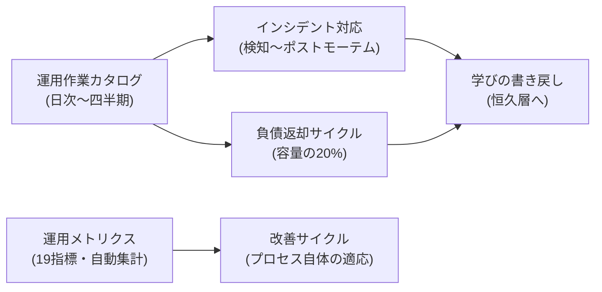

統合プロセスを導入したあと、**回し続けるための運用**を定義したフェーズです。「リリースして終わり」ではなく、負債を計画的に返し、学びを書き戻し、プロセス自体を測って直すところまでを運用と呼びます。

## 運用の全体像

| ページ | 内容 | 対応する参照モデルの作業 |
| --- | --- | --- |
| [運用作業カタログ](/process-compass/phase6-operation/operations-catalog/) | 日次・週次・月次・四半期の定常作業一覧 | 運用フェーズ全体 |
| [インシデント対応](/process-compass/phase6-operation/incident-response/) | Sev 判定・エスカレーション・ポストモーテム様式 | 監視・インシデント対応 |
| [負債返却サイクル](/process-compass/phase6-operation/debt-payback/) | トリアージ基準と返却枠の運用 | 負債返却サイクル |
| [改善サイクル](/process-compass/phase6-operation/improvement-cycle/) | プロセス自体の検査と適応の回し方 | プロセスの振り返り |
| [運用メトリクス](/process-compass/phase6-operation/metrics/) | 19指標の算出方法と警戒サイン | プロセスの振り返りの入力 |

## 運用が失敗する典型パターン

- 負債を「記録だけ」して返さない(台帳が墓場になる)→ [返却枠の計画組み込み](/process-compass/phase6-operation/debt-payback/)で防ぐ
- インシデントの学びが個人の記憶に留まる → [ポストモーテムの書き戻し](/process-compass/phase6-operation/incident-response/)を様式で強制する
- 指標を「測っているが何も変えない」→ [改善サイクル](/process-compass/phase6-operation/improvement-cycle/)で警戒サインと打ち手を接続する
