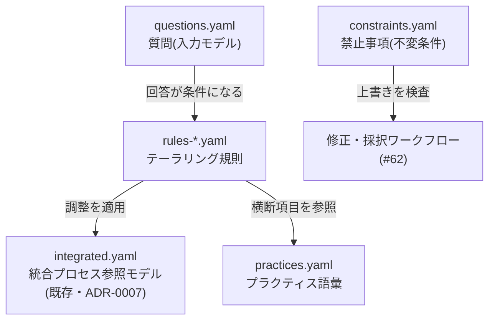

[要件定義](/process-compass/tool/requirements/)で定めた「知識ベースの単一ソース」「規則の宣言的管理」「根拠の追跡可能性」を満たすデータ構造の設計です。方針の決定記録は [ADR-0008](/process-compass/adr/0008-tailoring-rules-as-data/) にあります。

## 全体構造

知識ベースは4種のデータで構成し、すべて `src/data/tailoring/` の YAML として本リポジトリで版管理します。



- **質問(questions)**: 画面に出す入力項目。回答の選択肢 id が規則の条件になる
- **規則(rules)**: 「入力 → 調整」の対応。参照モデルへの差分として記述する
- **プラクティス(practices)**: ゲートやロールの構造に載らない横断的な運用項目の語彙(コア指定・負債運用・検収基準など)
- **制約(constraints)**: 入力に関係なく常に守る禁止事項。ユーザーの上書き検査に使う

## 設計判断のポイント

### 1. 規則は「参照モデルからの逸脱」だけを書く(差分方式)

ベースは常に[統合プロセス参照モデル](/process-compass/processes/integrated/)です。「グロース期は標準どおり」のような規則は書きません。これにより規則の総数が抑えられ、参照モデルの改版が自動的に全提案へ反映されます。

### 2. 説明のない調整は型レベルで書けない

調整1件ごとの `note`(画面にそのまま出す説明)、規則ごとの `reason`(なぜ)と `source`(根拠ページ)を必須にしています。要件定義の「ブラックボックスの推薦はしない」を、運用ルールでなくスキーマで強制します。

### 3. 条件は「質問→回答」の等値照合だけ

規則の条件(`when`)は、質問 id と回答 id の組み合わせに限定しています。同一質問内の複数回答は OR、質問間は AND です。数式や自由な論理式は導入しません(人が読んで検証できる範囲に条件語彙を留める)。

```yaml
# 例: 1〜2名 かつ 外部レビュアがいない 場合の規則(限界ケース)
- id: r-s-no-external-reviewer
  when:
    q-team-size: [size-1-2]
    q-external-reviewer: [reviewer-no]
  adjustments:
    - target: { type: gate, id: g-indep-review }
      action: omit
      note: 独立レビューは実施できないため省略する
    - target: { type: gate, id: g-ci }
      action: strengthen
      note: 代替としてCI基準を厳格化する(カバレッジ+静的解析の基準を引き上げ)
  reason: 独立レビューの担い手が誰もいない場合、人的検証の代替は機械検証しかない
  source: /process-compass/phase4-process-design/tailoring-guide/
  priority: 40
```

### 4. 調整操作は6動詞に限定する

| action | 意味 | 例 |
| --- | --- | --- |
| omit | 対象を省略する | PoC では独立レビューを省略 |
| simplify | 簡略化する | 企画承認を1枚企画書に |
| strengthen | 厳格化する | 規制業では CI に規制チェックを追加 |
| merge-into | 別の対象へ統合する | 要件合意を仕様承認に統合 |
| set | パラメータを設定する | コアレビュア数を2名に |
| note | 注記のみ(構造は変えない) | 価値責任者は発注側に置く |

対象(`target`)は `gate` / `role` / `activity` / `phase` / `process` / `practice` の6種で、`practice` 以外は integrated.yaml の id を参照します。

### 5. 優先度は初期値のみ定義する

規則の競合(例: PoC は独立レビューを省略、規制業は厳格化)に備えて `priority` を持たせています(補助の限界ケース 40 > 品質・規制 30 > 開発形態 20 > 規模・事業フェーズ 10)。適用順序と競合解決の意味論は[提案ロジック設計(#60)](https://github.com/Takenori-Kusaka/process-compass/issues/60)で定義します。

## 収録済みの規則

フェーズ4のテーラリングガイドの調整表を全件符号化し、スキーマを実データで検証済みです。

| ファイル | 内容 | 規則数 |
| --- | --- | --- |
| rules-team-size.yaml | 軸A: チーム規模(1〜2名 / 3〜9名 / 10名以上) | 3 |
| rules-business-phase.yaml | 軸B: 事業フェーズ(PoC / MVP / グロース / 安定運用) | 4 |
| rules-quality.yaml | 軸C: 期待品質・規制(高品質 / 規制業) | 2 |
| rules-dev-form.yaml | 軸D: 開発形態(発注側 / 受注側) | 2 |
| rules-supplementary.yaml | 補助: 限界ケース・既存ゲート接続・AI制約 | 5 |

制約(禁止事項)として「結果責任を持つのは1人」「AIを責任者にしない」「差し戻し基準のないゲートを作らない」の3件を収録しています。内容は[テーラリングの禁止事項](/process-compass/phase4-process-design/tailoring-guide/)と同一です。

## 検証と版管理

- スキーマ検証は Astro Content Collections(Zod)で行い、`npm run check` に統合されている。規則の書式誤りはビルドが落ちる
- 全ファイルに `schemaVersion: 0` を持たせ、条件語彙の拡張(数値範囲など)が必要になったら版を上げる
- 規則の追加・修正は YAML 編集だけで完結する。組織への適用事例から得た知見は、規則として追記していく(コミュニティが知識ベースを鍛える運用)
