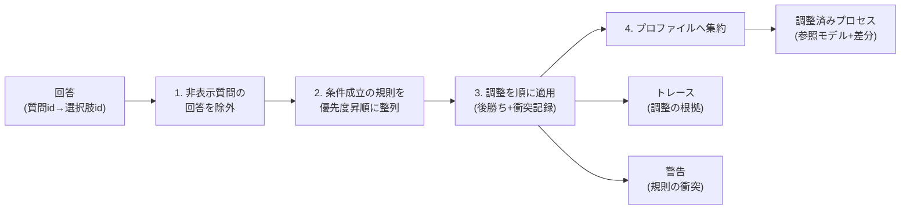

[知識ベース](/process-compass/tool/knowledge-base-schema/)の規則を、実際の回答へどう適用するかの設計です。エンジンは依存なしの純粋関数として実装済みで(`src/lib/tailoring-engine.mjs`)、要件定義の3ペルソナと限界ケースのシナリオ検証が `npm run check` に組み込まれています。

## 処理の流れ

1. **非表示質問の除外**: 条件付き質問(例: 外部レビュアの有無は1〜2名のときだけ表示)が非表示のとき、その回答は残っていても無視する。画面の状態と提案の根拠を常に一致させるため
2. **整列**: 条件が成立した規則を priority の昇順に安定ソートする(同順位はデータの記載順)
3. **適用**: 調整を順に適用する。後から適用されたもの(=優先度の高いもの)が勝つ「後勝ち」
4. **集約**: 対象(ゲート・ロール・プラクティス)ごとの最終状態にまとめ、描画層が参照モデルへ重ねられる形にする

## 優先度の設計

| priority | 規則群 | 意図 |
| --- | --- | --- |
| 40 | 限界ケース(補助) | 前提が崩れる組み合わせの代替。何よりも優先して実態に合わせる |
| 30 | 軸C: 品質・規制 | 安全とコンプライアンスの要求。事業フェーズの省略指示に勝つ |
| 20 | 軸D: 開発形態 | 契約構造の制約 |
| 10 | 軸A: 規模 / 軸B: 事業フェーズ / その他 | 基本の調整 |

たとえば「PoC だから出荷判定を省略(10)」と「高品質だから出荷判定を厳格化(30)」が同時に成立した場合、厳格化が勝ちます。**速度の都合が安全の要求を黙って消さない**、が優先度設計の原則です。

## 競合解決の規則

同一対象への調整がぶつかったときの解決は3つの規則で決まります。

| 状況 | 解決 |
| --- | --- |
| 構造操作同士(省略・簡略化・厳格化・統合) | 優先度の高い方が生き残る。負けた方は「上書きされた」としてトレースに残る |
| set(パラメータ設定)同士(同一 param) | 同上 |
| 低優先度の省略 × 高優先度の set | **対象を復活させる**。省略が取り消され、設定要求が生きる(例: PoC の独立レビュー省略は、規制業のレビュア2名要求で取り消される) |

重要なのは、**すべての衝突が警告としてユーザーに見える**ことです。エンジンは黙って解決しません。たとえば「2名・規制業・外部レビュアなし」という成立しない組み合わせでは、独立レビューの省略(限界ケース)が最終状態になりつつ、規制要求との衝突が警告に残ります。ユーザーはこれを見て「レビュアを確保する」か「逸脱として提案書に記録する」かを判断します(修正・採択ワークフロー #62 の入力)。

## トレース(調整の根拠)

要件定義の出力2「調整の根拠」は、エンジンのトレースをそのまま表示したものです。調整1件ごとに次を記録します。

- どの規則が(ruleId)、何を(target)、どうしたか(action)
- 画面向けの説明(note)、理由(reason)、根拠ページ(source)
- 適用結果(applied / overridden。上書きされた場合は上書きした規則の id つき)

規則スキーマで note・reason・source を必須にしているため(ADR-0008)、**トレースに説明のない行は構造上存在しません**。

## 決定性

- 同じ回答からは常に同じ提案が出る(乱数・時刻・外部状態を使わない)
- 同順位の規則はデータファイル名+記載順で順序が決まる(曖昧さを残さない)
- エンジンは依存ゼロの純粋関数で、ブラウザ(Astro アイランド)でも Node でも同じ結果になる

## 検証

`npm run test:engine`(check に統合済み)が次を検証します。

- **参照整合性**: 全規則の条件が questions.yaml に、対象 id が integrated.yaml / practices.yaml に実在すること
- **3ペルソナ**: 要件定義の利用シナリオ(2名PoC / 8名グロース高品質 / 15名・規制業・受注側)の期待どおりの提案
- **衝突2種**: PoC×高品質の後勝ち、規制業×レビュアなしの警告可視化
- **境界**: 非表示質問の残骸回答の無視、AI利用不可時のループ無効化

## 後続 Issue との接続

- **#61(UI プロトタイプ)**: `evaluate()` の profile を参照モデルに重ねて描画し、trace を根拠一覧として表示する
- **#62(修正・採択)**: ユーザーの上書きは profile への追加差分として扱い、constraints.yaml との照合と警告表示を行う
