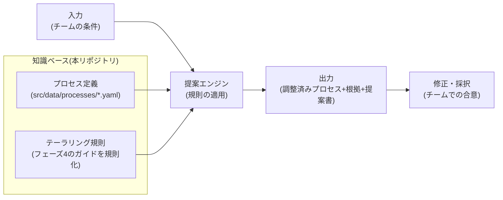

本プロジェクトの最終ゴールは、チームの条件を入力すると最適な開発プロセスを提案するインタラクティブなツールです。このページは、その**要件定義**です。[ツール構想](/process-compass/vision/03-tool-concept/)を、フェーズ1〜6の成果を踏まえて実装可能な粒度まで具体化します。

## ツールの位置づけ

ツールは新しい何かを発明するのではなく、**ここまでの成果物を機械的に適用できる形へ束ねたもの**です。

- 提案のベースは[統合プロセス参照モデル](/process-compass/processes/integrated/)
- 調整ロジックは[テーラリングガイド](/process-compass/phase4-process-design/tailoring-guide/)の4軸の表
- 出力の様式は[導入提案書テンプレート](/process-compass/phase4-process-design/proposal-template/)

## 利用シナリオ

テーラリングガイドの組み合わせ例と同じ3者を、ツールの一次ペルソナとします。

### シナリオ1: スタートアップの技術リード(2名・PoC)

プロセスを整える時間はないが、AIで書き散らしたコードが不安。ツールに人数と事業フェーズを入力すると「残すゲートは仕様承認とCIの2つだけ。独立レビューは省略し、代わりにCI基準を厳格化」という最小構成が根拠つきで提示される。10分で自チームの最低限のルールが決まる。

### シナリオ2: 事業会社のエンジニアリングマネージャー(8名・グロース)

AI活用を進めたいが、品質保証の説明責任を果たせる形にしたい。入力すると参照モデルにほぼ沿った構成が提示され、「価値責任者と技術判断者の分離」「コア機能の独立レビュー2名」が推奨として付く。提案書を出力し、チームと品質部門への説明資料にする。

### シナリオ3: SIer のプロジェクトマネージャー(15名・受託・規制業)

発注側からAI活用を求められたが、検収や監査との整合が分からない。入力すると契約ゲートの対応づけ(要件合意と検収の接続)、監査書式でのゲート記録、AI生成箇所のトレーサビリティ要件が提示される。「価値責任者を発注側に置く」が最大の交渉点であることも、提案書の交渉欄に明記される。

## 入力項目

設計原則は「**専門用語で聞かない**」です。回答者がプロセス用語を知らなくても答えられる質問だけで構成し、内部で調整軸に対応づけます。

| # | 質問(画面上の表現) | 選択肢 | 対応する調整軸 |
| --- | --- | --- | --- |
| 1 | 開発に関わる人数は? | 1〜2名 / 3〜9名 / 10名以上 | 軸A: チーム規模 |
| 2 | プロダクトはいまどの段階? | 検証中(PoC) / 最初の顧客向け(MVP) / 拡大中 / 安定運用 | 軸B: 事業フェーズ |
| 3 | 品質への要求は? | 一般的なWebサービス / 止まると社会・金銭に影響 / 規制業(医療・金融等) | 軸C: 期待品質・規制 |
| 4 | 開発の形態は? | 自社開発 / 外部へ発注する側 / 発注を受ける側 | 軸D: 開発形態 |
| 5 | レビューを頼める相手はチームの外にいる? | いる / いない | 軸Aの補助(1〜2名時の独立レビュー方式) |
| 6 | 社内に既存の承認ゲートはある? | ない / ある(品質部門・CTOレビュー等) | 外殻ゲートの対応づけ |
| 7 | AI利用の制約は? | 制約なし / 認可済みツールのみ / 利用不可 | AI協調ループの深さ、実装リファレンスの選択 |

- 質問は7問以内に収める(入力の負担が採択率を決める。悩まず2〜3分で答えられること)
- すべて選択式にする(自由記述は規則で解釈できないため v1 では扱わない)
- 質問7で「利用不可」の場合も従来型プロセスの整理として提案を返す(AIなしでも統合プロセスの外殻は機能する)

## 出力形式

出力は4点セットです。

| 出力 | 内容 | 実装上の扱い |
| --- | --- | --- |
| 1. 調整済みプロセス | フェーズ・ロール・ゲート・成果物の全体像 | 参照モデルのデータに規則を適用して導出し、既存のプロセス表示ページと同じ形式で描画する |
| 2. 調整の根拠 | どの入力がどの調整を発動したかの一覧 | 適用された規則を1件ずつ「入力→調整→理由」の形で明示する |
| 3. 導入提案書 | チーム・上長への説明資料 | 提案書テンプレートへ流し込み、Markdown としてコピー・ダウンロードできる |
| 4. 実装リファレンス | Git戦略・CIゲート・AI実行環境の該当節 | フェーズ5の各ページの該当アンカーへのリンク集 |

とくに重要なのが**出力2(調整の根拠)**です。「ツールがそう言ったから」では組織は動きません。すべての調整に「なぜ」を添えて、人が納得して修正・採択できる状態を作ります。ブラックボックスの推薦はしません。

## 提案 → 修正 → 採択のワークフロー

提案は出発点であり、そのまま従うものではありません(テーラリングガイドと同じ思想)。

- 修正: 提案された個別項目(ゲートの有無・レビュー人数など)をユーザーが上書きできる
- ただし[テーラリングの禁止事項](/process-compass/phase4-process-design/tailoring-guide/)の3つ(責任者を複数にする・AIを責任者にする・差し戻し基準のないゲート)は上書き時に警告し、提案書にも逸脱として記録する
- 共有: 入力と修正の状態を URL に符号化し、リンクを渡すだけでチームの他メンバーが同じ提案を見られるようにする
- 採択: 提案書を自組織のリポジトリへ持ち帰り、docs-as-code として版管理を始めた時点が採択。ツール側に保存機能は持たない

## 非機能要件

| 要件 | 内容 |
| --- | --- |
| 静的サイトで完結 | GitHub Pages 上でバックエンドなしで動作する。入力内容をブラウザの外へ送信しない(組織情報を預からない) |
| 知識ベースの単一ソース | プロセスデータはドキュメントと同じ YAML を参照する(ADR-0007 の延長。ツール用に二重管理しない) |
| 規則の宣言的管理 | テーラリング規則はコードに埋め込まず、データとして管理する(規則の追加・修正にプログラミングを要しない) |
| ドキュメントへの非侵襲 | JS が無効でも既存ドキュメントの閲覧に影響しない(ツールのページだけが JS を要する) |
| 根拠の追跡可能性 | すべての調整が知識ベース上の規則へ遡れる(規則にないことを提案しない) |

## スコープ外(v1 では扱わない)

- アカウント・サーバー側の保存(採択物は利用者が持ち帰る)
- 導入後のメトリクス診断([運用メトリクス](/process-compass/phase6-operation/metrics/)に将来構想として記載)
- 自由記述の解釈(LLM 連携による対話的ヒアリングは将来構想)
- 英語版 UI(サイトの多言語化と同時に検討)

## 後続 Issue との対応

| Issue | 内容 | このページとの関係 |
| --- | --- | --- |
| #59 | 知識ベーススキーマ設計 | 入力項目と規則を機械可読にする(調整軸・規則の型定義) |
| #60 | 提案ロジック設計 | 規則の適用順序・競合解決を定義する |
| #61 | UI プロトタイプ | 入力フォームと出力表示を実装する |
| #62 | 修正・採択ワークフロー | 上書き・警告・URL 共有・提案書出力を実装する |
| #63 | ユーザーテスト | 利用シナリオの3ペルソナ相当で検証する |
