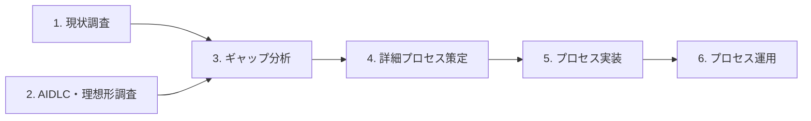

本プロジェクトは以下の6フェーズで進めます。

| フェーズ | 内容 | 期間目安 |
| --- | --- | --- |
| 1. 現状調査 | 既存の開発プロセス(ウォーターフォール、アジャイル、スクラム、TDD、DDD、イベント駆動、仕様駆動、AIDLC)を、ロール・ゲート・成果物・レビューまで踏み込んで体系化 | 3〜4ヶ月 |
| 2. AIDLC・理想形調査 | 生成AIを組み込んだときに期待される理想の開発プロセスを整理 | — |
| 3. ギャップ分析 | フェーズ1と2を突合し、差分と生成AIが入る余地を整理 | — |
| 4. 詳細プロセス策定 | 現実的な統合プロセスを詳細に定義 | — |
| 5. プロセス実装 | Git戦略、CI/CDゲート、AI実行環境、コンピューティングリソースなど、プロセスを動かす仕組みの設計 | — |
| 6. プロセス運用 | 策定したプロセスを継続運用するための運用プロセス・運用作業の定義 | — |

フェーズ1と2は並行して進められます。各フェーズの成果は随時このサイトで公開し、フィードバックを反映します。
