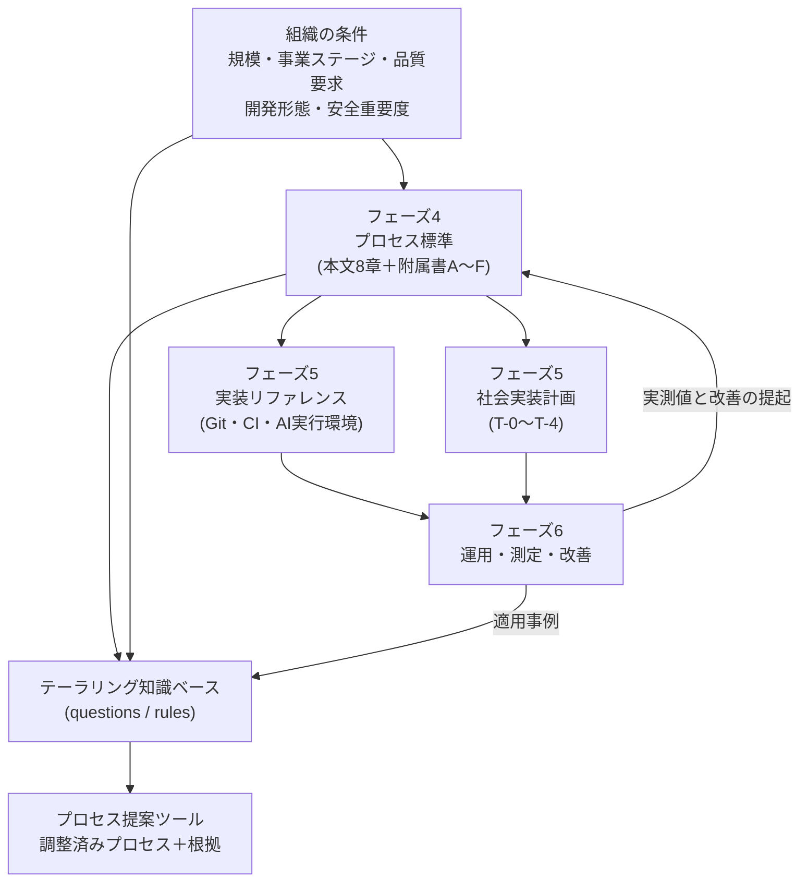
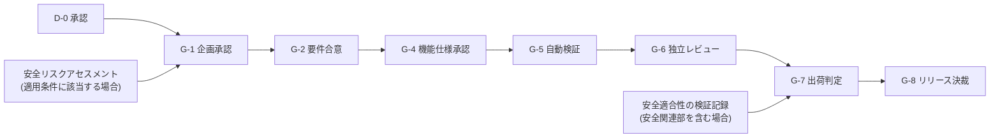

本ページは、フェーズ4(標準の規定)・フェーズ5(実装と移行)・フェーズ6(運用と改善)の成果物が、どこで生まれ、どこで使われるかを一覧にしたものです。あわせて、全体で用いる**記号体系の索引**を示します。

## 全体の接続

規定はフェーズ4に一本化し、フェーズ5とフェーズ6は**その実施と測定**を担います。テーラリング知識ベースはフェーズ4の第8章を機械可読にしたものであり、独立した規定ではありません。

## 調査層と規範層の役割分担

フェーズ1〜3は**調査層**、フェーズ4以降は**規範層**です。同じ事項が両方に現れる場合、**規定の正本は常に規範層**にあります。

| | 調査層(フェーズ1〜3) | 規範層(フェーズ4〜6) |
| --- | --- | --- |
| 書くこと | 観測した事実、現場の実態、理想が置く前提、その差分 | 要求事項、判定基準、閾値、様式 |
| 書かないこと | 「〜すべき」という規範、閾値 | 現場の実態の記述 |
| 時点への依存 | 技術に関する記述は高い(基準日を併記する) | 低い(見直しの契機を規定する) |
| 相互参照 | **規範層のどこで扱われたかを必ず示す** | 調査層の課題認識を前提として参照する |

**調査層から規範層への参照を欠かしてはなりません**。参照がないと、規範層の改訂が調査層へ伝わらず、同じサイト内で矛盾した記述が並びます。実際に、フェーズ3のロール整理が規範側への参照を持たなかったため、規定と食い違う記述が残りました([ADR-0015](/process-compass/adr/0015-role-boundary-by-function-stage/))。

| 調査層のページ | 規範層への対応表 |
| --- | --- |
| [フェーズ1 総括](/process-compass/phase1-current-state/summary/) | 3つの発見 → 第2章・第3章・第4章 |
| [理想モデルの前提条件一覧](/process-compass/phase2-aidlc/assumptions/) | 崩れる前提 T3・P3・O1〜O3・K1〜K3 → 第3章・第4章・第5章 |
| [ロール別の作業分担](/process-compass/phase3-gap-analysis/role-mapping/) | AI自律レベル L1〜L3 → 第5章 5.4 / 5.8 |
| [フェーズ3 総括](/process-compass/phase3-gap-analysis/summary/) | ギャップ G1〜G5 → 第2章・第3章・第4章・第7章 |

## 章と成果物の対応

| 規定 | 主な出力 | それを入力とする先 |
| --- | --- | --- |
| [第1章 総則](/process-compass/phase4-process-design/overview/) | 用語の定義、引用規格、構成 | 全章 |
| [第2章 ライフサイクル](/process-compass/phase4-process-design/lifecycle/) | 事業ステージ、移行ゲート、立ち上げ手順、移管ゲート、スコープ3層と進捗の観測 | 第4章、フェーズ5、フェーズ6 |
| [第3章 体制・会議体](/process-compass/phase4-process-design/roles-responsibilities/) | ロール、決裁権限、会議体、事前レビュー期間 | 第4章、[事前レビュー期間の自動化](/process-compass/phase5-implementation/pre-review-automation/) |
| [第4章 ゲートと判定基準](/process-compass/phase4-process-design/gate-criteria/) | 判定基準、SLA、欠陥トリアージ基準 | [CI/CD ゲート](/process-compass/phase5-implementation/ci-gates/)、[メトリクス](/process-compass/phase6-operation/metrics/) |
| [第5章 役割境界](/process-compass/phase4-process-design/human-ai-boundary/) | AI自律レベル、生成物の統制、形骸化の防止 | [AI 実行環境](/process-compass/phase5-implementation/ai-environment/)、附属書E・F |
| [第6章 成果物](/process-compass/phase4-process-design/deliverable-templates/) | テンプレ0〜9、安全リスクアセスメント | フェーズ5全般、附属書F |
| [第7章 例外](/process-compass/phase4-process-design/exception-escalation/) | 例外承認、エスカレーション、中止判断 | [改善サイクル](/process-compass/phase6-operation/improvement-cycle/) |
| [第8章 テーラリング](/process-compass/phase4-process-design/tailoring-guide/) | 調整軸と調整規則 | テーラリング知識ベース |
| [社会実装計画](/process-compass/phase5-implementation/enablement/) | 移行段階、判定ゲート、支援体制、教育計画 | フェーズ6 |
| [メトリクス](/process-compass/phase6-operation/metrics/) | 三識メトリクス、ゲートの健全性 | 第5章の見直し、第8章の調整 |

## 記号の索引

本標準は複数の区分体系を用います。**同じ数字でも意味が異なります**。

| 記号 | 意味 | 規定場所 |
| --- | --- | --- |
| S0 / S1 / S2 | 事業ステージ(探索・価値確立・スケール) | [第2章 2.3](/process-compass/phase4-process-design/lifecycle/) |
| SG-0 / SG-1 / SG-2 | ステージ移行ゲート | [第2章 2.4](/process-compass/phase4-process-design/lifecycle/) |
| G-1 〜 G-8 | 工程ゲート | [第4章](/process-compass/phase4-process-design/gate-criteria/) |
| H-1 / H-2 / H-3 | コンテキスト移管ゲート(要員の交代) | [第2章 2.9](/process-compass/phase4-process-design/lifecycle/) |
| B-1 〜 B-4 | 会議体 | [第3章 3.7](/process-compass/phase4-process-design/roles-responsibilities/) |
| D-0 | 意思決定・エスカレーション体制図 | [第6章 テンプレ0](/process-compass/phase4-process-design/deliverable-templates/) |
| R1 / R2 / R3 | リスク区分(決定の取り消し可能性) | [第3章 3.8.1](/process-compass/phase4-process-design/roles-responsibilities/) |
| SC-M / SC-P / SC-B | スコープ3層(確約範囲 / 計画範囲 / 調整枠) | [第2章 2.10](/process-compass/phase4-process-design/lifecycle/) |
| CR-n | 受入基準の識別子 | [第6章 テンプレ1](/process-compass/phase4-process-design/deliverable-templates/) |
| L1 / L2 / L3 | AI自律レベル | [第5章 5.4](/process-compass/phase4-process-design/human-ai-boundary/) |
| E1 / E2 / E3 | AI実行形態 | [AI 実行環境](/process-compass/phase5-implementation/ai-environment/) |
| Sev1 / Sev2 / Sev3 | 欠陥の重大度 | [第4章](/process-compass/phase4-process-design/gate-criteria/) |
| Hz-nnn | 危険源の識別子 | [第6章](/process-compass/phase4-process-design/deliverable-templates/) |
| Hs / Ex / Oc / Av | 危害のひどさ・暴露・発生確率・回避可能性 | [第6章](/process-compass/phase4-process-design/deliverable-templates/) |
| SR1 〜 SR4 | 安全リスク区分 | [第6章](/process-compass/phase4-process-design/deliverable-templates/) |
| RRS1 / RRS2 / RRS3 | リスク低減ステップ | [第6章](/process-compass/phase4-process-design/deliverable-templates/) |
| T-0 〜 T-4 | 移行段階 | [社会実装計画](/process-compass/phase5-implementation/enablement/) |
| TG-1 / TG-2 / TG-3 | 移行判定ゲート | [社会実装計画](/process-compass/phase5-implementation/enablement/) |
| EN-1 / EN-2 / EN-3 | 移行の支援体制 | [社会実装計画](/process-compass/phase5-implementation/enablement/) |
| A-T1 〜 A-K3 | 理想モデルの前提条件(技術・個人・組織・知識) | [前提条件一覧](/process-compass/phase2-aidlc/assumptions/) |
| AC-0 / AC-1 / AC-2 | 前提の充足状態(充足 / 劣化 / 不成立) | [第7章 7.10](/process-compass/phase4-process-design/exception-escalation/) |
| テンプレ0 〜 テンプレ10 | 成果物の様式 | [第6章](/process-compass/phase4-process-design/deliverable-templates/) |
| 附属書A 〜 附属書F | 背景・記法・手引き・様式 | [第1章 1.5](/process-compass/phase4-process-design/overview/) |

### 混同しやすい対

| 対 | 違い |
| --- | --- |
| SG(ステージ移行ゲート) と G(工程ゲート) | SG は投資と移管の判断。G は成果物を次工程へ進める判断 |
| G(工程ゲート) と TG(移行判定ゲート) | G は開発の制御点。TG は**組織が次の移行段階へ進めるか**の判断 |
| L(AI自律レベル) と E(AI実行形態) | L は権限の広さ。E は動かし方。**E3 でも R1 なら L1 に固定される** |
| R(リスク区分) と SR(安全リスク区分) | R は決定の取り消し可能性。SR は危害の大きさ |
| Sev(欠陥の重大度) と Hs(危害のひどさ) | Sev は発生した欠陥の事後評価。Hs は起こりうる危害の事前見積り |
| S(事業ステージ) と 製造業の設計審査 DR1〜DR4 | 別の体系。対応表は[第2章 2.3](/process-compass/phase4-process-design/lifecycle/)にある |
| A-T1〜A-T4(技術の前提) と T-0〜T-4(移行段階) | 別の体系。**ハイフンの有無だけで区別する構成は成立しない**ため、前提側へ `A-` を冠した |
| AC(前提の充足状態) と CL(安全重要度) | AC は前提が成立しているか、CL は危害の深刻度 |
| AC(前提の充足状態) と CR(受入基準) | 別の体系。**かつて受入基準の識別子も `AC-n` だった**ため、[ADR-0019](/process-compass/adr/0019-scope-commitment-three-layers/)で受入基準の側を `CR-n` へ改称した |
| SC(スコープ3層) と R(リスク区分) | SC は範囲の確約度、R は決定の取り消し可能性。**R1 の変更が調整枠(SC-B)に属することもある** |

**新しい区分を追加する場合、必ず本表を更新してください**。過去に2度、記号の重複によって別の概念が同じ記号で書かれ、後から改称が必要になっています。

## 前提条件の連鎖

ゲートの前提条件は連鎖します。上流を満たさないまま下流へ進めません。

## 未解決の事項

本標準には、外部の一次情報を入手できていない箇所があります。**規制対応の文脈で引用する前に、原本での確認が必要です**。

| 事項 | 状態 |
| --- | --- |
| ISO 12100 / JIS B 9700 の条項番号 | 公開転載に依拠。原本での逐語確認は未了 |
| ISO/IEC TR 5469:2024 の使用レベルと技術クラス | 未入手。本標準では引用していない |
| 安全状態への遷移に関する規格要求 | 調査が不十分。[附属書F](/process-compass/phase4-process-design/safety-verification/) F.5 は最小限の集合 |
| 経営層の関与と現場の関与の相対的な重み | 実証的な優劣を示す資料を確認できていない |
| 日本企業の品質保証部門の権限構造 | 一次調査を確認できていない |
| 確約範囲の上限 60% の実証的裏づけ | 存在しない。DSDM の推奨値を初期値として採った |
| 確率的予測(モンテカルロ)の精度を示す査読研究 | 特定できていない。本標準では精度に関する数値を引用していない |
| 「範囲の内か外か」の意味的判定における LLM と人間の一致率 | 特定できていない |
